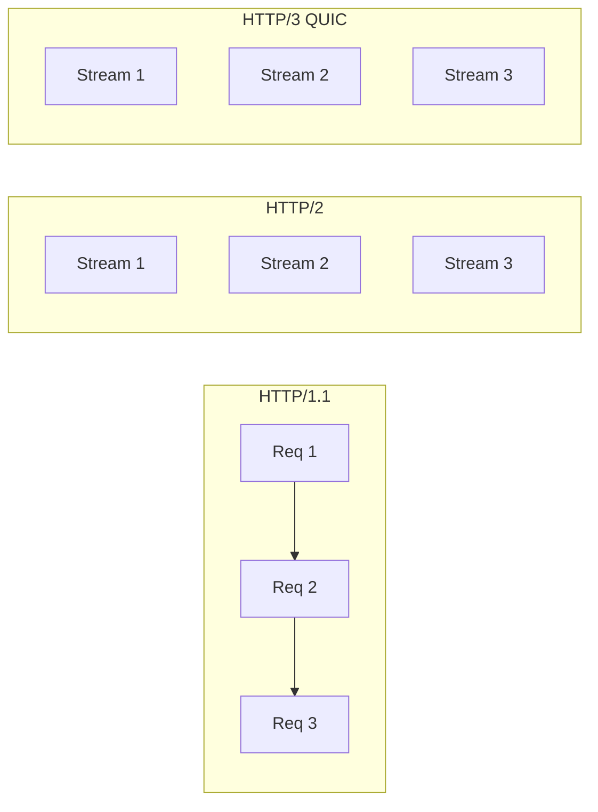
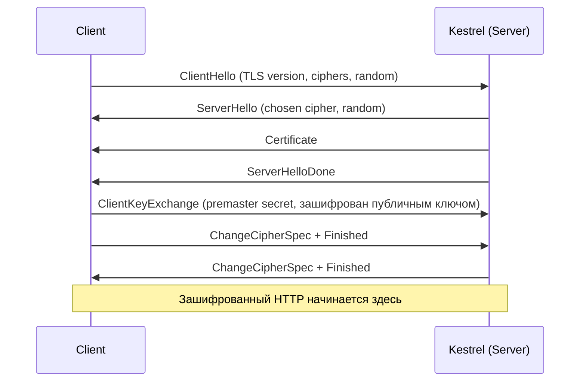
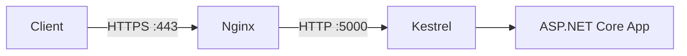

# Kestrel и HTTP-стек

> Kestrel — это движок, который принимает байты из сети и превращает их в `HttpContext`. Всё остальное в ASP.NET Core работает поверх него.

## Содержание
- [Что такое Kestrel](#что-такое-kestrel)
- [Transport Layer: System.IO.Pipelines](#transport-layer-systemiopipelines)
- [ConnectionContext — абстракция соединения](#connectioncontext--абстракция-соединения)
- [HTTP/1.1, HTTP/2, HTTP/3](#http11-http2-http3)
- [TLS Handshake](#tls-handshake)
- [WebSockets Upgrade](#websockets-upgrade)
- [Reverse Proxy перед Kestrel](#reverse-proxy-перед-kestrel)
- [Подводные камни](#подводные-камни)
- [См. также](#см-также)

---

## Что такое Kestrel

**Kestrel** — кросс-платформенный встроенный HTTP-сервер ASP.NET Core. Написан поверх `System.Net.Sockets` и `System.IO.Pipelines`, работает на любой ОС.

До .NET 6 его прятали за reverse proxy. С .NET 6 достаточно зрелый для прямого выхода в интернет при правильной конфигурации.

---

## Transport Layer: System.IO.Pipelines

Kestrel не читает сокет через обычный `Stream` — он использует **`System.IO.Pipelines`**: высокопроизводительный API для чтения/записи без лишних аллокаций.

Ключевые типы:
- **`PipeReader`** / **`PipeWriter`** — асинхронные потоки данных без промежуточных буферов.
- **`IDuplexPipe`** — объединяет читающую и пишущую стороны в одном объекте.

Путь одного соединения:

```
OS TCP socket
  └─ SocketTransport (IConnectionListenerFactory)
       └─ SocketConnection : ConnectionContext
            └─ HttpProtocol (HTTP/1.1 | HTTP/2 | HTTP/3)
                 └─ IHttpApplication<HttpContext>  ← ваш middleware pipeline
```

`SocketTransport` слушает порт и на каждое новое TCP-соединение создаёт `SocketConnection`. Та передаётся в `HttpConnectionManager`, который запускает обработку в `ThreadPool`.

---

## ConnectionContext — абстракция соединения

`ConnectionContext` — объект одного TCP/UDP соединения. Его структура:

```
ConnectionContext
├── Transport   : IDuplexPipe     ← байты туда-сюда
├── Features    : IFeatureCollection  ← TLS-инфо, IP, HTTP/2 потоки
├── ConnectionId : string
└── LocalEndPoint / RemoteEndPoint
```

`IFeatureCollection` позволяет протоколам верхнего уровня (HTTP/2) добавлять свои фичи, не меняя базовый тип. Например, `ITlsConnectionFeature` кладётся в Features при HTTPS-соединении.

---

## HTTP/1.1, HTTP/2, HTTP/3

| Версия | Транспорт | Мультиплексирование | Ключевая особенность |
|--------|-----------|---------------------|----------------------|
| HTTP/1.1 | TCP | Нет (pipelining редко) | `keep-alive`, chunked transfer |
| HTTP/2 | TCP + TLS | Да — потоки на одном соединении | HPACK-сжатие заголовков, server push |
| HTTP/3 | QUIC (UDP) | Да — без head-of-line блокировки | Быстрое переключение сети, 0-RTT |

**HTTP/2** решает head-of-line blocking HTTP/1.1: несколько запросов идут параллельно как независимые **streams** (числовой ID). Потеря пакета в TCP всё ещё блокирует всё соединение.

**HTTP/3 / QUIC** базируется на UDP: потеря пакета блокирует только один поток, остальные продолжают работу.



Kestrel включает HTTP/2 по умолчанию для HTTPS. HTTP/3 требует явной настройки:

```csharp
builder.WebHost.ConfigureKestrel(options =>
{
    options.ListenAnyIP(5001, listenOptions =>
    {
        listenOptions.UseHttps();
        listenOptions.Protocols = HttpProtocols.Http1AndHttp2AndHttp3;
    });
});
```

---

## TLS Handshake

TLS Handshake происходит до передачи HTTP-данных. Kestrel реализует его через `System.Net.Security.SslStream`.



**TLS 1.3** сокращает handshake до **1-RTT** (и **0-RTT** для возобновления сессии), убирая лишние round-trips.

После TLS handshake Kestrel получает `SslStream`, оборачивает его в `IDuplexPipe` и передаёт HTTP-протоколу.

---

## WebSockets Upgrade

WebSocket начинается как обычный HTTP/1.1 запрос:

```
GET /ws HTTP/1.1
Host: example.com
Upgrade: websocket
Connection: Upgrade
Sec-WebSocket-Key: dGhlIHNhbXBsZSBub25jZQ==
Sec-WebSocket-Version: 13
```

Kestrel отвечает `101 Switching Protocols`, после чего TCP-соединение переходит в режим full-duplex. Фрейм протокола HTTP больше не используется — данные идут в бинарном WebSocket-формате.

В ASP.NET Core:

```csharp
app.UseWebSockets();

app.Map("/ws", async context =>
{
    if (!context.WebSockets.IsWebSocketRequest)
    {
        context.Response.StatusCode = 400;
        return;
    }

    using var ws = await context.WebSockets.AcceptWebSocketAsync();
    var buffer = new byte[4096];

    while (ws.State == WebSocketState.Open)
    {
        var result = await ws.ReceiveAsync(buffer, CancellationToken.None);
        if (result.MessageType == WebSocketMessageType.Close)
            break;

        await ws.SendAsync(
            buffer.AsMemory(0, result.Count),
            result.MessageType,
            result.EndOfMessage,
            CancellationToken.None);
    }
});
```

---

## Reverse Proxy перед Kestrel

В production Kestrel обычно стоит за Nginx или IIS:



**Зачем нужен reverse proxy:**
- **TLS termination** — Nginx обрабатывает сертификаты, Kestrel получает plaintext HTTP.
- **Load balancing** — несколько экземпляров Kestrel за одним Nginx.
- **Static files** — Nginx отдаёт статику без .NET процесса.
- **DDoS / rate limiting** на уровне сети.

**Проблема:** Kestrel видит IP Nginx, а не клиента. Решение — middleware `ForwardedHeaders`:

```csharp
app.UseForwardedHeaders(new ForwardedHeadersOptions
{
    ForwardedHeaders = ForwardedHeaders.XForwardedFor | ForwardedHeaders.XForwardedProto
});
```

Он читает `X-Forwarded-For` и `X-Forwarded-Proto`, установленные Nginx, и записывает реальные значения в `HttpContext.Connection.RemoteIpAddress` и `HttpContext.Request.Scheme`.

> Важно: `UseForwardedHeaders` должен стоять **первым** в pipeline — до любого middleware, который читает IP или схему.

---

## Подводные камни

**Не открывать Kestrel напрямую в интернет без настройки лимитов.** По умолчанию нет ограничений на размер тела запроса для `KeepAlive`-соединений и максимальное число одновременных соединений:

```csharp
builder.WebHost.ConfigureKestrel(options =>
{
    options.Limits.MaxRequestBodySize = 10 * 1024 * 1024; // 10 MB
    options.Limits.MaxConcurrentConnections = 1000;
    options.Limits.MaxConcurrentUpgradedConnections = 100; // WebSocket
    options.Limits.KeepAliveTimeout = TimeSpan.FromMinutes(2);
    options.Limits.RequestHeadersTimeout = TimeSpan.FromSeconds(30);
});
```

**`ForwardedHeaders` без ограничения на доверенные прокси** — уязвимость: клиент может подделать `X-Forwarded-For`. Всегда ограничивай доверенные IP:

```csharp
var options = new ForwardedHeadersOptions
{
    ForwardedHeaders = ForwardedHeaders.XForwardedFor | ForwardedHeaders.XForwardedProto
};
options.KnownProxies.Add(IPAddress.Parse("10.0.0.1")); // IP вашего Nginx
app.UseForwardedHeaders(options);
```

---

## См. также

- [02-request-lifecycle.md](./02-request-lifecycle.md) — что происходит после того, как Kestrel создал `HttpContext`
- [03-middleware.md](./03-middleware.md) — как устроен pipeline, в который Kestrel передаёт управление
