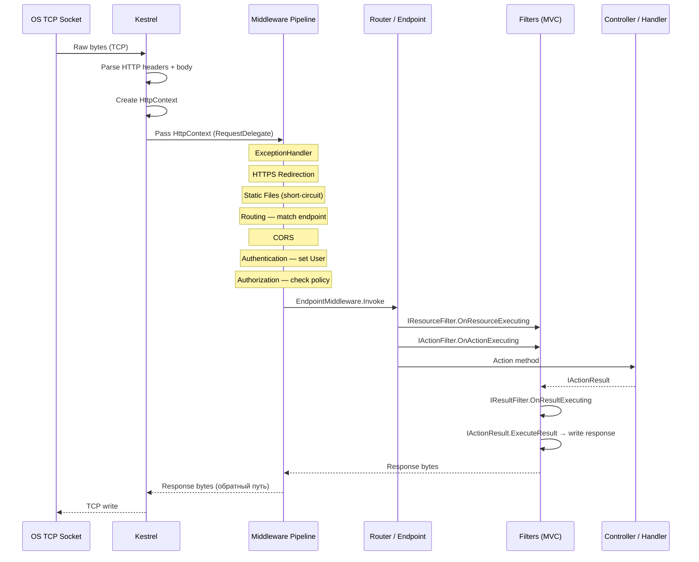
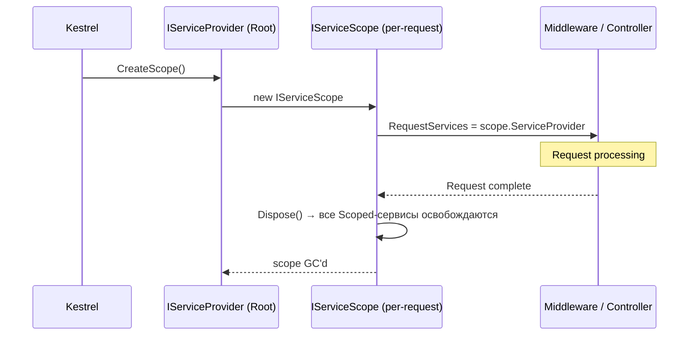

# Жизненный цикл запроса

> Знание полного пути запроса — от байт на сокете до ответа — объясняет, почему порядок middleware важен и где что может сломаться.

## Содержание
- [Полный путь от сокета до ответа](#полный-путь-от-сокета-до-ответа)
- [HttpContext — центральный объект](#httpcontext--центральный-объект)
- [IFeatureCollection — низкоуровневые возможности](#ifeaturecollection--низкоуровневые-возможности)
- [Жизненный цикл DI Scope](#жизненный-цикл-di-scope)
- [Подводные камни](#подводные-камни)
- [См. также](#см-также)

---

## Полный путь от сокета до ответа



Ключевые этапы:

1. **Kestrel** принимает TCP-соединение, парсит HTTP-заголовки через `System.IO.Pipelines`, создаёт `HttpContext`.
2. **Middleware pipeline** — цепочка `RequestDelegate`. Каждый компонент получает `HttpContext` и решает: обработать самому или передать дальше.
3. **Endpoint Routing** — `UseRouting` матчит путь к конкретному endpoint и сохраняет результат в `IEndpointFeature`. `UseAuthorization` читает его, чтобы знать, какой `[Authorize]` применить.
4. **MVC Filters** — выполняются внутри `EndpointMiddleware`, ближе к контроллеру. Отдельный уровень AOP только для MVC.
5. **Обратный путь** — каждый middleware может обработать ответ (добавить заголовки, сжать тело) до того, как байты уйдут в Kestrel.

---

## HttpContext — центральный объект

`HttpContext` создаётся Kestrel для каждого запроса и уничтожается после его завершения. Он является «владельцем» всего состояния запроса-ответа.

```
HttpContext
├── Request  : HttpRequest
│   ├── Method, Path, QueryString, Headers
│   ├── Body   : Stream (читается один раз!)
│   └── Form   : IFormCollection (lazy, только после чтения)
├── Response : HttpResponse
│   ├── StatusCode, Headers
│   └── Body   : Stream (write-only после начала ответа)
├── User     : ClaimsPrincipal   ← заполняется UseAuthentication
├── Items    : IDictionary<object, object>  ← per-request state
├── Features : IFeatureCollection  ← низкоуровневые фичи
├── RequestServices : IServiceProvider  ← DI scope этого запроса
├── TraceIdentifier : string  ← уникальный ID запроса
└── Abort()  : отменить соединение немедленно
```

`HttpContext` **не thread-safe**. Нельзя использовать его вне pipeline:

```csharp
// ПЛОХО: HttpContext будет уничтожен к моменту выполнения Task
_ = Task.Run(async () =>
{
    await Task.Delay(1000);
    var body = context.Request.Body; // ObjectDisposedException
});

// ХОРОШО: если нужен фоновый доступ — сохрани нужные данные до запуска Task
var path = context.Request.Path.Value;
_ = Task.Run(async () =>
{
    await Task.Delay(1000);
    logger.LogInformation("Background work for {Path}", path);
});
```

Если доступ к `HttpContext` нужен вне middleware (например, в сервисе), используй `IHttpContextAccessor`:

```csharp
builder.Services.AddHttpContextAccessor();

public class AuditService
{
    private readonly IHttpContextAccessor _accessor;

    public AuditService(IHttpContextAccessor accessor)
    {
        _accessor = accessor;
    }

    public string? GetCurrentUserId()
        => _accessor.HttpContext?.User.FindFirst(ClaimTypes.NameIdentifier)?.Value;
}
```

`IHttpContextAccessor` использует `AsyncLocal<T>` внутри — значит, контекст передаётся по цепочке `await` автоматически.

---

## IFeatureCollection — низкоуровневые возможности

`HttpContext.Features` — словарь расширений, которые разные компоненты кладут в него на лету:

| Feature-интерфейс | Кто устанавливает | Что даёт |
|---|---|---|
| `IHttpRequestFeature` | Kestrel | Сырой метод, путь, заголовки |
| `IHttpResponseFeature` | Kestrel | Запись статуса и заголовков ответа |
| `ITlsConnectionFeature` | Kestrel (HTTPS) | Клиентский сертификат, шифр |
| `IEndpointFeature` | `UseRouting` | Матчнутый endpoint |
| `IExceptionHandlerFeature` | `UseExceptionHandler` | Перехваченное исключение |
| `IHttpUpgradeFeature` | Kestrel | WebSocket upgrade |

Чтение:

```csharp
var endpoint = context.Features.Get<IEndpointFeature>()?.Endpoint;
var exception = context.Features.Get<IExceptionHandlerFeature>()?.Error;
var tlsFeature = context.Features.Get<ITlsConnectionFeature>();
```

Этот механизм позволяет middleware общаться без прямых зависимостей друг от друга — только через известный интерфейс.

---

## Жизненный цикл DI Scope

Каждый HTTP-запрос создаёт **новый DI Scope** в момент, когда Kestrel вызывает `RequestDelegate`:



Что это означает на практике:

- Все `Scoped`-сервисы живут ровно один HTTP-запрос.
- `context.RequestServices` — это `IServiceProvider` конкретного scope. Именно через него DI разрешает зависимости контроллеров и middleware.
- После завершения запроса scope вызывает `Dispose()` на всех `IDisposable` Scoped-сервисах. EF Core `DbContext` освобождается автоматически.
- `Singleton`-сервисы разделяются между всеми запросами — они не попадают в scope.

```csharp
// Middleware может явно создать дополнительный scope для Scoped-сервиса
public class BackgroundCapturingMiddleware
{
    private readonly RequestDelegate _next;
    private readonly IServiceScopeFactory _factory;

    public BackgroundCapturingMiddleware(RequestDelegate next, IServiceScopeFactory factory)
    {
        _next = next;
        _factory = factory;
    }

    public async Task InvokeAsync(HttpContext context)
    {
        await _next(context);

        // Не используем context.RequestServices — scope уже закрывается
        // Создаём новый scope для фонового задания
        _ = Task.Run(async () =>
        {
            using var scope = _factory.CreateScope();
            var service = scope.ServiceProvider.GetRequiredService<IAnalyticsService>();
            await service.TrackAsync(context.TraceIdentifier);
        });
    }
}
```

---

## Подводные камни

**Body читается один раз.** `HttpRequest.Body` — это `Stream`, который после однократного чтения указатель сдвигается в конец. Если нужно читать тело дважды (например, в middleware для логирования и потом в контроллере):

```csharp
// Включить буферизацию тела запроса
app.Use(async (context, next) =>
{
    context.Request.EnableBuffering(); // позволяет Seek(0, SeekOrigin.Begin)
    await next(context);
});
```

**Запись в Response после начала ответа невозможна.** Как только начали писать тело ответа, заголовки уже отправлены. Попытка изменить `StatusCode` после `response.Body.WriteAsync` вызовет исключение. Проверяй `context.Response.HasStarted`.

**`TraceIdentifier` ≠ correlation ID.** По умолчанию это внутренний ID Kestrel (короткий). Для трейсинга через несколько сервисов используй `Activity.Current?.TraceId` (OpenTelemetry) или передавай `X-Correlation-ID` заголовок.

---

## См. также

- [01-kestrel.md](./01-kestrel.md) — как Kestrel создаёт `HttpContext`
- [03-middleware.md](./03-middleware.md) — как устроена цепочка middleware
- [07-dependency-injection.md](./07-dependency-injection.md) — Scoped/Singleton/Transient подробно
