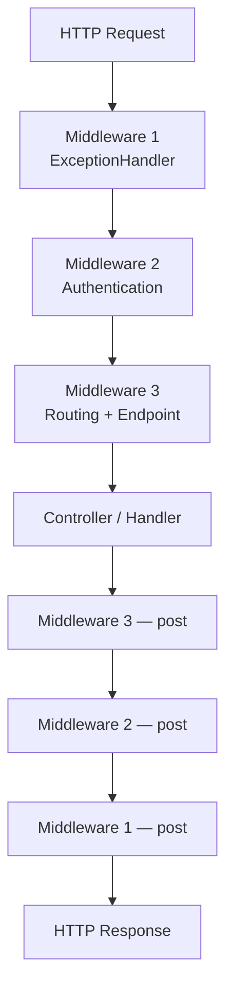
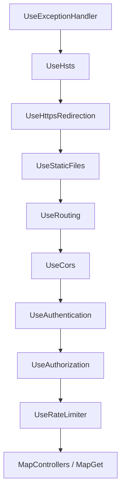

# Middleware Pipeline

> Middleware — это единственное место, где можно перехватить запрос до контроллера и ответ после него. Порядок регистрации определяет поведение приложения.

## Содержание
- [Концепция: цепочка RequestDelegate](#концепция-цепочка-requestdelegate)
- [Use, Run, Map, MapWhen](#use-run-map-mapwhen)
- [Порядок middleware — критически важен](#порядок-middleware--критически-важен)
- [Написание своего middleware](#написание-своего-middleware)
- [Convention-based vs IMiddleware](#convention-based-vs-imiddleware)
- [Встроенные middleware](#встроенные-middleware)
- [Подводные камни](#подводные-камни)
- [См. также](#см-также)

---

## Концепция: цепочка RequestDelegate

`RequestDelegate` — это `Func<HttpContext, Task>`. Весь pipeline — это вложенные делегаты:



Каждый middleware получает `HttpContext` и `RequestDelegate next`. Он может:
1. Завершить запрос сам (short-circuit) — не вызывать `next`.
2. Передать управление дальше — вызвать `await next(context)`.
3. Сделать что-то **до** и **после** следующего middleware.

Внутри ASP.NET Core `IApplicationBuilder.Build()` собирает все middleware в одну вложенную цепочку:

```
middleware1(middleware2(middleware3(endpoint)))
```

---

## Use, Run, Map, MapWhen

```csharp
var app = builder.Build();

// Use — вызывает next, участвует в обратном пути
app.Use(async (context, next) =>
{
    context.Response.Headers["X-Request-Start"] = DateTimeOffset.UtcNow.ToString("O");
    await next(context);
    // сюда попадаем после всей цепочки ниже
    context.Response.Headers["X-Request-End"] = DateTimeOffset.UtcNow.ToString("O");
});

// Run — терминальный, next не вызывает (short-circuit)
app.Run(async context =>
{
    await context.Response.WriteAsync("Fallback response");
});

// Map — ветвление по префиксу пути; создаёт отдельную ветку pipeline
app.Map("/admin", adminApp =>
{
    adminApp.UseAuthentication();
    adminApp.Run(async context =>
    {
        await context.Response.WriteAsync("Admin area");
    });
});

// MapWhen — ветвление по произвольному условию
app.MapWhen(
    ctx => ctx.Request.Query.ContainsKey("api-version"),
    versionedApp =>
    {
        versionedApp.Run(async context =>
        {
            await context.Response.WriteAsync("v2 API");
        });
    });
```

**Важно:** `Map` создаёт **отдельную ветку** pipeline. Управление из неё не возвращается в основной pipeline, даже если ветка завершилась через `Run`. Это не `if/else` — это именно отдельный `IApplicationBuilder`.

---

## Порядок middleware — критически важен

Стандартный порядок ASP.NET Core (каждый пункт объясняет, почему именно здесь):

```csharp
// 1. Первым: перехватывает исключения из ВСЕГО нижележащего pipeline
app.UseExceptionHandler("/error");

// 2. HSTS — добавляет заголовок Strict-Transport-Security
app.UseHsts();

// 3. Редирект с HTTP на HTTPS (301/307)
app.UseHttpsRedirection();

// 4. Отдаёт статику из wwwroot, short-circuit — не идёт в контроллеры
app.UseStaticFiles();

// 5. Матчит маршрут и сохраняет результат в IEndpointFeature
app.UseRouting();

// 6. CORS читает IEndpointFeature — должен быть после UseRouting
app.UseCors();

// 7. Заполняет context.User (ClaimsPrincipal)
app.UseAuthentication();

// 8. Проверяет [Authorize] — нужен заполненный User
app.UseAuthorization();

// 9. Rate Limiting (.NET 7+)
app.UseRateLimiter();

// 10. Вызывает endpoint (контроллер / minimal API handler)
app.MapControllers();
```



Нарушения порядка и их последствия:

| Нарушение | Что сломается |
|-----------|--------------|
| `UseAuthentication` после `UseAuthorization` | `User` не заполнен → авторизация всегда отказывает |
| `UseCors` до `UseRouting` | CORS не знает, какой endpoint матчится — не может применить политику |
| `UseExceptionHandler` не первым | Исключения из middleware выше него не перехватываются |
| `UseStaticFiles` после `UseRouting` | Статика попадает в routing, конфликтует с именованными маршрутами |

---

## Написание своего middleware

Минимальный шаблон:

```csharp
/// <summary>
/// Adds X-Request-Id header to every response and logs request boundaries.
/// </summary>
public class RequestIdMiddleware
{
    private readonly RequestDelegate _next;
    private readonly ILogger<RequestIdMiddleware> _logger;

    public RequestIdMiddleware(RequestDelegate next, ILogger<RequestIdMiddleware> logger)
    {
        _next = next;
        _logger = logger;
    }

    public async Task InvokeAsync(HttpContext context)
    {
        var id = context.TraceIdentifier;
        context.Response.Headers["X-Request-Id"] = id;

        _logger.LogInformation("Request {Id} {Method} {Path}", id,
            context.Request.Method, context.Request.Path);

        await _next(context);

        _logger.LogInformation("Response {Id} {StatusCode}", id,
            context.Response.StatusCode);
    }
}

// Extension для регистрации
public static class RequestIdMiddlewareExtensions
{
    public static IApplicationBuilder UseRequestId(this IApplicationBuilder app)
        => app.UseMiddleware<RequestIdMiddleware>();
}
```

Регистрация:
```csharp
app.UseRequestId();
```

---

## Convention-based vs IMiddleware

**Convention-based** (пример выше):
- Конструктор принимает `RequestDelegate next` и любые **Singleton** зависимости.
- Создаётся **один раз** при старте приложения.
- **Scoped-зависимости нельзя** внедрять в конструктор — только через параметр `InvokeAsync`.

```csharp
// Scoped-зависимость через параметр метода — правильно
public async Task InvokeAsync(HttpContext context, IScopedService service)
{
    await service.DoSomethingAsync();
    await _next(context);
}
```

**`IMiddleware`** (factory-based):
- Создаётся через DI на каждый запрос.
- Scoped-зависимости можно внедрять в **конструктор**.
- Требует явной регистрации в DI.

```csharp
/// <summary>
/// Factory-based middleware with per-request Scoped dependency support.
/// </summary>
public class AuditMiddleware : IMiddleware
{
    private readonly IAuditRepository _audit;  // Scoped — OK

    public AuditMiddleware(IAuditRepository audit)
    {
        _audit = audit;
    }

    public async Task InvokeAsync(HttpContext context, RequestDelegate next)
    {
        await next(context);
        await _audit.LogAsync(context.Request.Path, context.Response.StatusCode);
    }
}

// Обязательно зарегистрировать как сервис!
builder.Services.AddScoped<AuditMiddleware>();
app.UseMiddleware<AuditMiddleware>();
```

| | Convention-based | IMiddleware |
|--|-----------------|-------------|
| Создание | Один раз (Singleton) | Per-request (через DI) |
| Scoped в конструкторе | Нет | Да |
| Регистрация в DI | Не нужна | Обязательна |
| Overhead | Минимальный | DI resolve на каждый запрос |

---

## Встроенные middleware

| Middleware | Метод регистрации | Назначение |
|-----------|------------------|------------|
| ExceptionHandler | `UseExceptionHandler` | Перехват необработанных исключений |
| DeveloperExceptionPage | `UseDeveloperExceptionPage` | Детальная страница ошибок (только dev) |
| HSTS | `UseHsts` | Заголовок `Strict-Transport-Security` |
| HttpsRedirection | `UseHttpsRedirection` | 301/307 редирект на HTTPS |
| StaticFiles | `UseStaticFiles` | Файлы из `wwwroot` |
| Routing | `UseRouting` | Матчинг endpoint |
| CORS | `UseCors` | Заголовки `Access-Control-*` |
| Authentication | `UseAuthentication` | Заполнение `User` |
| Authorization | `UseAuthorization` | Проверка `[Authorize]` |
| RateLimiter | `UseRateLimiter` | Ограничение частоты запросов (.NET 7+) |
| ResponseCompression | `UseResponseCompression` | Gzip/Brotli сжатие |
| ResponseCaching | `UseResponseCaching` | HTTP-кеширование ответов |
| ForwardedHeaders | `UseForwardedHeaders` | Реальный IP и схема за прокси |

---

## Подводные камни

**Short-circuit не значит «ответ отправлен».** Middleware может вызвать `context.Result = ...` (только в фильтрах) или написать в `context.Response.Body`. Если middleware short-circuit без записи в Body, клиент получит пустой ответ с заданным StatusCode.

**`Map` не разделяет `Use` middleware, объявленные до него.** Middleware добавленные через `app.Use(...)` до `app.Map(...)` выполняются для всех веток:

```csharp
app.Use(async (ctx, next) => { /* выполняется для ВСЕХ путей */ await next(ctx); });
app.Map("/admin", branch => {
    // здесь добавляем middleware только для /admin
    branch.Run(async ctx => { ... });
});
```

**Не вызывай `next` дважды.** Это пишет в уже начатый Response и вызывает исключение или повреждение ответа. Всегда один `await next(context)`.

---

## См. также

- [02-request-lifecycle.md](./02-request-lifecycle.md) — полный путь запроса
- [04-routing.md](./04-routing.md) — как `UseRouting` матчит endpoint
- [06-exception-handling.md](./06-exception-handling.md) — `UseExceptionHandler` подробно
- [10-filters.md](./10-filters.md) — фильтры как MVC-аналог middleware
