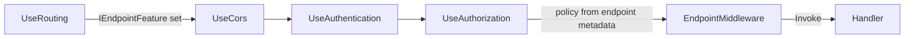

# Routing

> Endpoint Routing разделяет матчинг маршрута и его выполнение — авторизация и CORS могут знать, какой endpoint будет вызван, до его вызова.

## Содержание
- [Endpoint Routing — как устроено](#endpoint-routing--как-устроено)
- [Route Templates и Constraints](#route-templates-и-constraints)
- [Атрибутный Routing для контроллеров](#атрибутный-routing-для-контроллеров)
- [Minimal API Routing](#minimal-api-routing)
- [IRouteConstraint — кастомное ограничение](#irouteconstraint--кастомное-ограничение)
- [Link Generation](#link-generation)
- [Подводные камни](#подводные-камни)
- [См. также](#см-также)

---

## Endpoint Routing — как устроено

До .NET Core 3.0 routing был встроен в MVC и недоступен middleware. С версии 3.0 — **Endpoint Routing**: маршруты матчатся в `UseRouting`, а результат доступен всем middleware ниже.



`UseRouting` делает одно: запускает `EndpointRoutingMiddleware`, который обходит дерево маршрутов и, при успехе, устанавливает `IEndpointFeature` на `HttpContext`.

`UseAuthorization` читает `IEndpointFeature` и извлекает из него атрибуты `[Authorize]` — это позволяет проверять политики **до** вызова хендлера, не полагаясь на фильтры.

```csharp
// Читаем матчнутый endpoint в middleware
app.Use(async (context, next) =>
{
    var endpoint = context.GetEndpoint(); // null до UseRouting
    var displayName = endpoint?.DisplayName;
    await next(context);
});
```

Endpoints регистрируются через `MapControllers()`, `MapGet()`, `MapHub<T>()` и т.д. — они добавляют маршруты в `EndpointDataSource`.

---

## Route Templates и Constraints

```csharp
// Литеральный сегмент
app.MapGet("/products/list", handler);

// Параметр маршрута
app.MapGet("/products/{id}", handler);

// Опциональный параметр
app.MapGet("/products/{id?}", handler);

// Значение по умолчанию
app.MapGet("/products/{id=1}", handler);

// Catch-all (всё, что идёт дальше)
app.MapGet("/files/{**path}", handler);  // ** сохраняет слэши

// Inline constraints
app.MapGet("/products/{id:int}", handler);           // только int
app.MapGet("/products/{id:guid}", handler);          // только GUID
app.MapGet("/users/{name:alpha}", handler);           // только буквы a-z A-Z
app.MapGet("/items/{id:int:min(1)}", handler);        // int >= 1
app.MapGet("/items/{id:int:range(1,100)}", handler);  // 1 <= id <= 100
app.MapGet("/date/{date:datetime}", handler);          // парсится как DateTime
app.MapGet("/code/{code:regex(^\\d{{5}}$)}", handler); // 5 цифр ({{}} экранирует {})
app.MapGet("/slug/{slug:minlength(3)}", handler);     // строка >= 3 символа
```

**Как работают constraints:** перед вызовом хендлера routing проверяет каждое ограничение через `IRouteConstraint.Match`. Если хотя бы одно возвращает `false` — маршрут не матчится, routing переходит к следующему кандидату.

Несколько constraints на одном параметре применяются через `:`:
```csharp
app.MapGet("/items/{id:int:min(1):max(1000)}", handler);
```

---

## Атрибутный Routing для контроллеров

```csharp
[ApiController]
[Route("api/[controller]")]  // [controller] → "products" (суффикс Controller убирается)
public class ProductsController : ControllerBase
{
    [HttpGet]                         // GET api/products
    public IActionResult GetAll() { ... }

    [HttpGet("{id:int}")]              // GET api/products/42
    public IActionResult GetById(int id) { ... }

    [HttpPost]                         // POST api/products
    public IActionResult Create([FromBody] CreateProductRequest dto) { ... }

    [HttpPut("{id:int}")]              // PUT api/products/42
    public IActionResult Update(int id, [FromBody] UpdateProductRequest dto) { ... }

    [HttpDelete("{id:int}")]           // DELETE api/products/42
    public IActionResult Delete(int id) { ... }

    // Абсолютный маршрут (игнорирует [Route] на контроллере)
    [HttpGet("/health")]               // GET /health
    public IActionResult Health() => Ok();
}
```

Токены в `[Route]`:
- `[controller]` — имя класса без суффикса `Controller`, lowercase.
- `[action]` — имя метода, lowercase. Используется редко в REST API.
- `[area]` — имя Area для MVC.

**`[ApiController]`** активирует несколько поведений:
- Автоматический `400 Bad Request` при невалидном `ModelState`.
- Обязательная маршрутизация через атрибуты (конвенционный routing отключается).
- Автоматическое связывание `[FromBody]` для сложных типов.

---

## Minimal API Routing

Minimal API (.NET 6+) регистрирует endpoints без контроллеров:

```csharp
var app = builder.Build();

// Inline lambda — параметры берутся из DI и маршрута
app.MapGet("/products/{id:int}", async (int id, IProductRepository repo) =>
{
    var product = await repo.FindAsync(id);
    return product is null ? Results.NotFound() : Results.Ok(product);
});

// Named handler (отдельный метод)
app.MapPost("/products", CreateProduct);

static async Task<IResult> CreateProduct(
    CreateProductRequest dto,
    IProductRepository repo,
    IValidator<CreateProductRequest> validator)
{
    var result = await validator.ValidateAsync(dto);
    if (!result.IsValid)
        return Results.ValidationProblem(result.ToDictionary());

    var product = await repo.CreateAsync(dto);
    return Results.Created($"/products/{product.Id}", product);
}
```

**Route Groups** — общий префикс и middleware для набора endpoints:

```csharp
var products = app.MapGroup("/api/products")
    .RequireAuthorization()           // [Authorize] для всей группы
    .WithTags("Products")             // Swagger-тег
    .WithOpenApi();

products.MapGet("/", GetAll);
products.MapGet("/{id:int}", GetById);
products.MapPost("/", Create);
products.MapDelete("/{id:int}", Delete);

// Вложенные группы
var admin = products.MapGroup("/admin").RequireAuthorization("AdminPolicy");
admin.MapDelete("/purge", PurgeAll);
```

**Minimal API vs Controllers:**

| | Minimal API | Controllers |
|--|-------------|-------------|
| Ceremony | Минимум | Больше кода |
| Фильтры | Частичная поддержка | Полная |
| Группировка | Route Groups | Классы |
| Подходит для | Microservices, небольшие API | Крупные API со сложными фильтрами |
| Startup time | Быстрее | Медленнее (reflection) |

---

## IRouteConstraint — кастомное ограничение

```csharp
/// <summary>
/// Route constraint that accepts only ISO 3166-1 alpha-2 country codes (e.g. "US", "DE").
/// </summary>
public class CountryCodeConstraint : IRouteConstraint
{
    private static readonly HashSet<string> _codes = new(StringComparer.OrdinalIgnoreCase)
    {
        "US", "DE", "FR", "RU", "GB", "CN", "JP"
        // в реальном проекте — полный список или из базы
    };

    public bool Match(
        HttpContext? httpContext,
        IRouter? route,
        string routeKey,
        RouteValueDictionary values,
        RouteDirection routeDirection)
    {
        if (!values.TryGetValue(routeKey, out var value))
            return false;

        return _codes.Contains(value?.ToString() ?? string.Empty);
    }
}

// Регистрация constraint под именем "country"
builder.Services.Configure<RouteOptions>(options =>
{
    options.ConstraintMap["country"] = typeof(CountryCodeConstraint);
});

// Использование в маршруте
app.MapGet("/prices/{country:country}", GetPricesByCountry);
```

---

## Link Generation

Routing умеет генерировать URL по имени endpoint — без хардкода строк:

```csharp
// Именование endpoint
app.MapGet("/products/{id:int}", GetById).WithName("GetProduct");

// Генерация URL
public class ProductsController : ControllerBase
{
    private readonly LinkGenerator _links;

    public ProductsController(LinkGenerator links)
    {
        _links = links;
    }

    [HttpPost]
    public IActionResult Create([FromBody] CreateProductRequest dto)
    {
        var product = _service.Create(dto);

        // Генерируем URL для Location заголовка
        var url = _links.GetPathByName("GetProduct", new { id = product.Id });
        return Created(url, product);
    }
}
```

В контроллерах проще через `CreatedAtAction` / `CreatedAtRoute`:

```csharp
return CreatedAtAction(
    actionName: nameof(GetById),
    routeValues: new { id = product.Id },
    value: product);
```

---

## Подводные камни

**Порядок регистрации endpoint влияет на выбор при неоднозначности.** Если два маршрута могут матчить один путь, ASP.NET Core использует route precedence (приоритет). Литеральный сегмент > параметр с constraint > параметр без constraint > catch-all. При полном совпадении — `AmbiguousMatchException`.

**`{**path}` vs `{*path}`:** одна звёздочка не сохраняет слэши (кодирует их), двойная звёздочка сохраняет. Для path-like параметров всегда используй `**`.

**Constraints не заменяют валидацию.** Constraint — это только routing-решение (матчить или нет). Он не должен обращаться к базе данных, делать HTTP-запросы или иметь побочные эффекты. Бизнес-валидацию делай в хендлере.

**`[Route]` на контроллере + `[HttpGet]` с параметром.** Если в `[HttpGet("{id}")]` не указан полный путь, он добавляется к маршруту контроллера. Если начинается с `/` — это абсолютный путь, маршрут контроллера игнорируется:

```csharp
[Route("api/products")]
public class ProductsController : ControllerBase
{
    [HttpGet("{id}")]      // → api/products/{id}
    public IActionResult A(int id) { ... }

    [HttpGet("/health")]   // → /health (абсолютный)
    public IActionResult B() { ... }
}
```

---

## См. также

- [03-middleware.md](./03-middleware.md) — как `UseRouting` вписывается в pipeline
- [05-model-binding.md](./05-model-binding.md) — как параметры маршрута привязываются к параметрам метода
- [10-filters.md](./10-filters.md) — фильтры выполняются уже после routing
