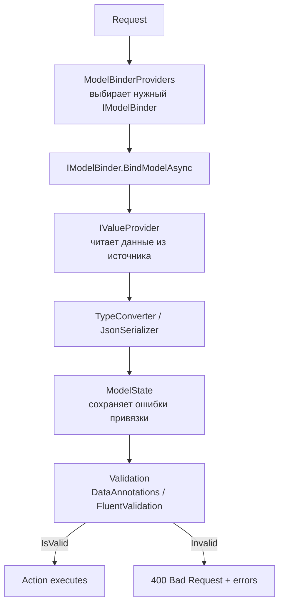

# Model Binding и Validation

> Model Binding превращает сырые данные запроса (строки, байты) в типизированные объекты C#. Validation проверяет, что эти объекты соответствуют бизнес-правилам.

## Содержание
- [Источники привязки](#источники-привязки)
- [Как работает Model Binding внутри](#как-работает-model-binding-внутри)
- [Правила по умолчанию для ApiController](#правила-по-умолчанию-для-apicontroller)
- [Кастомный IModelBinder](#кастомный-imodelbinder)
- [DataAnnotations Validation](#dataannotations-validation)
- [FluentValidation](#fluentvalidation)
- [Подводные камни](#подводные-камни)
- [См. также](#см-также)

---

## Источники привязки

ASP.NET Core ищет значения параметров action-метода в нескольких источниках. Источник указывается атрибутом:

```csharp
[HttpPost("orders/{orderId}/items")]
public IActionResult AddItem(
    [FromRoute]  int orderId,                              // /orders/42/items
    [FromQuery]  bool urgent,                              // ?urgent=true
    [FromBody]   CreateItemRequest dto,                    // JSON/XML body
    [FromHeader(Name = "X-Api-Key")] string apiKey,       // заголовок
    [FromForm]   IFormFile attachment                      // multipart/form-data
) { ... }
```

| Атрибут | Источник | Типичное применение |
|---------|----------|---------------------|
| `[FromRoute]` | Сегмент URL `{id}` | Идентификаторы ресурса |
| `[FromQuery]` | Query string `?key=val` | Фильтры, пагинация, флаги |
| `[FromBody]` | Тело запроса (JSON, XML) | Сложные объекты, DTO |
| `[FromHeader]` | HTTP-заголовок | API-ключи, версии, трейс ID |
| `[FromForm]` | Form data / file upload | Файлы, HTML-формы |
| `[FromServices]` | DI-контейнер | Инжектировать сервис в метод |

---

## Как работает Model Binding внутри



Цепочка провайдеров в порядке приоритета:
1. `FormFileModelBinderProvider` — `IFormFile`, `IFormFileCollection`
2. `FormCollectionModelBinderProvider` — `IFormCollection`
3. `BodyModelBinderProvider` — параметры с `[FromBody]`
4. `HeaderModelBinderProvider` — `[FromHeader]`
5. `RouteValueProviderFactory` — `[FromRoute]`
6. `QueryStringValueProviderFactory` — `[FromQuery]`
7. `ComplexObjectModelBinderProvider` — составные объекты (рекурсивно)

Binding происходит **до** вызова action — если тип не конвертируется, ошибка попадает в `ModelState`, и с `[ApiController]` автоматически возвращается `400`.

---

## Правила по умолчанию для ApiController

С атрибутом `[ApiController]` на контроллере:

- Сложные типы (классы, record) → `[FromBody]` (JSON-десериализация).
- Простые типы (`int`, `string`, `Guid`) → `[FromRoute]` если имя совпадает с сегментом шаблона, иначе `[FromQuery]`.
- `IFormFile` → `[FromForm]` всегда.
- Если `ModelState.IsValid == false` → `400 Bad Request` с `ValidationProblemDetails` **автоматически**, без проверки вручную.

Без `[ApiController]` нужно проверять явно:

```csharp
if (!ModelState.IsValid)
    return BadRequest(ModelState);
```

---

## Кастомный IModelBinder

Пример: привязка comma-separated query string к массиву целых чисел (`?ids=1,2,3`):

```csharp
/// <summary>
/// Binds a comma-separated query value to int[].
/// Example: ?ids=1,2,3 → int[] { 1, 2, 3 }
/// </summary>
public class CommaSeparatedBinder : IModelBinder
{
    public Task BindModelAsync(ModelBindingContext context)
    {
        var raw = context.ValueProvider
            .GetValue(context.ModelName).FirstValue;

        if (string.IsNullOrWhiteSpace(raw))
        {
            context.Result = ModelBindingResult.Success(Array.Empty<int>());
            return Task.CompletedTask;
        }

        var parsed = raw.Split(',', StringSplitOptions.RemoveEmptyEntries)
            .Select(s => int.TryParse(s.Trim(), out var n) ? (int?)n : null)
            .Where(n => n.HasValue)
            .Select(n => n!.Value)
            .ToArray();

        context.Result = ModelBindingResult.Success(parsed);
        return Task.CompletedTask;
    }
}

/// <summary>
/// Provider that activates CommaSeparatedBinder for int[] parameters.
/// </summary>
public class CommaSeparatedBinderProvider : IModelBinderProvider
{
    public IModelBinder? GetBinder(ModelBinderProviderContext context)
    {
        if (context.Metadata.ModelType == typeof(int[]))
            return new CommaSeparatedBinder();

        return null;
    }
}

// Регистрация — вставляем первым, чтобы перехватить до стандартного
builder.Services.AddControllers(options =>
{
    options.ModelBinderProviders.Insert(0, new CommaSeparatedBinderProvider());
});
```

Применение в action:

```csharp
// ?ids=10,20,30 → int[] { 10, 20, 30 }
[HttpGet]
public IActionResult GetByIds([FromQuery] int[] ids) { ... }
```

Для точечного применения — атрибут на параметре:

```csharp
public IActionResult GetByIds(
    [ModelBinder(typeof(CommaSeparatedBinder))] int[] ids) { ... }
```

---

## DataAnnotations Validation

Встроенные атрибуты валидации:

```csharp
/// <summary>
/// DTO for creating a new product.
/// </summary>
public record CreateProductRequest
{
    [Required]
    [StringLength(100, MinimumLength = 2, ErrorMessage = "Name must be 2–100 chars")]
    public string Name { get; init; } = default!;

    [Range(0.01, 999_999.99)]
    public decimal Price { get; init; }

    [RegularExpression(@"^[A-Z]{2,5}$", ErrorMessage = "SKU: 2–5 uppercase letters")]
    public string Sku { get; init; } = default!;

    [EmailAddress]
    public string? ContactEmail { get; init; }

    [Url]
    public string? ProductPageUrl { get; init; }

    [Phone]
    public string? SupportPhone { get; init; }
}
```

Кастомный атрибут валидации:

```csharp
/// <summary>
/// Validates that a decimal value has at most two decimal places.
/// </summary>
public class MaxDecimalPlacesAttribute : ValidationAttribute
{
    private readonly int _places;

    public MaxDecimalPlacesAttribute(int places) => _places = places;

    protected override ValidationResult? IsValid(object? value, ValidationContext ctx)
    {
        if (value is decimal d)
        {
            var multiplied = d * (decimal)Math.Pow(10, _places);
            if (multiplied != Math.Floor(multiplied))
                return new ValidationResult($"Max {_places} decimal places allowed.");
        }
        return ValidationResult.Success;
    }
}

// Применение
public record PriceRequest
{
    [MaxDecimalPlaces(2)]
    public decimal Amount { get; init; }
}
```

---

## FluentValidation

Более мощная альтернатива: сложные правила, зависимости от сервисов, условная валидация.

Установка:
```bash
dotnet add package FluentValidation.AspNetCore
```

```csharp
/// <summary>
/// Validates CreateProductRequest with async uniqueness check and conditional rules.
/// </summary>
public class CreateProductRequestValidator : AbstractValidator<CreateProductRequest>
{
    public CreateProductRequestValidator(IProductRepository repository)
    {
        RuleFor(x => x.Name)
            .NotEmpty()
            .Length(2, 100)
            .MustAsync(async (name, ct) => !await repository.ExistsAsync(name))
            .WithMessage("Product with this name already exists");

        RuleFor(x => x.Price)
            .GreaterThan(0)
            .LessThanOrEqualTo(999_999.99m);

        RuleFor(x => x.Sku)
            .Matches(@"^[A-Z]{2,5}$")
            .When(x => x.Sku is not null);

        // Email обязателен для дорогих товаров
        When(x => x.Price > 10_000, () =>
        {
            RuleFor(x => x.ContactEmail)
                .NotEmpty()
                .EmailAddress();
        });
    }
}

// Регистрация
builder.Services.AddFluentValidationAutoValidation();
builder.Services.AddValidatorsFromAssemblyContaining<CreateProductRequestValidator>();
```

Ручной вызов (в Minimal API или когда автовалидация не подключена):

```csharp
app.MapPost("/products", async (
    CreateProductRequest dto,
    IValidator<CreateProductRequest> validator) =>
{
    var result = await validator.ValidateAsync(dto);
    if (!result.IsValid)
        return Results.ValidationProblem(result.ToDictionary());

    // ...
    return Results.Created($"/products/{id}", dto);
});
```

**DataAnnotations vs FluentValidation:**

| | DataAnnotations | FluentValidation |
|--|-----------------|-----------------|
| Сложные правила | Атрибуты, неудобно | Цепочки методов |
| Зависимости от сервисов | Нет | Да (через DI) |
| Async-правила | Нет | Да (`MustAsync`) |
| Условная валидация | `[RequiredIf]` через custom attr | `.When()` / `.Unless()` |
| Повторное использование | Плохое | `ChildRules`, наследование |

---

## Подводные камни

**`[FromBody]` читает поток один раз.** Если нужно прочитать body в middleware и потом снова в контроллере — включай буферизацию через `context.Request.EnableBuffering()`.

**Null vs отсутствие в ModelState.** Если поле `[Required]` отсутствует в JSON вообще — ошибка `Required`. Если поле присутствует со значением `null` — тоже ошибка `Required`. Если хочешь разрешить `null`, убери `[Required]` и сделай тип nullable.

**FluentValidation + `[ApiController]` — конфликт AutoValidation.** `AddFluentValidationAutoValidation()` заменяет стандартную проверку `ModelState`. Если одновременно используются DataAnnotations на одном DTO и FluentValidation — поведение может быть неожиданным. Выбери один подход.

**Binding не выбрасывает исключение — он пишет в `ModelState`.** Ошибки привязки (`int id = "abc"`) не бросают исключение из метода — они записываются в `ModelState.Errors`. Без `[ApiController]` их надо проверять вручную.

---

## См. также

- [04-routing.md](./04-routing.md) — параметры маршрута как источник привязки
- [06-exception-handling.md](./06-exception-handling.md) — обработка ошибок валидации через Problem Details
- [10-filters.md](./10-filters.md) — `IActionFilter` для валидации до вызова action
