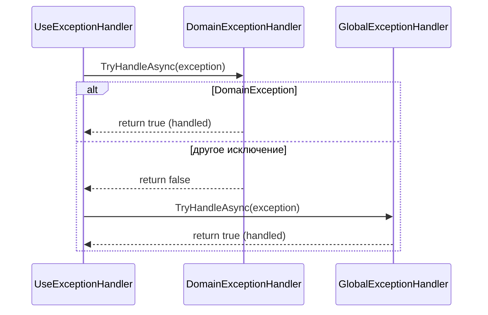

# Exception Handling

> Необработанное исключение без явного обработчика возвращает клиенту пустой 500 или HTML-страницу с traceback. Правильная обработка — это Problem Details + типизированные обработчики.

## Содержание
- [UseExceptionHandler](#useexceptionhandler)
- [IExceptionHandler (.NET 8+)](#iexceptionhandler-net-8)
- [Problem Details (RFC 7807)](#problem-details-rfc-7807)
- [Middleware vs MVC-фильтры для ошибок](#middleware-vs-mvc-фильтры-для-ошибок)
- [Подводные камни](#подводные-камни)
- [См. также](#см-также)

---

## UseExceptionHandler

`UseExceptionHandler` перехватывает все исключения из middleware, расположенных **ниже** него по pipeline. Именно поэтому он должен стоять первым.

**Вариант 1 — перенаправление на endpoint:**

```csharp
app.UseExceptionHandler("/error");

// Endpoint, который возвращает ответ об ошибке
app.Map("/error", (HttpContext context) =>
{
    var feature = context.Features.Get<IExceptionHandlerFeature>();
    var exception = feature?.Error;

    var status = exception switch
    {
        NotFoundException       => StatusCodes.Status404NotFound,
        ValidationException     => StatusCodes.Status422UnprocessableEntity,
        UnauthorizedException   => StatusCodes.Status401Unauthorized,
        _                       => StatusCodes.Status500InternalServerError
    };

    return Results.Problem(
        title: GetTitle(exception),
        detail: exception?.Message,
        statusCode: status);
});
```

**Вариант 2 — inline обработчик (без перенаправления):**

```csharp
app.UseExceptionHandler(errorApp =>
{
    errorApp.Run(async context =>
    {
        var feature = context.Features.Get<IExceptionHandlerFeature>();
        var exception = feature?.Error;

        context.Response.ContentType = "application/problem+json";
        context.Response.StatusCode = exception switch
        {
            NotFoundException => 404,
            _                 => 500
        };

        var problem = new ProblemDetails
        {
            Status  = context.Response.StatusCode,
            Title   = exception?.GetType().Name,
            Detail  = exception?.Message
        };

        await context.Response.WriteAsJsonAsync(problem);
    });
});
```

---

## IExceptionHandler (.NET 8+)

Более чистый подход: несколько типизированных обработчиков, вызываемых по цепочке.

```csharp
/// <summary>
/// Handles domain-specific exceptions, converts to 422 Problem Details.
/// Returns false for non-domain exceptions to pass to the next handler.
/// </summary>
public class DomainExceptionHandler : IExceptionHandler
{
    private readonly ILogger<DomainExceptionHandler> _logger;

    public DomainExceptionHandler(ILogger<DomainExceptionHandler> logger)
    {
        _logger = logger;
    }

    public async ValueTask<bool> TryHandleAsync(
        HttpContext context,
        Exception exception,
        CancellationToken cancellationToken)
    {
        if (exception is not DomainException domainEx)
            return false;  // передаём следующему обработчику

        _logger.LogWarning(exception, "Domain rule violated: {Message}", exception.Message);

        context.Response.StatusCode = StatusCodes.Status422UnprocessableEntity;
        await context.Response.WriteAsJsonAsync(new ProblemDetails
        {
            Status = 422,
            Title  = "Business rule violation",
            Detail = domainEx.Message,
            Type   = "https://errors.example.com/domain"
        }, cancellationToken);

        return true;  // исключение обработано
    }
}

/// <summary>
/// Fallback handler for all unhandled exceptions.
/// </summary>
public class GlobalExceptionHandler : IExceptionHandler
{
    private readonly ILogger<GlobalExceptionHandler> _logger;

    public GlobalExceptionHandler(ILogger<GlobalExceptionHandler> logger)
    {
        _logger = logger;
    }

    public async ValueTask<bool> TryHandleAsync(
        HttpContext context,
        Exception exception,
        CancellationToken cancellationToken)
    {
        _logger.LogError(exception, "Unhandled exception");

        context.Response.StatusCode = StatusCodes.Status500InternalServerError;
        await context.Response.WriteAsJsonAsync(new ProblemDetails
        {
            Status = 500,
            Title  = "Internal server error",
            Detail = "An unexpected error occurred."
        }, cancellationToken);

        return true;
    }
}
```

Регистрация — порядок важен, вызываются последовательно:

```csharp
builder.Services.AddExceptionHandler<DomainExceptionHandler>();   // специфичный
builder.Services.AddExceptionHandler<GlobalExceptionHandler>();   // fallback
builder.Services.AddProblemDetails();

app.UseExceptionHandler();  // без аргументов — использует IExceptionHandler
```



---

## Problem Details (RFC 7807)

Стандарт описания ошибок HTTP API. ASP.NET Core реализует его через `ProblemDetails`:

```json
{
  "type":     "https://errors.example.com/not-found",
  "title":    "Product not found",
  "status":   404,
  "detail":   "Product with id '42' does not exist",
  "instance": "/api/products/42",
  "traceId":  "00-abc123def456-00"
}
```

Поля:
- `type` — URI, идентифицирующий тип ошибки (документация по ссылке).
- `title` — короткое человекочитаемое название (не меняется для одного типа).
- `status` — HTTP-статус.
- `detail` — контекст конкретного инцидента.
- `instance` — URI запроса, вызвавшего ошибку.

Включение:

```csharp
builder.Services.AddProblemDetails();
```

После этого `[ApiController]` автоматически оборачивает `400`/`405`/`415` ответы в Problem Details. `UseExceptionHandler()` без аргументов тоже использует Problem Details как формат.

Расширение для кастомных полей:

```csharp
var problem = new ProblemDetails
{
    Status = 422,
    Title  = "Validation failed",
    Detail = "One or more fields are invalid"
};
problem.Extensions["errors"] = new Dictionary<string, string[]>
{
    ["Name"]  = ["Name is required"],
    ["Price"] = ["Price must be positive"]
};

return Results.Problem(problem);
```

Возврат Problem Details из контроллера:

```csharp
return Problem(
    title:      "Product not found",
    detail:     $"Product with id '{id}' does not exist",
    statusCode: StatusCodes.Status404NotFound,
    type:       "https://errors.example.com/not-found",
    instance:   HttpContext.Request.Path
);
```

---

## Middleware vs MVC-фильтры для ошибок

| Аспект | `UseExceptionHandler` / `IExceptionHandler` | `IExceptionFilter` |
|--------|---------------------------------------------|-------------------|
| Область применения | Весь pipeline (middleware + MVC) | Только MVC-контроллеры |
| Доступ к `ActionContext` | Нет | Да (`context.ActionDescriptor`) |
| Доступ к исключению | Через `IExceptionHandlerFeature` | Через `ExceptionContext.Exception` |
| `ExceptionHandled` флаг | Возврат `true` из `TryHandleAsync` | `context.ExceptionHandled = true` |
| Когда использовать | Основной механизм | Дополнительный MVC-специфичный |

Рекомендация: `IExceptionHandler` — основной и единственный обработчик в большинстве случаев. `IExceptionFilter` — только если нужен доступ к `ActionDescriptor` (имя action, параметры).

```csharp
/// <summary>
/// MVC filter that logs action name alongside exception details.
/// Use only when ActionDescriptor context is needed.
/// </summary>
public class MvcLoggingExceptionFilter : IExceptionFilter
{
    private readonly ILogger<MvcLoggingExceptionFilter> _logger;

    public MvcLoggingExceptionFilter(ILogger<MvcLoggingExceptionFilter> logger)
    {
        _logger = logger;
    }

    public void OnException(ExceptionContext context)
    {
        _logger.LogError(
            context.Exception,
            "Exception in {Action}",
            context.ActionDescriptor.DisplayName);
        // ExceptionHandled = false — пусть IExceptionHandler обработает дальше
    }
}

// Регистрация глобально
builder.Services.AddControllers(options =>
{
    options.Filters.Add<MvcLoggingExceptionFilter>();
});
```

---

## Подводные камни

**`UseExceptionHandler` не перехватывает исключения из middleware, стоящих выше него.** Если `UseHsts` или другой middleware бросит — `UseExceptionHandler` это не увидит. Всегда ставь его первым.

**Нельзя изменить заголовки ответа после начала его записи.** Если исключение произошло после того, как `Response.Body.WriteAsync` был вызван (`context.Response.HasStarted == true`) — обработчик не может изменить статус-код или заголовки. Он может только дописать в поток или прервать соединение через `context.Abort()`.

**`IExceptionHandler` и `AddProblemDetails` не одно и то же.** `AddProblemDetails` настраивает форматирование для стандартных HTTP-ошибок (4xx без тела). `IExceptionHandler` перехватывает исключения. Оба нужны одновременно.

**Не логируй исключения дважды.** Если `IExceptionHandler` логирует ошибку, а `IExceptionFilter` тоже логирует — одна ошибка даст два лог-события. Определи одно место для логирования.

---

## См. также

- [03-middleware.md](./03-middleware.md) — порядок `UseExceptionHandler` в pipeline
- [10-filters.md](./10-filters.md) — `IExceptionFilter` как MVC-уровень
- [05-model-binding.md](./05-model-binding.md) — валидационные ошибки и Problem Details
