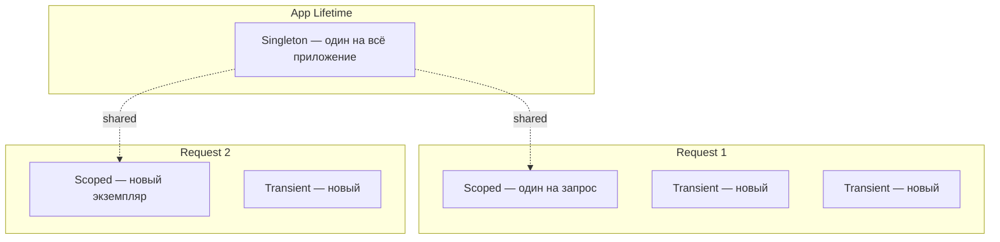

# Dependency Injection

> Встроенный DI-контейнер ASP.NET Core управляет временем жизни сервисов. Главная ловушка — Captive Dependency: когда Singleton захватывает Scoped.

## Содержание
- [Регистрация и разрешение](#регистрация-и-разрешение)
- [Lifetimes: Singleton, Scoped, Transient](#lifetimes-singleton-scoped-transient)
- [Captive Dependency](#captive-dependency)
- [IServiceScopeFactory — ручное управление scope](#iservicescopefactory--ручное-управление-scope)
- [Keyed Services (.NET 8+)](#keyed-services-net-8)
- [Open Generic Registration](#open-generic-registration)
- [IOptions — типизированная конфигурация](#ioptions--типизированная-конфигурация)
- [Подводные камни](#подводные-камни)
- [См. также](#см-также)

---

## Регистрация и разрешение

```csharp
var builder = WebApplication.CreateBuilder(args);

// Регистрация
builder.Services.AddSingleton<IEmailService, SmtpEmailService>();
builder.Services.AddScoped<IProductRepository, EfProductRepository>();
builder.Services.AddTransient<IPasswordHasher, BcryptPasswordHasher>();

// Регистрация с фабрикой (когда нужна дополнительная логика)
builder.Services.AddSingleton<ICache>(sp =>
{
    var config = sp.GetRequiredService<IConfiguration>();
    return new RedisCache(config.GetConnectionString("Redis")!);
});

var app = builder.Build();
```

После `builder.Build()` `IServiceCollection` закрывается — регистрировать новые сервисы нельзя.

Разрешение:

```csharp
// Через DI (рекомендуется — конструктор контроллера/сервиса)
public class OrderService
{
    private readonly IProductRepository _repo;
    public OrderService(IProductRepository repo) => _repo = repo;
}

// Через IServiceProvider напрямую (service locator — антипаттерн, избегай)
var repo = app.Services.GetRequiredService<IProductRepository>();
```

`GetRequiredService<T>()` бросает `InvalidOperationException` если сервис не зарегистрирован. `GetService<T>()` возвращает `null`.

---

## Lifetimes: Singleton, Scoped, Transient



| Lifetime | Создаётся | Уничтожается | Когда использовать |
|----------|-----------|--------------|-------------------|
| **Singleton** | При первом запросе или явно | При остановке приложения | Stateless сервисы, кеши, `HttpClient` через фабрику |
| **Scoped** | Раз на HTTP-запрос | После завершения запроса | `DbContext`, Unit of Work, per-request state |
| **Transient** | При каждом вызове `GetService` | После использования (`IDisposable`) | Лёгкие операции, mapper'ы |

Практические правила:
- `DbContext` — **всегда Scoped**. Не thread-safe, хранит tracked entities.
- `HttpClient` — **Singleton через `IHttpClientFactory`** (не создавай `new HttpClient()` напрямую).
- `ILogger<T>` — Singleton, создаётся фреймворком.

---

## Captive Dependency

**Captive dependency** — Singleton держит ссылку на Scoped или Transient сервис. Scoped-сервис, захваченный Singleton, фактически становится Singleton.

```csharp
// ПРОБЛЕМА
public class OrderService  // Singleton
{
    private readonly IOrderRepository _repo;  // Scoped!

    public OrderService(IOrderRepository repo)
    {
        _repo = repo;  // захвачен при первом запросе, живёт вечно
    }
}
```

Последствия: `DbContext` переиспользуется между запросами → race conditions, утечки tracked entities, устаревшие данные.

ASP.NET Core **выбрасывает исключение** в Development при обнаружении captive dependency:

```
InvalidOperationException: Cannot consume scoped service 'IOrderRepository'
from singleton 'OrderService'.
```

В Production этот контроль по умолчанию отключён. Включить явно:

```csharp
builder.Host.UseDefaultServiceProvider(options =>
{
    options.ValidateScopes = true;   // проверяет captive dependency
    options.ValidateOnBuild = true;  // проверяет при Build(), не при первом вызове
});
```

---

## IServiceScopeFactory — ручное управление scope

Когда Singleton действительно нужен, но ему нужен Scoped-сервис — создавай scope вручную:

```csharp
public class OrderService  // Singleton
{
    private readonly IServiceScopeFactory _factory;

    public OrderService(IServiceScopeFactory factory)
    {
        _factory = factory;
    }

    public async Task ProcessAsync(int orderId)
    {
        using var scope = _factory.CreateScope();
        var repo = scope.ServiceProvider.GetRequiredService<IOrderRepository>();
        await repo.ProcessAsync(orderId);
        // scope.Dispose() вызывается here — repo и DbContext освобождаются
    }
}
```

Тот же паттерн используется в `BackgroundService` — он регистрируется как Singleton, но нуждается в Scoped `DbContext` на каждую итерацию:

```csharp
protected override async Task ExecuteAsync(CancellationToken stoppingToken)
{
    while (!stoppingToken.IsCancellationRequested)
    {
        using var scope = _factory.CreateScope();
        var processor = scope.ServiceProvider.GetRequiredService<IMessageProcessor>();
        await processor.ProcessNextAsync(stoppingToken);

        await Task.Delay(TimeSpan.FromSeconds(5), stoppingToken);
    }
}
```

---

## Keyed Services (.NET 8+)

Несколько реализаций одного интерфейса под разными ключами:

```csharp
// Регистрация
builder.Services.AddKeyedSingleton<IPaymentGateway, StripeGateway>("stripe");
builder.Services.AddKeyedSingleton<IPaymentGateway, PayPalGateway>("paypal");

// Разрешение через атрибут в конструкторе
public class PaymentService
{
    private readonly IPaymentGateway _gateway;

    public PaymentService([FromKeyedServices("stripe")] IPaymentGateway gateway)
    {
        _gateway = gateway;
    }
}

// Разрешение через IServiceProvider
var gateway = sp.GetRequiredKeyedService<IPaymentGateway>("paypal");
```

До .NET 8 для этого использовали фабрику:

```csharp
// Старый способ
builder.Services.AddSingleton<Func<string, IPaymentGateway>>(sp => key => key switch
{
    "stripe" => sp.GetRequiredService<StripeGateway>(),
    "paypal" => sp.GetRequiredService<PayPalGateway>(),
    _        => throw new ArgumentException($"Unknown gateway: {key}")
});
```

---

## Open Generic Registration

Регистрация открытого generic-типа покрывает все закрытые варианты:

```csharp
// Регистрация
builder.Services.AddScoped(typeof(IRepository<>), typeof(EfRepository<>));

// Работает для любого T без дополнительной регистрации
public class OrderService
{
    public OrderService(IRepository<Order> repo) { }
}

public class ProductService
{
    public ProductService(IRepository<Product> repo) { }
}
```

Полезно для паттернов Repository, Generic Handler (MediatR-style):

```csharp
builder.Services.AddTransient(typeof(IPipelineBehavior<,>), typeof(ValidationBehavior<,>));
```

---

## IOptions — типизированная конфигурация

Связывает секцию конфигурации с типизированным классом:

```csharp
/// <summary>Configuration options for SMTP email sending.</summary>
public class EmailOptions
{
    public const string Section = "Email";

    public string SmtpHost { get; set; } = default!;
    public int    SmtpPort { get; set; } = 587;
    public string Username { get; set; } = default!;
    public string Password { get; set; } = default!;
}

// Регистрация
builder.Services.Configure<EmailOptions>(
    builder.Configuration.GetSection(EmailOptions.Section));
```

Три варианта внедрения:

```csharp
public class EmailService
{
    // IOptions<T> — читается один раз, Singleton, не обновляется при изменении файла
    public EmailService(IOptions<EmailOptions> options)
    {
        var host = options.Value.SmtpHost;
    }

    // IOptionsSnapshot<T> — Scoped, пересоздаётся раз в запрос
    public EmailService(IOptionsSnapshot<EmailOptions> snapshot)
    {
        var host = snapshot.Value.SmtpHost; // актуально на момент запроса
    }

    // IOptionsMonitor<T> — Singleton, реагирует на изменения в реальном времени
    public EmailService(IOptionsMonitor<EmailOptions> monitor)
    {
        monitor.OnChange(opts =>
            _logger.LogInformation("Email config changed: {Host}", opts.SmtpHost));

        var host = monitor.CurrentValue.SmtpHost;
    }
}
```

| | `IOptions<T>` | `IOptionsSnapshot<T>` | `IOptionsMonitor<T>` |
|--|:---:|:---:|:---:|
| Lifetime | Singleton | Scoped | Singleton |
| Обновляется | Нет | Раз в запрос | Немедленно (OnChange) |
| Для BackgroundService | Нет | Нет | **Да** |

Валидация опций при старте:

```csharp
builder.Services
    .AddOptions<EmailOptions>()
    .Bind(builder.Configuration.GetSection(EmailOptions.Section))
    .ValidateDataAnnotations()
    .ValidateOnStart();  // бросает исключение при запуске, не при первом запросе
```

---

## Подводные камни

**`IDisposable` + Transient в Singleton scope.** Transient `IDisposable`-сервис, разрешённый из root `IServiceProvider` (не из request scope), никогда не будет задиспоужен до остановки приложения — утечка памяти. Всегда создавай scope перед разрешением Transient `IDisposable`.

**`AddSingleton` vs `AddSingleton<T>(instance)`.** Первый вариант — контейнер создаёт экземпляр при первом запросе. Второй — ты передаёшь уже созданный экземпляр. Если экземпляр реализует `IDisposable`, контейнер **не** будет его диспоузить (ты создал — ты и диспоузишь).

**Множественные регистрации одного типа.** `GetService<T>()` вернёт последнюю зарегистрированную реализацию. `GetServices<T>()` вернёт все:

```csharp
builder.Services.AddSingleton<IPlugin, PluginA>();
builder.Services.AddSingleton<IPlugin, PluginB>();

// GetService → PluginB (последняя)
// GetServices → [PluginA, PluginB]
```

---

## См. также

- [02-request-lifecycle.md](./02-request-lifecycle.md) — как DI Scope привязан к HTTP-запросу
- [08-configuration.md](./08-configuration.md) — источники конфигурации для `IOptions`
- [09-hosted-services.md](./09-hosted-services.md) — `IServiceScopeFactory` в BackgroundService
