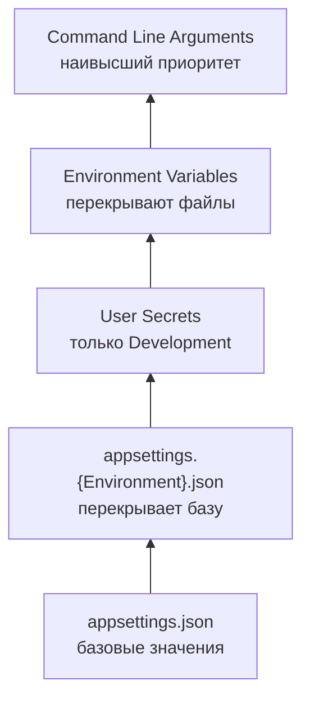

# Configuration

> ASP.NET Core собирает конфигурацию из нескольких источников. Источник, добавленный позже, перекрывает ранее добавленные. Правильный инструмент для доступа — `IOptions<T>`.

## Содержание
- [Источники и порядок приоритетов](#источники-и-порядок-приоритетов)
- [appsettings.json и структура](#appsettingsjson-и-структура)
- [Environment Variables](#environment-variables)
- [User Secrets (только для разработки)](#user-secrets-только-для-разработки)
- [Reload on Change](#reload-on-change)
- [Кастомный Configuration Provider](#кастомный-configuration-provider)
- [Подводные камни](#подводные-камни)
- [См. также](#см-также)

---

## Источники и порядок приоритетов

`WebApplication.CreateBuilder(args)` по умолчанию добавляет источники в следующем порядке (каждый следующий перекрывает предыдущий):



Явная настройка (обычно не нужна, но позволяет добавить кастомные источники):

```csharp
builder.Configuration
    .AddJsonFile("appsettings.json", optional: false, reloadOnChange: true)
    .AddJsonFile($"appsettings.{builder.Environment.EnvironmentName}.json", optional: true, reloadOnChange: true)
    .AddUserSecrets<Program>(optional: true)
    .AddEnvironmentVariables()
    .AddCommandLine(args);
```

Текущее окружение определяется переменной `ASPNETCORE_ENVIRONMENT`. Стандартные значения: `Development`, `Staging`, `Production`.

---

## appsettings.json и структура

```json
{
  "ConnectionStrings": {
    "Default": "Server=localhost;Database=shop;User Id=app;Password=secret;"
  },
  "Email": {
    "SmtpHost": "smtp.example.com",
    "SmtpPort": 587,
    "Username": "sender@example.com"
  },
  "Logging": {
    "LogLevel": {
      "Default": "Information",
      "Microsoft.AspNetCore": "Warning",
      "Microsoft.EntityFrameworkCore.Database.Command": "Information"
    }
  },
  "AllowedHosts": "*"
}
```

Чтение через `IConfiguration` (низкоуровневый доступ, только для Program.cs / middleware):

```csharp
var host = builder.Configuration["Email:SmtpHost"];           // строка или null
var port = builder.Configuration.GetValue<int>("Email:SmtpPort", defaultValue: 587);
var conn = builder.Configuration.GetConnectionString("Default");

// Секция как объект
var emailSection = builder.Configuration.GetSection("Email");
var smtpHost = emailSection["SmtpHost"];
```

Правило: в бизнес-коде (сервисах, контроллерах) **не** внедряй `IConfiguration` напрямую — используй `IOptions<T>`.

---

## Environment Variables

Переменные окружения используют `__` (двойное подчёркивание) как разделитель секций:

```bash
# Соответствует Email:SmtpHost в JSON
export Email__SmtpHost=smtp.example.com
export Email__SmtpPort=587

# ConnectionStrings:Default
export ConnectionStrings__Default="Server=prod-db;Database=shop;..."

# Logging:LogLevel:Default
export Logging__LogLevel__Default=Warning
```

В Kubernetes это настраивается через `ConfigMap` и `Secret`:

```yaml
env:
  - name: ConnectionStrings__Default
    valueFrom:
      secretKeyRef:
        name: app-secrets
        key: db-connection-string
  - name: Email__SmtpHost
    valueFrom:
      configMapKeyRef:
        name: app-config
        key: smtp-host
```

---

## User Secrets (только для разработки)

User Secrets хранятся **вне** директории проекта — не попадают в git. Путь хранения:
- Windows: `%APPDATA%\Microsoft\UserSecrets\{userSecretsId}\secrets.json`
- Linux/macOS: `~/.microsoft/usersecrets/{userSecretsId}/secrets.json`

```bash
# Инициализация (добавляет UserSecretsId в .csproj)
dotnet user-secrets init

# Установка секретов
dotnet user-secrets set "Email:Password" "super-secret-password"
dotnet user-secrets set "ConnectionStrings:Default" "Server=localhost;..."

# Просмотр всех секретов
dotnet user-secrets list

# Удаление
dotnet user-secrets remove "Email:Password"
dotnet user-secrets clear   # удалить все
```

User Secrets подключаются автоматически в `Development`. В `Production` / `Staging` их нет — там используй переменные окружения или секрет-менеджер (Azure Key Vault, AWS Secrets Manager).

---

## Reload on Change

`reloadOnChange: true` отслеживает файл через `FileSystemWatcher`. При изменении файла конфигурация перезагружается без перезапуска приложения.

```csharp
builder.Configuration.AddJsonFile("appsettings.json", reloadOnChange: true);
```

Подписка на изменения через `IOptionsMonitor<T>`:

```csharp
public class FeatureFlagService
{
    private FeatureFlagOptions _options;

    public FeatureFlagService(IOptionsMonitor<FeatureFlagOptions> monitor)
    {
        _options = monitor.CurrentValue;

        monitor.OnChange(updated =>
        {
            _options = updated;
            _logger.LogInformation("Feature flags reloaded");
        });
    }

    public bool IsEnabled(string feature)
        => _options.EnabledFeatures.Contains(feature);
}
```

`IOptionsSnapshot<T>` тоже подхватывает изменения, но только на следующий HTTP-запрос (Scoped — создаётся заново).

---

## Кастомный Configuration Provider

Когда конфигурация хранится в нестандартном месте (база данных, API):

```csharp
/// <summary>
/// Configuration source backed by a SQL database table.
/// </summary>
public class DatabaseConfigurationSource : IConfigurationSource
{
    private readonly string _connectionString;

    public DatabaseConfigurationSource(string connectionString)
    {
        _connectionString = connectionString;
    }

    public IConfigurationProvider Build(IConfigurationBuilder builder)
        => new DatabaseConfigurationProvider(_connectionString);
}

/// <summary>
/// Loads key-value pairs from app_settings table.
/// </summary>
public class DatabaseConfigurationProvider : ConfigurationProvider
{
    private readonly string _connectionString;

    public DatabaseConfigurationProvider(string connectionString)
    {
        _connectionString = connectionString;
    }

    public override void Load()
    {
        using var connection = new SqlConnection(_connectionString);
        connection.Open();

        var command = new SqlCommand(
            "SELECT [Key], [Value] FROM app_settings WHERE is_active = 1", connection);

        using var reader = command.ExecuteReader();
        var data = new Dictionary<string, string?>(StringComparer.OrdinalIgnoreCase);

        while (reader.Read())
            data[reader.GetString(0)] = reader.GetString(1);

        Data = data;
    }
}

// Регистрация
builder.Configuration.Add(
    new DatabaseConfigurationSource(
        builder.Configuration.GetConnectionString("Default")!));
```

---

## Подводные камни

**Секреты в `appsettings.json` попадают в git.** Никогда не пиши пароли, API-ключи, connection strings с паролями в `appsettings.json`. Для разработки — User Secrets, для production — переменные окружения или внешний секрет-менеджер.

**`IConfiguration` в бизнес-коде — антипаттерн.** Прямая зависимость от `IConfiguration` в сервисах делает код немасштабируемым и неудобным для тестирования. Используй `IOptions<T>` — можно подменить в тестах через `Options.Create(new MyOptions { ... })`.

**Порядок в `appsettings.{env}.json` не абсолютный.** Если ключ не указан в `appsettings.Production.json`, он берётся из `appsettings.json`. Это merge, а не замена файла целиком. Пустой `appsettings.Production.json` не обнулит все настройки.

**`reloadOnChange` в контейнерах.** `FileSystemWatcher` может не работать корректно в некоторых контейнерных окружениях (особенно монтированные volumes). Для динамической конфигурации в Kubernetes лучше использовать внешний провайдер (Consul, Azure App Configuration).

---

## См. также

- [07-dependency-injection.md](./07-dependency-injection.md) — `IOptions<T>`, `IOptionsSnapshot`, `IOptionsMonitor` подробно
- [09-hosted-services.md](./09-hosted-services.md) — `IOptionsMonitor` в BackgroundService
