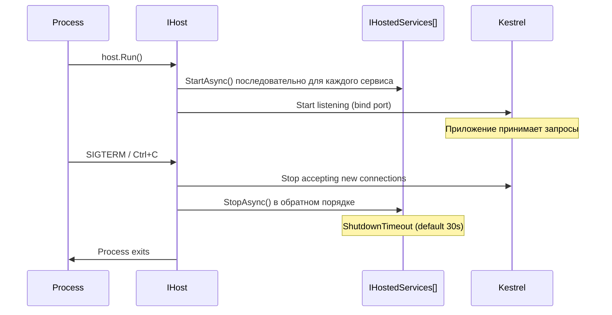

# Hosted Services

> Hosted Services — фоновая работа, привязанная к жизненному циклу хоста. Стартуют вместе с приложением, останавливаются при graceful shutdown.

## Содержание
- [IHostedService — базовый интерфейс](#ihostedservice--базовый-интерфейс)
- [BackgroundService — абстрактный базовый класс](#backgroundservice--абстрактный-базовый-класс)
- [Жизненный цикл хоста и Graceful Shutdown](#жизненный-цикл-хоста-и-graceful-shutdown)
- [Доступ к Scoped-сервисам](#доступ-к-scoped-сервисам)
- [Периодические задачи](#периодические-задачи)
- [Подводные камни](#подводные-камни)
- [См. также](#см-также)

---

## IHostedService — базовый интерфейс

`IHostedService` — два метода: `StartAsync` и `StopAsync`. Подходит для одноразовых задач при старте/остановке (прогрев кешей, миграции, регистрация в service discovery).

```csharp
/// <summary>
/// Warms up application caches on startup by pre-loading frequently accessed data.
/// </summary>
public class CacheWarmupService : IHostedService
{
    private readonly IServiceScopeFactory _factory;
    private readonly ILogger<CacheWarmupService> _logger;

    public CacheWarmupService(
        IServiceScopeFactory factory,
        ILogger<CacheWarmupService> logger)
    {
        _factory = factory;
        _logger = logger;
    }

    public async Task StartAsync(CancellationToken cancellationToken)
    {
        _logger.LogInformation("Cache warmup starting");

        using var scope = _factory.CreateScope();
        var cache = scope.ServiceProvider.GetRequiredService<IProductCache>();
        await cache.WarmupAsync(cancellationToken);

        _logger.LogInformation("Cache warmup completed");
    }

    public Task StopAsync(CancellationToken cancellationToken)
    {
        _logger.LogInformation("Cache warmup service stopping");
        return Task.CompletedTask;
    }
}

builder.Services.AddHostedService<CacheWarmupService>();
```

`StartAsync` вызывается **до** того, как Kestrel начнёт принимать входящие соединения — приложение не отвечает на запросы, пока все `StartAsync` не завершатся. Долгие операции надо уходить в фон (`Task.Run`) или делать через `BackgroundService`.

---

## BackgroundService — абстрактный базовый класс

`BackgroundService` реализует `IHostedService` и прячет управление: ты переопределяешь только `ExecuteAsync`, которая запускается в фоне после `StartAsync`.

```csharp
/// <summary>
/// Continuously processes messages from an in-memory channel.
/// Uses IServiceScopeFactory to resolve Scoped dependencies per message.
/// </summary>
public class MessageProcessorService : BackgroundService
{
    private readonly Channel<Message> _channel;
    private readonly IServiceScopeFactory _factory;
    private readonly ILogger<MessageProcessorService> _logger;

    public MessageProcessorService(
        Channel<Message> channel,
        IServiceScopeFactory factory,
        ILogger<MessageProcessorService> logger)
    {
        _channel = channel;
        _factory = factory;
        _logger = logger;
    }

    protected override async Task ExecuteAsync(CancellationToken stoppingToken)
    {
        _logger.LogInformation("Message processor started");

        await foreach (var message in _channel.Reader.ReadAllAsync(stoppingToken))
        {
            try
            {
                await ProcessAsync(message, stoppingToken);
            }
            catch (OperationCanceledException)
            {
                break;
            }
            catch (Exception ex)
            {
                // Не пробрасываем — сервис должен продолжить работу
                _logger.LogError(ex, "Failed to process message {MessageId}", message.Id);
            }
        }

        _logger.LogInformation("Message processor stopped");
    }

    private async Task ProcessAsync(Message message, CancellationToken ct)
    {
        using var scope = _factory.CreateScope();
        var handler = scope.ServiceProvider.GetRequiredService<IMessageHandler>();
        await handler.HandleAsync(message, ct);
    }
}
```

Как `BackgroundService` реализует `IHostedService` внутри:

```csharp
// Упрощённый исходник BackgroundService
public abstract class BackgroundService : IHostedService, IDisposable
{
    private Task? _executeTask;
    private CancellationTokenSource? _cts;

    public Task StartAsync(CancellationToken cancellationToken)
    {
        _cts = CancellationTokenSource.CreateLinkedTokenSource(cancellationToken);
        _executeTask = ExecuteAsync(_cts.Token);

        // Если ExecuteAsync завершился синхронно — возвращаем его Task
        if (_executeTask.IsCompleted)
            return _executeTask;

        // Иначе — возвращаем сразу, ExecuteAsync работает в фоне
        return Task.CompletedTask;
    }

    public async Task StopAsync(CancellationToken cancellationToken)
    {
        if (_executeTask is null) return;

        _cts!.Cancel();

        // Ждём завершения ExecuteAsync или истечения ShutdownTimeout
        await Task.WhenAny(_executeTask, Task.Delay(Timeout.Infinite, cancellationToken));
    }

    protected abstract Task ExecuteAsync(CancellationToken stoppingToken);
}
```

---

## Жизненный цикл хоста и Graceful Shutdown



`StopAsync` вызывается с `CancellationToken`, который отменяется по истечении `ShutdownTimeout`. По умолчанию — 30 секунд. После отмены токена процесс завершается принудительно.

```csharp
// Увеличить таймаут для долгих задач (например, дообработка очереди)
builder.Services.Configure<HostOptions>(options =>
{
    options.ShutdownTimeout = TimeSpan.FromSeconds(60);
});
```

Корректная реакция на остановку в `ExecuteAsync`:

```csharp
protected override async Task ExecuteAsync(CancellationToken stoppingToken)
{
    while (!stoppingToken.IsCancellationRequested)
    {
        try
        {
            await DoWorkAsync(stoppingToken);
        }
        catch (OperationCanceledException)
        {
            // Нормальная остановка — выходим из цикла без логирования ошибки
            break;
        }
    }

    // Финализация — у нас ещё есть ShutdownTimeout секунд
    await FlushPendingAsync(CancellationToken.None);
}
```

---

## Доступ к Scoped-сервисам

`BackgroundService` регистрируется как **Singleton** (один экземпляр на всё приложение). Scoped-сервисы (`DbContext`, репозитории) нельзя внедрять в конструктор — captive dependency.

Правильный паттерн: `IServiceScopeFactory` + `using var scope`:

```csharp
/// <summary>
/// Background service that runs database maintenance jobs on a schedule.
/// Creates a new DI scope per job to avoid DbContext reuse across iterations.
/// </summary>
public class DatabaseMaintenanceService : BackgroundService
{
    private readonly IServiceScopeFactory _factory;
    private readonly ILogger<DatabaseMaintenanceService> _logger;

    public DatabaseMaintenanceService(
        IServiceScopeFactory factory,
        ILogger<DatabaseMaintenanceService> logger)
    {
        _factory = factory;
        _logger = logger;
    }

    protected override async Task ExecuteAsync(CancellationToken stoppingToken)
    {
        while (!stoppingToken.IsCancellationRequested)
        {
            await Task.Delay(TimeSpan.FromHours(1), stoppingToken);

            using var scope = _factory.CreateScope();
            var db = scope.ServiceProvider.GetRequiredService<AppDbContext>();

            var deleted = await db.AuditLogs
                .Where(l => l.CreatedAt < DateTime.UtcNow.AddDays(-30))
                .ExecuteDeleteAsync(stoppingToken);

            _logger.LogInformation("Deleted {Count} old audit log entries", deleted);
            // scope.Dispose() → DbContext освобождается
        }
    }
}
```

---

## Периодические задачи

**Вариант 1 — `Task.Delay` в цикле** (простой, неточный интервал):

```csharp
protected override async Task ExecuteAsync(CancellationToken stoppingToken)
{
    while (!stoppingToken.IsCancellationRequested)
    {
        await DoWorkAsync(stoppingToken);
        await Task.Delay(TimeSpan.FromMinutes(5), stoppingToken);
    }
}
```

Интервал отсчитывается от конца предыдущего выполнения — дрейф накапливается.

**Вариант 2 — `PeriodicTimer` (.NET 6+)** (точный интервал, не дрейфует):

```csharp
protected override async Task ExecuteAsync(CancellationToken stoppingToken)
{
    using var timer = new PeriodicTimer(TimeSpan.FromMinutes(5));

    while (await timer.WaitForNextTickAsync(stoppingToken))
    {
        try
        {
            await DoWorkAsync(stoppingToken);
        }
        catch (Exception ex)
        {
            _logger.LogError(ex, "Periodic job failed");
        }
    }
}
```

`PeriodicTimer` тикает по реальному времени: если `DoWorkAsync` занял 2 минуты при 5-минутном интервале, следующий тик будет через 3 минуты, а не через 5.

---

## Подводные камни

**Необработанное исключение из `ExecuteAsync` роняет BackgroundService.** Хост **не** перезапускает упавший сервис автоматически. Необработанное исключение из `ExecuteAsync` завершит Task, и сервис молча прекратит работу. Всегда оборачивай тело цикла в `try/catch`.

**`StartAsync` блокирует запуск Kestrel.** Если `StartAsync` висит (например, ждёт подключения к базе), Kestrel не начнёт принимать запросы. Для долгих инициализаций запускай фоновую задачу изнутри `StartAsync` и не жди её:

```csharp
public Task StartAsync(CancellationToken cancellationToken)
{
    _ = Task.Run(() => LongInitializationAsync(), cancellationToken);
    return Task.CompletedTask;
}
```

**Порядок `StartAsync` — порядок регистрации.** Сервисы стартуют последовательно в том порядке, в котором были добавлены через `AddHostedService`. `StopAsync` вызывается в обратном порядке.

**`IOptionsMonitor` вместо `IOptions` в BackgroundService.** `IOptions<T>` — Singleton, читается один раз при создании. Если конфигурация изменилась (reloadOnChange) — BackgroundService об этом не узнает. Используй `IOptionsMonitor<T>`.

---

## См. также

- [07-dependency-injection.md](./07-dependency-injection.md) — Captive Dependency и `IServiceScopeFactory`
- [08-configuration.md](./08-configuration.md) — `IOptionsMonitor` для динамической конфигурации
- [02-request-lifecycle.md](./02-request-lifecycle.md) — жизненный цикл DI Scope (контраст с Singleton BackgroundService)
