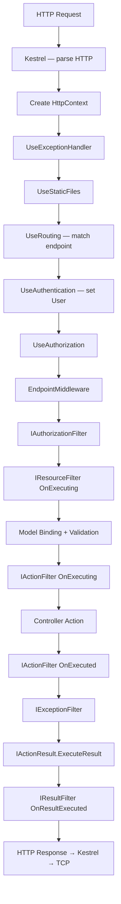

# Фильтры ASP.NET Core

> Фильтры — это AOP для MVC. Они работают внутри middleware pipeline, ближе к контроллеру, и имеют доступ к ActionContext — чего нет в middleware.

## Содержание
- [Место фильтров в pipeline](#место-фильтров-в-pipeline)
- [Типы фильтров и порядок выполнения](#типы-фильтров-и-порядок-выполнения)
- [IActionFilter и IAsyncActionFilter](#iactionfilter-и-iasyncactionfilter)
- [IResourceFilter](#iresourcefilter)
- [IResultFilter](#iresultfilter)
- [IExceptionFilter](#iexceptionfilter)
- [Регистрация фильтров](#регистрация-фильтров)
- [Сводная диаграмма всего pipeline](#сводная-диаграмма-всего-pipeline)
- [Подводные камни](#подводные-камни)
- [См. также](#см-также)

---

## Место фильтров в pipeline

Фильтры выполняются **внутри** `EndpointMiddleware` — после того, как middleware pipeline завершил свою работу и управление передано MVC.


Главное отличие фильтров от middleware:
- Фильтры знают о **контексте MVC**: имя action, параметры, `ModelState`, `IActionResult`.
- Middleware работает только с `HttpContext` — байты и заголовки.

---

## Типы фильтров и порядок выполнения

| Фильтр | Интерфейс | Когда выполняется |
|--------|-----------|-----------------|
| Authorization | `IAuthorizationFilter` | Первым, до всего остального |
| Resource | `IResourceFilter` | После авторизации, до model binding |
| Action | `IActionFilter` | До и после выполнения action |
| Result | `IResultFilter` | До и после `IActionResult.ExecuteResult` |
| Exception | `IExceptionFilter` | При необработанном исключении в action |

Порядок при нескольких фильтрах одного типа:

```
OnExecuting:  Global → Controller → Action
OnExecuted:   Action → Controller → Global
```

---

## IActionFilter и IAsyncActionFilter

**Синхронный вариант** — два отдельных метода:

```csharp
/// <summary>
/// Logs action execution time and argument names.
/// </summary>
public class TimingActionFilter : IActionFilter
{
    private readonly ILogger<TimingActionFilter> _logger;
    private Stopwatch? _sw;

    public TimingActionFilter(ILogger<TimingActionFilter> logger)
    {
        _logger = logger;
    }

    public void OnActionExecuting(ActionExecutingContext context)
    {
        _sw = Stopwatch.StartNew();
        _logger.LogInformation("Executing {Action}, args: {Args}",
            context.ActionDescriptor.DisplayName,
            string.Join(", ", context.ActionArguments.Keys));
    }

    public void OnActionExecuted(ActionExecutedContext context)
    {
        _sw?.Stop();
        _logger.LogInformation("Executed {Action} in {Ms}ms, exception: {Ex}",
            context.ActionDescriptor.DisplayName,
            _sw?.ElapsedMilliseconds,
            context.Exception?.Message ?? "none");
    }
}
```

**Асинхронный вариант** — один метод, оборачивает выполнение (удобнее для short-circuit):

```csharp
/// <summary>
/// Short-circuits the pipeline with 400 if ModelState is invalid.
/// </summary>
public class ValidateModelFilter : IAsyncActionFilter
{
    public async Task OnActionExecutionAsync(
        ActionExecutingContext context,
        ActionExecutionDelegate next)
    {
        if (!context.ModelState.IsValid)
        {
            context.Result = new UnprocessableEntityObjectResult(
                new ValidationProblemDetails(context.ModelState));
            return;  // next() не вызываем — short-circuit
        }

        await next();  // вызываем action и все следующие фильтры
    }
}
```

Нельзя реализовать `IActionFilter` и `IAsyncActionFilter` одновременно на одном классе — фреймворк использует только async-версию если оба присутствуют.

---

## IResourceFilter

Выполняется **до model binding** — позволяет short-circuit ещё до того, как тело запроса будет десериализовано. Применяется для кеширования на уровне фильтра:

```csharp
/// <summary>
/// Caches IActionResult by request path for a configurable duration.
/// Short-circuits model binding and action execution for cached responses.
/// </summary>
public class ResponseCacheFilter : IResourceFilter
{
    private readonly IMemoryCache _cache;
    private readonly TimeSpan _duration;
    private string? _key;

    public ResponseCacheFilter(IMemoryCache cache, TimeSpan duration)
    {
        _cache = cache;
        _duration = duration;
    }

    public void OnResourceExecuting(ResourceExecutingContext context)
    {
        _key = context.HttpContext.Request.Path.ToString();

        if (_cache.TryGetValue(_key, out IActionResult? cached))
        {
            context.Result = cached;  // short-circuit — action не вызывается
        }
    }

    public void OnResourceExecuted(ResourceExecutedContext context)
    {
        if (context.Result is not null && _key is not null)
            _cache.Set(_key, context.Result, _duration);
    }
}
```

---

## IResultFilter

Выполняется вокруг `IActionResult.ExecuteResult` — когда уже известен результат, но ответ ещё не записан в `Response.Body`:

```csharp
/// <summary>
/// Adds pagination metadata headers before response body is written.
/// </summary>
public class PaginationHeaderFilter : IResultFilter
{
    public void OnResultExecuting(ResultExecutingContext context)
    {
        if (context.Result is ObjectResult { Value: PagedResult paged })
        {
            context.HttpContext.Response.Headers["X-Total-Count"] =
                paged.TotalCount.ToString();
            context.HttpContext.Response.Headers["X-Page"] =
                paged.Page.ToString();
        }
    }

    public void OnResultExecuted(ResultExecutedContext context)
    {
        // ответ уже записан, заголовки изменить нельзя
    }
}
```

---

## IExceptionFilter

Перехватывает необработанные исключения из **action и других фильтров** (не из middleware). Используй, когда нужен `ActionDescriptor` или `ActionArguments` вместе с исключением:

```csharp
/// <summary>
/// Handles NotFoundException from action methods, returns 404 Problem Details.
/// Sets ExceptionHandled = true so IExceptionHandler does not duplicate the response.
/// </summary>
public class NotFoundExceptionFilter : IExceptionFilter
{
    private readonly ILogger<NotFoundExceptionFilter> _logger;

    public NotFoundExceptionFilter(ILogger<NotFoundExceptionFilter> logger)
    {
        _logger = logger;
    }

    public void OnException(ExceptionContext context)
    {
        if (context.Exception is not NotFoundException)
            return;

        _logger.LogWarning(
            "Not found in {Action}: {Message}",
            context.ActionDescriptor.DisplayName,
            context.Exception.Message);

        context.Result = new NotFoundObjectResult(new ProblemDetails
        {
            Status = 404,
            Title  = "Resource not found",
            Detail = context.Exception.Message
        });

        context.ExceptionHandled = true;
    }
}
```

Если `ExceptionHandled = false` (или не установлен) — исключение продолжает подниматься вверх и попадает в `UseExceptionHandler`.

---

## Регистрация фильтров

**Глобально — для всех контроллеров:**

```csharp
builder.Services.AddControllers(options =>
{
    options.Filters.Add<TimingActionFilter>();       // через DI
    options.Filters.Add(new ValidateModelFilter());  // инстанс
    options.Filters.Add<NotFoundExceptionFilter>(order: -1); // порядок
});
```

**На контроллере — для всех его action:**

```csharp
[ServiceFilter(typeof(TimingActionFilter))]   // берёт из DI (должен быть зарегистрирован)
[TypeFilter(typeof(ResponseCacheFilter),
    Arguments = new object[] { TimeSpan.FromMinutes(5) })]  // создаёт через ObjectFactory
public class ProductsController : ControllerBase { ... }
```

**На конкретном action:**

```csharp
[HttpGet("{id:int}")]
[ServiceFilter(typeof(ResponseCacheFilter))]
public IActionResult GetById(int id) { ... }
```

`ServiceFilter` vs `TypeFilter`:

| | `[ServiceFilter]` | `[TypeFilter]` |
|--|-------------------|----------------|
| Откуда берёт экземпляр | Из DI-контейнера | Создаёт через `ObjectFactory` |
| Регистрация в DI | Обязательна | Не нужна |
| Передача аргументов конструктора | Нет | Да, через `Arguments` |

Фильтры как `IFilterFactory` — продвинутый способ создавать фильтры с параметрами в виде атрибутов:

```csharp
/// <summary>
/// Attribute that applies response caching with a configurable duration.
/// </summary>
public class CacheResponseAttribute : Attribute, IFilterFactory
{
    private readonly int _seconds;

    public CacheResponseAttribute(int seconds) => _seconds = seconds;

    public bool IsReusable => false;

    public IFilterMetadata CreateInstance(IServiceProvider serviceProvider)
    {
        var cache = serviceProvider.GetRequiredService<IMemoryCache>();
        return new ResponseCacheFilter(cache, TimeSpan.FromSeconds(_seconds));
    }
}

// Применение
[HttpGet]
[CacheResponse(seconds: 300)]
public IActionResult GetAll() { ... }
```

---

## Сводная диаграмма всего pipeline



---

## Подводные камни

**Short-circuit в `IResourceFilter` пропускает model binding и action, но не `IResultFilter`.** `OnResourceExecuted` и `IResultFilter` всё равно выполнятся. Если выставил `context.Result` в `OnResourceExecuting` — убедись, что `IResultFilter` это корректно обрабатывает.

**`IActionFilter` — не замена `IExceptionHandler`.** Фильтры перехватывают только исключения из action и других фильтров. Исключения из middleware (например, из `UseAuthentication`) они не видят.

**Не смешивай `IActionFilter` и `IAsyncActionFilter` на одном классе.** Если класс реализует оба интерфейса — фреймворк использует только асинхронную версию, синхронная игнорируется.

**`[ServiceFilter]` без регистрации в DI.** `[ServiceFilter(typeof(T))]` вызовет `InvalidOperationException` в рантайме, если T не зарегистрирован. Регистрируй через `AddScoped`/`AddSingleton` явно или используй `[TypeFilter]`.

---

## См. также

- [03-middleware.md](./03-middleware.md) — middleware vs фильтры: что где применять
- [06-exception-handling.md](./06-exception-handling.md) — `IExceptionHandler` как основной механизм обработки ошибок
- [04-routing.md](./04-routing.md) — endpoint routing, после которого запускаются фильтры
