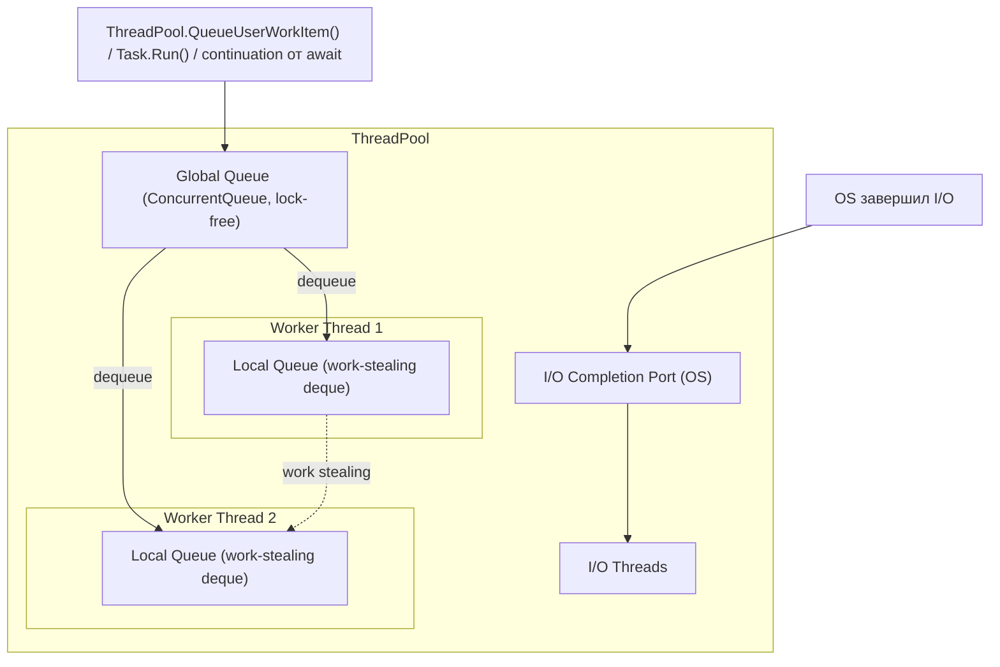
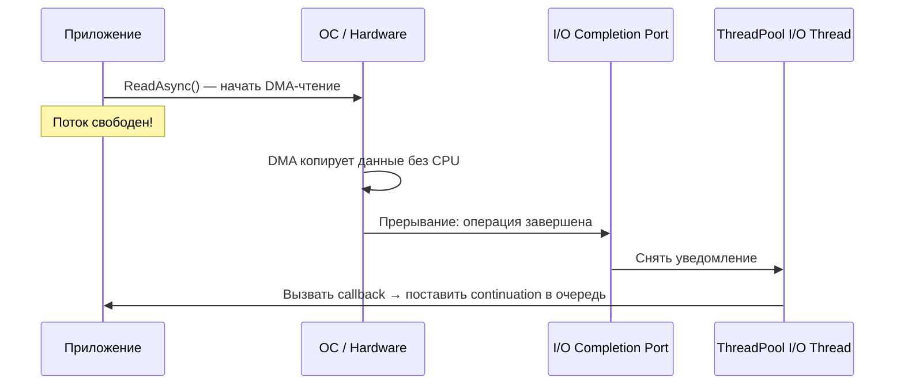
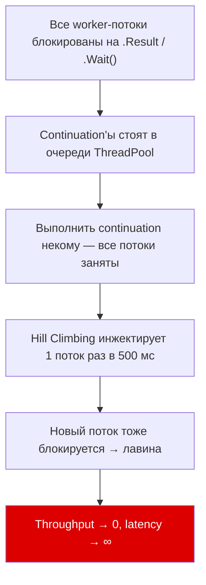

# ThreadPool

> Рабочая лошадка async/await: именно ThreadPool выполняет continuation'ы после await в серверном коде.

## Содержание
- [Что такое ThreadPool](#что-такое-threadpool)
- [Два типа потоков](#два-типа-потоков)
- [Архитектура очередей](#архитектура-очередей)
- [I/O Completion Port и epoll](#io-completion-port-и-epoll)
- [Hill Climbing — как пул решает сколько потоков нужно](#hill-climbing)
- [Thread Starvation](#thread-starvation)
- [Подводные камни](#подводные-камни)
- [См. также](#см-также)

---

## Что такое ThreadPool

Управляемый пул потоков CLR, который переиспользует потоки вместо создания новых под каждую задачу.

Создание потока — дорого: ~1 МБ стека + системный вызов. Пул амортизирует эту стоимость, держа горячий набор уже созданных потоков.

В контексте `async/await`: когда `await` возвращает управление вызывающему, continuation (код после `await`) должен выполниться **на каком-то потоке**. Если нет `SynchronizationContext` — этот поток берётся из ThreadPool.

---

## Два типа потоков

| Тип | Назначение |
|-----|-----------|
| **Worker threads** | Выполняют CPU-bound работу и continuation'ы async-методов |
| **I/O Completion Port threads** | Обрабатывают завершение асинхронных I/O-операций на уровне ОС |

---

## Архитектура очередей

ThreadPool использует двухуровневую систему очередей для минимизации contention:



**Global Queue** (`ConcurrentQueue<T>`, lock-free) — сюда попадают work items от внешних источников: `ThreadPool.QueueUserWorkItem()`, `Task.Run()`, continuation'ы от `await`. Все worker-потоки конкурируют за элементы из неё.

**Local Queue** (у каждого worker-потока своя, реализована как **work-stealing deque**) — когда worker внутри себя порождает новый work item (continuation внутри async-цепочки), он кладёт его в **свою** локальную очередь. Так избегается contention на глобальной очереди.

**Work Stealing** — если локальная очередь потока пуста, он «ворует» работу из локальных очередей **других** потоков (берёт с противоположного конца deque, чтобы снизить конфликты). Это балансировка нагрузки без центрального координатора.

---

## I/O Completion Port и epoll

Когда вызывается `Socket.ReceiveAsync()` или `FileStream.ReadAsync()`, ни один поток не ждёт завершения операции. Вместо этого:



1. ОС регистрирует операцию и сразу возвращает управление
2. Сетевая карта/диск завершает операцию через DMA — данные копируются в буфер **без участия CPU**
3. Аппаратное прерывание → ОС кладёт уведомление в IOCP (Windows) или epoll (Linux)
4. I/O-поток пула снимает уведомление и вызывает callback
5. Callback ставит continuation в очередь worker-потоков

На Linux .NET использует **epoll** — механизм отличается деталями, но принцип тот же.

---

## Hill Climbing

Алгоритм, которым ThreadPool решает сколько потоков держать:

- Стартует с `Environment.ProcessorCount` worker-потоков
- Каждые ~500 мс измеряет throughput (сколько work items завершилось)
- Принимает решение: добавить поток, убрать или оставить как есть
- Это **стохастический** алгоритм — он «экспериментирует», слегка меняя число потоков, и наблюдает эффект

**Минимум:** `ProcessorCount`  
**Максимум:** настраивается через `ThreadPool.SetMaxThreads()`

**Критичная деталь:** если все worker-потоки заняты дольше ~500 мс → инжектируется новый поток. Скорость — **1 поток примерно каждые 500 мс**. Нужно 50 дополнительных потоков? Жди ~25 секунд.

---

## Thread Starvation

Самая опасная проблема ThreadPool — возникает при блокировании потоков.



Сценарий в ASP.NET:
1. Все worker-потоки заблокированы на `.Result`
2. Continuation'ы, которые **должны разблокировать** эти потоки, стоят в очереди ThreadPool
3. Но выполнить их некому
4. ThreadPool медленно добавляет потоки
5. Новые потоки тоже блокируются → лавина

Результат: приложение «зависает», все запросы таймаутятся.

```csharp
// Диагностика thread starvation:
ThreadPool.GetAvailableThreads(out int worker, out int io);
ThreadPool.GetMaxThreads(out int maxWorker, out int maxIo);
// Если (maxWorker - worker) близко к 0 → starvation
```

---

## Подводные камни

**1. `Thread.Sleep` в async-коде** — блокирует поток пула. Используй `await Task.Delay()`.

**2. Длинные синхронные циклы** — монополизируют поток, другие work items голодают. Вставляй `await Task.Yield()` в критических местах.

**3. `ThreadLocal<T>` не течёт через await** — поток может смениться. Используй `AsyncLocal<T>` вместо него.

**4. `ThreadPool.SetMinThreads()`** — можно поднять минимум для warm startup:
```csharp
// В начале приложения: предотвратить медленный ramp-up при нагрузке
ThreadPool.SetMinThreads(100, 100);
```
Актуально для сервисов с burst-нагрузкой при старте.

---

## См. также

- [02-task.md](./02-task.md) — Task как объект-состояние поверх ThreadPool
- [05-execution-flow.md](./05-execution-flow.md) — полный путь от await до continuation на потоке пула
- [06-synchronization-context.md](./06-synchronization-context.md) — как SyncContext меняет куда идёт continuation
