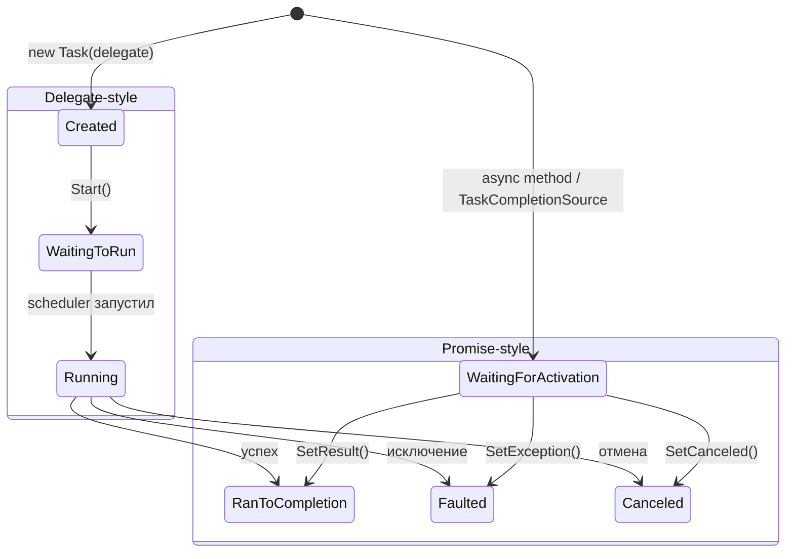
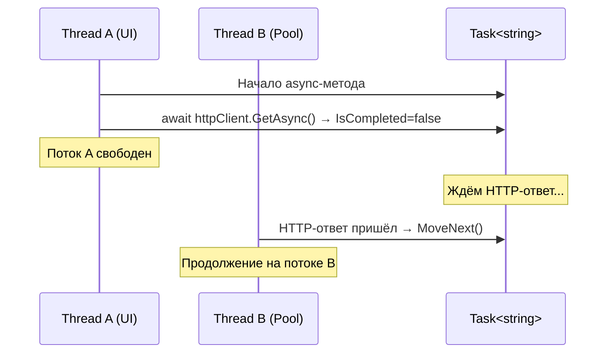

# Task и Task\<T\>

> Task — это не поток и не промис. Это объект-состояние, описывающий «работу, которая когда-то завершится».

## Содержание
- [Два способа создания Task](#два-способа-создания-task)
- [Состояния Task](#состояния-task)
- [Task vs Thread](#task-vs-thread)
- [Что хранит Task внутри](#что-хранит-task-внутри)
- [Continuation'ы внутри Task](#continuationы-внутри-task)
- [Кешированные Task'и](#кешированные-taskи)
- [Исключения: await vs .Result](#исключения-await-vs-result)
- [Подводные камни](#подводные-камни)
- [См. также](#см-также)

---

## Два способа создания Task

### Promise-style (async/await, TaskCompletionSource)

Task создаётся в состоянии `WaitingForActivation`. Нет привязанного делегата — Task просто ждёт, пока кто-то вызовет `SetResult` / `SetException`. Именно так работает `async/await`.

```csharp
// async-метод → promise-style Task
public async Task<int> Calculate() { ... }

// TaskCompletionSource → явное управление
var tcs = new TaskCompletionSource<int>();
// где-то позже:
tcs.SetResult(42);
return tcs.Task;
```

### Delegate-style (Task.Run, new Task)

Task оборачивает делегат и проходит через состояния `Created → WaitingToRun → Running`.

```csharp
var task = Task.Run(() => HeavyCpu()); // delegate-style
```

**В контексте async/await почти всегда используется promise-style.** `Task.Run()` — исключение для CPU-bound работы.

---

## Состояния Task



Promise-style Task **никогда** не проходит через `Running` — он идёт напрямую из `WaitingForActivation` в терминальное состояние. Это не баг, а архитектурное решение: у такого Task нет делегата, нечего «запускать».

---

## Task vs Thread

Task — это **не** обёртка над потоком.

Один Task может:
- Начать выполнение на потоке A
- Приостановиться на `await`
- Продолжиться на потоке B

При этом ни один поток не «принадлежит» Task'у и не ждёт его.



Это принципиальное отличие от модели «один поток — одна задача».

---

## Что хранит Task внутри

```csharp
// Упрощённо, что лежит внутри Task<T>:
class Task<TResult>
{
    volatile int m_stateFlags;      // текущее состояние (bit flags)
    TResult m_result;               // результат (после завершения)
    object m_continuationObject;    // continuation'ы (один или список)
    // исключение хранится как ExceptionDispatchInfo[]
}
```

- **Состояние** — `volatile int` с bit-флагами. Изменяется атомарно через `Interlocked`.
- **Результат** — null до завершения, заполняется при `SetResult`.
- **Исключение** — оборачивается в `ExceptionDispatchInfo`, чтобы сохранить оригинальный стек-трейс.
- **Continuation'ы** — связный список `TaskContinuation`-объектов.

Когда Task завершается (`TrySetResult` / `TrySetException`), он обходит список continuation'ов и ставит каждый в очередь на выполнение (через SyncContext или ThreadPool).

---

## Continuation'ы внутри Task

Когда ты пишешь `await task`, и Task ещё не завершён — builder подписывает continuation (ссылку на `MoveNext` state machine) на этот Task.

- **Один continuation** — поле `object m_continuationObject` хранит Action напрямую
- **Несколько continuation'ов** — превращается в `List<object>` (когда несколько `await`-ов на одном Task)

```csharp
// Несколько подписчиков на один Task:
var task = LongOperation();
var a = Subscriber1(task); // подписался
var b = Subscriber2(task); // подписался
// task внутри держит List<object> с двумя continuation'ами
await Task.WhenAll(a, b);
```

---

## Кешированные Task'и

Рантайм кеширует часто используемые Task'и — они не аллоцируют новый объект:

```csharp
Task.CompletedTask           // singleton, статус RanToCompletion
Task.FromResult(true)        // кешируется
Task.FromResult(false)       // кешируется
Task.FromResult(0)           // кешируется
// Для int: кешируются значения от -1 до 9 включительно

// Пример: этот метод не аллоцирует новый Task!
async Task<bool> IsEnabled() => true;
// Builder обнаружит, что завершился синхронно, и вернёт кешированный Task.FromResult(true)
```

---

## Исключения: await vs .Result

При `await` исключение пробрасывается через `ExceptionDispatchInfo.Throw()`:
- Бросается **оригинальное** исключение (не `AggregateException`)
- Сохраняется оригинальный стек-трейс
- К нему дописывается async-цепочка (`--- End of stack trace from previous location ---`)

При `.Result` / `.Wait()`:
- Исключение оборачивается в `AggregateException`
- Оригинальный стек-трейс перезаписывается

```csharp
// await — понятная диагностика:
// System.HttpRequestException: 404
//    at HttpClient.SendAsync()       ← оригинальный стек
//    at MyService.Fetch()
//    at MyController.Handle()

// .Result — грязная диагностика:
// System.AggregateException: One or more errors occurred.
//  ---> System.HttpRequestException: 404
//    at HttpClient.SendAsync()
//    --- End of inner exception ---
//    at Task.ThrowIfExceptional()    ← стек .Result, не async-цепочки
//    at Task.GetResultCore()
```

---

## Подводные камни

**`Task.Result` на незавершённой задаче** — блокирует текущий поток через `ManualResetEventSlim` (спин-ожидание + kernel wait). В серверном коде это нарушение [Thread Starvation](./01-threadpool.md#thread-starvation).

**`new Task(delegate)` vs `Task.Run()`** — у `new Task()` состояние `Created`, она не запускается до `Start()`. `Task.Run()` сразу запускает. Используй `Task.Run()`.

**`Task.Factory.StartNew()`** — имеет опасный дефолт: не убирает `SynchronizationContext` внутри делегата и использует `TaskScheduler.Current`, который внутри `ContinueWith` будет не `Default`. Всегда предпочитай `Task.Run()`.

---

## См. также

- [01-threadpool.md](./01-threadpool.md) — ThreadPool, на котором выполняются continuation'ы
- [03-state-machine.md](./03-state-machine.md) — как async-метод создаёт и управляет Task через builder
- [07-valuetask.md](./07-valuetask.md) — ValueTask как способ избежать аллокации Task
