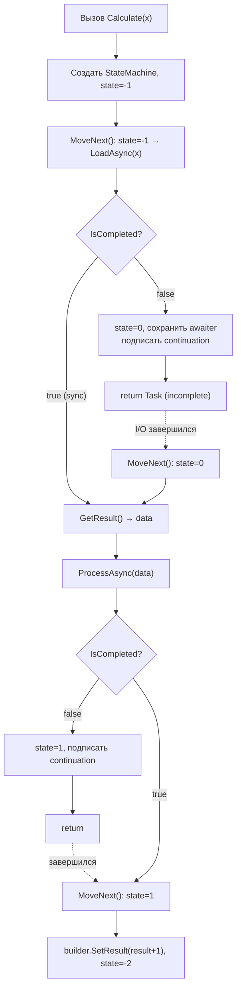
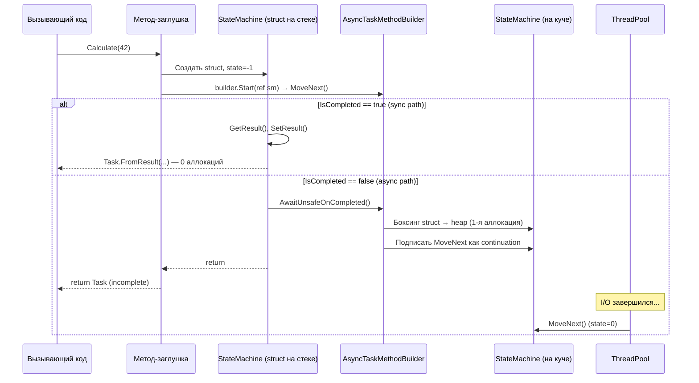

# State Machine: как компилятор трансформирует async/await

> Ключевое слово `async` — инструкция компилятору, а не рантайму. В IL-коде никакого `async` нет.

## Содержание
- [Суть трансформации](#суть-трансформации)
- [Что генерирует компилятор](#что-генерирует-компилятор)
- [Метод MoveNext](#метод-movenext)
- [Жизненный цикл state machine](#жизненный-цикл-state-machine)
- [Почему struct, а не class](#почему-struct-а-не-class)
- [Боксинг на heap: когда и зачем](#боксинг-на-heap)
- [Локальные переменные становятся полями](#локальные-переменные-становятся-полями)
- [Код до первого await выполняется синхронно](#код-до-первого-await)
- [Подводные камни](#подводные-камни)
- [См. также](#см-также)

---

## Суть трансформации

`async/await` — синтаксический сахар того же уровня, что `yield return` для итераторов. Компилятор берёт линейный код и превращает его в **конечный автомат** (finite state machine), где каждый `await` — точка, где автомат может приостановиться и продолжиться позже.

В рантайме нет ни `async`, ни `await` — есть обычная struct с методом `MoveNext()`.

---

## Что генерирует компилятор

Исходный код:

```csharp
public async Task<int> Calculate(int x)
{
    var data = await LoadAsync(x);
    var result = await ProcessAsync(data);
    return result + 1;
}
```

Компилятор генерирует два артефакта:

**1. Метод-заглушка (stub)** — тонкая оболочка, создаёт state machine и запускает её:

```csharp
public Task<int> Calculate(int x)
{
    var sm = new CalculateStateMachine();
    sm.x = x;
    sm.builder = AsyncTaskMethodBuilder<int>.Create();
    sm.state = -1;
    sm.builder.Start(ref sm); // вызывает первый MoveNext()
    return sm.builder.Task;   // возвращает Task СРАЗУ
}
```

**2. State machine** — struct, реализующая `IAsyncStateMachine`:

```csharp
private struct CalculateStateMachine : IAsyncStateMachine
{
    public int state;
    public AsyncTaskMethodBuilder<int> builder;

    // Параметры и локальные переменные исходного метода
    public int x;
    private object data;
    private int result;

    // Awaiter'ы для каждого await (хранятся между MoveNext-вызовами)
    private TaskAwaiter<object> awaiter1;
    private TaskAwaiter<int> awaiter2;

    public void MoveNext() { ... }
}
```

---

## Метод MoveNext

Это сердце всей механики. Вызывается несколько раз: по одному разу на каждый `await`, где пришлось реально ждать.

```csharp
public void MoveNext()
{
    int localState = state;
    try
    {
        if (localState == 0) goto AfterFirstAwait;
        if (localState == 1) goto AfterSecondAwait;

        // --- state == -1: начало метода ---
        var localAwaiter = LoadAsync(x).GetAwaiter();

        if (!localAwaiter.IsCompleted)
        {
            state = 0;
            awaiter1 = localAwaiter;
            builder.AwaitUnsafeOnCompleted(ref localAwaiter, ref this);
            return; // ← поток освобождается!
        }

    AfterFirstAwait:
        localAwaiter = awaiter1;
        awaiter1 = default; // обнулить, не держать ссылку
        data = localAwaiter.GetResult();

        // --- второй await ---
        var localAwaiter2 = ProcessAsync(data).GetAwaiter();

        if (!localAwaiter2.IsCompleted)
        {
            state = 1;
            awaiter2 = localAwaiter2;
            builder.AwaitUnsafeOnCompleted(ref localAwaiter2, ref this);
            return;
        }

    AfterSecondAwait:
        localAwaiter2 = awaiter2;
        awaiter2 = default;
        result = localAwaiter2.GetResult();

        builder.SetResult(result + 1);
    }
    catch (Exception ex)
    {
        state = -2;
        builder.SetException(ex);
    }
    state = -2;
}
```



**Значения state:**
- `-1` — начало метода (первый вход)
- `0, 1, 2...` — после N-го await (точка возобновления)
- `-2` — метод завершён

---

## Жизненный цикл state machine



---

## Почему struct, а не class

Это ключевая оптимизация.

**Сценарий 1 — sync path (hot path):**
- State machine — struct на стеке вызывающего метода
- Все awaiter'ы завершены синхронно (`IsCompleted == true`)
- Builder возвращает кешированный Task
- **0 аллокаций на куче**. Struct уничтожается при выходе из метода-заглушки

**Сценарий 2 — async path (cold path):**
- Первый `MoveNext()` обнаруживает `IsCompleted == false`
- Builder боксит struct на heap (~1 аллокация — `AsyncStateMachineBox`)
- **Все последующие** `MoveNext()` работают с тем же heap-объектом — без дополнительных аллокаций
- **~2 аллокации** независимо от количества `await`-ов в методе

---

## Боксинг на heap

Боксинг происходит внутри `builder.AwaitUnsafeOnCompleted()` — builder копирует struct на heap и сохраняет ссылку. Следующий вызов `MoveNext()` работает уже с heap-копией.

Начиная с .NET Core, builder создаёт не отдельный Task + отдельную SM, а один объект **`AsyncStateMachineBox<TStateMachine>`**, который:
- Наследует от `Task<TResult>` (сам является Task'ом)
- Содержит state machine
- Хранит `ExecutionContext`

Это экономит одну аллокацию по сравнению с .NET Framework.

**`IAsyncStateMachine.SetStateMachine()`** — вызывается builder'ом после боксинга, чтобы heap-копия SM «узнала» о себе. Все дальнейшие операции идут через неё; stack-копия в этот момент уже невалидна.

---

## Локальные переменные становятся полями

Любая локальная переменная, которая «живёт» через точку `await` (пересекает точку приостановки), становится **полем struct'а**. Иначе она бы потерялась при выходе из `MoveNext()`.

```csharp
async Task Process()
{
    var conn = await GetConnectionAsync(); // conn нужен после await → поле
    var data = await conn.ReadAsync();     // data нужен после await → поле

    int x = Compute(data);  // x не пересекает await → может остаться локальной
    Log(x);
}
```

Компилятор анализирует время жизни переменных и оптимизирует: переменные, не пересекающие `await`, остаются локальными в `MoveNext()` — нет лишних полей в struct.

---

## Код до первого await

Весь код до первого `await`, где `IsCompleted == false`, выполняется **синхронно на потоке вызывающего** — в рамках первого `MoveNext()`.

Это имеет важное следствие для **валидации аргументов**:

```csharp
// ПЛОХО: ArgumentNullException попадёт в Task, не бросится синхронно
public async Task<User> Find(string id)
{
    ArgumentNullException.ThrowIfNull(id); // ← MoveNext() перехватит и положит в Task
    return await repository.Find(id);
}

// ПРАВИЛЬНО: разделить метод
public Task<User> Find(string id)
{
    ArgumentNullException.ThrowIfNull(id); // ← бросается синхронно (нет async)
    return FindCore(id);
}

private async Task<User> FindCore(string id)
{
    return await repository.Find(id);
}
```

---

## Подводные камни

**`async` без `await` компилируется, но работает синхронно.** Компилятор выдаёт предупреждение CS4014. Метод выполняется полностью синхронно и возвращает уже завершённый Task.

**`goto` в сгенерированном коде.** Дизассемблированный async-метод полон `goto` — это не баг шерсти, а намеренная генерация компилятора. SharpLab.io позволяет посмотреть на сгенерированный C#-эквивалент.

**`await` в `catch`/`finally` (C# 6+).** Компилятор поддерживает это, но генерирует более сложный state machine с дополнительными полями для хранения исключений.

---

## См. также

- [04-awaitable-pattern.md](./04-awaitable-pattern.md) — как builder подписывает MoveNext как continuation через awaiter
- [05-execution-flow.md](./05-execution-flow.md) — полный путь выполнения: от вызова до результата
- [07-valuetask.md](./07-valuetask.md) — PoolingAsyncValueTaskMethodBuilder: пулинг state machine box
