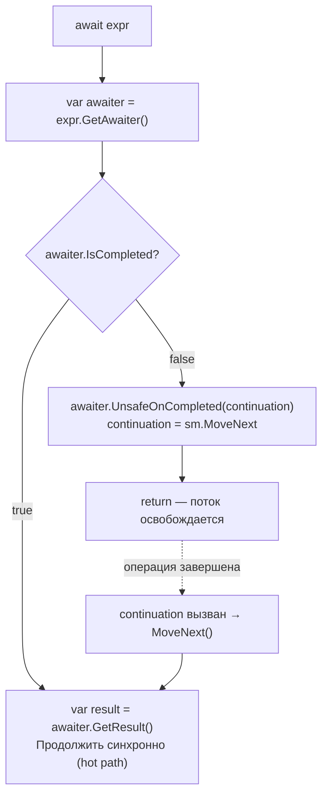
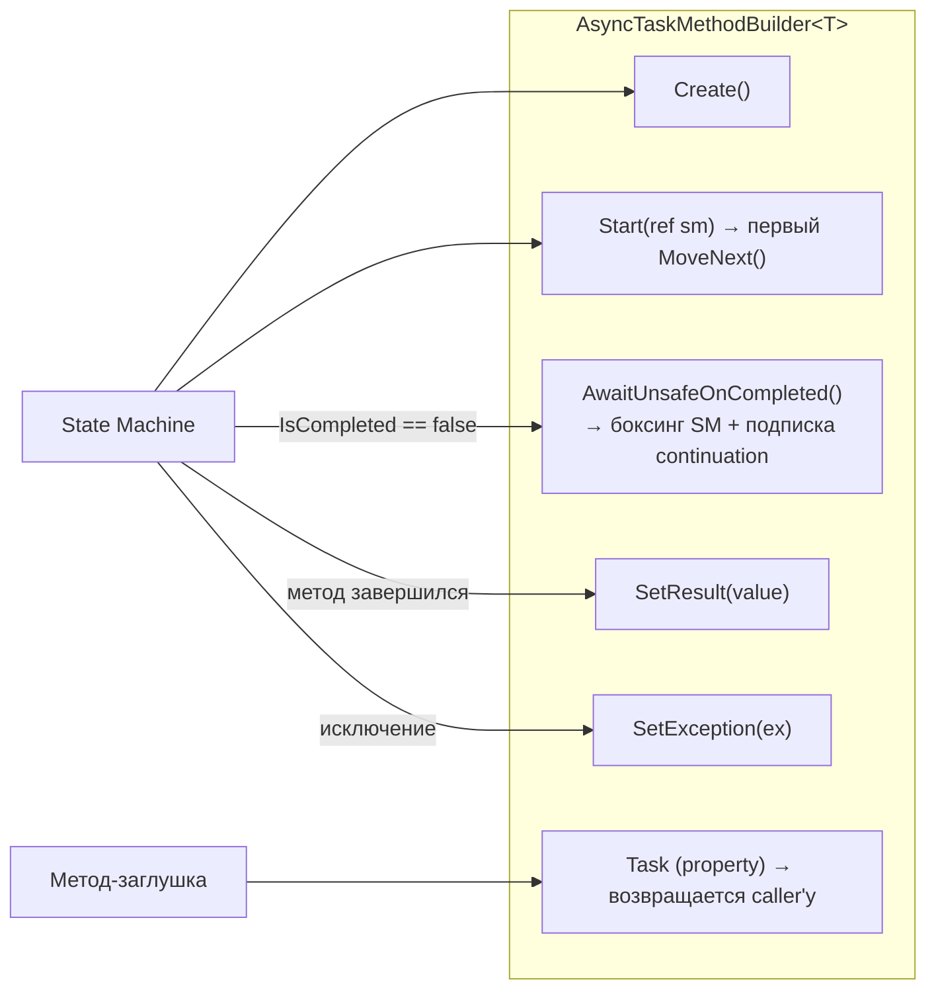

# Паттерн awaitable/awaiter

> `await` работает не только с Task — это duck-typing паттерн. Любой тип можно сделать awaitable.

## Содержание
- [Суть паттерна](#суть-паттерна)
- [Контракт awaiter'а](#контракт-awaitera)
- [Как компилятор раскрывает await](#как-компилятор-раскрывает-await)
- [OnCompleted vs UnsafeOnCompleted](#oncompleted-vs-unsafeoncompleted)
- [AsyncTaskMethodBuilder](#asynctaskmethodbuilder)
- [Кастомный awaitable: примеры](#кастомный-awaitable-примеры)
- [Что можно await'ить из коробки](#что-можно-awaitить-из-коробки)
- [Подводные камни](#подводные-камни)
- [См. также](#см-также)

---

## Суть паттерна

Компилятор не проверяет интерфейсы при `await` — он проверяет **наличие методов с нужными сигнатурами** (duck typing). Это значит:

- `Task` awaitable, потому что у него есть `GetAwaiter()` — не потому что он реализует какой-то интерфейс
- Любой свой тип можно сделать awaitable через extension method `GetAwaiter()`

```csharp
// Работает! Extension method делает TimeSpan awaitable:
public static TaskAwaiter GetAwaiter(this TimeSpan ts)
    => Task.Delay(ts).GetAwaiter();

// Теперь можно:
await TimeSpan.FromSeconds(2);
```

---

## Контракт awaiter'а

Объект, возвращаемый `GetAwaiter()`, должен реализовать:

```csharp
public struct MyAwaiter : INotifyCompletion // или ICriticalNotifyCompletion
{
    // 1. Готов ли результат прямо сейчас?
    public bool IsCompleted { get; }

    // 2. Получить результат (или бросить исключение, если Task faulted/canceled)
    public TResult GetResult();

    // 3. Подписать continuation (из INotifyCompletion)
    public void OnCompleted(Action continuation);

    // 4. Оптимизированная версия (из ICriticalNotifyCompletion)
    public void UnsafeOnCompleted(Action continuation);
}
```

`INotifyCompletion` требует только `OnCompleted`. `ICriticalNotifyCompletion` добавляет `UnsafeOnCompleted` — builder предпочитает именно его.

---

## Как компилятор раскрывает await



Три шага:
1. Вызвать `GetAwaiter()` — получить awaiter
2. Проверить `IsCompleted` — если `true`, взять результат синхронно и продолжить
3. Если `false` — подписать `MoveNext` через `UnsafeOnCompleted`, вернуть управление

---

## OnCompleted vs UnsafeOnCompleted

| Метод | ExecutionContext | Кто вызывает |
|-------|----------------|--------------|
| `OnCompleted` | **Awaiter** сам захватывает EC и восстанавливает при вызове continuation | Fallback, если нет `ICriticalNotifyCompletion` |
| `UnsafeOnCompleted` | Awaiter **не** захватывает EC — это делает builder | Используется builder'ом по умолчанию |

Builder всегда предпочитает `UnsafeOnCompleted`, потому что он **сам** уже захватил `ExecutionContext` в `AwaitUnsafeOnCompleted()`. Если бы awaiter тоже захватывал — двойной захват и двойное восстановление, что wasteful.

---

## AsyncTaskMethodBuilder

Посредник между state machine и `Task`. Builder инкапсулирует все оптимизации и подменяемую логику для разных возвращаемых типов.



Три варианта builder'а:

| Builder | Тип возврата |
|---------|-------------|
| `AsyncTaskMethodBuilder` | `Task` |
| `AsyncTaskMethodBuilder<TResult>` | `Task<TResult>` |
| `AsyncVoidMethodBuilder` | `async void` |

**Детально `AwaitUnsafeOnCompleted()`:**

```csharp
// Псевдокод:
public void AwaitUnsafeOnCompleted<TAwaiter, TStateMachine>(
    ref TAwaiter awaiter, ref TStateMachine stateMachine)
{
    // 1. Захватить ExecutionContext
    var ec = ExecutionContext.Capture();

    // 2. При первом async await — создать AsyncStateMachineBox на куче
    //    (это одновременно Task + боксированная SM + держатель EC)
    if (m_task == null)
        m_task = AsyncMethodBuilderCore.CreateBox(ref stateMachine);

    m_task.Context = ec;

    // 3. Подписать MoveNext как continuation на awaiter
    awaiter.UnsafeOnCompleted(m_task.MoveNextAction);
}
```

`AsyncStateMachineBox<TStateMachine>` наследует от `Task<TResult>` — это **один объект** вместо двух (Task + SM box), экономия одной аллокации по сравнению с .NET Framework.

---

## Кастомный awaitable: примеры

### Переключение на ThreadPool

```csharp
public struct ThreadPoolAwaitable
{
    public ThreadPoolAwaiter GetAwaiter() => new();
}

public struct ThreadPoolAwaiter : ICriticalNotifyCompletion
{
    // Всегда false — форсируем переход на ThreadPool
    public bool IsCompleted => false;
    public void GetResult() { }

    public void UnsafeOnCompleted(Action continuation)
        => ThreadPool.QueueUserWorkItem(_ => continuation(), null);

    public void OnCompleted(Action continuation)
        => UnsafeOnCompleted(continuation);
}

// Использование: гарантированный переход на поток пула
await new ThreadPoolAwaitable();
// Код ниже выполняется на ThreadPool независимо от текущего контекста
```

### Переключение на UI-поток

```csharp
// Вернуться на UI-поток из любого контекста:
public static SynchronizationContextAwaiter GetAwaiter(
    this SynchronizationContext ctx)
{
    return new SynchronizationContextAwaiter(ctx);
}

// Использование:
await Application.Current.Dispatcher; // WPF
// Код ниже выполняется на UI-потоке
```

### Awaitable для нативных callback-based API

```csharp
// Оборачиваем callback-API через TaskCompletionSource:
public Task<int> ReadNativeAsync(IntPtr handle)
{
    var tcs = new TaskCompletionSource<int>();
    NativeLib.BeginRead(handle, result => tcs.SetResult(result));
    return tcs.Task;
}

await ReadNativeAsync(handle);
```

---

## Что можно await'ить из коробки

- `Task`, `Task<T>`
- `ValueTask`, `ValueTask<T>`
- `ConfiguredTaskAwaitable` (результат `task.ConfigureAwait(...)`)
- `YieldAwaitable` (результат `Task.Yield()`)
- `IAsyncEnumerable<T>` через `await foreach`
- Любой тип с методом `GetAwaiter()` — instance или extension

---

## Подводные камни

**Кастомный awaiter с `IsCompleted` всегда `false`** — это намеренный паттерн для форсирования async-пути (как `Task.Yield()`). Но если `IsCompleted` возвращает `false`, а `UnsafeOnCompleted` никогда не вызывает continuation — поток заблокируется навсегда.

**`GetResult()` бросает исключение** — это штатное поведение. Если операция завершилась с ошибкой, awaiter.`GetResult()` бросает оригинальное исключение. State machine перехватит его в `try/catch` и передаст в `builder.SetException()`.

**Extension method `GetAwaiter()` перекрывает instance-метод** — нет. Extension method вызывается только если у типа нет собственного `GetAwaiter()`. Instance-метод имеет приоритет.

---

## См. также

- [03-state-machine.md](./03-state-machine.md) — как state machine вызывает awaiter в MoveNext
- [05-execution-flow.md](./05-execution-flow.md) — полный путь через awaiter к continuation
- [06-synchronization-context.md](./06-synchronization-context.md) — как SyncContext влияет на UnsafeOnCompleted
