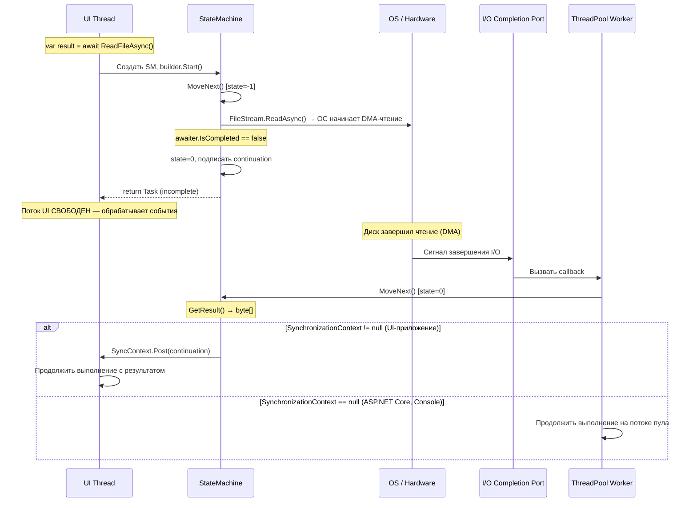
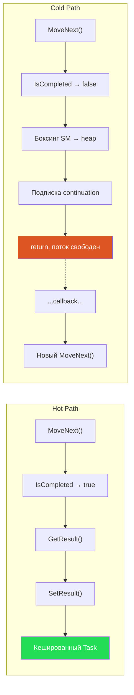
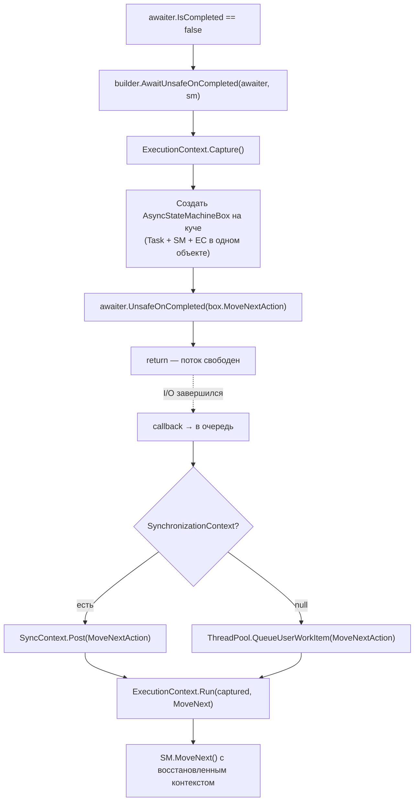

# Пайплайн выполнения async-метода

> Понять, где именно работает код — на каком потоке, в какой момент — ключ к правильному написанию async-кода.

## Содержание
- [Полный путь от вызова до результата](#полный-путь)
- [Hot path: синхронное завершение](#hot-path)
- [Cold path: асинхронное завершение](#cold-path)
- [ExecutionContext](#executioncontext)
- [AsyncLocal\<T\>](#asynclocalt)
- [Task.Yield()](#taskyield)
- [Task.Run и SynchronizationContext](#taskrun-и-synchronizationcontext)
- [Подводные камни](#подводные-камни)
- [См. также](#см-также)

---

## Полный путь

Рассмотрим `await ReadFileAsync()` из кода на UI-потоке.



Ключевой момент: между «return Task» и «MoveNext() [state=0]» **ни один поток не занят ожиданием**. ОС уведомит, когда данные готовы. Это «true async» — принципиальное отличие от `Task.Run(() => file.Read())`, где поток пула **блокируется**.

---

## Hot path

Когда `IsCompleted == true` до подписки continuation — поток не переключается.



**Когда Task завершается синхронно:**
- `Stream.ReadAsync()` — данные уже в буфере ОС
- `Socket.ReceiveAsync()` — данные уже пришли в буфер сокета
- `MemoryCache.GetOrCreateAsync()` — попадание в кеш
- `Channel.ReadAsync()` — в канале уже есть элемент
- `SemaphoreSlim.WaitAsync()` — семафор не занят

В высоконагруженных серверах большинство async-вызовов завершаются синхронно.

**Стоимость:**

| | Hot Path | Cold Path |
|---|---|---|
| Аллокации | 0 | ~2 (SM box + Task) |
| Переключения потоков | 0 | 1+ |
| Захват контекста | нет | ExecutionContext + возможно SyncContext |
| Overhead | ~наносекунды | ~микросекунды |

---

## Cold path

Когда `IsCompleted == false`:



**Порядок:**
1. `ExecutionContext.Capture()` — всегда, отключить нельзя
2. `AsyncStateMachineBox` — создаётся один раз при первом async await, переиспользуется для всех последующих `await`-ов в том же методе
3. Маршалинг continuation: через SyncContext или ThreadPool

---

## ExecutionContext

«Папка с документами», которая течёт вместе с кодом через `await`. Невидимый контейнер.

**Что внутри:**
- `AsyncLocal<T>` — основной механизм хранения ambient-данных
- SecurityContext (в .NET Framework)

**Отличие от SynchronizationContext:**

| | ExecutionContext | SynchronizationContext |
|---|---|---|
| **Что** | Данные (AsyncLocal, Security) | Целевой «планировщик» |
| **Зачем** | Пронести данные через async | Вернуться на нужный поток |
| **Кто управляет** | Всегда захватывается builder'ом | Захватывается awaiter'ом |
| **Можно отключить?** | Нет | Да, через `ConfigureAwait(false)` |

`ExecutionContext` захватывается **всегда**, независимо от `ConfigureAwait(false)`. Это намеренно — иначе `AsyncLocal<T>` и security данные терялись бы через `await`.

---

## AsyncLocal\<T\>

Хранит данные в `ExecutionContext` с **copy-on-write** семантикой.

```csharp
var local = new AsyncLocal<string>();

async Task Parent()
{
    local.Value = "parent";
    await Child();
    Console.WriteLine(local.Value); // "parent" — не "child"!
}

async Task Child()
{
    Console.WriteLine(local.Value); // "parent" — унаследовали
    local.Value = "child";          // создаётся КОПИЯ EC
    Console.WriteLine(local.Value); // "child"
}
// Изменение в Child не видно в Parent — copy-on-write
```

Это принципиальное отличие от `ThreadLocal<T>`, который:
- Привязан к конкретному потоку
- Не течёт через `await` (поток может смениться)

**Типичный use case — correlation ID:**

```csharp
private static readonly AsyncLocal<string> requestId = new();

public async Task Handle()
{
    requestId.Value = Guid.NewGuid().ToString();
    await DoWork();
    // requestId.Value здесь тот же — EC восстановлен
}

public async Task DoWork()
{
    // Работает даже если мы на другом потоке после await
    logger.LogInformation("Processing {RequestId}", requestId.Value);
}
```

---

## Task.Yield()

`await Task.Yield()` **всегда** форсирует асинхронный путь. У `YieldAwaitable` `IsCompleted` всегда `false`.

```csharp
public async Task Process(IEnumerable<Item> items)
{
    foreach (var item in items)
    {
        Handle(item);
        await Task.Yield(); // после каждой итерации — отдать поток пулу
        // Другие work items получают шанс выполниться
    }
}
```

**Когда использовать:**
- Длинные синхронные циклы, чтобы не монополизировать поток
- Принудительный переход на ThreadPool
- Тестирование: форсировать async-поведение для проверки race conditions

**Под капотом:** `YieldAwaitable.GetAwaiter().IsCompleted` возвращает `false`. При подписке continuation — маршалит через текущий `SyncContext` (если есть) или `ThreadPool`.

---

## Task.Run и SynchronizationContext

`Task.Run()` **специально убирает** `SynchronizationContext` внутри делегата:

```csharp
// На UI-потоке (SyncContext = DispatcherSynchronizationContext):
await Task.Run(async () =>
{
    // Здесь SynchronizationContext.Current == null!
    // Task.Run вызывает SetSynchronizationContext(null) перед выполнением
    await SomeAsync(); // нет риска deadlock'а
});
```

`Task.Factory.StartNew()` **не убирает** SyncContext — это одна из причин предпочитать `Task.Run()`:

```csharp
// Task.Factory.StartNew — подвох:
await Task.Factory.StartNew(async () =>
{
    await SomeAsync(); // SyncContext может быть != null и вызвать deadlock
}, CancellationToken.None, TaskCreationOptions.DenyChildAttach, TaskScheduler.Default);
```

---

## Подводные камни

**Код до первого await выполняется на потоке вызывающего.** Если до первого `await` есть тяжёлые вычисления — они блокируют вызывающий поток (UI или ASP.NET request thread).

**`await` не гарантирует переключение потока.** Если Task уже завершён (`IsCompleted == true`), код продолжится на том же потоке — без переключения. Хочешь гарантированного переключения — используй `await Task.Yield()` или `await Task.Run(...)`.

**После `await` поток может смениться.** Переменные, захваченные в замыканиях, могут использоваться из другого потока. `ThreadLocal<T>` после `await` может вернуть другое значение.

---

## См. также

- [01-threadpool.md](./01-threadpool.md) — где выполняются continuation'ы
- [03-state-machine.md](./03-state-machine.md) — как MoveNext управляет переходами
- [06-synchronization-context.md](./06-synchronization-context.md) — как SyncContext влияет на маршалинг
