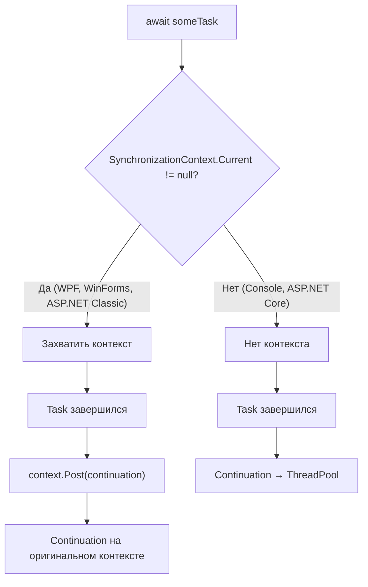
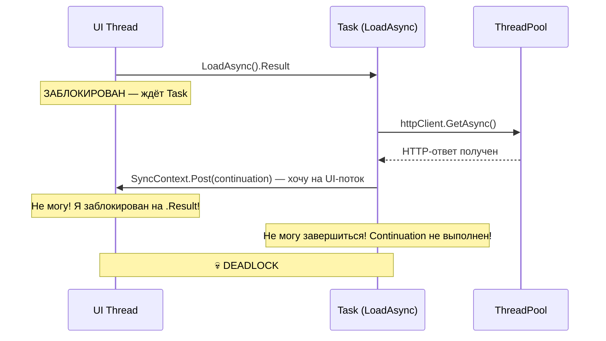
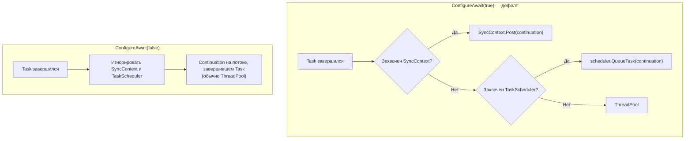

# SynchronizationContext и ConfigureAwait

> SynchronizationContext отвечает на вопрос «куда маршалить continuation после await». Отсюда — и deadlock'и, и `ConfigureAwait(false)`.

## Содержание
- [Зачем нужен SynchronizationContext](#зачем-нужен-synchronizationcontext)
- [Контракт SynchronizationContext](#контракт-synchronizationcontext)
- [Реализации в разных средах](#реализации-в-разных-средах)
- [Механизм захвата контекста](#механизм-захвата-контекста)
- [Deadlock через .Result/.Wait()](#deadlock)
- [ConfigureAwait(false)](#configureawaitfalse)
- [Что ConfigureAwait(false) НЕ делает](#что-configureawait-не-делает)
- [ConfigureAwaitOptions в .NET 8+](#configureawaitoptions)
- [Правила применения](#правила-применения)
- [Подводные камни](#подводные-камни)
- [См. также](#см-также)

---

## Зачем нужен SynchronizationContext

В WPF/WinForms UI-элементы можно трогать **только** из UI-потока. Без SyncContext после `await` пришлось бы вручную маршалить каждый callback:

```csharp
// БЕЗ async/await + SyncContext:
httpClient.GetStringAsync(url).ContinueWith(task =>
{
    Dispatcher.BeginInvoke(() =>  // ← вручную
    {
        textBlock.Text = task.Result;
    });
});

// С async/await + SyncContext:
var data = await httpClient.GetStringAsync(url);
textBlock.Text = data; // SyncContext автоматически вернул нас на UI-поток
```

---

## Контракт SynchronizationContext

```csharp
public class SynchronizationContext
{
    // Поставить callback в очередь (async, fire-and-forget)
    public virtual void Post(SendOrPostCallback d, object state);

    // Выполнить callback синхронно (блокирует caller)
    public virtual void Send(SendOrPostCallback d, object state);

    // Текущий контекст потока (thread-static)
    public static SynchronizationContext? Current { get; }

    // Установить контекст на текущем потоке
    public static void SetSynchronizationContext(SynchronizationContext? sc);
}
```

Базовая реализация `Post()` просто вызывает `ThreadPool.QueueUserWorkItem()`. UI-фреймворки переопределяют `Post()`, чтобы маршалить на свой поток.

---

## Реализации в разных средах

| Среда | SynchronizationContext | Поведение Post() |
|-------|----------------------|-----------------|
| **WPF** | `DispatcherSynchronizationContext` | `Dispatcher.BeginInvoke()` — UI-поток |
| **WinForms** | `WindowsFormsSynchronizationContext` | `Control.BeginInvoke()` — UI-поток |
| **ASP.NET Classic** | `AspNetSynchronizationContext` | В тот же `HttpContext` (сериализация, но не один поток) |
| **ASP.NET Core** | **null** | Continuation → любой поток пула |
| **Console App** | **null** | Continuation → любой поток пула |

**Почему ASP.NET Core убрал SyncContext:**

В ASP.NET Classic `AspNetSynchronizationContext` гарантировал, что continuation'ы одного HTTP-запроса не выполняются **одновременно**. Это упрощало доступ к `HttpContext.Current`, но создавало:
1. Overhead на каждый `await` — захват + маршалинг
2. Источник deadlock'ов при sync-over-async
3. Ограничение throughput — сериализация continuation'ов

ASP.NET Core: `SyncContext == null`, `HttpContext` передаётся явно через DI/параметры, continuation'ы идут на **любой** поток пула. Результат — выше производительность, меньше сюрпризов.

---

## Механизм захвата контекста



**Важный нюанс:** SyncContext захватывается **не всегда**. Только когда `IsCompleted == false` и начинается подписка continuation. Если Task уже завершён синхронно — SyncContext не участвует вообще.

**`null` и «базовый SyncContext» — не одно и то же:** наличие даже базового SyncContext (не `null`) меняет поведение `await`. При `SyncContext == null` continuation может выполниться инлайново на потоке, завершившем Task. При `SyncContext != null` — continuation будет поставлен через `Post()`.

---

## Deadlock

Классика в WPF/WinForms:



```csharp
// UI-поток:
public void Button_Click()
{
    var data = LoadAsync().Result; // блокирует UI-поток
}

public async Task<string> LoadAsync()
{
    var response = await httpClient.GetAsync(url);
    // continuation хочет вернуться на UI-поток через SyncContext
    // но UI-поток заблокирован на .Result → дедлок
    return await response.Content.ReadAsStringAsync();
}
```

**Почему нет deadlock'а в ASP.NET Core:** `SyncContext == null` → continuation не привязан к конкретному потоку → выполнится на любом потоке пула. Но `.Result` всё равно опасен в ASP.NET Core — ведёт к [Thread Starvation](./01-threadpool.md#thread-starvation).

**Почему deadlock intermittent:** если Task уже завершён к моменту вызова `.Result` — блокировки нет. В тестах работает (быстрая localhost-DB), в продакшне дедлочит (медленная remote-DB).

**Решения (от лучшего к худшему):**
1. `await` вместо `.Result` — всегда
2. `ConfigureAwait(false)` внутри всех `await` вызываемого метода — хрупко
3. `Task.Run(() => LoadAsync()).Result` — запускает на потоке пула где SyncContext=null, но блокирует два потока
4. `.GetAwaiter().GetResult()` — то же, что `.Result`, но без обёртки в `AggregateException`

---

## ConfigureAwait(false)

`task.ConfigureAwait(false)` возвращает `ConfiguredTaskAwaitable` — обёртку, чей awaiter игнорирует `SynchronizationContext` и `TaskScheduler`:



**Внутри:**

```csharp
public struct ConfiguredTaskAwaiter : ICriticalNotifyCompletion
{
    private readonly Task m_task;
    private readonly bool m_continueOnCapturedContext; // ← ключевой флаг

    public void UnsafeOnCompleted(Action continuation)
    {
        if (m_continueOnCapturedContext)
            // захватить SyncContext, маршалить через Post()
        else
            // подписать continuation напрямую на Task, без SyncContext
    }
}
```

---

## Что ConfigureAwait НЕ делает

**1. Не гарантирует выполнение на другом потоке.** Если Task уже завершён синхронно — continuation выполнится на текущем потоке независимо от настройки.

**2. Не переключает на ThreadPool принудительно.** Continuation выполнится на потоке, завершившем Task. Обычно это ThreadPool, но не гарантировано.

**3. Не «отменяет» SyncContext навсегда.** `ConfigureAwait(false)` действует только на **один конкретный `await`**. Следующий `await` без него снова захватит SyncContext (если он есть).

**4. Не влияет на ExecutionContext.** `ExecutionContext` захватывается всегда. `ConfigureAwait(false)` отключает только маршалинг через SyncContext/TaskScheduler.

---

## ConfigureAwaitOptions

В .NET 8 появился `ConfigureAwait(ConfigureAwaitOptions)` — расширенные флаги:

```csharp
// Это [Flags] enum — флаги комбинируются:
await task.ConfigureAwait(ConfigureAwaitOptions.None);
// = ConfigureAwait(false)

await task.ConfigureAwait(ConfigureAwaitOptions.ContinueOnCapturedContext);
// = ConfigureAwait(true)

await task.ConfigureAwait(ConfigureAwaitOptions.ForceYielding);
// форсировать async (никогда sync) — как Task.Yield() для конкретного await

await task.ConfigureAwait(ConfigureAwaitOptions.SuppressThrowing);
// не бросать исключение при Canceled/Faulted

// Комбинирование:
await task.ConfigureAwait(
    ConfigureAwaitOptions.ForceYielding |
    ConfigureAwaitOptions.ContinueOnCapturedContext);
```

---

## Правила применения

**Библиотечный код (NuGet, shared-lib)** → всегда `ConfigureAwait(false)`.  
Библиотека не знает, в каком контексте будет вызвана. Если забыть — потребитель в WPF получит deadlock при `.Result`.

**Application-level в ASP.NET Core** → `ConfigureAwait(false)` не нужен и не вредит. SyncContext и так `null`. Добавление — шум в коде без пользы.

**Application-level в WPF/WinForms** → `ConfigureAwait(false)` для кода, которому не нужен UI-поток. После `await X.ConfigureAwait(false)` нельзя обращаться к UI-элементам.

---

## Подводные камни

**`ConfigureAwait(false)` в одном методе не защищает весь стек.** Если вызываемый метод внутри делает `await` без `ConfigureAwait(false)` — там снова захватится SyncContext.

**`TaskCompletionSource` по умолчанию** запускает continuation'ы инлайново на потоке, вызвавшем `SetResult`. Это может привести к нежелательным задержкам на этом потоке. Используй `TaskCreationOptions.RunContinuationsAsynchronously`:

```csharp
var tcs = new TaskCompletionSource<int>(
    TaskCreationOptions.RunContinuationsAsynchronously);
```

---

## См. также

- [05-execution-flow.md](./05-execution-flow.md) — как происходит маршалинг continuation
- [10-antipatterns.md](./10-antipatterns.md) — deadlock и sync-over-async в деталях
- [01-threadpool.md](./01-threadpool.md) — thread starvation при блокировании потоков
