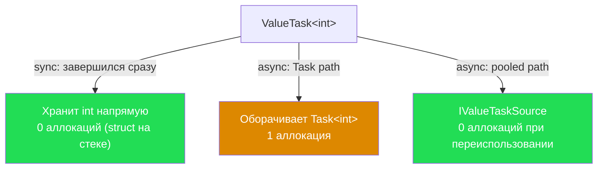
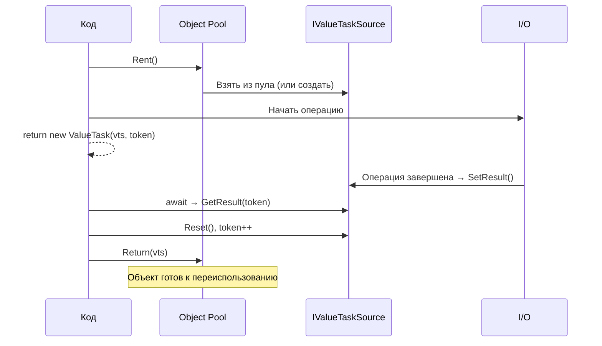
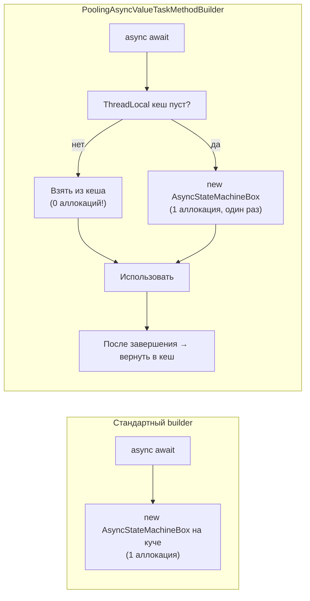

# ValueTask

> ValueTask решает одну проблему: `Task` — это объект на куче. Если метод завершается синхронно в 99% случаев, аллокация каждый раз расточительна.

## Содержание
- [Проблема Task: аллокация на каждый вызов](#проблема-task)
- [Устройство ValueTask](#устройство-valuetask)
- [Когда использовать ValueTask](#когда-использовать-valuetask)
- [Когда НЕ использовать ValueTask](#когда-не-использовать-valuetask)
- [Ограничения: нельзя использовать дважды](#ограничения)
- [IValueTaskSource и пулинг](#ivaluetasksource-и-пулинг)
- [Пулинг state machine (PoolingAsyncValueTaskMethodBuilder)](#пулинг-state-machine)
- [Подводные камни](#подводные-камни)
- [См. также](#см-также)

---

## Проблема Task

`Task<T>` — reference type. Каждый вызов async-метода, который возвращает `Task<T>`, аллоцирует объект на куче. В серверных приложениях с высоким RPS это давление на GC.

```csharp
// Каждый вызов → новый объект на куче:
public async Task<int> GetFromCache(string key)
{
    if (cache.TryGet(key, out int val))
        return val; // ← завершается синхронно, но Task всё равно создаётся

    return await db.GetAsync(key); // async path
}
```

Исключения: кешированные Task'и (`Task.FromResult(true)`, `Task.CompletedTask`, int от -1 до 9). Но для пользовательских типов и произвольных значений — всегда новая аллокация.

---

## Устройство ValueTask

`ValueTask<T>` — struct. Хранит либо результат напрямую, либо ссылку на Task/IValueTaskSource:

```csharp
public readonly struct ValueTask<TResult>
{
    // Три варианта внутреннего представления:
    private readonly Task<TResult>? _task;       // async path — обёртка над Task
    private readonly TResult _result;            // sync path — результат напрямую
    // ИЛИ:
    private readonly IValueTaskSource<TResult>? _source; // pooled path
    private readonly short _token;                       // версия источника
}
```



На sync path `ValueTask<T>` — просто struct на стеке, 0 аллокаций. Результат хранится прямо в полях struct.

---

## Когда использовать ValueTask

**Метод часто завершается синхронно** — основной кейс:

```csharp
// Хорошо для ValueTask: кеш попадает в 95% случаев
public ValueTask<User> GetUser(int id)
{
    if (cache.TryGet(id, out var user))
        return ValueTask.FromResult(user); // 0 аллокаций

    return new ValueTask<User>(LoadFromDb(id)); // 1 аллокация (Task)
}
```

**Hot path критичен** — метод вызывается тысячи раз в секунду в tight loop.

**Caller всегда делает `await` сразу** — не сохраняет ValueTask в переменную для повторного использования.

---

## Когда НЕ использовать ValueTask

- Метод **всегда** асинхронный (HTTP-запрос, запрос к БД) — `Task` проще и без ограничений
- Caller может захотеть `Task.WhenAll()` — нужно вызвать `.AsTask()` и потерять преимущество
- Public API, где потребители могут не знать об ограничениях
- Метод вызывается редко — overhead на понимание ограничений не оправдан

---

## Ограничения

Вытекают из того, что `ValueTask` может быть backed by `IValueTaskSource`, который **переиспользуется**:

**1. Нельзя await'ить дважды:**

```csharp
// НЕЛЬЗЯ:
var vt = SomeMethodAsync();
var a = await vt;
var b = await vt; // UNDEFINED BEHAVIOR — источник мог быть возвращён в пул
```

**2. Нельзя использовать одновременно из нескольких потоков:**

```csharp
// НЕЛЬЗЯ:
var vt = SomeMethodAsync();
Task.WhenAll(vt.AsTask(), vt.AsTask()); // UNDEFINED BEHAVIOR
```

**3. Нельзя вызвать `.Result` до завершения:**

```csharp
// НЕЛЬЗЯ:
var vt = SomeMethodAsync();
// если не awaited → vt.Result при незавершённой операции = undefined behavior
```

**Правило:** обращайся с `ValueTask` как с `Span<T>` — используй один раз, сразу, не сохраняй. Если нужно сохранить — вызови `.AsTask()`:

```csharp
// МОЖНО:
var result = await SomeMethodAsync(); // одноразовый await — OK

// МОЖНО (если нужно сохранить):
Task<int> task = SomeMethodAsync().AsTask();
var a = await task;
var b = await task; // Task можно await дважды
```

---

## IValueTaskSource и пулинг

Позволяет переиспользовать объект-источник вместо создания нового Task на каждую операцию:

```csharp
public interface IValueTaskSource<out TResult>
{
    ValueTaskSourceStatus GetStatus(short token);
    TResult GetResult(short token);
    void OnCompleted(
        Action<object?> continuation,
        object? state,
        short token,
        ValueTaskSourceOnCompletedFlags flags);
}
```



**`token`** — защита от повторного использования. При каждом `Reset()` token инкрементируется. Старый `ValueTask` с устаревшим token'ом не сможет получить результат.

**`ManualResetValueTaskSourceCore<T>`** — готовая реализация ядра IValueTaskSource из BCL. Не нужно писать с нуля, обрабатывает token, continuation, результат/исключение.

**Где используется в .NET:** `Socket.AwaitableSocketAsyncEventArgs`, `PipeReader` — Kestrel переиспользует объекты через `IValueTaskSource` при обработке HTTP. Критично при 100k+ RPS.

---

## Пулинг state machine

С .NET 6 можно пулировать саму state machine:

```csharp
[AsyncMethodBuilder(typeof(PoolingAsyncValueTaskMethodBuilder<>))]
public async ValueTask<int> Calculate(int x)
{
    var a = await Step1(x);
    var b = await Step2(a);
    return b;
}
```

Стандартный builder при async await аллоцирует `AsyncStateMachineBox<T>` на куче. `PoolingAsyncValueTaskMethodBuilder` берёт объект из `ThreadLocal` кеша. Когда `ValueTask` потреблён — объект возвращается в кеш.



**Ограничения:**
- Работает только с `ValueTask`/`ValueTask<T>`, не с `Task`
- `ValueTask` должен потребляться ровно один раз
- Если caller не `await`'ит `ValueTask` — объект утечёт из пула (не катастрофа, просто аллокация)

Подходит для: горячих async-методов, вызываемых тысячи раз в секунду — middleware, handler'ы, парсеры.

---

## Подводные камни

**`await` дважды** — самая частая ошибка. Нет compile-time защиты, только runtime undefined behavior.

**Сохранение в поле класса** — почти всегда ошибка:

```csharp
class MyClass
{
    private ValueTask<int> _vt; // ПЛОХО — скорее всего ошибка
}
```

**Возврат `ValueTask` из `async` метода** — компилятор использует `AsyncValueTaskMethodBuilder`, а не `PoolingAsyncValueTaskMethodBuilder`. Для пулинга нужен явный `[AsyncMethodBuilder(...)]` атрибут.

**`ValueTask` без `IValueTaskSource`** — если метод всегда асинхронный, `ValueTask` backed by `Task`, и ты получаешь overhead на struct + те же 2 аллокации. Профилируй прежде чем оптимизировать.

---

## См. также

- [02-task.md](./02-task.md) — Task: аллокации, кешированные экземпляры
- [03-state-machine.md](./03-state-machine.md) — AsyncStateMachineBox, который пулируется
- [04-awaitable-pattern.md](./04-awaitable-pattern.md) — IValueTaskSource реализует паттерн awaiter
