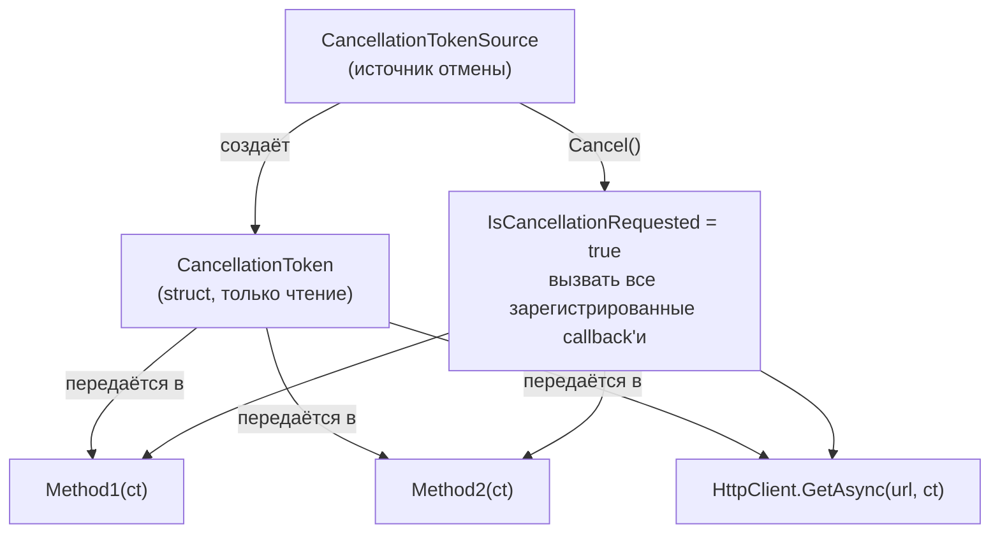

# CancellationToken

> Отмена в .NET — кооперативная. Задача сама решает, когда и как остановиться. Нельзя «убить» задачу извне.

## Содержание
- [Cooperative cancellation](#cooperative-cancellation)
- [CancellationTokenSource и CancellationToken](#cancellationtokensource-и-cancellationtoken)
- [Три способа реагировать на отмену](#три-способа-реагировать)
- [Linked tokens: объединение источников](#linked-tokens)
- [Timeout через CancellationTokenSource](#timeout)
- [OperationCanceledException vs TaskCanceledException](#исключения)
- [Регистрация callback на отмену](#callback)
- [CancellationToken в ASP.NET Core](#в-aspnet-core)
- [Подводные камни](#подводные-камни)
- [См. также](#см-также)

---

## Cooperative cancellation

Почему кооперативная, а не preemptive (как `Thread.Abort()`)?

`Thread.Abort()` прерывал поток в произвольной точке. Это оставляло объекты в inconsistent состоянии, не давало закрыть соединения и откатить транзакции. Поэтому в .NET 5+ `Thread.Abort()` бросает `PlatformNotSupportedException`.

Cooperative cancellation: код **сам проверяет** токен и корректно завершается — закрывает соединения, освобождает ресурсы, откатывает транзакции.

---

## CancellationTokenSource и CancellationToken



**`CancellationTokenSource`** — источник отмены, знает как отменить. Реализует `IDisposable`.  
**`CancellationToken`** — struct, знает только о факте отмены. Безопасно копировать и передавать.

```csharp
using var cts = new CancellationTokenSource();
var token = cts.Token;

// Отмена из другого места:
cts.Cancel(); // синхронно вызывает все callback'и
// или:
cts.CancelAfter(TimeSpan.FromSeconds(30)); // отмена с задержкой
```

---

## Три способа реагировать

```csharp
public async Task<Data> Fetch(string url, CancellationToken ct = default)
{
    // 1. Бросить исключение немедленно при проверке
    ct.ThrowIfCancellationRequested();

    // 2. Передать токен вглубь — I/O-операция прервётся сама
    var response = await httpClient.GetAsync(url, ct);

    // 3. Проверить без исключения (graceful exit)
    if (ct.IsCancellationRequested)
        return Data.Empty;

    return Parse(await response.Content.ReadAsStringAsync(ct));
}
```

**Рекомендация:** всегда передавай `ct` в I/O-операции (вариант 2). `ThrowIfCancellationRequested()` используй для долгих CPU-bound циклов. Вариант 3 — когда нужен graceful результат вместо исключения.

---

## Linked tokens

Объединяет несколько источников отмены в один. Отмена **любого** из них отменяет linked token:

```csharp
using var requestCts = new CancellationTokenSource(); // от HTTP-запроса
using var timeoutCts = new CancellationTokenSource(TimeSpan.FromSeconds(30));

using var linkedCts = CancellationTokenSource.CreateLinkedTokenSource(
    requestCts.Token,
    timeoutCts.Token
);

await ProcessAsync(linkedCts.Token);
// Отменится если клиент отключился ИЛИ таймаут истёк
```

**Типичный паттерн в ASP.NET Core** — объединить таймаут с `HttpContext.RequestAborted`:

```csharp
public async Task<IActionResult> Handle(
    [FromBody] Request req,
    CancellationToken requestCt) // автоматически = HttpContext.RequestAborted
{
    using var timeoutCts = new CancellationTokenSource(TimeSpan.FromSeconds(10));
    using var linkedCts = CancellationTokenSource.CreateLinkedTokenSource(
        requestCt, timeoutCts.Token);

    var result = await service.Process(req, linkedCts.Token);
    return Ok(result);
}
```

---

## Timeout

```csharp
// Вариант 1: через CancellationTokenSource
using var cts = new CancellationTokenSource(TimeSpan.FromSeconds(30));
await FetchData(cts.Token);

// Вариант 2: CancelAfter (переиспользовать существующий CTS)
cts.CancelAfter(TimeSpan.FromSeconds(30));

// Вариант 3: HttpClient.Timeout (только для HttpClient)
var client = new HttpClient { Timeout = TimeSpan.FromSeconds(30) };
// Под капотом тоже использует CancellationToken
```

`CancellationTokenSource` с таймаутом регистрирует внутренний `Timer`. Поэтому важно вызывать `Dispose()` — иначе утечёт таймер.

---

## Исключения

| Исключение | Кто бросает |
|-----------|-------------|
| `OperationCanceledException` | `ct.ThrowIfCancellationRequested()` |
| `TaskCanceledException` | `HttpClient`, `Task.Delay(ct)`, большинство BCL async API |

`TaskCanceledException` наследует от `OperationCanceledException`. Ловить нужно `OperationCanceledException` — покрывает оба:

```csharp
try
{
    await FetchAsync(ct);
}
catch (OperationCanceledException) when (ct.IsCancellationRequested)
{
    // Наша отмена — обработать gracefully
}
catch (OperationCanceledException)
{
    // Отмена внутри метода (другой CTS) — перебросить
    throw;
}
```

`Task.Status` после отмены — `Canceled`, не `Faulted`. `await` бросит `OperationCanceledException`, `.Result` бросит `AggregateException` с `TaskCanceledException` внутри.

---

## Callback

Для интеграции с API, которые не принимают `CancellationToken`:

```csharp
// Register вызовется при отмене токена:
ct.Register(() => connection.Abort());

// С state object (избежать замыкание):
ct.Register(static state => ((Connection)state!).Abort(), connection);

// Возвращает IDisposable — снять регистрацию:
using var reg = ct.Register(() => connection.Abort());
// При Dispose — callback снимается
```

**Важно:** callback вызывается синхронно на потоке, вызвавшем `cts.Cancel()`. Не делай в callback долгих операций.

---

## В ASP.NET Core

`HttpContext.RequestAborted` — `CancellationToken`, который отменяется когда клиент разрывает соединение. Автоматически передаётся в action-параметр с именем `CancellationToken` или `ct`:

```csharp
[HttpGet("data")]
public async Task<IActionResult> GetData(CancellationToken ct)
{
    // ct = HttpContext.RequestAborted автоматически
    var data = await service.GetAsync(ct);
    return Ok(data);
}
```

Всегда передавай этот токен в сервисы — это позволяет прервать длинные операции при отключении клиента и не тратить ресурсы зря.

---

## Подводные камни

**`CancellationTokenSource` не Dispose'd** — утечёт таймер (если был таймаут). Всегда `using`:

```csharp
using var cts = new CancellationTokenSource(timeout);
```

**`default(CancellationToken)` vs `CancellationToken.None`** — это одно и то же. Ни тот, ни другой никогда не отменяется. Используй как default-значение параметра.

**`CancellationToken` не отменяет уже начатую операцию автоматически** — он отменяет только если операция его проверяет. `await Task.Delay(1_000_000, ct)` прервётся, но `Thread.Sleep(1_000_000)` — нет.

**`Cancel()` бросает исключение, если callback бросил** — `CancellationTokenSource.Cancel()` по умолчанию **пробрасывает** первое исключение из callback'ов. Используй `Cancel(throwOnFirstException: false)` чтобы вызвать все callback'и и собрать все исключения в `AggregateException`.

---

## См. также

- [09-advanced.md](./09-advanced.md) — `Task.WhenAny` + отмена проигравших задач
- [10-antipatterns.md](./10-antipatterns.md) — fire-and-forget без отмены
