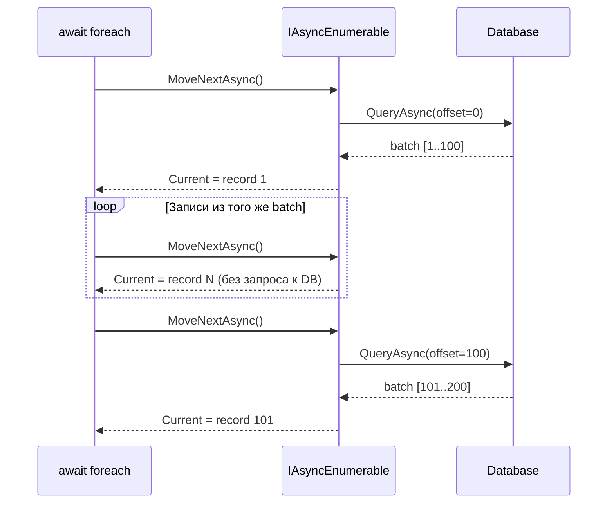
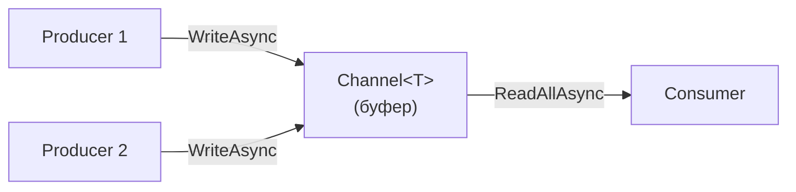

# Продвинутые сценарии: WhenAll, WhenAny, IAsyncEnumerable, Channels, TaskCompletionSource

> Инструменты для координации нескольких async-операций и построения конвейеров данных.

## Содержание
- [Task.WhenAll](#taskwhenall)
- [Task.WhenAny](#taskwhenany)
- [Parallel.ForEachAsync](#parallelforeachasync)
- [IAsyncEnumerable\<T\>](#iasyncenumerablet)
- [Channel\<T\>](#channelt)
- [TaskCompletionSource](#taskcompletionsource)
- [Подводные камни](#подводные-камни)
- [См. также](#см-также)

---

## Task.WhenAll

Запустить несколько операций параллельно и дождаться всех:

```csharp
// Последовательно: 3 + 4 + 2 = 9 сек
var user = await GetUserAsync(id);
var orders = await GetOrdersAsync(id);
var prefs = await GetPreferencesAsync(id);

// Параллельно: max(3, 4, 2) = 4 сек
var (users, orders, prefs) = await (
    GetUserAsync(id),
    GetOrdersAsync(id),
    GetPreferencesAsync(id)
);
// или явно:
var allTasks = new[] { GetUserAsync(id), GetOrdersAsync(id), GetPreferencesAsync(id) };
var results = await Task.WhenAll(allTasks);
```

**Обработка исключений** — при нескольких ошибках `await` бросает только первую. Все исключения доступны через `Task.Exception`:

```csharp
var allTask = Task.WhenAll(task1, task2, task3);
try
{
    await allTask;
}
catch
{
    foreach (var ex in allTask.Exception!.InnerExceptions)
        logger.LogError(ex, "Task failed");
}
```

**Отмена при первом успехе** — `WhenAll` не отменяет задачи автоматически при ошибке. Если хочешь «все или ничего»:

```csharp
using var cts = new CancellationTokenSource();
var tasks = new[]
{
    FetchA(cts.Token),
    FetchB(cts.Token),
};

try
{
    await Task.WhenAll(tasks);
}
catch
{
    cts.Cancel(); // отменить оставшиеся
    throw;
}
```

---

## Task.WhenAny

Дождаться **первой** завершённой задачи:

```csharp
var task1 = FetchFromPrimary(ct);
var task2 = FetchFromFallback(ct);

var first = await Task.WhenAny(task1, task2);
var result = await first; // развернуть результат
```

**Критично: WhenAny не отменяет проигравших.** task2 продолжает работать в фоне:

```csharp
// Правильный паттерн с отменой:
using var cts = new CancellationTokenSource();
var tasks = new[]
{
    Fetch(url1, cts.Token),
    Fetch(url2, cts.Token),
};
var first = await Task.WhenAny(tasks);
await cts.CancelAsync(); // отменить проигравших
var result = await first;
```

**Паттерн timeout без таймера:**

```csharp
var dataTask = FetchDataAsync(ct);
var timeoutTask = Task.Delay(TimeSpan.FromSeconds(10), ct);

if (await Task.WhenAny(dataTask, timeoutTask) == timeoutTask)
    throw new TimeoutException("Operation timed out");

return await dataTask;
```

---

## Parallel.ForEachAsync

Параллельная обработка async-операций с ограничением степени параллелизма.

`Task.WhenAll` — стартует все задачи одновременно (нет ограничения). `Parallel.ForEach` — блокирует потоки на `await`. `Parallel.ForEachAsync` — лучшее из двух миров:

```csharp
await Parallel.ForEachAsync(
    urls,
    new ParallelOptions
    {
        MaxDegreeOfParallelism = 10,
        CancellationToken = ct
    },
    async (url, token) =>
    {
        var data = await httpClient.GetStringAsync(url, token);
        await ProcessAsync(data, token);
    });
// Не более 10 URL одновременно, потоки НЕ блокируются
```

Подходит для: батч-обработки записей, параллельной загрузки с rate limiting, fan-out с ограничением.

---

## IAsyncEnumerable\<T\>

Асинхронный стрим — `yield return` + `await` в одном методе. Позволяет обрабатывать данные по мере их поступления, не загружая всё в память.

```csharp
public async IAsyncEnumerable<Record> Stream(
    [EnumeratorCancellation] CancellationToken ct = default)
{
    int offset = 0;
    while (true)
    {
        var batch = await db.QueryAsync(offset, limit: 100, ct);
        if (batch.Count == 0) yield break;

        foreach (var record in batch)
            yield return record;

        offset += batch.Count;
    }
}

// Потребление:
await foreach (var record in Stream(cancellationToken: ct))
{
    await Process(record);
}
```



**Под капотом:** компилятор генерирует state machine, реализующую `IAsyncEnumerator<T>` — двойную state machine: одна для `yield return`, другая для `await`. Объединены в одну struct.

**`MoveNextAsync()` возвращает `ValueTask<bool>`** — оптимизация для случая, когда следующий элемент доступен синхронно (из того же batch).

**`[EnumeratorCancellation]`** — позволяет передать токен через `await foreach (...).WithCancellation(ct)`:

```csharp
// Эти два варианта эквивалентны:
await foreach (var r in Stream(ct)) { }
await foreach (var r in Stream().WithCancellation(ct)) { }
```

---

## Channel\<T\>

Producer-consumer очередь с async поддержкой. Встроена в BCL (`System.Threading.Channels`).

```csharp
// Создать bounded channel (с ограничением — backpressure)
var channel = Channel.CreateBounded<int>(new BoundedChannelOptions(100)
{
    FullMode = BoundedChannelFullMode.Wait // producer ждёт если полный
});

// Producer:
await channel.Writer.WriteAsync(item, ct);
channel.Writer.Complete(); // сигнал: данных больше не будет

// Consumer:
await foreach (var item in channel.Reader.ReadAllAsync(ct))
{
    await Process(item);
}
```



**Unbounded channel** — нет ограничения на размер. Подходит если producer не может превысить consumer:

```csharp
var channel = Channel.CreateUnbounded<int>();
```

**Типичный паттерн: pipeline из stages:**

```csharp
var rawChannel = Channel.CreateBounded<RawItem>(100);
var processedChannel = Channel.CreateBounded<ProcessedItem>(100);

// Stage 1: читать из источника
var produce = ProduceAsync(rawChannel.Writer, ct);

// Stage 2: трансформировать
var transform = TransformAsync(rawChannel.Reader, processedChannel.Writer, ct);

// Stage 3: сохранить
var consume = ConsumeAsync(processedChannel.Reader, ct);

await Task.WhenAll(produce, transform, consume);
```

**Channel vs `BlockingCollection<T>`:** `BlockingCollection` блокирует потоки. Channel — async, без блокировки.

---

## TaskCompletionSource

Ручное управление Task: создать Task и завершить его из другого места/потока.

```csharp
public Task<int> WaitForExternalEvent()
{
    var tcs = new TaskCompletionSource<int>(
        TaskCreationOptions.RunContinuationsAsynchronously);

    // Зарегистрировать callback в внешней системе:
    externalSystem.OnEvent += result => tcs.SetResult(result);
    externalSystem.OnError += ex => tcs.SetException(ex);

    return tcs.Task; // вернуть Task, который завершится позже
}

// Caller:
var result = await WaitForExternalEvent();
```

**`RunContinuationsAsynchronously`** — критически важный флаг. Без него `SetResult()` выполняет continuation'ы инлайново на вызывающем потоке (тот, что вызвал `SetResult`). Это может создать нежелательные задержки или deadlock'и. **Всегда указывай этот флаг.**

**Методы TCS:**

| Метод | Результат |
|-------|-----------|
| `SetResult(value)` | Завершить Task успешно |
| `SetException(ex)` | Завершить Task с ошибкой |
| `SetCanceled(ct)` | Завершить Task как отменённый |
| `TrySet*` | Те же, но не бросают если уже завершён |

Используй `TrySet*` если есть гонка между несколькими источниками завершения.

---

## Подводные камни

**`Task.WhenAll` с пустой коллекцией** — немедленно завершается с пустым массивом результатов. Не ошибка, но нужно учитывать.

**`WhenAny` + исключения** — `await Task.WhenAny(tasks)` никогда не бросает исключение само по себе. Оно бросится при `await first`. Проверяй `first.IsFaulted` если нужно обработать ошибку без исключения.

**`IAsyncEnumerable` и `IDisposable`** — `await foreach` автоматически вызывает `DisposeAsync()` на enumerator'е. Убедись, что твои ресурсы (подключения к БД) освобождаются в `finally` или `DisposeAsync`.

**Channel не thread-safe для Writer/Reader** — `Writer` и `Reader` можно использовать из разных потоков, но не несколько `WriteAsync` конкурентно из одного потока без синхронизации (bounded channel с `Wait` mode).

---

## См. также

- [08-cancellation.md](./08-cancellation.md) — передача CancellationToken в WhenAny/WhenAll
- [01-threadpool.md](./01-threadpool.md) — Parallel.ForEachAsync и пул потоков
- [10-antipatterns.md](./10-antipatterns.md) — fire-and-forget вместо proper WhenAll
