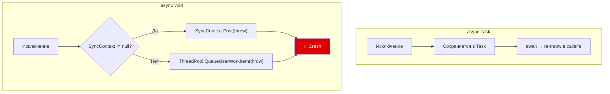

# Антипаттерны async/await

> Большинство async-багов — не баги компилятора. Это баги понимания модели выполнения.

## Содержание
- [async void](#async-void)
- [Deadlock: .Result/.Wait() с SynchronizationContext](#deadlock)
- [Fire-and-forget без обработки ошибок](#fire-and-forget)
- [Async over sync](#async-over-sync)
- [Sync over async](#sync-over-async)
- [Не ждать Task'и в цикле](#не-ждать-taskи-в-цикле)
- [Передача CancellationToken только в начало стека](#cancellationtoken-только-в-начало)
- [Подводные камни](#подводные-камни)

---

## async void

**Проблема:** исключение из `async void` не попадает в Task — его некуда поместить. Оно пробрасывается через `SynchronizationContext` или ThreadPool и **крашит процесс**.



```csharp
// ПЛОХО:
public async void OnClick(object sender, EventArgs e)
{
    await LoadData();
    // Если исключение → нельзя поймать через try/catch снаружи
}

// Нельзя поймать:
try
{
    FireAndForgetAsync(); // async void возвращает void немедленно
}
catch (Exception) { } // НИКОГДА сюда не попадёт
```

**Почему async void существует:** обработчики событий (`event EventHandler`) обязаны возвращать `void`. Это единственное легитимное использование.

**Правило:** в обработчиках событий оборачивай в try/catch всё тело:

```csharp
public async void OnClick(object sender, EventArgs e)
{
    try
    {
        await LoadData();
        UpdateUI();
    }
    catch (Exception ex)
    {
        logger.LogError(ex, "OnClick failed");
        ShowError(ex.Message);
    }
}
```

**`async void` и тесты:** тест завершится до выполнения async-кода. xUnit/NUnit умеют обрабатывать `async Task`-тесты, но не `async void`.

---

## Deadlock

**Условие:** `SynchronizationContext` != null + `.Result`/`.Wait()`.

Механизм подробно разобран в [06-synchronization-context.md](./06-synchronization-context.md#deadlock).

```csharp
// WPF / WinForms / ASP.NET Classic:
public string GetData()
{
    return LoadAsync().Result; // DEADLOCK
}

public async Task<string> LoadAsync()
{
    var response = await httpClient.GetAsync(url);
    // continuation хочет вернуться на UI-поток через SyncContext
    // но UI-поток заблокирован на .Result → взаимная блокировка
    return await response.Content.ReadAsStringAsync();
}
```

**Решения (от лучшего к худшему):**

```csharp
// 1. Лучшее: async all the way down
public async Task<string> GetData()
    => await LoadAsync();

// 2. ConfigureAwait(false) внутри LoadAsync — хрупко, только если полностью под контролем
public async Task<string> LoadAsync()
{
    var response = await httpClient.GetAsync(url).ConfigureAwait(false);
    return await response.Content.ReadAsStringAsync().ConfigureAwait(false);
}

// 3. Task.Run — работает, но блокирует два потока (антипаттерн в prod)
public string GetData()
    => Task.Run(() => LoadAsync()).Result;

// 4. .GetAwaiter().GetResult() — то же, что .Result, но без AggregateException
//    Всё равно блокирует, всё равно может дедлочить
```

**Почему intermittent:** если Task завершился к моменту вызова `.Result` — блокировки нет. В тестах (быстрая БД в памяти) работает. В продакшне (медленная remote-DB) — дедлок.

---

## Fire-and-forget

**Проблема:** Task без `await` «проглатывает» исключения. В .NET Core необработанный Task-exception вызывает `TaskScheduler.UnobservedTaskException`, но **не крашит процесс**. Исключение просто теряется.

```csharp
// ПЛОХО: исключение молча потеряно
public void Process()
{
    _ = SendEmailAsync(); // исключение внутри — никто не узнает
}
```

**Правило:** fire-and-forget допустим только если потеря результата и ошибки некритична (метрики, логирование с fallback). Для бизнес-операций — всегда `await`.

```csharp
// ПРАВИЛЬНО: обернуть в try/catch
public void Process()
{
    _ = SendEmailSafe();
}

private async Task SendEmailSafe()
{
    try
    {
        await SendEmailAsync();
    }
    catch (Exception ex)
    {
        logger.LogError(ex, "Email sending failed");
    }
}

// ИЛИ: extension method для централизованной обработки
public static async void SafeFireAndForget(
    this Task task,
    ILogger? logger = null,
    [CallerMemberName] string caller = "")
{
    try
    {
        await task.ConfigureAwait(false);
    }
    catch (Exception ex)
    {
        logger?.LogError(ex, "Fire-and-forget failed in {Caller}", caller);
    }
}

SendEmailAsync().SafeFireAndForget(logger);
```

---

## Async over sync

Оборачивание синхронного кода в `Task.Run` в библиотечном коде:

```csharp
// ПЛОХО в библиотеке:
public Task<int> CalculateAsync(int x)
    => Task.Run(() => Calculate(x));
```

**Почему плохо:** библиотека не знает контекст вызова. В ASP.NET это **хуже** синхронного вызова — занимает два потока: текущий ждёт (await), второй считает. Вызывающий код думает, что это I/O-bound операция.

**Правило:** решение об использовании `Task.Run()` для CPU-bound работы принимает **application code**, не библиотека:

```csharp
// Библиотека предоставляет синхронный метод:
public int Calculate(int x) { ... }

// Application code решает:
// В WPF — обернуть, чтобы не блокировать UI:
var result = await Task.Run(() => calculator.Calculate(x));

// В ASP.NET — вызвать синхронно (уже на потоке пула):
var result = calculator.Calculate(x);
```

---

## Sync over async

Вызов `.Result`/`.Wait()` на async-коде в синхронном методе:

```csharp
// ПЛОХО:
public string Get()
    => GetAsync().Result; // deadlock (UI) или thread starvation (server)
```

**Почему возникает:** legacy-код с синхронным интерфейсом `IRepository.Get()`, но реализация вызывает async API. «Быстрое решение» — `.Result`.

**Правильное решение** — добавить async-версию и мигрировать:

```csharp
// Добавить async-метод:
Task<string> GetAsync(CancellationToken ct = default);

// Мигрировать все вызывающие:
public async Task<string> Handle()
    => await repository.GetAsync(ct);
```

Если миграция невозможна немедленно — изолировать sync-over-async в одном месте с документацией почему:

```csharp
// TEMPORARY: sync interface, async implementation
// TODO: migrate to async in ticket #1234
public string Get()
{
    // Safe because this code path never runs in a context
    // with SynchronizationContext (background service only)
    return GetAsync().GetAwaiter().GetResult();
}
```

---

## Не ждать Task'и в цикле

```csharp
// ПЛОХО: последовательно, не параллельно
foreach (var url in urls)
{
    var data = await httpClient.GetStringAsync(url); // по одному
    Process(data);
}

// ЛУЧШЕ: параллельно с ограничением
await Parallel.ForEachAsync(
    urls,
    new ParallelOptions { MaxDegreeOfParallelism = 10 },
    async (url, ct) =>
    {
        var data = await httpClient.GetStringAsync(url, ct);
        await ProcessAsync(data, ct);
    });
```

Исключение: если порядок важен или операции **зависят** друг от друга — последовательно оправдано.

---

## CancellationToken только в начало стека

```csharp
// ПЛОХО: передали токен в entry point, но не вглубь
public async Task Handle(CancellationToken ct)
{
    var data = await repository.GetAsync(); // ct не передан!
    await service.Process(data);            // ct не передан!
}

// ПРАВИЛЬНО: токен течёт через весь стек
public async Task Handle(CancellationToken ct)
{
    var data = await repository.GetAsync(ct);
    await service.Process(data, ct);
}
```

Если не передавать `ct` вглубь — отмена не прерывает I/O-операции. Метод продолжит работу даже после того, как клиент отключился.

---

## Подводные камни

**`ConfigureAwait(false)` не решает все проблемы.** Если хоть один `await` в цепочке не имеет `ConfigureAwait(false)` — SyncContext может быть захвачен там. Нельзя «защитить» только один уровень.

**`_ = Task` вместо `await`** — иногда намеренно (fire-and-forget), иногда случайно (забыли `await`). Компилятор не предупреждает о пропущенном `await`. Включи `#pragma warning restore CS4014` в критичных местах.

**`async Task Main()` в консольных приложениях** — начиная с C# 7.1 поддерживается. Если используешь старый паттерн `.GetAwaiter().GetResult()` в Main — убедись что нет SyncContext (в консоли его нет).
