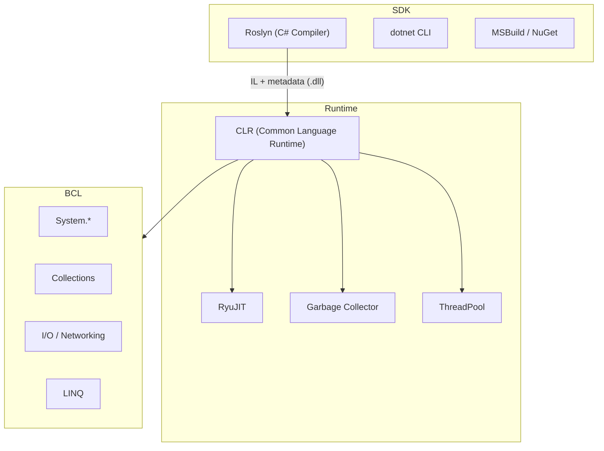
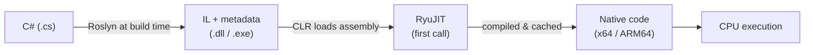
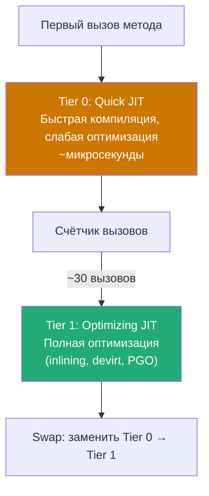
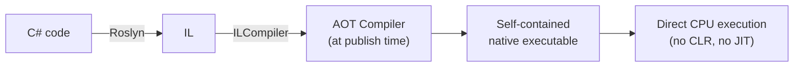

# .NET Platform: CLR, JIT, NativeAOT

> Что происходит между `dotnet run` и первой инструкцией CPU — и почему это важно для понимания производительности.

## Содержание
- [Компоненты .NET](#компоненты-net)
- [Путь от кода до выполнения](#путь-от-кода-до-выполнения)
- [JIT-компиляция](#jit-компиляция)
- [Tiered Compilation](#tiered-compilation)
- [Dynamic PGO](#dynamic-pgo)
- [NativeAOT](#nativeaot)
- [Подводные камни](#подводные-камни)
- [См. также](#см-также)

---

## Компоненты .NET



| Компонент | Роль | Аналог в Java |
|-----------|------|---------------|
| **CLR** | Виртуальная машина, исполняет IL | JVM |
| **IL** | Байт-код, в который компилируется C# | JVM bytecode |
| **RyuJIT** | Компилятор IL → native code (в runtime) | HotSpot JIT |
| **BCL** | Стандартная библиотека | java.lang + java.util |
| **SDK** | Компилятор + CLI + инструменты (для разработки) | JDK |
| **Runtime** | CLR + BCL (для запуска) | JRE |

**SDK vs Runtime:** на продакшн-сервер ставят только Runtime. SDK нужен только на машине разработчика и в CI.

---

## Путь от кода до выполнения



**IL** — независимый от платформы байт-код. Один и тот же `.dll` запускается на Windows x64, Linux ARM64, macOS — JIT компилирует под конкретную архитектуру в runtime.

```csharp
// C# код:
int Add(int a, int b) => a + b;

// IL (упрощённо):
// ldarg.0   (push a)
// ldarg.1   (push b)
// add
// ret

// x64 native после JIT:
// lea eax, [rcx + rdx]
// ret
```

**Метаданные в .dll:** каждая сборка содержит не только IL, но и полное описание типов, методов, полей, атрибутов — это основа Reflection и работы CLR без заголовочных файлов.

---

## JIT-компиляция

**JIT** компилирует IL в нативный код **при первом вызове метода**. Результат кешируется в памяти — при повторных вызовах компиляция не повторяется.

**Оптимизации JIT (Tier 1):**

| Оптимизация | Что делает |
|-------------|-----------|
| Method inlining | Вставляет тело мелкого метода в caller — убирает overhead вызова |
| Dead code elimination | Удаляет недостижимый код (`if (false) { ... }`) |
| Loop unrolling | Разворачивает короткие циклы для уменьшения branch overhead |
| Bounds check elimination | Убирает проверку границ массива, если индекс доказано валиден |
| Devirtualization | Заменяет виртуальный вызов прямым, если JIT знает конкретный тип |
| Register allocation | Хранит горячие значения в регистрах CPU вместо памяти |

```csharp
// JIT может заинлайнить этот метод:
[MethodImpl(MethodImplOptions.AggressiveInlining)]
private static int Square(int x) => x * x;

// Запрет инлайнинга (для стектрейсов, бенчмарков):
[MethodImpl(MethodImplOptions.NoInlining)]
private static void ExpensiveMethod() { ... }
```

---

## Tiered Compilation

**Проблема без Tiered Compilation:** полная оптимизация при первом вызове — долгий cold start. Без оптимизации — плохая steady-state производительность.

**Решение:** два уровня компиляции.



- **Tier 0** — приложение быстро стартует, редко вызываемые методы так и остаются на Tier 0
- **Tier 1** — горячие методы (вызываемые часто) перекомпилируются с полной оптимизацией
- **OSR (On-Stack Replacement):** метод, уже выполняющийся в длинном цикле, может быть заменён на Tier 1 прямо во время выполнения — без ожидания следующего вызова

---

## Dynamic PGO

**PGO (Profile-Guided Optimization)** — JIT собирает профиль реального выполнения во время Tier 0 и использует его при Tier 1 компиляции.


**Что даёт Dynamic PGO (.NET 8+):**
- **Speculative devirtualization** — JIT видит, что `IAnimal.Speak()` в 99% случаев вызывается на `Dog`, и генерирует быстрый direct call с fallback на virtual
- **Hot/cold splitting** — редко выполняемый код (обработка ошибок) выносится из горячего пути, улучшая cache locality
- **Branch prediction hints** — JIT расставляет likely/unlikely на основе реального профиля

```csharp
// Без PGO — virtual call через vtable:
void Process(IAnimal animal) => animal.Speak();

// С PGO — если в профиле 99% вызовов было на Dog:
// if (animal is Dog d) d.Speak(); // fast path
// else animal.Speak();            // slow path
```

---

## NativeAOT

**NativeAOT** — компиляция IL в нативный код **при публикации** (`dotnet publish -r linux-x64`). Никакого JIT в runtime.



**Когда NativeAOT выгоден:**

| Сценарий | Причина |
|----------|---------|
| Serverless / AWS Lambda | Cold start критичен — нет JIT warm-up |
| CLI-утилиты | Мгновенный запуск, no runtime dependency |
| Embedded / IoT | Ограниченные ресурсы, нет места для CLR |
| Microservices с быстрым деплоем | Меньше памяти, быстрее готов принимать трафик |

**Ограничения NativeAOT:**

```csharp
// НЕ РАБОТАЕТ в NativeAOT:
var type = Type.GetType("MyApp.SomeClass"); // dynamic type loading
var asm = Assembly.LoadFrom("plugin.dll");  // dynamic assembly loading
Activator.CreateInstance(type);             // если тип не в AOT graph

// РАБОТАЕТ (с source generators):
[JsonSerializable(typeof(Order))]           // source-generated serializer
public partial class AppJsonContext : JsonSerializerContext { }
```

**Trimming:** NativeAOT автоматически удаляет неиспользуемый код из BCL. Reflection-зависимый код ломается, если тип не сохранён явно через `[DynamicallyAccessedMembers]` или rd.xml.

---

## Подводные камни

**Cold start в serverless:** JIT-приложение на AWS Lambda может добавлять 500–2000 мс к cold start. NativeAOT или ReadyToRun (`<PublishReadyToRun>true</PublishReadyToRun>`) решают это.

**ReadyToRun (R2R):** компромисс между JIT и NativeAOT — pre-JIT-ed код включается в сборку, CLR всё ещё присутствует. Быстрый старт без ограничений NativeAOT.

```xml
<PropertyGroup>
  <PublishReadyToRun>true</PublishReadyToRun>         <!-- R2R -->
  <PublishAot>true</PublishAot>                        <!-- NativeAOT -->
  <TieredCompilation>true</TieredCompilation>          <!-- default: true -->
  <TieredPGO>true</TieredPGO>                         <!-- default .NET 8+ -->
</PropertyGroup>
```

**`GC.Collect()` в production** — почти всегда ошибка. JIT и GC настроены работать вместе; принудительная сборка нарушает их эвристику и вызывает паузы в неподходящий момент.

---

## См. также

- [04-stack-heap.md](./04-stack-heap.md) — как CLR организует память на stack и heap
- [07-gc.md](./07-gc.md) — Garbage Collector: поколения, фазы, паузы
