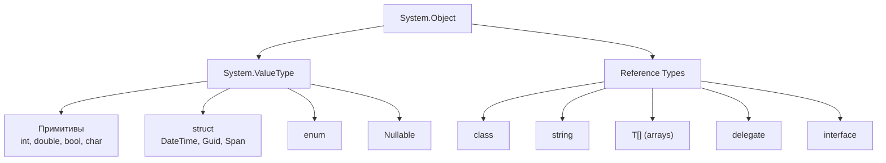
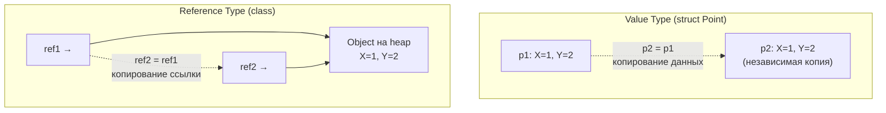
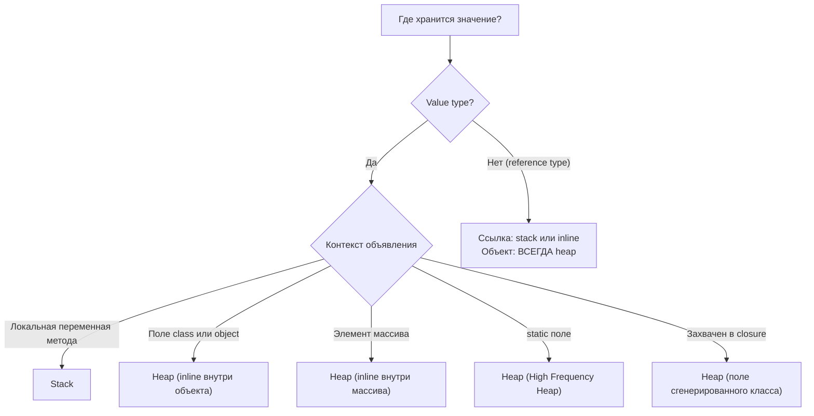

# Value Types vs Reference Types

> Фундаментальное разделение в .NET — всё остальное (stack/heap, boxing, GC) вытекает из него.

## Содержание
- [Иерархия типов](#иерархия-типов)
- [Ключевые различия](#ключевые-различия)
- [Семантика копирования](#семантика-копирования)
- [Где физически хранятся данные](#где-физически-хранятся-данные)
- [Примитивные типы](#примитивные-типы)
- [enum](#enum)
- [Nullable\<T\>](#nullablet)
- [Подводные камни](#подводные-камни)
- [См. также](#см-также)

---

## Иерархия типов



Все типы в .NET наследуются от `System.Object`. Value types наследуются через `System.ValueType`, который переопределяет `Equals` и `GetHashCode` для value-based сравнения.

---

## Ключевые различия

| | Value Type | Reference Type |
|---|---|---|
| **Хранит** | Сами данные (inline) | Ссылку (pointer) на данные |
| **Копирование** | Побитовая копия всех данных | Копия ссылки (данные shared) |
| **Equality по умолчанию** | Сравнение всех полей | Сравнение ссылок (ReferenceEquals) |
| **null** | Нет (если не `Nullable<T>`) | Да |
| **Наследование** | Нет (sealed implicitly) | Да |
| **Overhead объекта** | 0 байт | 16 байт (Sync Block + MT pointer) |
| **GC собирает** | Нет (если на стеке) | Да |

---

## Семантика копирования

```csharp
// Value type — полная копия данных:
int a = 42;
int b = a;     // b получает независимую копию
b = 100;
Console.WriteLine(a); // 42 — не изменился

// Reference type — копия ссылки:
var list1 = new List<int> { 1, 2, 3 };
var list2 = list1;   // list2 указывает на ТОТ ЖЕ объект в heap
list2.Add(4);
Console.WriteLine(list1.Count); // 4 — изменился!
```



**Equality:**

```csharp
// Value type: equals по содержимому (по умолчанию через ValueType.Equals)
var p1 = new Point(1, 2);
var p2 = new Point(1, 2);
Console.WriteLine(p1.Equals(p2)); // True (одинаковые поля)

// Reference type: equals по ссылке (по умолчанию)
var c1 = new Coordinate(1, 2);
var c2 = new Coordinate(1, 2);
Console.WriteLine(c1.Equals(c2)); // False (разные объекты в heap)
Console.WriteLine(c1 == c2);      // False (если == не переопределён)
```

---

## Где физически хранятся данные

Простое правило «value types на стеке, reference types на heap» — **упрощение**. Точное правило:



```csharp
class Order
{
    public int Id;           // int живёт на heap — inline внутри Order
    public DateTime Created; // DateTime живёт на heap — inline внутри Order
}

int[] numbers = new int[100];
// Массив на heap, но int'ы лежат непрерывно внутри (не 100 отдельных аллокаций)

int counter = 0;
Action increment = () => counter++;
// counter «переезжает» в поле сгенерированного компилятором класса — heap
```

**Ref-return позволяет работать со значением на heap без копирования:**

```csharp
ref int first = ref numbers[0]; // ссылка на элемент массива, не копия
first = 99;                     // изменили первый элемент массива напрямую
```

---

## Примитивные типы

Примитивные типы — алиасы CLR-типов. `int` и `System.Int32` — одно и то же.

| C# alias | CLR type | Size | Диапазон |
|----------|----------|------|----------|
| `byte` | `System.Byte` | 1 | 0..255 |
| `short` | `System.Int16` | 2 | -32 768..32 767 |
| `int` | `System.Int32` | 4 | ±2.1 млрд |
| `long` | `System.Int64` | 8 | ±9.2×10¹⁸ |
| `float` | `System.Single` | 4 | ~6–7 значащих цифр |
| `double` | `System.Double` | 8 | ~15–16 значащих цифр |
| `decimal` | `System.Decimal` | 16 | 28–29 значащих цифр |
| `bool` | `System.Boolean` | 1 | true / false |
| `char` | `System.Char` | 2 | Unicode UTF-16 |

**`decimal` vs `double` — почему деньги хранят в decimal:**

```csharp
double d = 0.1 + 0.2;
Console.WriteLine(d == 0.3);   // False! d = 0.30000000000000004
// double — бинарная плавающая точка, 0.1 не представим точно

decimal m = 0.1m + 0.2m;
Console.WriteLine(m == 0.3m);  // True
// decimal — десятичная, 0.1 = 1 × 10⁻¹ представим точно
```

`double` — для научных вычислений (скорость, диапазон). `decimal` — для финансов (точность).

---

## enum

`enum` — именованные целочисленные константы. Хранится как число, занимает столько же места.

```csharp
public enum OrderStatus : byte   // underlying type: byte (default: int)
{
    Pending    = 0,
    Processing = 1,
    Shipped    = 2,
    Delivered  = 3,
    Canceled   = 4
}

OrderStatus status = OrderStatus.Shipped;
byte raw = (byte)status;  // 2

// [Flags] — битовые маски:
[Flags]
public enum Permission
{
    None    = 0,
    Read    = 1 << 0,  // 0001
    Write   = 1 << 1,  // 0010
    Execute = 1 << 2,  // 0100
    All     = Read | Write | Execute
}

Permission p = Permission.Read | Permission.Write;
bool canRead = p.HasFlag(Permission.Read); // true
bool canExec = p.HasFlag(Permission.Execute); // false
```

**Явный underlying type** стоит указывать для enum-значений, которые хранятся в БД или сериализуются — защита от случайного расширения до int там, где достаточно byte/short.

---

## Nullable\<T\>

`int?` — это `Nullable<int>`: struct с двумя полями (`bool HasValue` + `T Value`).

```csharp
int? age = null;
int? count = 42;

// Проверка:
if (age.HasValue)
    Console.WriteLine(age.Value); // бросит InvalidOperationException если null

// Null-coalescing:
int result = age ?? 0;          // 0 если null
int safe = age.GetValueOrDefault(-1); // -1 если null

// Null-conditional:
string? name = null;
int? len = name?.Length;        // null, не NullReferenceException

// Pattern matching:
if (age is int a)
    Console.WriteLine(a); // a — распакованный int, доступен только здесь
```

**Nullable<T> не является reference type.** `null` для `Nullable<int>` — это `HasValue = false`, а не null-ссылка. Sizeof: `Nullable<int>` = 8 байт (4 для bool + alignment + 4 для int).

**Boxing nullable:**

```csharp
int? n = 42;
object boxed = n;          // боксируется как int (42), не как Nullable<int>!

int? empty = null;
object boxedNull = empty;  // boxedNull == null (null-ссылка, не Nullable)
```

---

## Подводные камни

**Мутабельный value type в коллекции:**

```csharp
public struct Counter { public int Value; public void Increment() => Value++; }

var list = new List<Counter> { new Counter { Value = 1 } };
list[0].Increment(); // компилятор выдаёт ошибку: list[0] возвращает КОПИЮ
                     // даже если бы скомпилировалось — инкремент на копии
```

**Equality по умолчанию для struct через Reflection:**

```csharp
// ValueType.Equals() по умолчанию использует Reflection для сравнения полей.
// Это МЕДЛЕННО и вызывает boxing. Всегда переопределяй Equals + GetHashCode.
public readonly struct Point : IEquatable<Point>
{
    public readonly double X, Y;
    public bool Equals(Point other) => X == other.X && Y == other.Y;
    public override bool Equals(object? obj) => obj is Point p && Equals(p);
    public override int GetHashCode() => HashCode.Combine(X, Y);
}
```

**Большой struct копируется целиком при передаче:**

```csharp
// struct 64 байта — передача по значению копирует 64 байта каждый раз
void Process(BigStruct s) { ... }

// Лучше: передавать по ссылке (in — readonly, ref — mutable)
void Process(in BigStruct s) { ... } // нет копирования, нет мутации
```

---

## См. также

- [05-struct-class-record.md](./05-struct-class-record.md) — struct vs class, readonly struct, ref struct, records
- [06-boxing.md](./06-boxing.md) — boxing/unboxing: механика и как избежать
- [03-string.md](./03-string.md) — string как особый reference type
