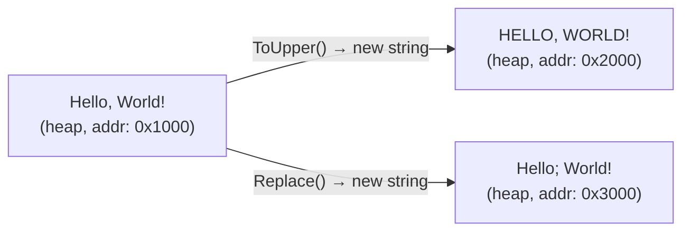
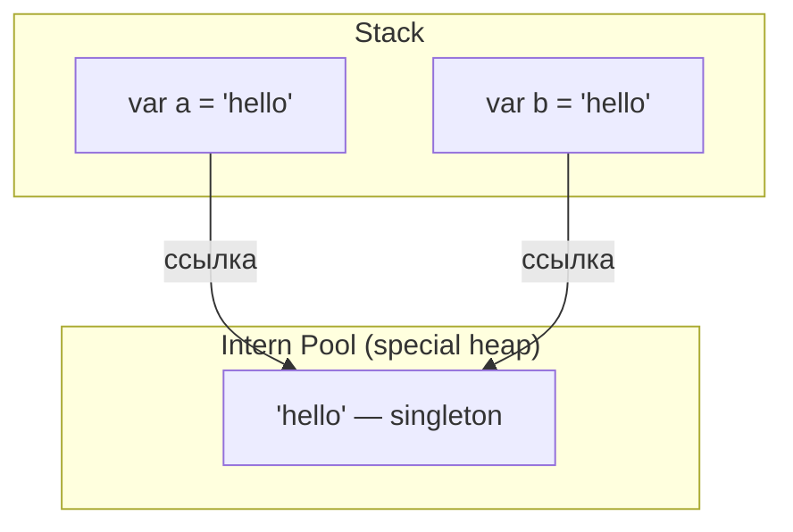

# string

> Reference type с value-семантикой — иммутабельность делает string безопасным для sharing, но ломает интуицию при конкатенации в циклах.

## Содержание
- [Что такое string](#что-такое-string)
- [Иммутабельность](#иммутабельность)
- [String Interning](#string-interning)
- [Конкатенация и StringBuilder](#конкатенация-и-stringbuilder)
- [String Interpolation](#string-interpolation)
- [Span-based операции](#span-based-операции)
- [Подводные камни](#подводные-камни)
- [См. также](#см-также)

---

## Что такое string

`string` — reference type (`System.String`), но ведёт себя **как value type**:

| Свойство | Поведение |
|----------|-----------|
| Тип | Reference type (живёт на heap) |
| Equality (`==`) | Сравнение **содержимого** (переопределено), не ссылок |
| Мутабельность | Иммутабельный — любая «изменяющая» операция создаёт новый объект |
| Thread safety | Безопасен для чтения из нескольких потоков без синхронизации |
| Null | Может быть null (в отличие от value types) |
| Empty | `string.Empty == ""` — одна и та же интернированная ссылка |

```csharp
string a = "hello";
string b = "hello";

Console.WriteLine(a == b);              // True  (содержимое совпадает)
Console.WriteLine(ReferenceEquals(a, b)); // True  (литералы интернированы)

string c = new string("hello".ToCharArray());
Console.WriteLine(a == c);              // True  (содержимое совпадает)
Console.WriteLine(ReferenceEquals(a, c)); // False (c создан через new)
```

---

## Иммутабельность

Все методы, которые «изменяют» строку, возвращают **новый** объект:

```csharp
string original = "Hello, World!";

string upper = original.ToUpper();      // новая строка "HELLO, WORLD!"
string replaced = original.Replace(",", ";"); // новая строка
string sub = original.Substring(0, 5); // новая строка "Hello"

Console.WriteLine(original); // "Hello, World!" — не изменился
```



**Почему это важно:** строки можно безопасно передавать между потоками, кешировать, использовать как ключи в Dictionary — никто не может неожиданно изменить данные под тобой.

**Внутреннее устройство:** `string` хранит `int _length` и массив `char[]` (UTF-16) inline в объекте. Символ — 2 байта. `"abc"` на heap занимает ~26 байт (object header 16 + length 4 + 3×char 6, rounded to alignment).

---

## String Interning

Литеральные строки в коде **интернируются** автоматически — CLR помещает их в специальный Intern Pool и при повторном использовании возвращает ту же ссылку.



```csharp
string a = "hello";
string b = "hello";
Console.WriteLine(ReferenceEquals(a, b)); // True — один объект

// Динамически созданная строка НЕ интернируется:
string c = new string(new char[] { 'h','e','l','l','o' });
Console.WriteLine(ReferenceEquals(a, c)); // False

// Принудительное интернирование:
string d = string.Intern(c);
Console.WriteLine(ReferenceEquals(a, d)); // True

// Проверить без интернирования:
string? e = string.IsInterned(c);         // null если не интернирована
```

**Когда интернирование полезно:** часто повторяющиеся строки (имена полей, статусы, коды) — экономит память. Сравнение интернированных строк через `ReferenceEquals` — O(1) вместо O(n).

**Когда вредно:** интернирование строк удерживает их в памяти навсегда (Intern Pool — не собирается GC). Не интернировать пользовательский ввод или данные из БД.

---

## Конкатенация и StringBuilder

**Проблема: N конкатенаций строк = O(n²) по памяти:**

```csharp
// ПЛОХО:
string result = "";
for (int i = 0; i < 10_000; i++)
    result += i.ToString();
// Каждая итерация: скопировать всё предыдущее + добавить новое
// 1 + 2 + 3 + ... + 10000 = ~50 млн байт скопировано, ~10000 аллокаций
```

**StringBuilder** — мутабельный буфер с удвоением capacity при переполнении (как `List<T>`):

```csharp
// ХОРОШО:
var sb = new StringBuilder(capacity: 60_000); // заранее зарезервировать
for (int i = 0; i < 10_000; i++)
    sb.Append(i);
string result = sb.ToString(); // одна финальная аллокация строки
```

**Когда StringBuilder не нужен:**

```csharp
// 2–4 конкатенации — компилятор использует string.Concat, быстрее SB:
string full = firstName + " " + lastName; // OK

// string.Join для коллекций:
string csv = string.Join(", ", items);    // эффективнее SB в данном случае

// $"" интерполяция для нескольких вставок:
string msg = $"Hello, {name}! You have {count} messages."; // OK
```

**Правило:** StringBuilder нужен, когда количество конкатенаций неизвестно заранее или больше ~5–10.

---

## String Interpolation

В .NET 6+ компилятор оптимизирует `$"..."` через `DefaultInterpolatedStringHandler` — stack-allocated handler минимизирует аллокации:

```csharp
// .NET 6+ — компилятор генерирует через DefaultInterpolatedStringHandler:
string name = "Alice";
int age = 30;
string msg = $"Name: {name}, Age: {age}";
// Нет промежуточных строк — прямая запись в буфер

// Format specifiers работают как обычно:
decimal price = 9.99m;
string s = $"Price: {price:C2}";    // "Price: $9.99"
string hex = $"0x{value:X8}";       // hex с padding
string aligned = $"{name,-20}|";    // left-align, width 20

// FormattableString — отложенная интерполяция (например для SQL-параметров):
FormattableString query = $"SELECT * FROM users WHERE id = {userId}";
string sql = query.Format;          // "SELECT * FROM users WHERE id = {0}"
object[] args = query.GetArguments(); // [userId]
```

**Logging — не используй интерполяцию:**

```csharp
// ПЛОХО: строка создаётся ВСЕГДА, даже если уровень логирования выше Debug
logger.LogDebug($"Processing order {orderId} for user {userId}");

// ХОРОШО: structured logging, строка не создаётся если Debug отключён
logger.LogDebug("Processing order {OrderId} for user {UserId}", orderId, userId);
```

---

## Span-based операции

`ReadOnlySpan<char>` позволяет работать с частями строки **без аллокации** новой строки:

```csharp
string input = "Hello, World!";

// ПЛОХО: Substring создаёт новую строку
string part = input.Substring(7, 5); // "World" — новая аллокация

// ХОРОШО: Span — просто ссылка на участок памяти
ReadOnlySpan<char> span = input.AsSpan(7, 5); // "World" — 0 аллокаций
Console.WriteLine(span.ToString()); // ToString создаёт строку только если нужна

// Разбор чисел без промежуточных строк:
ReadOnlySpan<char> digits = "12345".AsSpan();
int parsed = int.Parse(digits);     // нет аллокации

// MemoryExtensions для операций со spans:
ReadOnlySpan<char> trimmed = "  hello  ".AsSpan().Trim();
bool starts = "HelloWorld".AsSpan().StartsWith("Hello");

// Запись в собственный буфер:
Span<char> buffer = stackalloc char[64];
bool ok = name.TryCopyTo(buffer);
```

**.NET 8+ — zero-allocation форматирование:**

```csharp
Span<char> buf = stackalloc char[128];
int written;
bool success = buf.TryWrite($"Name: {name}, Age: {age}", out written);
string result = success ? buf[..written].ToString() : string.Empty;
```

---

## Подводные камни

**`String.Equals` vs `==`:** оба сравнивают содержимое для `string`, но при работе с `object`-переменными `==` сравнивает ссылки:

```csharp
object x = "hello";
object y = "hel" + "lo"; // может не интернироваться в рантайме
Console.WriteLine(x == y);              // True или False — зависит от интернирования!
Console.WriteLine(x.Equals(y));         // True — всегда содержимое
Console.WriteLine(string.Equals((string)x, (string)y)); // True — надёжно
```

**Ordinal vs Culture-sensitive сравнение:**

```csharp
// НЕ используй StringComparison.CurrentCulture для технических ключей:
"file.txt".Equals("FILE.TXT", StringComparison.OrdinalIgnoreCase); // правильно

// Для UI (отображение пользователю):
string.Compare(a, b, StringComparison.CurrentCultureIgnoreCase);
```

**Конкатенация с null не бросает исключение:**

```csharp
string? s = null;
string result = "prefix_" + s; // "prefix_" — null трактуется как ""
// НО: s.Length бросит NullReferenceException
```

---

## См. также

- [02-value-reference-types.md](./02-value-reference-types.md) — value vs reference types, почему string — reference type
- [04-stack-heap.md](./04-stack-heap.md) — как string размещается на heap, intern pool
- [06-boxing.md](./06-boxing.md) — boxing и строки в конкатенации
