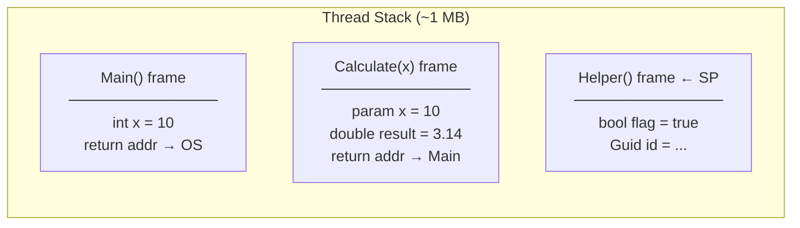
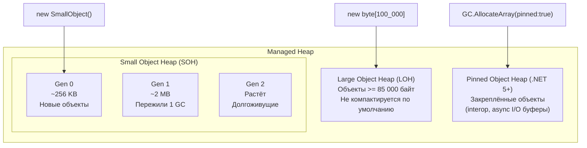
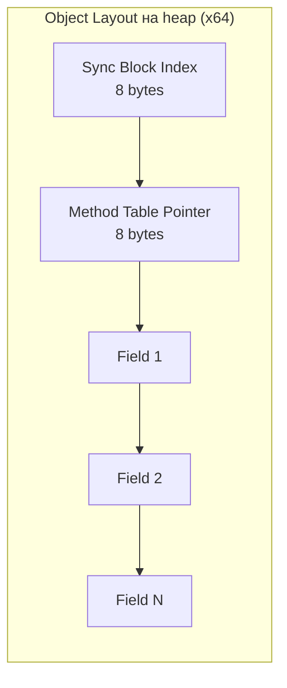
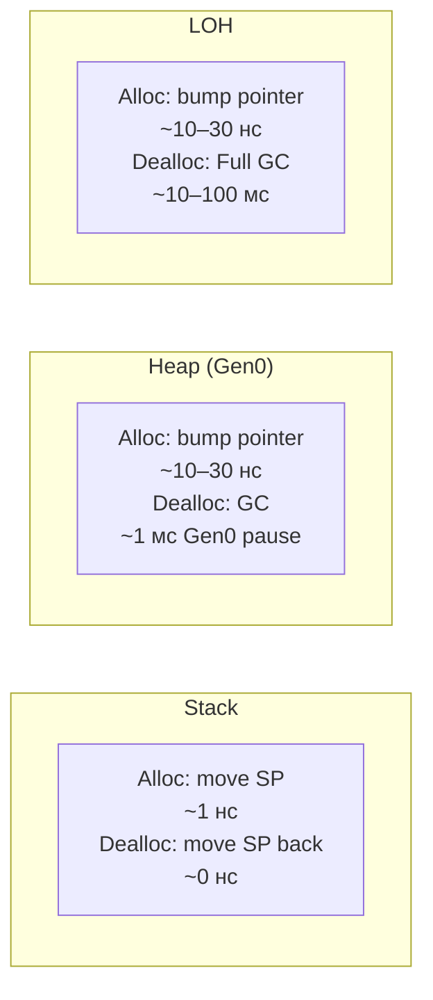

# Stack и Heap

> Два региона памяти с принципиально разной стоимостью аллокации и разным временем жизни данных.

## Содержание
- [Stack](#stack)
- [Stack Frame](#stack-frame)
- [StackOverflowException](#stackoverflowexception)
- [Managed Heap](#managed-heap)
- [Анатомия объекта на heap](#анатомия-объекта-на-heap)
- [Стоимость аллокации](#стоимость-аллокации)
- [Подводные камни](#подводные-камни)
- [См. также](#см-также)

---

## Stack

**Stack** — область памяти, выделяемая каждому потоку при создании. Работает по принципу LIFO: при входе в метод стек растёт, при выходе — сжимается.



| Свойство | Значение |
|----------|----------|
| Размер | ~1 МБ на поток (Windows default) |
| Аллокация | Передвинуть Stack Pointer — **1 инструкция CPU** |
| Деаллокация | Автоматически при выходе из метода (SP назад) |
| Thread safety | Каждый поток — свой стек, нет конкуренции |

---

## Stack Frame

При каждом вызове метода создаётся **stack frame** — блок памяти для:

- Параметров метода (value types — сами данные, reference types — ссылки)
- Локальных переменных (value types inline, reference types — ссылки)
- Адреса возврата (куда вернуться после `ret`)
- Сохранённых регистров CPU

```csharp
void Example()
{
    int local = 42;              // на стеке: 4 байта
    double ratio = 3.14;         // на стеке: 8 байт
    var obj = new MyClass();     // ссылка на стеке: 8 байт (x64)
                                 // сам объект MyClass — на heap
    var point = new Point(1, 2); // struct Point на стеке: inline
}
// При выходе из Example: весь frame исчезает — SP сдвинулся назад
// obj из heap не собирается мгновенно — это работа GC
```

**`stackalloc` — выделение массива на стеке:**

```csharp
// Безопасно только для short-lived, small buffers:
Span<byte> buffer = stackalloc byte[256];
buffer[0] = 42;
// При выходе из метода — автоматически освобождается (не нужен GC)
// Нельзя вернуть из метода! Время жизни ограничено scope
```

---

## StackOverflowException

```csharp
// Классическая причина — бесконечная рекурсия:
void Recurse() => Recurse();
// Каждый вызов: +frame (~50–200 байт)
// ~1 MB / ~100 bytes ≈ ~10 000 вызовов → StackOverflowException

// StackOverflowException НЕЛЬЗЯ поймать через try/catch (с .NET 2.0)
// CLR немедленно завершает процесс
```

**Как обнаружить глубокую рекурсию:**

```csharp
// Проверить текущую глубину стека (приближённо):
RuntimeHelpers.EnsureSufficientExecutionStack(); // бросает InsufficientExecutionStackException
                                                  // если стека мало — можно поймать

// Или явно отслеживать глубину:
void Recurse(int depth)
{
    if (depth > 500) throw new InvalidOperationException("Max recursion depth exceeded");
    Recurse(depth + 1);
}
```

---

## Managed Heap

**Managed Heap** — область памяти для reference-type объектов. Разделена на регионы для эффективной работы GC.



**Allocation Pointer:** GC поддерживает указатель на следующее свободное место в Gen0. Аллокация = сдвиг указателя. Это **очень быстро** — почти как на стеке.

---

## Анатомия объекта на heap

Каждый reference-type объект на heap имеет фиксированный header:



| Часть | Размер | Назначение |
|-------|--------|-----------|
| **Sync Block Index** | 8 байт | `lock`, `GetHashCode` кеш, COM interop |
| **Method Table Pointer** | 8 байт | Ссылка на тип: методы, интерфейсы, размер. Через него GC знает тип, CLR — vtable |
| **Fields** | зависит от типа | Данные объекта. Value-type поля — inline, reference поля — ссылки |

**Минимальный размер объекта** на x64: **24 байта** (16 header + минимум 8 байт для alignment). Даже `new object()` занимает 24 байта.

```csharp
// Пример: class с одним int полем
class Box { public int Value; }
// Layout: SyncBlock(8) + MT*(8) + int(4) + padding(4) = 24 байта

// struct с тем же полем — 4 байта (нет header)
struct BoxStruct { public int Value; }
```

**Method Table** используется для:
- Виртуальных вызовов (vtable dispatch)
- Проверки типа (`is`, `as`, `typeof`)
- Reflection
- GC: определить размер объекта и где в нём ссылки для mark phase

---

## Стоимость аллокации



| Операция | Стоимость | GC Impact |
|----------|-----------|-----------|
| Stack alloc | ~1 нс | Нет |
| Heap alloc (Gen0) | ~10–30 нс | Увеличивает GC pressure |
| GC Gen0 collection | ~1 мс pause | Кратко |
| GC Gen2 / Full GC | ~10–100 мс pause | Заметно |

**Heap-аллокация сама по себе быстрая** (pointer bump). Проблема не в скорости одной аллокации, а в **GC pressure** — чем больше аллоцируешь, тем чаще GC собирает, тем чаще паузы.

**Как снизить GC pressure:**

```csharp
// 1. Struct вместо class для короткоживущих данных:
readonly struct Result { public int Value; public bool IsOk; }

// 2. ArrayPool — переиспользование массивов:
var pool = ArrayPool<byte>.Shared;
byte[] buf = pool.Rent(4096);
try { /* use buf */ }
finally { pool.Return(buf); }

// 3. stackalloc для маленьких временных буферов:
Span<int> temp = stackalloc int[16];

// 4. ObjectPool<T> — переиспользование тяжёлых объектов:
// Microsoft.Extensions.ObjectPool

// 5. ValueTask вместо Task — нет аллокации при синхронном завершении:
async ValueTask<int> GetFromCacheAsync(string key)
{
    if (_cache.TryGetValue(key, out int v)) return v; // нет аллокации
    return await FetchAsync(key);
}
```

---

## Подводные камни

**Closure переносит локальную переменную на heap:**

```csharp
void Example()
{
    int count = 0; // изначально — намерение на стек
    var increment = () => count++; // count ПЕРЕЕЗЖАЕТ в поле класса на heap
    increment();
    Console.WriteLine(count); // 1
}
// Переменные, захваченные лямбдами, ВСЕГДА на heap
```

**Pinning мешает compact phase GC:**

```csharp
fixed (byte* ptr = buffer) // закрепляет объект в памяти
{
    // GC не может переместить buffer пока мы внутри fixed
    // Много pinned объектов → фрагментация SOH
}
// Решение: использовать POH или stackalloc для interop-буферов
```

**LOH-фрагментация:**

```csharp
// Частое создание и выброс больших массивов → дыры в LOH:
for (int i = 0; i < 1000; i++)
{
    var big = new byte[200_000]; // LOH
    ProcessAndDiscard(big);
}
// LOH не компактируется → OutOfMemoryException при фрагментации

// Решение:
var pool = ArrayPool<byte>.Shared;
byte[] big = pool.Rent(200_000); // берём из пула, не из LOH
```

---

## См. также

- [07-gc.md](./07-gc.md) — как GC собирает Gen0/1/2, LOH, POH
- [05-struct-class-record.md](./05-struct-class-record.md) — struct vs class: когда что выгоднее
- [06-boxing.md](./06-boxing.md) — как value type попадает на heap через boxing
