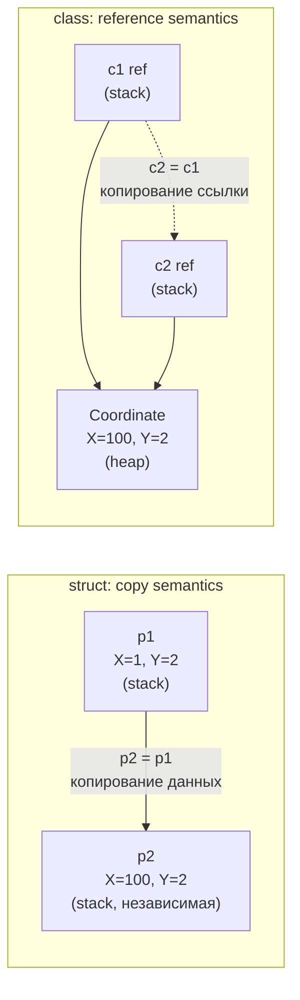
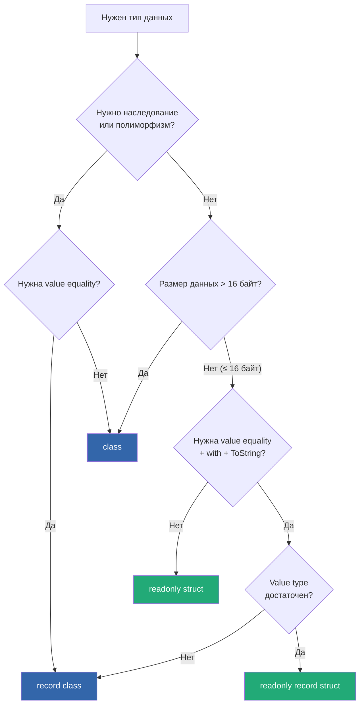

# struct, class, record

> Три способа определить тип данных в C# — выбор влияет на память, семантику копирования и производительность.

## Содержание
- [struct vs class: ключевые отличия](#struct-vs-class-ключевые-отличия)
- [Семантика копирования в деталях](#семантика-копирования-в-деталях)
- [readonly struct](#readonly-struct)
- [ref struct](#ref-struct)
- [record class](#record-class)
- [record struct](#record-struct)
- [Дерево решений](#дерево-решений)
- [Подводные камни](#подводные-камни)
- [См. также](#см-также)

---

## struct vs class: ключевые отличия

| Аспект | struct | class |
|--------|--------|-------|
| Тип | Value type | Reference type |
| Размещение | Stack или inline в родителе | Heap |
| Копирование | Полная копия всех полей | Копия ссылки |
| Default value | Все поля = zero/null/false | null |
| Наследование | Нет (implicitly sealed) | Да |
| Конструктор по умолчанию | Есть (zeroing) | Генерируется компилятором |
| null | Нет (если не Nullable\<T\>) | Да |
| Object header overhead | 0 байт | 16 байт (Sync Block + MT*) |
| Equality по умолчанию | По полям (через Reflection!) | По ссылке (ReferenceEquals) |
| GC | Нет (если на стеке) | Да |

```csharp
public struct Point
{
    public double X;
    public double Y;
    public Point(double x, double y) => (X, Y) = (x, y);
}

public class Coordinate
{
    public double X { get; set; }
    public double Y { get; set; }
    public Coordinate(double x, double y) => (X, Y) = (x, y);
}
```

---

## Семантика копирования в деталях

```csharp
// struct — независимые копии:
var p1 = new Point(1, 2);
var p2 = p1;    // p2 — полная независимая копия
p2.X = 100;
Console.WriteLine(p1.X); // 1 — оригинал не изменился

// class — shared reference:
var c1 = new Coordinate(1, 2);
var c2 = c1;    // c2 указывает на ТОТ ЖЕ объект
c2.X = 100;
Console.WriteLine(c1.X); // 100 — оригинал изменился!
```



**Копирование при передаче в метод:**

```csharp
// struct: метод получает копию — мутации не видны снаружи
void MutateStruct(Point p) { p.X = 999; } // работает с копией

// Если нужна мутация — передавай по ref:
void MutateRef(ref Point p) { p.X = 999; } // работает с оригиналом

// class: метод получает ссылку — мутации видны снаружи
void MutateClass(Coordinate c) { c.X = 999; } // меняет оригинал!
```

---

## readonly struct

`readonly struct` — компилятор гарантирует, что все поля не изменяются после конструктора. Это не просто соглашение — нарушение = ошибка компиляции.

```csharp
public readonly struct Money
{
    public decimal Amount { get; }
    public string Currency { get; }

    public Money(decimal amount, string currency)
    {
        Amount = amount;
        Currency = currency;
    }

    public Money Add(Money other)
    {
        if (Currency != other.Currency)
            throw new InvalidOperationException("Currency mismatch");
        return new Money(Amount + other.Amount, Currency); // новый объект
    }
}
```

**Зачем `readonly` на struct:** без него компилятор делает **defensive copy** при передаче в `in`-параметр или при вызове метода на readonly-ссылке. Это скрытое копирование убивает весь смысл `in`.

```csharp
// Без readonly struct:
struct MutablePoint { public int X; public void Reset() => X = 0; }

void Process(in MutablePoint p)
{
    p.Reset(); // ОШИБКА: нельзя мутировать in-параметр
    // ИЛИ компилятор тихо делает копию и вызывает Reset() на ней
}

// С readonly struct:
readonly struct ImmutablePoint { public int X { get; } ... }
void Process(in ImmutablePoint p) // нет defensive copy — компилятор знает: безопасно
{
    _ = p.X; // прямой доступ без копирования
}
```

---

## ref struct

`ref struct` — struct, которая **не может покинуть стек**. Компилятор запрещает её попадание на heap.

**Ограничения ref struct:**
- Нельзя боксировать (нет `object box = refStruct`)
- Нельзя использовать как поле `class`
- Нельзя использовать в `async` методах (state machine живёт на heap)
- Нельзя использовать в замыканиях/лямбдах
- Нельзя реализовывать интерфейсы (кроме `IDisposable`)

**Главный пример — `Span<T>` и `ReadOnlySpan<T>`:**

```csharp
// Span<T> — ref struct. Ссылается на непрерывный участок памяти:
// 1. Стек (stackalloc)
Span<byte> stackBuf = stackalloc byte[256];

// 2. Heap-массив (без копирования)
int[] arr = { 1, 2, 3, 4, 5 };
Span<int> slice = arr.AsSpan(1, 3); // [2, 3, 4] — без аллокации

// 3. Unmanaged memory
unsafe
{
    byte* ptr = stackalloc byte[64];
    Span<byte> fromPointer = new Span<byte>(ptr, 64);
}

// Работа со строками без аллокации:
ReadOnlySpan<char> hello = "Hello, World!".AsSpan(0, 5); // "Hello"
Console.WriteLine(hello.SequenceEqual("Hello")); // true — 0 аллокаций
```

**Собственный ref struct:**

```csharp
public ref struct JsonParser
{
    private ReadOnlySpan<char> _remaining;
    private int _position;

    public JsonParser(ReadOnlySpan<char> json)
    {
        _remaining = json;
        _position = 0;
    }

    public bool TryReadString(out ReadOnlySpan<char> value) { ... }
}
// JsonParser нельзя хранить в поле класса или передать в async-метод
```

---

## record class

`record` (C# 9) — синтаксический сахар над `class` с автогенерацией value-based equality, `ToString`, `with`-expression и деконструкции.

```csharp
// Positional record — компактный синтаксис:
public record User(string Name, int Age);

// Эквивалентно (примерно) следующему классу:
public class User : IEquatable<User>
{
    public string Name { get; init; }
    public int Age { get; init; }

    public User(string name, int age) { Name = name; Age = age; }

    // Автогенерация:
    public bool Equals(User? other) => other != null && Name == other.Name && Age == other.Age;
    public override bool Equals(object? obj) => obj is User u && Equals(u);
    public override int GetHashCode() => HashCode.Combine(Name, Age);
    public override string ToString() => $"User {{ Name = {Name}, Age = {Age} }}";

    // Deconstruct:
    public void Deconstruct(out string name, out int age) { name = Name; age = Age; }
}
```

**Использование:**

```csharp
var u1 = new User("Alice", 30);
var u2 = new User("Alice", 30);
Console.WriteLine(u1 == u2);   // True (value equality)
Console.WriteLine(u1);         // User { Name = Alice, Age = 30 }

// with-expression — non-destructive mutation:
var u3 = u1 with { Age = 31 };
Console.WriteLine(u1.Age);     // 30 (оригинал не изменился)
Console.WriteLine(u3.Age);     // 31 (новый объект)

// Pattern matching:
var (name, age) = u1;  // Deconstruct
Console.WriteLine(name); // "Alice"
```

**Наследование record:**

```csharp
public record Person(string Name);
public record Employee(string Name, string Department) : Person(Name);

var emp = new Employee("Bob", "Engineering");
Console.WriteLine(emp); // Employee { Name = Bob, Department = Engineering }

// Equals учитывает конкретный тип:
Person p = new Person("Bob");
Person e = new Employee("Bob", "Engineering");
Console.WriteLine(p == e); // False — разные типы!
```

---

## record struct

`record struct` (C# 10) — то же, что `record class`, но value type.

```csharp
public record struct Point(double X, double Y);

var p1 = new Point(1, 2);
var p2 = new Point(1, 2);
Console.WriteLine(p1 == p2); // True

// По умолчанию МУТАБЕЛЬНЫЙ (в отличие от record class):
var p3 = p1;
p3.X = 99; // OK! struct — копия

// Immutable record struct:
public readonly record struct ImmutablePoint(double X, double Y);
```

**record class vs record struct:**

| | record class | record struct |
|---|---|---|
| Тип | Reference (heap) | Value (stack) |
| Мутабельность | Immutable (init) по умолчанию | Mutable по умолчанию |
| Наследование | Да | Нет |
| null | Да | Нет |
| Overhead | 16 байт header | 0 байт |

---

## Дерево решений



**Правило Microsoft для struct:** используй struct, если тип:
1. Логически представляет единичное значение (`Point`, `Money`, `Color`)
2. Размер <= 16 байт
3. Иммутабельный (или мутабельность явно нужна)
4. Не будет часто боксироваться (не передаётся как `object` или интерфейс)

---

## Подводные камни

**Мутабельный struct в коллекции — тихий баг:**

```csharp
public struct Counter { public int Value; public void Increment() => Value++; }

var list = new List<Counter> { new Counter { Value = 1 } };

// Компилятор ЗАПРЕЩАЕТ: list[0].Increment()
// list[0] возвращает копию — инкремент на копии, список не изменился бы

// Правильно: заменить элемент целиком
var temp = list[0];
temp.Increment();
list[0] = temp;
```

**Большой struct при передаче копируется полностью:**

```csharp
// struct из 10 int = 40 байт. При каждой передаче — 40 байт копируются
public struct BigStruct { public int F1, F2, F3, F4, F5, F6, F7, F8, F9, F10; }

void Process(BigStruct s) { ... }      // 40 байт копируются
void ProcessRef(in BigStruct s) { ... } // 8 байт (ссылка) — быстрее
```

**record class — shallow copy в `with`:**

```csharp
public record Container(List<int> Items);

var c1 = new Container(new List<int> { 1, 2, 3 });
var c2 = c1 with { };   // shallow copy! c2.Items — та же ссылка
c2.Items.Add(4);
Console.WriteLine(c1.Items.Count); // 4 — оба изменились!
```

---

## См. также

- [02-value-reference-types.md](./02-value-reference-types.md) — фундаментальная разница value/reference
- [06-boxing.md](./06-boxing.md) — как struct попадает на heap через boxing
- [04-stack-heap.md](./04-stack-heap.md) — где физически размещаются struct и class
