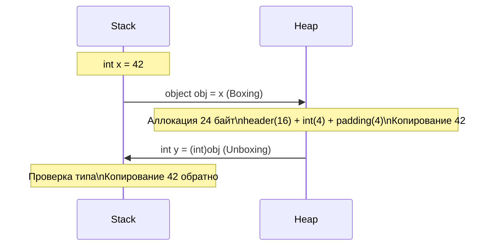
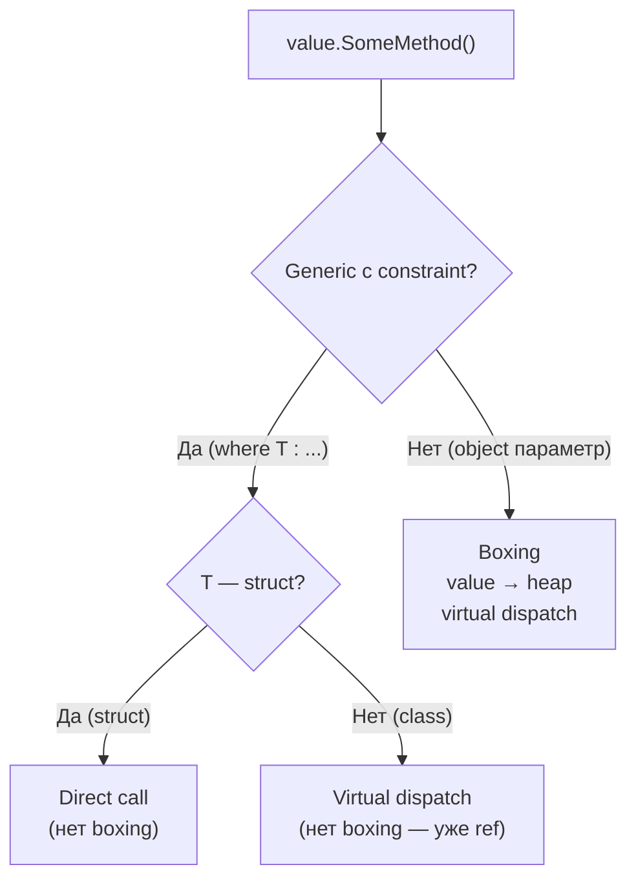

# Boxing и Unboxing

> Скрытая аллокация, которая убивает производительность в горячем пути — важно знать где возникает неявно.

## Содержание
- [Механика](#механика)
- [Стоимость](#стоимость)
- [Неявный boxing](#неявный-boxing)
- [Constrained call](#constrained-call)
- [Как избежать](#как-избежать)
- [Подводные камни](#подводные-камни)
- [См. также](#см-также)

---

## Механика

**Boxing** — преобразование value type в `object` (или интерфейс). CLR:
1. Аллоцирует объект на heap (24+ байта)
2. Копирует данные value type в этот объект
3. Возвращает ссылку на heap-объект

**Unboxing** — обратное преобразование. CLR:
1. Проверяет тип объекта (если не совпадает — `InvalidCastException`)
2. Копирует данные из heap-объекта обратно в value type



```csharp
int value = 42;

// Boxing (явный):
object boxed = value;       // аллокация на heap + копирование

// Unboxing (явный, требует cast):
int unboxed = (int)boxed;   // проверка типа + копирование

// Unboxing в неправильный тип — исключение:
// long wrong = (long)boxed;     // InvalidCastException!
long correct = (long)(int)boxed; // сначала unbox в int, потом widening cast

// Boxing создаёт НЕЗАВИСИМУЮ копию:
int original = 42;
object box = original;
original = 100;
Console.WriteLine((int)box); // 42 — box не изменился
```

---

## Стоимость

| Операция | Стоимость | Причина |
|----------|-----------|---------|
| Boxing | ~20–30 нс | Heap-аллокация + копирование |
| Unboxing | ~5–10 нс | Проверка типа + копирование |
| GC pressure | × каждый boxing | Объект на heap → GC должен его собрать |

Boxing в горячем пути (цикл 1M итераций) — сотни миллисекунд дополнительно.

```csharp
// Benchmark: 1 million boxing operations
// vs generic — разница ~10–50x по времени и ~0 vs ~40 MB аллокаций

// МЕДЛЕННО:
var list = new ArrayList();
for (int i = 0; i < 1_000_000; i++)
    list.Add(i); // boxing на каждой итерации

// БЫСТРО:
var list = new List<int>();
for (int i = 0; i < 1_000_000; i++)
    list.Add(i); // нет boxing
```

---

## Неявный boxing

Опасен тем, что не виден в коде. Основные источники:

**1. Присвоение к `object` или интерфейсу:**

```csharp
int x = 42;
object obj = x;              // BOXING
IComparable comp = x;        // BOXING (int → интерфейс = ref type)
IFormattable fmt = x;        // BOXING
```

**2. Вызов виртуального метода, не переопределённого в struct:**

```csharp
struct BadStruct
{
    public int Value;
    // GetHashCode() и Equals(object) НЕ переопределены
}

var s = new BadStruct { Value = 1 };
int hash = s.GetHashCode(); // BOXING! Вызов через ValueType.GetHashCode()
                            // Нужен объект на heap для dispatch через vtable
```

**3. Non-generic коллекции (legacy код):**

```csharp
var dict = new Hashtable();
dict[1] = "one";              // key=1 → BOXING
int key = (int)dict.Keys.Cast<object>().First(); // UNBOXING

// Замена:
var dict = new Dictionary<int, string>(); // нет boxing
```

**4. String concatenation с value type:**

```csharp
int count = 42;
string msg = "Count: " + count;  // count боксируется в object для string.Concat
// Fix:
string msg = $"Count: {count}";  // .NET 6+ оптимизирует через handler, нет boxing
string msg = "Count: " + count.ToString(); // явный ToString, нет boxing
```

**5. `params object[]`:**

```csharp
// Console.WriteLine(string format, params object[] args) — старая перегрузка
Console.WriteLine("Value: {0}", 42); // 42 боксируется в object[]

// Современные перегрузки с generics решают это:
// Console.WriteLine($"Value: {42}"); // нет boxing
```

**6. Delegate и лямбды с value type closure:**

```csharp
int counter = 0;
Func<int> getCount = () => counter; // counter захватывается в поле класса (heap)
                                    // не boxing, но аллокация closure-класса
```

---

## Constrained call

JIT генерирует специальную IL инструкцию `constrained.` для вызовов методов на generic параметрах с constraint. Это позволяет **избежать boxing** при вызове виртуального метода через интерфейс.

```csharp
// Без constraint — boxing:
void Print(object obj) => Console.WriteLine(obj.ToString()); // если obj — value type → boxing

// С generic constraint — constrained call, нет boxing:
void Print<T>(T value) => Console.WriteLine(value.ToString());
// JIT генерирует constrained call instruction
// Для struct: прямой вызов ToString() без boxing
// Для class: обычный virtual dispatch

// IEquatable<T> constraint:
void Compare<T>(T a, T b) where T : IEquatable<T>
{
    a.Equals(b); // constrained call → если T = struct, нет boxing
}
```



---

## Как избежать

**1. Generics вместо object:**

```csharp
// ПЛОХО:
void Store(object value) { _list.Add(value); } // boxing при передаче struct

// ХОРОШО:
void Store<T>(T value) { _list.Add(value); }   // нет boxing (List<T> generic)
```

**2. Переопределяй `Equals`, `GetHashCode`, `ToString` в struct:**

```csharp
public readonly struct Point : IEquatable<Point>
{
    public double X { get; }
    public double Y { get; }

    public Point(double x, double y) => (X, Y) = (x, y);

    // Без этого: s.Equals(obj) → boxing через ValueType.Equals
    public bool Equals(Point other) => X == other.X && Y == other.Y;
    public override bool Equals(object? obj) => obj is Point p && Equals(p);
    public override int GetHashCode() => HashCode.Combine(X, Y);
    public override string ToString() => $"({X}, {Y})";

    public static bool operator ==(Point a, Point b) => a.Equals(b);
    public static bool operator !=(Point a, Point b) => !a.Equals(b);
}
```

**3. Generic constraints для interface-dispatch:**

```csharp
// Сортировка без boxing:
void Sort<T>(T[] arr) where T : IComparable<T>
{
    // arr[i].CompareTo(arr[j]) — constrained call, нет boxing
}

// Dictionary с struct key — нужен IEquatable<T>:
// Если Point реализует IEquatable<Point>, Dictionary<Point, V> не боксирует при lookup
```

**4. `Span<T>` вместо array boxing:**

```csharp
// Метод принимает IEnumerable<int> — boxing возможен при передаче int[]:
void Process(IEnumerable<int> items) { ... }

// Лучше для массивов:
void Process(ReadOnlySpan<int> items) { ... }
// Вызов: Process(new[] { 1, 2, 3 }) или Process(stackalloc int[] { 1, 2, 3 })
```

---

## Подводные камни

**Unboxing требует точный тип:**

```csharp
int x = 42;
object boxed = x;

// Попытка unbox в совместимый, но не точный тип:
// long wrong = (long)boxed;  // InvalidCastException!

// Правильно: сначала unbox в точный тип, потом преобразование:
long correct = (long)(int)boxed;

// То же с nullable:
int? nullable = 42;
object boxedNullable = nullable; // боксируется как int (42), не Nullable<int>
int back = (int)boxedNullable;   // OK
```

**Boxing в Dictionary key:**

```csharp
// Если struct не реализует IEquatable<T> — Dictionary боксирует при каждом lookup:
struct BadKey { public int Id; } // нет IEquatable<BadKey>

var dict = new Dictionary<BadKey, string>(); // каждый TryGetValue → boxing!

// Fix: добавить IEquatable<T>
readonly struct GoodKey : IEquatable<GoodKey>
{
    public int Id { get; }
    public bool Equals(GoodKey other) => Id == other.Id;
    public override int GetHashCode() => Id.GetHashCode();
}
```

**LINQ с value types:**

```csharp
int[] numbers = { 1, 2, 3 };

// OK — LINQ generic, нет boxing:
var evens = numbers.Where(n => n % 2 == 0);

// Boxing: приведение к non-generic interface:
IEnumerable nonGeneric = numbers; // boxing при итерации через non-generic foreach
```

---

## См. также

- [02-value-reference-types.md](./02-value-reference-types.md) — value vs reference: почему boxing происходит
- [04-stack-heap.md](./04-stack-heap.md) — heap аллокация и GC pressure
- [05-struct-class-record.md](./05-struct-class-record.md) — когда использовать struct
