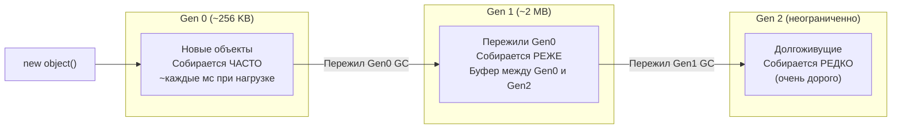
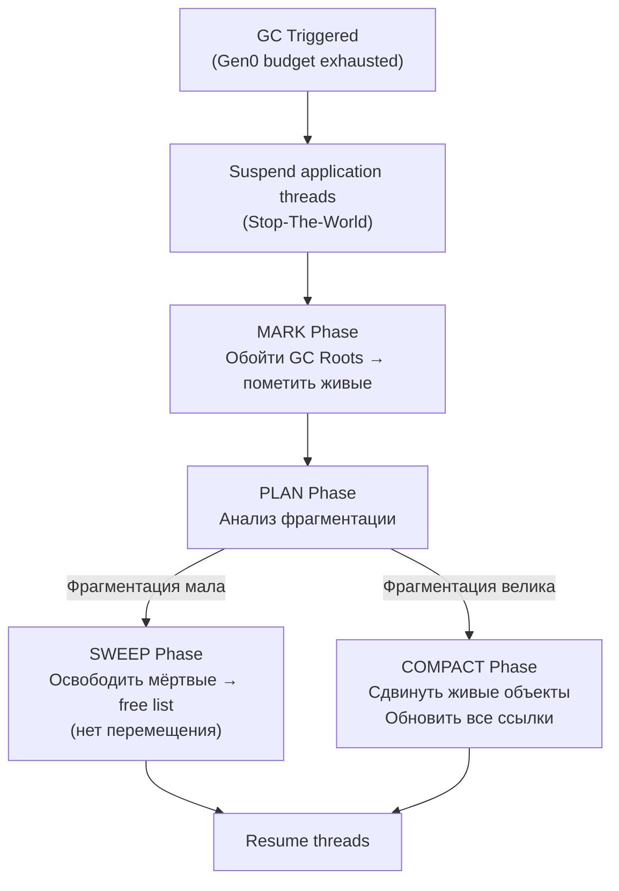
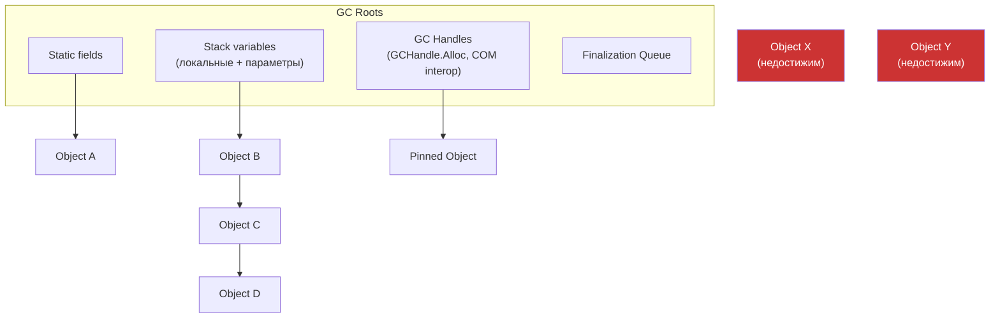
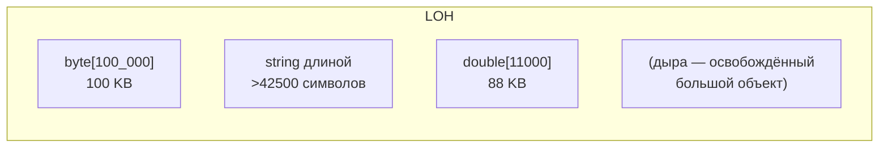
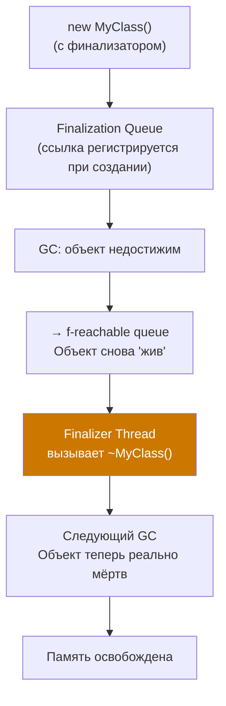

# Garbage Collector

> GC освобождает программиста от ручного управления памятью, но его паузы — реальная причина latency-проблем в production.

## Содержание
- [Зачем нужен GC](#зачем-нужен-gc)
- [Поколения](#поколения)
- [Фазы сборки](#фазы-сборки)
- [GC Roots](#gc-roots)
- [Memory Leaks в managed коде](#memory-leaks-в-managed-коде)
- [Workstation vs Server GC](#workstation-vs-server-gc)
- [LOH и POH](#loh-и-poh)
- [Finalization](#finalization)
- [Диагностика](#диагностика)
- [Подводные камни](#подводные-камни)
- [См. также](#см-также)

---

## Зачем нужен GC

Ручное управление памятью (C/C++) — источник целого класса ошибок:

| Ошибка | Описание |
|--------|----------|
| Memory leak | Забыли вызвать `free()` — память растёт |
| Use-after-free | Обратились к памяти после `free()` — UB/crash |
| Double free | Вызвали `free()` дважды — heap corruption |
| Dangling pointer | Ссылка на освобождённую память |

**GC-решение:** программист только аллоцирует (`new`). GC определяет, какие объекты недостижимы, и освобождает их. Компромисс: CPU time на сборку + паузы, но устраняет целые классы ошибок.

---

## Поколения

**Generational hypothesis:** большинство объектов умирают молодыми. Небольшое меньшинство — долгожители.



**Почему поколения эффективны:** Gen0 collection сканирует только ~256 KB — это быстро. Большинство мусора умирает в Gen0. Gen2 сканируется редко, хотя он большой.

**Когда запускается GC:**
- Gen0: бюджет Gen0 исчерпан (allocation pointer достиг лимита)
- Gen1/Gen2: после нескольких Gen0 collections по эвристике
- Full GC: нехватка памяти, `GC.Collect()`, OS memory pressure

---

## Фазы сборки



**Mark Phase:**
- Начинает с GC Roots (стек, статические поля, GC handles)
- Обходит граф объектов в глубину
- Помечает каждый достижимый объект
- Непомеченные — мусор

**Sweep vs Compact:**
- Sweep: быстрее, но оставляет дыры (free list) → фрагментация
- Compact: медленнее, но устраняет фрагментацию, улучшает cache locality

**Background GC (Concurrent GC):**

Gen2 collection может выполняться в фоне — Mark Phase идёт параллельно с application threads. Write Barrier отслеживает изменения ссылок во время background mark. Короткая STW-пауза нужна только в финале (sweep/compact).

```
Foreground thread: ──────────────── работает ────────────────────────
Background GC:     ─── mark (concurrent) ──── STW ─── sweep ─── done
```

---

## GC Roots

GC начинает mark phase с **GC Roots** — множества ссылок, которые всегда считаются живыми.



Объект жив, если существует **хотя бы один путь** от GC Root до него. Если путей нет — объект собирается.

---

## Memory Leaks в managed коде

Managed код не защищён от утечек — GC собирает только **недостижимые** объекты. Утечки возникают, когда объекты **достижимы, но бесполезны**.

**1. Static fields — живут всё время приложения:**

```csharp
public static class Cache
{
    private static readonly Dictionary<string, byte[]> _data = new();

    public static void Add(string key, byte[] value)
        => _data[key] = value; // никогда не очищается
}
```

**2. Event handlers — publisher удерживает subscriber:**

```csharp
// УТЕЧКА: Form подписывается, но publisher живёт дольше
button.Click += OnButtonClick; // button держит ссылку на this
// Если button не собирается — Form не собирается, даже если она "закрыта"

// FIX: отписываться при dispose
public void Dispose() => button.Click -= OnButtonClick;
```

**3. Closure захватывает переменные:**

```csharp
public IEnumerable<Action> Create()
{
    var actions = new List<Action>();
    for (int i = 0; i < 10; i++)
    {
        actions.Add(() => Console.WriteLine(i)); // захватывает переменную i
    }
    // После выхода из Create: список actions удерживает closure-класс,
    // который удерживает captured переменную
    return actions;
}
```

**4. ConcurrentDictionary / Cache без вытеснения:**

```csharp
// Растёт без предела:
private static ConcurrentDictionary<Guid, UserSession> _sessions = new();

// FIX: MemoryCache с expiration или явная очистка
```

---

## Workstation vs Server GC

| Аспект | Workstation GC | Server GC |
|--------|---------------|-----------|
| Потоки GC | 1 | По 1 на логический процессор |
| Heaps | 1 managed heap | По 1 heap на процессор |
| Паузы | Короче (меньший heap) | Длиннее, но throughput выше |
| Memory footprint | Меньше | Больше |
| Использование | Desktop, UI | ASP.NET Core, серверы |

```xml
<!-- .csproj / runtimeconfig.json -->
<PropertyGroup>
  <ServerGarbageCollection>true</ServerGarbageCollection>
  <!-- Опционально: ограничить потребление памяти -->
  <GarbageCollectionAdaptationMode>0</GarbageCollectionAdaptationMode>
</PropertyGroup>
```

**Server GC в ASP.NET Core** включён по умолчанию. Каждое ядро обрабатывает свой heap параллельно — throughput выше, но при Full GC паузы на всех heaps одновременно.

**DATAS (Dynamic Adaptation To Application Sizes, .NET 8+):** GC автоматически подстраивает количество heaps и их размер под нагрузку. Снижает memory footprint при низкой нагрузке.

---

## LOH и POH

**LOH (Large Object Heap):**



- Объекты **>= 85 000 байт** попадают в LOH (почти всегда большие массивы)
- **Не компактируется** по умолчанию (перемещать гигабайтный массив — дорого)
- Собирается только при **Full GC (Gen2)** — редко и дорого
- Фрагментируется → `OutOfMemoryException` при свободной памяти в куче

```csharp
// Включить компактировку LOH разово:
GCSettings.LargeObjectHeapCompactionMode = GCLargeObjectHeapCompactionMode.CompactOnce;
GC.Collect(); // следующий GC сделает compact

// Лучший вариант — использовать ArrayPool:
var pool = ArrayPool<byte>.Shared;
byte[] buffer = pool.Rent(200_000);
try { /* use */ }
finally { pool.Return(buffer); }
// Массив переиспользуется — нет постоянных LOH-аллокаций
```

**POH (Pinned Object Heap, .NET 5+):**
- Для объектов, которые нужно pin'ить (interop, async I/O)
- Изолирует их от SOH — SOH не фрагментируется

```csharp
// Аллокация на POH (не LOH, не SOH):
byte[] ioBuffer = GC.AllocateArray<byte>(4096, pinned: true);
// Безопасно передавать в native код — GC не переместит
```

---

## Finalization

**Финализатор** (`~ClassName()`) вызывается GC перед освобождением объекта. Нужен только для unmanaged ресурсов.



**Последствия финализатора:**
1. Объект живёт минимум **на одно поколение дольше**
2. **Один** Finalizer Thread на весь процесс — медленный финализатор блокирует всё
3. Порядок финализации **не определён** — нельзя обращаться к другим finalizable-объектам
4. При `Environment.Exit()` финализаторы **не гарантированы**

**Правило:** финализаторы нужны **крайне редко**. Используй `SafeHandle` или `IDisposable`.

---

## Диагностика

```csharp
// Статистика GC:
Console.WriteLine($"Gen0 collections: {GC.CollectionCount(0)}");
Console.WriteLine($"Gen1 collections: {GC.CollectionCount(1)}");
Console.WriteLine($"Gen2 collections: {GC.CollectionCount(2)}");

GCMemoryInfo info = GC.GetGCMemoryInfo();
Console.WriteLine($"Heap: {info.HeapSizeBytes / 1024 / 1024} MB");
Console.WriteLine($"Fragmented: {info.FragmentedBytes / 1024} KB");

// Поколение конкретного объекта:
var obj = new object();
Console.WriteLine(GC.GetGeneration(obj)); // 0
```

**CLI-инструменты:**

```bash
# Real-time GC метрики (без перезапуска приложения):
dotnet-counters monitor --process-id <PID> System.Runtime

# GC-специфичный dump для анализа:
dotnet-gcdump collect --process-id <PID>

# Heap dump (полный):
dotnet-dump collect --process-id <PID>

# Анализ dump:
dotnet-dump analyze <dump-file>
> dumpheap -stat                  # статистика по типам
> dumpheap -type MyLeakingType    # найти все экземпляры
> gcroot <object-address>         # найти цепочку root → object
```

**PerfView** — глубокий анализ GC pauses, allocation hotspots. Показывает дерево аллокаций с callstack.

---

## Подводные камни

**`GC.Collect()` в production — почти всегда ошибка:**

```csharp
// НЕ ДЕЛАЙ ТАК:
public void ProcessRequest()
{
    DoWork();
    GC.Collect();              // нарушает эвристику GC
    GC.WaitForPendingFinalizers(); // блокирует поток
    GC.Collect();              // вторая сборка после финализаторов
}
// Результат: паузы в неподходящий момент, хуже throughput
```

**Pinned objects фрагментируют SOH:**

```csharp
// Много fixed/GCHandle → дыры в SOH → медленнее compact
fixed (byte* ptr = buffer) { NativeMethod(ptr, buffer.Length); }

// Лучше: POH или stackalloc для short-lived buffers
byte[] ioBuffer = GC.AllocateArray<byte>(4096, pinned: true); // POH
```

**Gen2 promoted объекты из-за неочевидных ссылок:**

```csharp
// Долгоживущий объект держит ссылку на короткоживущий → оба в Gen2:
class Service
{
    private readonly List<Request> _requestHistory = new(); // растёт вечно

    public void Handle(Request req)
    {
        _requestHistory.Add(req); // req promoted в Gen2 через _requestHistory
    }
}
```

---

## См. также

- [04-stack-heap.md](./04-stack-heap.md) — устройство heap: поколения, LOH, POH
- [08-finalization-dispose.md](./08-finalization-dispose.md) — IDisposable, Finalize, SafeHandle
- [06-boxing.md](./06-boxing.md) — boxing увеличивает GC pressure
