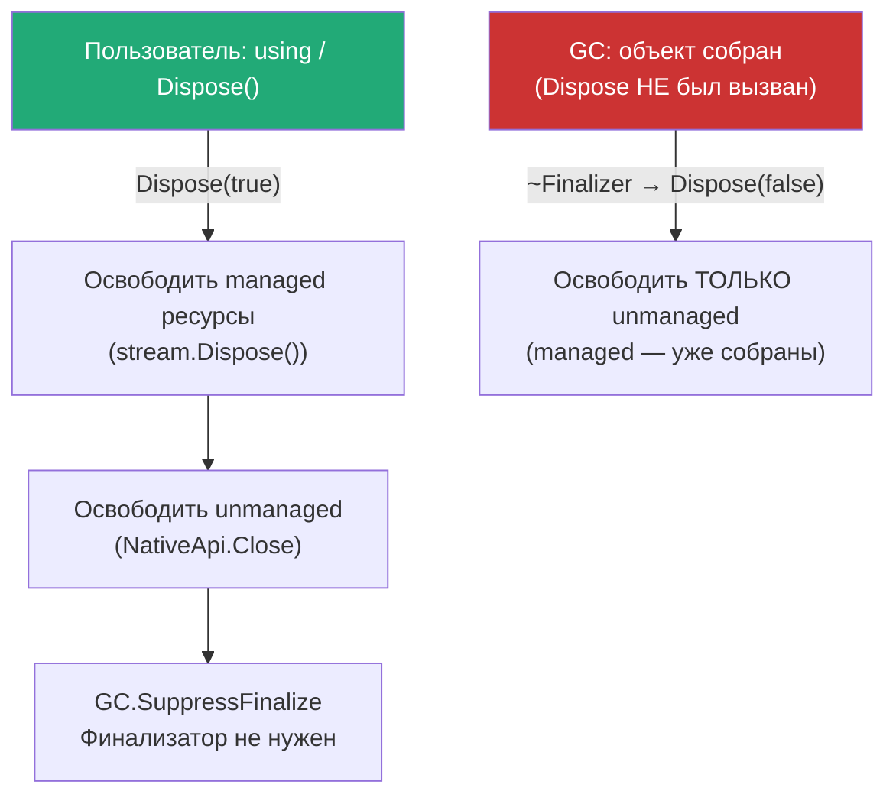
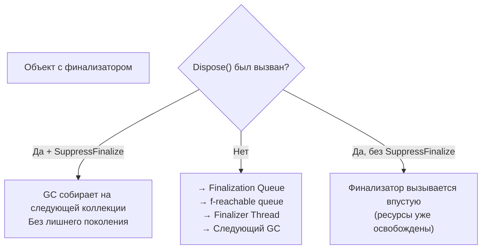

# Finalization и IDisposable

> GC управляет памятью, но не умеет закрывать файлы и соединения — для этого нужен явный Dispose.

## Содержание
- [Зачем нужен Dispose](#зачем-нужен-dispose)
- [using statement и declaration](#using-statement-и-declaration)
- [Полный Dispose-паттерн](#полный-dispose-паттерн)
- [GC.SuppressFinalize](#gcsuppressfinalize)
- [IAsyncDisposable](#iasyncdisposable)
- [SafeHandle](#safehandle)
- [Подводные камни](#подводные-камни)
- [См. также](#см-также)

---

## Зачем нужен Dispose

**GC управляет управляемой памятью.** Всё остальное он не знает как освободить:

| Ресурс | Пример | Что происходит без Dispose |
|--------|--------|--------------------------|
| Файловые дескрипторы | `FileStream` | Файл заблокирован до финализации |
| Сетевые сокеты | `Socket`, `TcpClient` | Порт занят, соединение не закрыто |
| DB connections | `SqlConnection` | Соединение не вернулось в пул → пул исчерпан |
| Unmanaged memory | `Marshal.AllocHGlobal` | Утечка native памяти |
| OS handles | `Mutex`, `FileSystemWatcher` | Kernel objects не освобождены |
| Crypto objects | `Aes`, `SHA256` | Secure memory не очищена |

```csharp
public interface IDisposable
{
    void Dispose();
}
```

`IDisposable` — контракт: «у меня есть ресурсы, освободи их явно когда закончишь».

---

## using statement и declaration

`using` — синтаксический сахар: гарантирует вызов `Dispose()` даже при исключении.

```csharp
// using statement (C# 1.0+):
using (var stream = new FileStream("data.txt", FileMode.Open))
using (var reader = new StreamReader(stream))
{
    string content = reader.ReadToEnd();
} // reader.Dispose(), потом stream.Dispose() — в обратном порядке

// Компилятор генерирует:
FileStream stream = new FileStream("data.txt", FileMode.Open);
try
{
    StreamReader reader = new StreamReader(stream);
    try { /* работаем */ }
    finally { reader?.Dispose(); }
}
finally { stream?.Dispose(); }

// using declaration (C# 8+) — Dispose в конце scope:
void Process()
{
    using var stream = new FileStream("data.txt", FileMode.Open);
    using var reader = new StreamReader(stream);
    var content = reader.ReadToEnd();
    // Dispose вызывается при выходе из метода
    // Порядок: reader.Dispose(), stream.Dispose()
}
```

**`using` применим к любому типу с методом `Dispose()`** — не обязательно реализующему `IDisposable` (duck typing для using в C# 8+).

---

## Полный Dispose-паттерн

Используется когда класс **напрямую** держит unmanaged ресурсы (IntPtr, native handle). Если только managed ресурсы — упрощённый вариант без финализатора.

```csharp
/// <summary>
/// Demonstrates the complete Dispose pattern.
/// Use when the class directly wraps unmanaged resources.
/// For managed-only resources, omit the finalizer.
/// </summary>
public class ResourceHolder : IDisposable
{
    private IntPtr _nativeHandle;   // unmanaged
    private FileStream? _stream;    // managed disposable
    private bool _disposed;

    public ResourceHolder()
    {
        _nativeHandle = NativeApi.Create();
        _stream = new FileStream("log.txt", FileMode.Create);
    }

    public void Dispose()
    {
        Dispose(disposing: true);
        GC.SuppressFinalize(this);   // финализатор больше не нужен
    }

    protected virtual void Dispose(bool disposing)
    {
        if (_disposed) return;

        if (disposing)
        {
            // Managed ресурсы — только если вызвано из Dispose(),
            // не из финализатора (managed объекты могут быть уже собраны)
            _stream?.Dispose();
            _stream = null;
        }

        // Unmanaged ресурсы — всегда (и из Dispose, и из финализатора)
        if (_nativeHandle != IntPtr.Zero)
        {
            NativeApi.Close(_nativeHandle);
            _nativeHandle = IntPtr.Zero;
        }

        _disposed = true;
    }

    ~ResourceHolder()
    {
        Dispose(disposing: false); // safety net
    }

    // Защита от использования после Dispose:
    private void ThrowIfDisposed()
    {
        ObjectDisposedException.ThrowIf(_disposed, this);
    }
}
```



**Упрощённый паттерн (только managed ресурсы):**

```csharp
// Нет unmanaged → нет финализатора
public class ManagedOnlyHolder : IDisposable
{
    private SqlConnection? _connection;
    private bool _disposed;

    public void Dispose()
    {
        if (_disposed) return;
        _connection?.Dispose();
        _connection = null;
        _disposed = true;
    }
}
```

---

## GC.SuppressFinalize

**Зачем:** если `Dispose()` вызван — ресурсы освобождены. Без `SuppressFinalize` объект всё равно попадёт в finalization queue, проживёт лишнее поколение GC, и Finalizer Thread будет делать бесполезную работу.

```csharp
public void Dispose()
{
    Dispose(true);
    GC.SuppressFinalize(this); // говорит GC: финализатор для этого объекта не нужен
}
```



---

## IAsyncDisposable

Когда освобождение ресурса само по себе асинхронное (flush + close для network stream, flush DB transaction).

```csharp
public interface IAsyncDisposable
{
    ValueTask DisposeAsync();
}

// await using — асинхронный Dispose:
await using var conn = new SqlConnection(connectionString);
await conn.OpenAsync();
// ... работаем ...
// conn.DisposeAsync() вызывается при выходе

// Реализация обоих интерфейсов:
public class AsyncResource : IAsyncDisposable, IDisposable
{
    private Stream? _stream;
    private bool _disposed;

    public async ValueTask DisposeAsync()
    {
        if (_disposed) return;
        if (_stream != null)
        {
            await _stream.FlushAsync();    // асинхронный flush
            await _stream.DisposeAsync(); // асинхронный close
            _stream = null;
        }
        _disposed = true;
        GC.SuppressFinalize(this);
    }

    public void Dispose()
    {
        if (_disposed) return;
        _stream?.Dispose(); // синхронный fallback
        _stream = null;
        _disposed = true;
        GC.SuppressFinalize(this);
    }
}
```

**Когда реализовывать оба:** если тип может использоваться как в async, так и в sync контексте. Sync `Dispose()` — синхронный fallback.

---

## SafeHandle

`SafeHandle` — лучшая альтернатива голому `IntPtr` с финализатором. Наследуется от `CriticalFinalizerObject`.

**Гарантии SafeHandle:**
1. Финализатор вызывается **обязательно** (даже при `ThreadAbortException`, stack overflow recovery)
2. Финализатор выполняется **после** обычных финализаторов
3. Нет двойного закрытия — reference counting
4. Атомарное присвоение: handle не «утечёт» между P/Invoke и присвоением переменной

```csharp
// Кастомный SafeHandle:
public sealed class FileHandle : SafeHandleZeroOrMinusOneIsInvalid
{
    public FileHandle() : base(ownsHandle: true) { }

    // ownsHandle = false если мы не владеем хендлом (не должны закрывать)
    public FileHandle(IntPtr handle, bool owns) : base(owns)
    {
        SetHandle(handle);
    }

    protected override bool ReleaseHandle()
    {
        return NativeApi.CloseFile(handle); // вернуть true если успешно
    }
}

// Использование с P/Invoke:
[DllImport("kernel32.dll", SetLastError = true)]
static extern FileHandle CreateFile(string path, ...);

public class NativeFileReader : IDisposable
{
    private FileHandle _handle;

    public NativeFileReader(string path)
    {
        _handle = CreateFile(path, ...);
        if (_handle.IsInvalid)
            throw new Win32Exception(Marshal.GetLastWin32Error());
    }

    public void Dispose()
    {
        _handle.Dispose(); // SafeHandle управляет своим финализатором
        // НЕ нужен свой финализатор!
    }
}
```

**Сравнение подходов:**

| Подход | Когда использовать |
|--------|-------------------|
| `IDisposable` (managed only) | Только managed ресурсы (DB connection, stream) |
| `IDisposable` + финализатор | Прямой `IntPtr` без SafeHandle (legacy код) |
| `SafeHandle` | Любой native OS handle (предпочтительно) |

---

## Подводные камни

**Dispose дважды не должен бросать исключение:**

```csharp
// IDisposable contract: повторный Dispose — безопасен
public void Dispose()
{
    if (_disposed) return; // идемпотентность
    // ...
    _disposed = true;
}
```

**Использование объекта после Dispose:**

```csharp
var stream = new FileStream("data.txt", FileMode.Open);
stream.Dispose();
stream.Read(buffer, 0, 10); // ObjectDisposedException

// Паттерн защиты:
private void EnsureNotDisposed()
{
    ObjectDisposedException.ThrowIf(_disposed, nameof(MyClass));
}
```

**Dispose в финализаторе не должен трогать managed объекты:**

```csharp
~MyClass()
{
    Dispose(disposing: false); // disposing = false!
    // Внутри: НЕ вызывать _managedObj.Dispose()
    // _managedObj может быть уже собран GC (или находиться в f-reachable queue)
}
```

**`using` не поймает исключение в конструкторе:**

```csharp
// Если конструктор бросил исключение — Dispose НЕ будет вызван:
using var conn = new SqlConnection("bad connection string"); // exception здесь
// conn.Dispose() не вызывается — объект не создан

// Но если исключение после создания:
SqlConnection? conn = null;
try
{
    conn = new SqlConnection(cs);
    conn.Open(); // может бросить
    // работаем
}
finally
{
    conn?.Dispose(); // безопасно: null-conditional
}
```

---

## См. также

- [07-gc.md](./07-gc.md) — как работает finalization queue, GC поколения
- [05-struct-class-record.md](./05-struct-class-record.md) — struct не нуждается в Dispose
