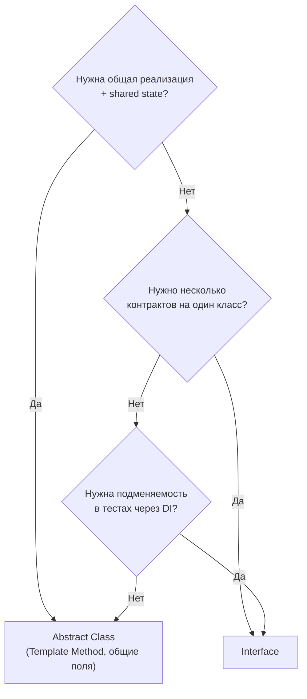
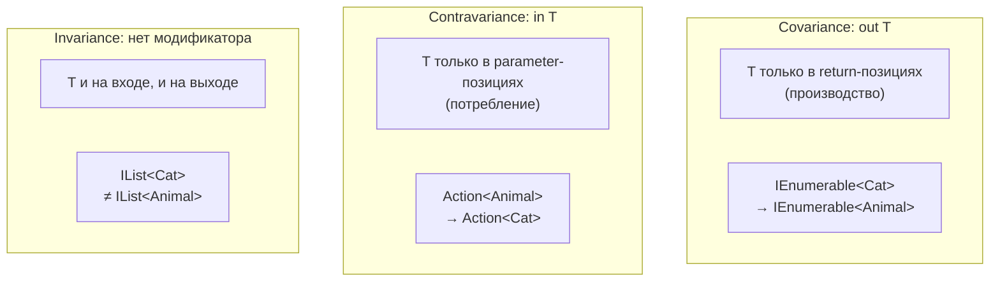

# Interfaces

> Контракт без реализации — основа тестируемости, DI и decoupling в .NET.

## Содержание
- [Контракт и dispatch](#контракт-и-dispatch)
- [Interface vs Abstract Class](#interface-vs-abstract-class)
- [Default Interface Methods](#default-interface-methods)
- [Explicit Implementation](#explicit-implementation)
- [Generic Interfaces и Constraints](#generic-interfaces-и-constraints)
- [Covariance и Contravariance](#covariance-и-contravariance)
- [Подводные камни](#подводные-камни)
- [См. также](#см-также)

---

## Контракт и dispatch

**Интерфейс** — контракт: определяет что объект умеет делать, без указания как. Все члены по умолчанию публичные и абстрактные.

```csharp
/// <summary>
/// Contract for persisting and retrieving domain entities.
/// </summary>
public interface IRepository<T> where T : class
{
    Task<T?> Find(int id, CancellationToken ct = default);
    Task Add(T entity, CancellationToken ct = default);
    Task Remove(T entity, CancellationToken ct = default);
    IQueryable<T> Query();
}

// Реализация 1: EF Core
public class EfRepository<T> : IRepository<T> where T : class
{
    private readonly DbContext _context;
    public EfRepository(DbContext context) => _context = context;

    public async Task<T?> Find(int id, CancellationToken ct)
        => await _context.Set<T>().FindAsync(new object[] { id }, ct);

    public async Task Add(T entity, CancellationToken ct)
    {
        _context.Set<T>().Add(entity);
        await _context.SaveChangesAsync(ct);
    }

    public async Task Remove(T entity, CancellationToken ct)
    {
        _context.Set<T>().Remove(entity);
        await _context.SaveChangesAsync(ct);
    }

    public IQueryable<T> Query() => _context.Set<T>();
}

// Реализация 2: In-memory (для тестов)
public class InMemoryRepository<T> : IRepository<T> where T : class
{
    private readonly List<T> _store = new();
    // ...
}
```

**Virtual dispatch через интерфейс:**


Вызов через интерфейс — indirect call через IMT (Interface Method Table). Это чуть медленнее прямого вызова, но JIT с PGO может devirtualize если видит конкретный тип.

**Зачем интерфейсы:**
- **Абстракция** — код зависит от контракта, не от реализации
- **Тестируемость** — мок реализует интерфейс
- **DI** — контейнер резолвит интерфейс в нужную реализацию
- **Множественное "наследование"** — класс реализует несколько контрактов

---

## Interface vs Abstract Class

| Аспект | Interface | Abstract Class |
|--------|-----------|---------------|
| Множественное наследование | Да (`: IA, IB, IC`) | Нет (один базовый класс) |
| Конструктор | Нет | Да |
| State (поля) | Нет | Да |
| Модификаторы доступа | public (по умолчанию) | Любые (public, protected, private) |
| Версионирование | Сложно без default methods | Легко (добавить virtual метод) |
| Реализация | Default methods (C# 8+) | Полноценная |



**Когда interface:**
```csharp
// Разные несвязанные типы поддерживают один контракт:
public interface IDisposable { void Dispose(); }
public interface IComparable<T> { int CompareTo(T? other); }
public interface IFormattable { string ToString(string? format, IFormatProvider? provider); }
// FileStream, SqlConnection, Timer — ничего общего, кроме Dispose

// Подменяемость для DI:
services.AddScoped<IEmailSender, SmtpEmailSender>();
services.AddScoped<IEmailSender, FakeEmailSender>(); // для тестов
```

**Когда abstract class:**
```csharp
// Template Method — общий алгоритм, шаги переопределяются:
public abstract class DataImporter
{
    // Общий алгоритм:
    public void Import(string path)
    {
        var data = ReadData(path);   // hook
        var clean = Validate(data);  // hook
        Save(clean);                 // hook
    }

    protected abstract IEnumerable<Record> ReadData(string path);
    protected abstract IEnumerable<Record> Validate(IEnumerable<Record> data);

    // Дефолтная реализация — можно переопределить:
    protected virtual void Save(IEnumerable<Record> data)
    {
        foreach (var record in data) _repo.Save(record);
    }
}

public class CsvImporter : DataImporter
{
    protected override IEnumerable<Record> ReadData(string path) => ParseCsv(path);
    protected override IEnumerable<Record> Validate(IEnumerable<Record> data) => ...;
}
```

---

## Default Interface Methods

С C# 8 интерфейсы могут содержать реализацию по умолчанию. Позволяет добавлять методы без breaking change для существующих реализаций.

```csharp
public interface ILogger
{
    void Log(string message);

    // Default implementation (C# 8+):
    void LogWarning(string message) => Log($"[WARN] {message}");
    void LogError(string message) => Log($"[ERROR] {message}");
}

// Существующая реализация не сломается:
public class ConsoleLogger : ILogger
{
    public void Log(string message) => Console.WriteLine(message);
    // LogWarning и LogError используют default implementation
}

// Переопределить можно:
public class StructuredLogger : ILogger
{
    public void Log(string message) { /* structured */ }
    public void LogWarning(string message) { /* override default */ }
}
```

**Ограничение:** default methods доступны **только через интерфейс**, не через конкретный тип:

```csharp
var logger = new ConsoleLogger();
// logger.LogWarning("msg"); // ОШИБКА! Метод не виден через ConsoleLogger

ILogger iface = logger;
iface.LogWarning("msg");     // OK — через интерфейс
```

**Практическое применение:** добавление новых методов в публичный интерфейс библиотеки без мажорной версии.

---

## Explicit Implementation

Когда два интерфейса объявляют метод с одинаковым именем — нужна явная реализация.

```csharp
public interface IReadable { string Read(); }
public interface IWritable { string Read(); } // конфликт!

public class Document : IReadable, IWritable
{
    // Explicit: доступен ТОЛЬКО через приведение к интерфейсу
    string IReadable.Read() => "Reading content";
    string IWritable.Read() => "Reading write buffer";

    // Публичный метод — не конфликтует:
    public string GetContent() => "Document content";
}

var doc = new Document();
// doc.Read();             // ОШИБКА: компилятор не знает какой Read()

((IReadable)doc).Read();  // "Reading content"
((IWritable)doc).Read();  // "Reading write buffer"
```

**Другие причины для explicit:**

```csharp
// 1. Скрыть "технические" методы от основного API:
public class MyCollection : ICollection<int>
{
    public void Add(int item) { ... }   // публичный

    // Скрыты — используются только через ICollection<int>:
    bool ICollection<int>.IsReadOnly => false;
    void ICollection<int>.CopyTo(int[] array, int index) { ... }
}

// 2. IDisposable через Close():
public class Connection : IDisposable
{
    public void Close() { /* бизнес-логика закрытия */ }
    void IDisposable.Dispose() => Close(); // explicit, предлагаем Close()
}

using (Connection conn = ...)
{
    // conn.Close(); // понятно для пользователя
} // или using вызовет Dispose() → Close()
```

---

## Generic Interfaces и Constraints

Constraints позволяют вызывать методы через интерфейс без boxing (constrained call):

```csharp
// Без constraint — boxing при каждом вызове:
void Print(IFormattable value) => Console.WriteLine(value.ToString(null, null));
// int x = 42; Print(x); → boxing!

// С constraint — constrained call, нет boxing:
void Print<T>(T value) where T : IFormattable
    => Console.WriteLine(value.ToString(null, null));
// JIT генерирует constrained call → для struct: прямой вызов, нет boxing

// Множественные constraints:
void Process<T>(T item)
    where T : IComparable<T>, IEquatable<T>, new()
{
    var other = new T();           // new() constraint
    int cmp = item.CompareTo(other);
    bool eq = item.Equals(other);
}
```

**Стандартные generic интерфейсы для struct:**

```csharp
public readonly struct Temperature :
    IEquatable<Temperature>,
    IComparable<Temperature>,
    IFormattable
{
    public double Celsius { get; }
    public Temperature(double celsius) => Celsius = celsius;

    public bool Equals(Temperature other) => Celsius == other.Celsius;
    public override bool Equals(object? obj) => obj is Temperature t && Equals(t);
    public override int GetHashCode() => Celsius.GetHashCode();

    public int CompareTo(Temperature other) => Celsius.CompareTo(other.Celsius);

    public string ToString(string? format, IFormatProvider? provider)
        => $"{Celsius:F1}°C";

    public static bool operator ==(Temperature a, Temperature b) => a.Equals(b);
    public static bool operator !=(Temperature a, Temperature b) => !a.Equals(b);
    public static bool operator <(Temperature a, Temperature b) => a.CompareTo(b) < 0;
    public static bool operator >(Temperature a, Temperature b) => a.CompareTo(b) > 0;
}
```

---

## Covariance и Contravariance

Variance — можно ли заменить `IInterface<Derived>` на `IInterface<Base>` (или наоборот).

**Covariance (`out T`) — можно использовать более конкретный тип:**

```csharp
// IEnumerable<out T> — ковариантный:
IEnumerable<string> strings = new List<string> { "hello" };
IEnumerable<object> objects = strings; // OK! string : object

// Почему out T безопасен: T только на выходе (return).
// Нельзя добавить в IEnumerable — только читать. Читать string как object — OK.

// IEnumerable не ковариантен для IList:
// IList<string> → IList<object>: НЕЛЬЗЯ
// Потому что IList.Add(T) — если objects.Add(42) — нарушение типов!
```

**Contravariance (`in T`) — можно использовать более общий тип:**

```csharp
// Action<in T> — контравариантный:
Action<object> printAny = obj => Console.WriteLine(obj);
Action<string> printStr = printAny; // OK! object более общий

// Логика: если Action принимает любой object,
// то точно примет string (string — частный случай object).
// in T — T только на входе (параметры).
```



**Правило:**
- `out T` — T **только** в return-позициях → можно заменить на более конкретный
- `in T` — T **только** в parameter-позициях → можно заменить на более общий
- Нет модификатора — **инвариантен** (нельзя заменять)

```csharp
// Примеры из BCL:
interface IEnumerable<out T> { IEnumerator<T> GetEnumerator(); } // covariant
interface IComparer<in T> { int Compare(T? x, T? y); }          // contravariant
interface IList<T> : ICollection<T>                              // invariant (Add + this[i])

// Func<in T, out TResult> — contravariant по входу, covariant по выходу:
Func<Animal, string> describe = a => a.Name;
Func<Cat, object> catDescribe = describe; // OK! in Cat (Animal) + out object (string)
```

---

## Подводные камни

**Marker interface vs attribute:**

```csharp
// Marker interface (пустой) — устаревший подход:
public interface IEntity { }

// Лучше: атрибут или generic constraint
[AttributeUsage(AttributeTargets.Class)]
public class EntityAttribute : Attribute { }
// или
void Save<T>(T entity) where T : class, IEntity { }
```

**Default interface method — не поле, не state:**

```csharp
public interface ICounter
{
    private int _count; // ОШИБКА: поля в интерфейсах запрещены

    // Static поля — можно (C# 8+), но это странно:
    static int SharedCount;

    // Default method может вызывать другие методы интерфейса:
    void Increment() => SetCount(GetCount() + 1);
    int GetCount();
    void SetCount(int value);
}
```

**Explicit implementation скрывает метод от `var`:**

```csharp
public class MyList : IList<int>
{
    void IList<int>.Insert(int index, int item) { ... } // explicit

    // var list = new MyList();
    // list.Insert(0, 42); // ОШИБКА: Insert скрыт
    // ((IList<int>)list).Insert(0, 42); // OK
}
```

---

## См. также

- [02-value-reference-types.md](./02-value-reference-types.md) — интерфейс — reference type
- [06-boxing.md](./06-boxing.md) — struct через интерфейс → boxing (без constrained call)
- [05-struct-class-record.md](./05-struct-class-record.md) — struct реализует интерфейсы
