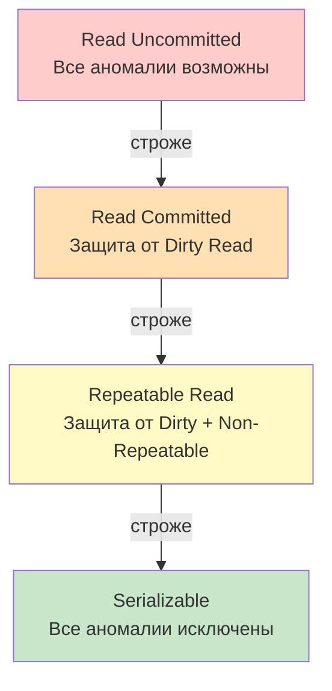
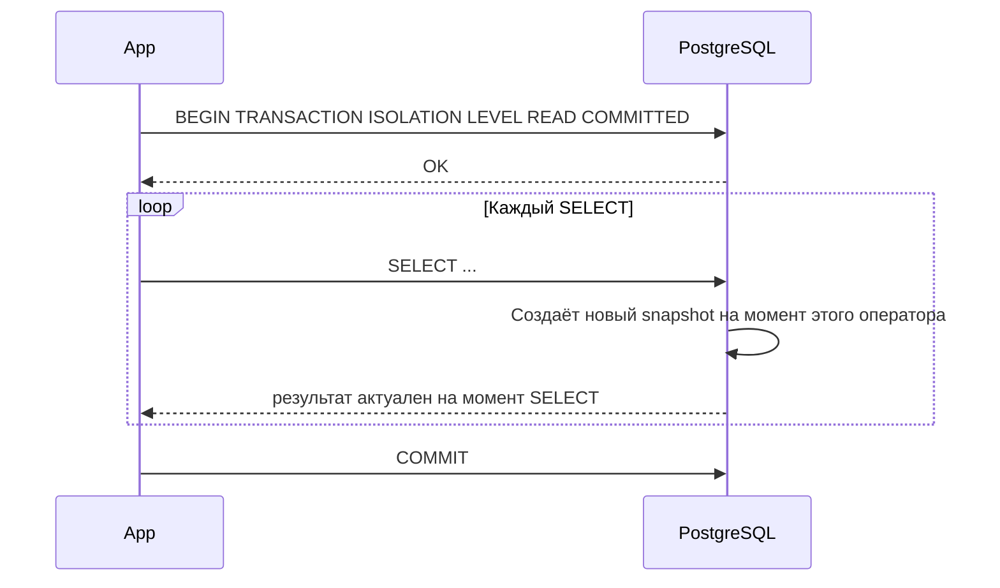

# Уровни изоляции транзакций

> Без изоляции параллельные транзакции ломают друг друга. Знать уровни — значит понимать, какой баг ты получишь в проде и почему.

## Содержание
- [Аномалии конкурентного доступа](#аномалии-конкурентного-доступа)
- [Четыре уровня изоляции](#четыре-уровня-изоляции)
- [Как PostgreSQL реализует уровни](#как-postgresql-реализует-уровни)
- [Serialization Anomaly и Write Skew](#serialization-anomaly-и-write-skew)
- [Подводные камни](#подводные-камни)
- [См. также](#см-также)

---

## Аномалии конкурентного доступа

Без изоляции возникают четыре класса аномалий.

### Dirty Read

T2 читает незакоммиченные изменения T1. Если T1 откатится — T2 приняла решение на основе несуществующих данных.

```sql
-- T1 (не закоммичена)
UPDATE balance SET amount = 1000 WHERE id = 1;

-- T2 читает 1000 — но T1 ещё не закоммичена
SELECT amount FROM balance WHERE id = 1;  -- 1000 (грязно!)

-- T1 откатывается
ROLLBACK;
-- amount снова 500, но T2 уже решила что у клиента 1000
```

### Non-Repeatable Read

T1 дважды читает одну строку — получает разные значения, потому что T2 успела изменить её между чтениями.

```sql
-- T1, первое чтение
SELECT amount FROM balance WHERE id = 1;  -- 500

-- T2 делает UPDATE + COMMIT

-- T1, второе чтение той же строки
SELECT amount FROM balance WHERE id = 1;  -- 1000 (изменилось!)
```

### Phantom Read

T1 дважды выполняет запрос с условием — получает разный набор строк, потому что T2 вставила/удалила строки в промежутке.

```sql
-- T1, первый запрос
SELECT COUNT(*) FROM orders WHERE status = 'new';  -- 10

-- T2: INSERT INTO orders (status) VALUES ('new'); COMMIT;

-- T1, второй запрос
SELECT COUNT(*) FROM orders WHERE status = 'new';  -- 11 (фантом!)
```

### Serialization Anomaly

Результат параллельного выполнения не соответствует **ни одному** возможному последовательному порядку. Классический пример — **write skew**: обе транзакции читают общие данные, принимают решение, пишут в разные строки — итоговое состояние невозможно при последовательном выполнении.

```sql
-- Правило: не может быть меньше одного дежурного врача
-- Сейчас дежурят: doctor_a = on_call, doctor_b = on_call

-- T1: "если есть другой дежурный, я могу уйти"
SELECT COUNT(*) FROM doctors WHERE on_call = true;  -- 2, ОК
UPDATE doctors SET on_call = false WHERE id = 'doctor_a';

-- T2 параллельно: та же логика
SELECT COUNT(*) FROM doctors WHERE on_call = true;  -- 2, ОК
UPDATE doctors SET on_call = false WHERE id = 'doctor_b';

-- Итог: оба врача ушли, никто не дежурит — нарушение инварианта!
-- При любом последовательном порядке такого бы не случилось.
```

---

## Четыре уровня изоляции

SQL-стандарт определяет 4 уровня через то, какие аномалии они допускают:



| Уровень | Dirty Read | Non-Repeatable | Phantom | Serialization Anomaly |
|---------|:----------:|:--------------:|:-------:|:---------------------:|
| Read Uncommitted | ✅ возможен | ✅ | ✅ | ✅ |
| Read Committed | ❌ нет | ✅ возможен | ✅ | ✅ |
| Repeatable Read | ❌ | ❌ нет | ✅ возможен* | ✅ |
| Serializable | ❌ | ❌ | ❌ нет | ❌ нет |

*В PostgreSQL Repeatable Read дополнительно защищает от фантомов — в отличие от стандарта SQL.

---

## Как PostgreSQL реализует уровни



**Read Committed (дефолт):** каждый `SELECT` получает новый snapshot — видит все изменения, закоммиченные к моменту выполнения *этого оператора*.

**Repeatable Read:** snapshot фиксируется при старте транзакции и не меняется — повторные чтения стабильны. В PostgreSQL реализовано через MVCC без блокировок.

**Serializable:** PostgreSQL использует **SSI (Serializable Snapshot Isolation)** — обнаруживает опасные зависимости между транзакциями и откатывает транзакцию с ошибкой `ERROR: could not serialize access due to read/write dependencies`.

```sql
-- Установка уровня
BEGIN TRANSACTION ISOLATION LEVEL REPEATABLE READ;
SELECT ...;
COMMIT;

-- Или через SET (до первой операции)
SET TRANSACTION ISOLATION LEVEL SERIALIZABLE;
```

**Read Uncommitted в PostgreSQL:** де-факто работает как Read Committed — PostgreSQL не реализует грязное чтение. Указание этого уровня не вызывает ошибки, но поведение идентично RC.

---

## Serialization Anomaly и Write Skew

Write skew — самая коварная аномалия: нет конфликта записи (транзакции пишут в разные строки), но нарушается инвариант, который возможно защитить только на уровне Serializable.

```sql
-- Защита от write skew
BEGIN TRANSACTION ISOLATION LEVEL SERIALIZABLE;

SELECT COUNT(*) FROM doctors WHERE on_call = true;
UPDATE doctors SET on_call = false WHERE id = 'doctor_a';

COMMIT;
-- При write skew PostgreSQL сам откатит одну из транзакций:
-- ERROR: could not serialize access due to read/write dependencies among transactions
```

Альтернатива без Serializable — явная пессимистическая блокировка через `SELECT FOR UPDATE`.

---

## Подводные камни

**Дефолтный уровень — Read Committed:** большинство аномалий Non-Repeatable Read в реальных системах не критичны, но если между двумя чтениями одного объекта принимается бизнес-решение — нужен минимум Repeatable Read.

**Serializable — не бесплатный:** при высокой конкуренции SSI может откатывать транзакции. Нужна retry-логика на стороне приложения.

**SET TRANSACTION после первой операции игнорируется:** уровень изоляции нельзя менять внутри транзакции после старта первого оператора.

**ORM скрывает уровень изоляции:**
```csharp
// EF Core: по умолчанию использует уровень изоляции СУБД (Read Committed для PostgreSQL)
// Чтобы изменить:
await context.Database.ExecuteSqlRawAsync(
    "SET TRANSACTION ISOLATION LEVEL SERIALIZABLE");

// Или через транзакцию:
using var tx = await context.Database.BeginTransactionAsync(
    System.Data.IsolationLevel.Serializable);
```

---

## См. также

- [02-mvcc.md](./02-mvcc.md) — как PostgreSQL реализует изоляцию через MVCC без блокировок
- [03-locking.md](./03-locking.md) — когда MVCC не достаточно и нужны явные блокировки
