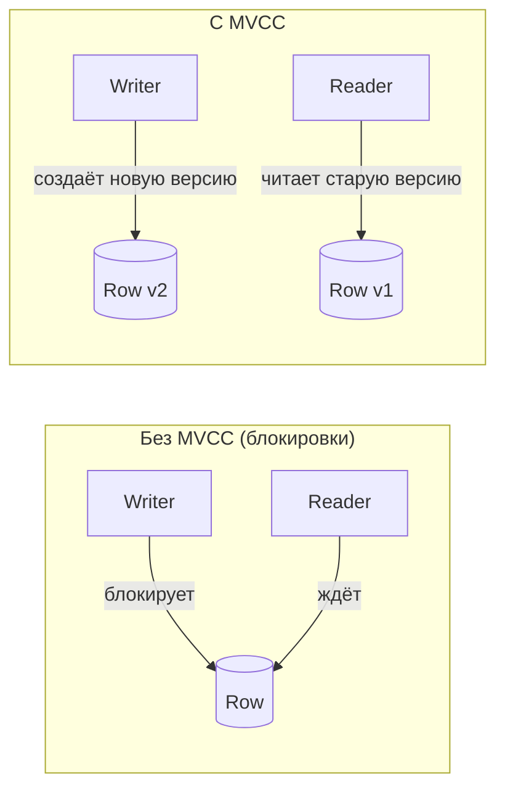
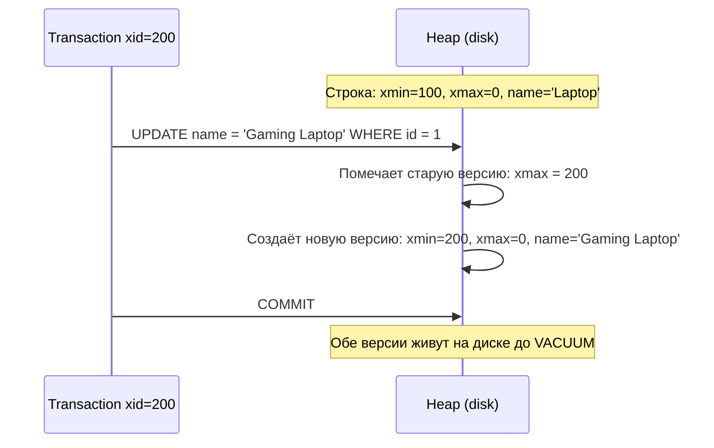
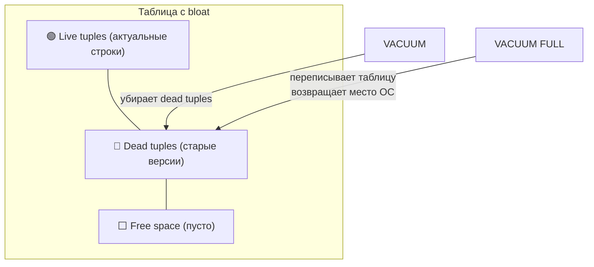
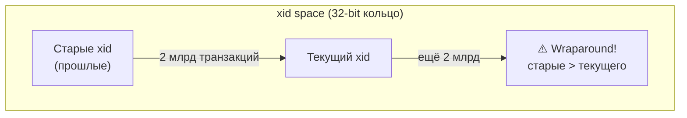

# MVCC в PostgreSQL

> MVCC — причина того, что читатели не блокируют писателей. Понять это — значит понять, откуда берётся table bloat и почему долгая транзакция убивает производительность.

## Содержание
- [Что такое MVCC и зачем](#что-такое-mvcc-и-зачем)
- [Системные поля каждой строки](#системные-поля-каждой-строки)
- [Как работает UPDATE](#как-работает-update)
- [Snapshot — снимок видимости](#snapshot--снимок-видимости)
- [VACUUM и мёртвые строки](#vacuum-и-мёртвые-строки)
- [Transaction ID Wraparound](#transaction-id-wraparound)
- [Подводные камни](#подводные-камни)
- [См. также](#см-также)

---

## Что такое MVCC и зачем

**MVCC (Multi-Version Concurrency Control)** — техника, при которой каждая версия строки хранится отдельно. Пока одна транзакция читает строку, другая может её обновить — обе получат консистентный результат без ожидания.



PostgreSQL **не обновляет строку на месте** — каждый `UPDATE` создаёт новую физическую версию строки (tuple) и помечает старую как удалённую.

---

## Системные поля каждой строки

Каждая строка в PostgreSQL содержит скрытые системные поля:

| Поле | Тип | Назначение |
|------|-----|-----------|
| `xmin` | `xid` (32-bit) | ID транзакции, **создавшей** эту версию |
| `xmax` | `xid` | ID транзакции, **удалившей/обновившей** эту версию (0 = строка жива) |
| `ctid` | `(page, offset)` | Физическое местоположение на диске |
| `cmin/cmax` | `cid` | Порядковый номер команды внутри транзакции |

```sql
SELECT xmin, xmax, ctid, id, name
FROM products
WHERE id = 1;

--  xmin | xmax | ctid  | id | name
-- ------+------+-------+----+------
--  1234 |    0 | (0,1) |  1 | Laptop
-- xmax = 0 → строка жива, никем не удалена
```

---

## Как работает UPDATE



После `UPDATE` на диске физически существуют **две** версии строки:
```
Старая: (xmin=100, xmax=200, id=1, name='Laptop')        ← dead tuple
Новая:  (xmin=200, xmax=0,   id=1, name='Gaming Laptop') ← live tuple
```

Удалённая (dead) версия остаётся на диске и занимает место до прихода VACUUM.

---

## Snapshot — снимок видимости

При старте транзакции (или каждого оператора при Read Committed) PostgreSQL создаёт **snapshot**:

```
Snapshot = {
  xmin: минимальный xid активной транзакции
         (все транзакции с xid < xmin точно закоммичены)
  xmax: xid следующей транзакции
         (все транзакции с xid >= xmax ещё не стартовали)
  xip:  список xid активных транзакций между xmin и xmax
}
```

**Правила видимости строки для snapshot:**

```mermaid
flowchart TD
    S{Строка (xmin, xmax)}
    S -->|"xmin < snapshot.xmin\nИ xmax = 0"| V1[Видима\nсоздана до snapshot, жива]
    S -->|"xmin в xip (активная)"| V2[Не видима\nтранзакция ещё не завершила запись]
    S -->|"xmax закоммичен\nИ xmax < snapshot.xmax"| V3[Не видима\nудалена до snapshot]
    S -->|"xmax в xip (активная)"| V4[Видима\nудаление не завершено]
```

**Практически:**
- Read Committed: новый snapshot на каждый `SELECT` → видит последние закоммиченные данные
- Repeatable Read: snapshot фиксируется при `BEGIN` → видит данные на момент старта транзакции

```sql
-- Проверить текущий xid транзакции
SELECT txid_current();

-- Проверить текущий snapshot
SELECT txid_current_snapshot();
-- Пример вывода: 100:105:101,103
-- xmin=100, xmax=105, активные=[101,103]
```

---

## VACUUM и мёртвые строки

Dead tuples накапливаются после каждого `UPDATE` и `DELETE`. Если их не убирать — **table bloat** (раздувание таблицы).



| Команда | Что делает | Блокировка |
|---------|-----------|-----------|
| `VACUUM` | Убирает dead tuples, помечает место как доступное для повторного использования (не возвращает ОС) | Нет (параллельно с DML) |
| `VACUUM FULL` | Переписывает таблицу полностью, возвращает место ОС | ACCESS EXCLUSIVE (блокирует всё!) |
| `ANALYZE` | Обновляет статистику для query planner | Нет |
| `VACUUM ANALYZE` | Оба действия за раз | Нет |

**autovacuum** — фоновый процесс, запускает VACUUM/ANALYZE автоматически по достижении порогов (настраиваются через `autovacuum_vacuum_threshold`, `autovacuum_vacuum_scale_factor`).

```sql
-- Посмотреть dead tuples по таблицам
SELECT relname, n_live_tup, n_dead_tup,
       round(n_dead_tup::numeric / nullif(n_live_tup, 0) * 100, 1) AS dead_pct,
       last_autovacuum
FROM pg_stat_user_tables
ORDER BY n_dead_tup DESC;
```

---

## Transaction ID Wraparound

`xid` — 32-bit беззнаковый счётчик. Максимум ~2 миллиарда транзакций. При переполнении (wraparound) старые транзакции становятся «новее» текущих — PostgreSQL перестаёт понимать, какие строки видимы.



**Защита через FREEZE:** autovacuum замораживает строки — заменяет `xmin` на специальный `FrozenXid`. Замороженные строки видимы для всех транзакций независимо от xid.

```sql
-- Посмотреть возраст транзакций (сколько до wraparound)
SELECT datname, age(datfrozenxid) AS xid_age
FROM pg_database
ORDER BY xid_age DESC;
-- age() > 1.5 млрд — критическая зона, нужен срочный VACUUM FREEZE
```

**Признак надвигающейся проблемы:** PostgreSQL выдаёт предупреждение в логах при приближении к wraparound threshold. При достижении `autovacuum_freeze_max_age` (дефолт 200 млн) — autovacuum принудительно запускает VACUUM FREEZE на таблице.

---

## Подводные камни

**Long-running транзакции убивают autovacuum.** VACUUM не может удалить dead tuples с `xmax >= xmin` самой старой активной транзакции. Транзакция, открытая на 8 часов, блокирует VACUUM от удаления всех строк, изменённых за эти 8 часов.

```sql
-- Найти долгие транзакции
SELECT pid, now() - pg_stat_activity.query_start AS duration, query
FROM pg_stat_activity
WHERE state != 'idle'
  AND now() - pg_stat_activity.query_start > interval '5 minutes'
ORDER BY duration DESC;
```

**Idle in transaction** — транзакция открыта, ничего не делает, но держит snapshot. Блокирует VACUUM так же, как активная.

**VACUUM FULL = риск.** Требует ACCESS EXCLUSIVE lock — таблица недоступна на время выполнения. Для продакшена используй `pg_repack` (реорганизация без полной блокировки).

**Bloat на write-heavy таблицах** — даже при работающем autovacuum может накапливаться, если скорость появления dead tuples превышает скорость VACUUM. Решение: увеличить частоту/параллельность autovacuum для конкретной таблицы:

```sql
ALTER TABLE orders SET (
    autovacuum_vacuum_scale_factor = 0.01,  -- 1% вместо дефолтных 20%
    autovacuum_vacuum_cost_delay = 2        -- менее агрессивный throttling
);
```

---

## См. также

- [01-transaction-isolation.md](./01-transaction-isolation.md) — уровни изоляции, которые MVCC реализует
- [03-locking.md](./03-locking.md) — когда MVCC недостаточно и нужны явные блокировки
- [09-query-optimization.md](./09-query-optimization.md) — VACUUM ANALYZE и его влияние на query planner
