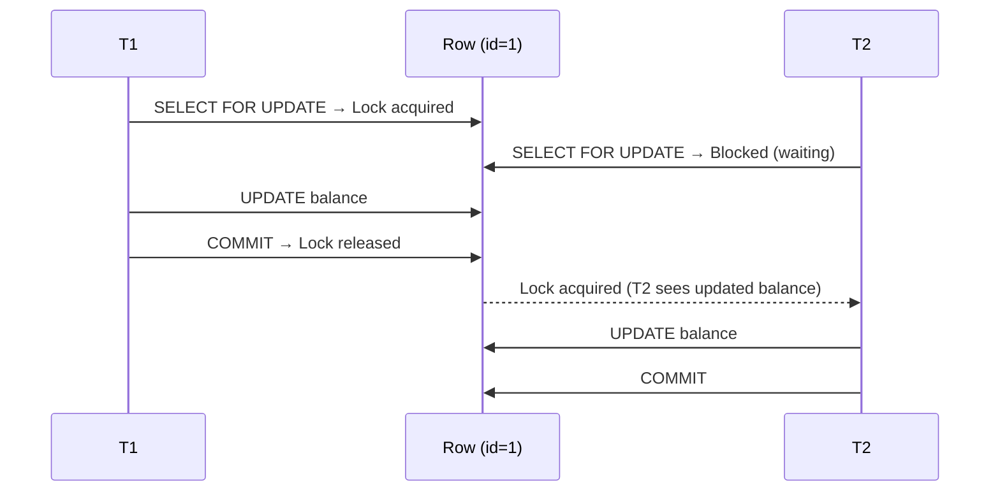
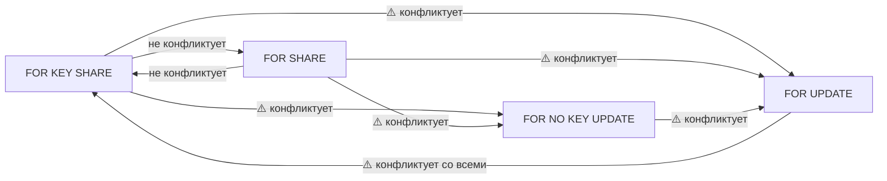
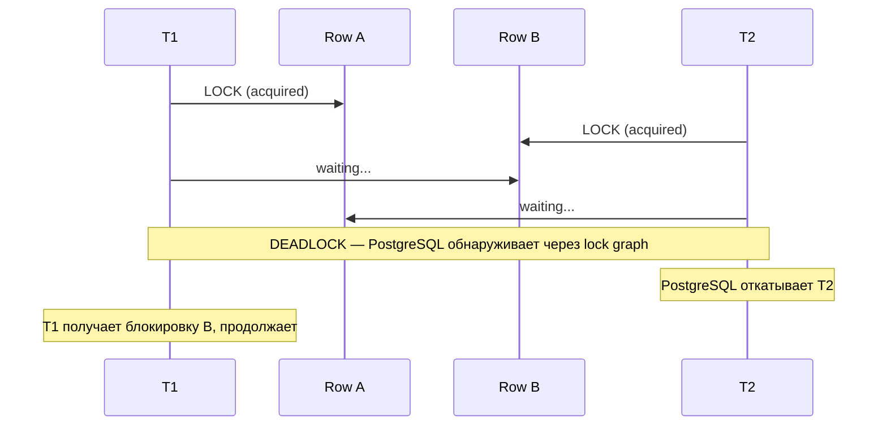
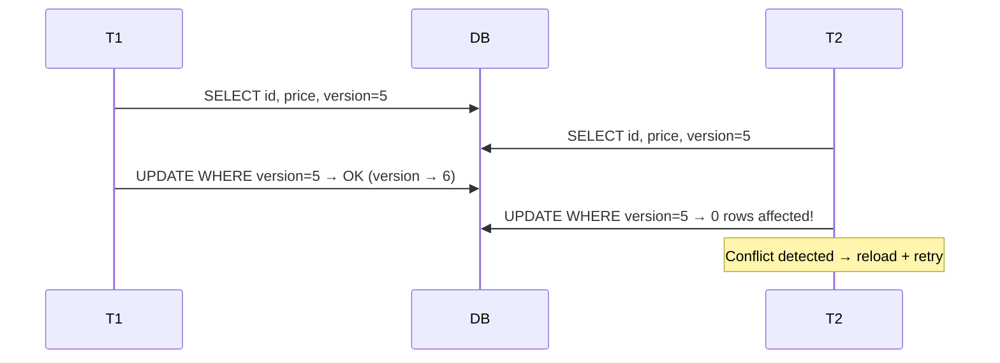

# Pessimistic и Optimistic Locking

> MVCC защищает от конкуренции при чтении. Но когда нужно «прочитать — решить — записать» атомарно, нужны явные блокировки или версионирование.

## Содержание
- [Pessimistic Locking](#pessimistic-locking)
- [Режимы строчных блокировок](#режимы-строчных-блокировок)
- [Deadlock](#deadlock)
- [Optimistic Locking](#optimistic-locking)
- [Pessimistic vs Optimistic — выбор](#pessimistic-vs-optimistic--выбор)
- [Подводные камни](#подводные-камни)
- [См. также](#см-также)

---

## Pessimistic Locking

Предполагает, что конфликты **вероятны** — строка блокируется при чтении. Конкурирующие транзакции ждут снятия блокировки.

```sql
-- SELECT FOR UPDATE: захватывает эксклюзивную блокировку на строки
-- Другие транзакции не могут изменить или заблокировать эти строки до COMMIT/ROLLBACK
BEGIN;
SELECT * FROM accounts WHERE id = 1 FOR UPDATE;
UPDATE accounts SET balance = balance - 100 WHERE id = 1;
COMMIT;
```



**Вариации `FOR UPDATE`:**

```sql
-- SKIP LOCKED: не ждёт заблокированные строки, пропускает их
-- Паттерн: очередь задач с конкурирующими воркерами
SELECT * FROM tasks
WHERE status = 'pending'
ORDER BY created_at
LIMIT 1
FOR UPDATE SKIP LOCKED;

-- NOWAIT: немедленная ошибка если строка заблокирована
-- ERROR: could not obtain lock on row in relation "products"
SELECT * FROM products WHERE id = 1 FOR UPDATE NOWAIT;
```

---

## Режимы строчных блокировок

| Режим | Конфликтует с | Когда использовать |
|-------|--------------|-------------------|
| `FOR KEY SHARE` | `FOR UPDATE`, `FOR NO KEY UPDATE` | FK-проверки (автоматически PostgreSQL) |
| `FOR SHARE` | `FOR UPDATE`, `FOR NO KEY UPDATE` | Защитить строку от изменения, но не от читателей |
| `FOR NO KEY UPDATE` | `FOR SHARE`, `FOR KEY SHARE`, `FOR NO KEY UPDATE` | UPDATE без изменения ключа |
| `FOR UPDATE` | Все режимы | Полная эксклюзивная блокировка |



---

## Deadlock

Взаимная блокировка: T1 держит A и ждёт B; T2 держит B и ждёт A.



PostgreSQL автоматически обнаруживает deadlock через анализ графа ожидания и откатывает одну из транзакций с ошибкой:
```
ERROR: deadlock detected
DETAIL: Process 12345 waits for ShareLock on transaction 67890;
        blocked by process 67890.
HINT: See server log for query details.
```

**Профилактика deadlock:**
- Всегда блокировать строки в одном и том же порядке (например, по возрастанию `id`)
- Минимизировать время между блокировкой и `COMMIT`
- Использовать `NOWAIT` + retry вместо ожидания

---

## Optimistic Locking

Предполагает, что конфликты **редки** — блокировок нет. При записи проверяется, не изменилась ли строка с момента чтения.

### Паттерн с version-колонкой

```sql
-- 1. Читаем строку с версией
SELECT id, name, price, version FROM products WHERE id = 1;
-- → version = 5

-- 2. Обновляем с проверкой версии
UPDATE products
SET price = 999, version = version + 1
WHERE id = 1 AND version = 5;

-- Если конкурент успел изменить строку — version != 5
-- → UPDATE затронул 0 строк → приложение знает о конфликте и повторяет
```

### EF Core — встроенная поддержка

```csharp
public class Product
{
    public int Id { get; set; }
    public string Name { get; set; } = default!;
    public decimal Price { get; set; }

    // SQL Server: rowversion (timestamp)
    // PostgreSQL: xmin (через Npgsql, или вручную через [ConcurrencyCheck])
    [Timestamp]
    public byte[] RowVersion { get; set; } = default!;
}
```

```csharp
// EF Core автоматически добавляет WHERE RowVersion = @original в UPDATE
// При конфликте бросает DbUpdateConcurrencyException
try
{
    await context.SaveChangesAsync();
}
catch (DbUpdateConcurrencyException ex)
{
    var entry = ex.Entries.Single();
    var dbValues = await entry.GetDatabaseValuesAsync();

    if (dbValues == null)
    {
        // Строка удалена другим пользователем
        throw new InvalidOperationException("Record was deleted by another user.");
    }

    // Обновить original values и попробовать снова
    entry.OriginalValues.SetValues(dbValues);
    await context.SaveChangesAsync();  // retry
}
```



---

## Pessimistic vs Optimistic — выбор

| Критерий | Pessimistic | Optimistic |
|---------|:----------:|:---------:|
| Уровень конкуренции | Высокий | Низкий |
| Риск deadlock | Есть | Нет |
| Риск retry storm | Нет | Есть при высокой нагрузке |
| Производительность при конкуренции | Ниже (ожидание) | Ниже (retry) |
| Производительность без конкуренции | Нормальная | Выше (нет блокировок) |
| Сложность кода | Меньше | Больше (retry-логика) |

**Pessimistic — когда:** финансовые операции, инвентарь (остатки товаров), очереди задач с конкурирующими воркерами.

**Optimistic — когда:** пользовательский контент (редко редактируется одновременно), read-heavy системы, UI-формы.

---

## Подводные камни

**Долгие блокировки при pessimistic locking** — если транзакция держит `FOR UPDATE` и выполняет медленную операцию (HTTP-запрос, вычисления), все конкурирующие транзакции ждут. Никогда не делай внешних вызовов внутри транзакции с блокировкой.

**Optimistic locking + высокая конкуренция = retry storm** — если 100 транзакций одновременно читают и пытаются обновить одну запись, 99 получат конфликт. Retry экспоненциально усугубляет нагрузку. В таком сценарии нужен pessimistic locking.

**`[Timestamp]` в EF Core vs PostgreSQL xmin** — `[Timestamp]` работает из коробки в SQL Server. В PostgreSQL правильный способ — пакет `Npgsql.EntityFrameworkCore.PostgreSQL` с `UseXminAsConcurrencyToken()`:

```csharp
modelBuilder.Entity<Product>()
    .UseXminAsConcurrencyToken();
// Npgsql использует системное поле xmin строки как токен конкурентности
```

**Advisory Locks** — PostgreSQL предоставляет блокировки на уровне приложения (не строк):

```sql
-- Взять application-level lock (id = произвольное int8)
SELECT pg_advisory_lock(12345);
-- ... критическая секция ...
SELECT pg_advisory_unlock(12345);

-- Транзакционный advisory lock (снимается автоматически при COMMIT)
SELECT pg_advisory_xact_lock(12345);
```

Полезно для распределённых мьютексов без строки в таблице.

---

## См. также

- [01-transaction-isolation.md](./01-transaction-isolation.md) — уровни изоляции и их связь с блокировками
- [02-mvcc.md](./02-mvcc.md) — почему читатели не блокируют писателей
