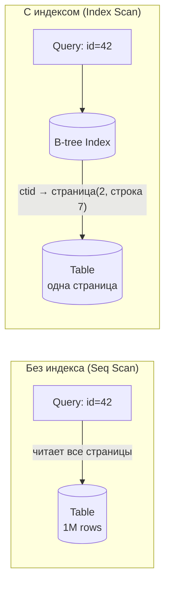
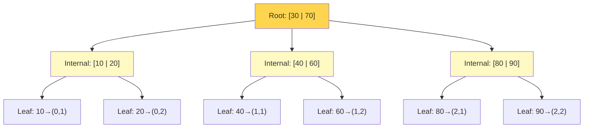
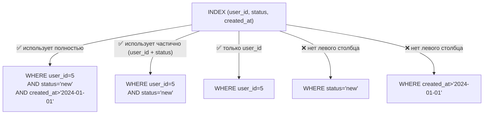

# Индексы в PostgreSQL

> Без индекса — Seq Scan по всей таблице. С неправильным индексом — bloat и write amplification. Знать устройство B-tree — значит делать индексы, а не угадывать их.

## Содержание
- [Зачем индексы и что такое Seq Scan](#зачем-индексы-и-что-такое-seq-scan)
- [B-tree — основная структура](#b-tree--основная-структура)
- [Clustered vs Non-Clustered](#clustered-vs-non-clustered)
- [Типы индексов PostgreSQL](#типы-индексов-postgresql)
- [Composite Index и Left-Prefix Rule](#composite-index-и-left-prefix-rule)
- [Covering Index (INCLUDE)](#covering-index-include)
- [Partial Index](#partial-index)
- [HOT Update и Write Amplification](#hot-update-и-write-amplification)
- [Функциональные индексы](#функциональные-индексы)
- [Подводные камни](#подводные-камни)
- [См. также](#см-также)

---

## Зачем индексы и что такое Seq Scan

Без индекса поиск строки требует **Sequential Scan** — перебор всей таблицы страница за страницей. При 100 миллионах строк это сотни тысяч disk I/O.

Индекс — отдельная структура данных с отсортированными значениями ключевых столбцов и указателями (`ctid`) на соответствующие строки в heap.



---

## B-tree — основная структура

**B-tree (Balanced Tree)** — сбалансированное дерево поиска. Все листовые узлы на одной глубине. Каждый узел = одна страница диска (~8KB).



**Почему не бинарное дерево?**

- Бинарное дерево: каждый узел = 2 ключа → глубина log₂(N) → при N=1M глубина=20 → 20 disk I/O
- B-tree: каждый узел = страница ~8KB ≈ **1000 ключей** → глубина log₁₀₀₀(N) → 1 млрд строк = 3 disk I/O

B-tree поддерживает: `=`, `<`, `>`, `<=`, `>=`, `BETWEEN`, `LIKE 'prefix%'`, `ORDER BY`, `UNIQUE`.

B-tree **не поддерживает**: `LIKE '%suffix'`, regex, полнотекстовый поиск, геоданные, `@>` (containment).

---

## Clustered vs Non-Clustered

### SQL Server

- **Clustered Index** — физический порядок строк таблицы == порядок индекса. Данные в листьях — сами строки. Один на таблицу (обычно PRIMARY KEY).
- **Non-Clustered Index** — отдельная структура; в листьях — указатели на строки clustered index или heap.

```
Clustered:     B-tree leaf = actual row data
Non-Clustered: B-tree leaf = {key, row_locator → clustered/heap}
```

### PostgreSQL

В PostgreSQL **нет clustered index** в смысле SQL Server — все индексы heap-based. Команда `CLUSTER table USING index` физически переупорядочивает heap **один раз**, но порядок не поддерживается автоматически при последующих insert/update.

**Следствие:** после поиска по не-покрывающему индексу PostgreSQL делает **Heap Fetch** — случайный I/O по `ctid` для каждой строки. При выборке >5-10% строк таблицы Seq Scan может оказаться быстрее.

---

## Типы индексов PostgreSQL

| Тип | Структура | Операции | Когда использовать |
|-----|-----------|----------|-------------------|
| **B-tree** | Сбалансированное дерево | `=`, `<`, `>`, `BETWEEN`, `LIKE 'x%'`, `ORDER BY` | Большинство случаев |
| **Hash** | Хеш-таблица | Только `=` | Точный поиск, высокая кардинальность |
| **GiST** | Generalized Search Tree | Геометрия, диапазоны, полнотекст | PostGIS, `tsrange`, `&&` |
| **GIN** | Generalized Inverted Index | Массивы, JSONB, `tsvector` | `@>`, `&&`, полнотекстовый поиск |
| **BRIN** | Block Range Index | `<`, `>`, диапазоны | Огромные таблицы с физической корреляцией (logs, time-series) |
| **SP-GiST** | Space-Partitioned GiST | Геометрия, IP-адреса | `inet`, точки, многоугольники |

```sql
-- GIN для JSONB
CREATE INDEX idx_product_meta ON products USING GIN (metadata);
SELECT * FROM products WHERE metadata @> '{"color": "red"}';

-- GIN для полнотекстового поиска
CREATE INDEX idx_search ON products
    USING GIN (to_tsvector('russian', description));
SELECT * FROM products
WHERE to_tsvector('russian', description) @@ to_tsquery('russian', 'ноутбук');

-- BRIN для таблицы логов (строки вставляются по возрастанию времени)
-- Хранит min/max created_at для каждых 128 страниц — занимает ~1% от B-tree
CREATE INDEX idx_logs_time ON logs USING BRIN (created_at);
```

**GIN vs GiST для полнотекста:**
- GIN: быстрее поиск, медленнее обновление, больше места
- GiST: медленнее поиск, быстрее обновление, поддерживает нечёткий поиск

---

## Composite Index и Left-Prefix Rule

Составной индекс `(a, b, c)` работает только если запрос начинается с левых столбцов:



```sql
CREATE INDEX idx_orders ON orders (user_id, status, created_at);

-- ✅ Полный Index Scan
SELECT * FROM orders WHERE user_id=5 AND status='new' AND created_at>'2024-01-01';

-- ✅ Partial Index Scan (user_id + status)
SELECT * FROM orders WHERE user_id=5 AND status='new';

-- ✅ Только user_id
SELECT * FROM orders WHERE user_id=5;

-- ❌ Seq Scan — пропущен левый столбец
SELECT * FROM orders WHERE status='new';
```

**Порядок столбцов:**
1. Столбцы с `=` — первыми (самая высокая кардинальность — первыми)
2. Столбцы с диапазонами `<`, `>` — после всех `=`
3. Столбцы из `ORDER BY` — в том же порядке для Index Scan без сортировки

---

## Covering Index (INCLUDE)

Если все нужные столбцы есть в индексе — PostgreSQL делает **Index Only Scan** и не ходит в heap.

```sql
-- Запрос
SELECT name, price FROM products WHERE category_id = 5;

-- Обычный индекс: Index Scan + Heap Fetch для каждой строки
CREATE INDEX idx_category ON products (category_id);

-- Covering index: Index Only Scan — heap не нужен
CREATE INDEX idx_category_covering ON products (category_id)
INCLUDE (name, price);
-- category_id — в B-tree (для поиска)
-- name, price — только в листьях (не участвуют в key lookup, не увеличивают глубину)
```

`INCLUDE` появился в PostgreSQL 11. Отличие от `(category_id, name, price)`: INCLUDE-столбцы не участвуют в сравнениях, не увеличивают глубину дерева, но доступны при Index Only Scan.

---

## Partial Index

Индексирует только часть строк — меньше размер, быстрее обновление:

```sql
-- 99% заказов — completed, индексируем только pending
CREATE INDEX idx_orders_pending ON orders (user_id, created_at)
WHERE status = 'pending';

-- Sparse data: индексируем только ненулевые значения
CREATE INDEX idx_promo ON orders (promo_code)
WHERE promo_code IS NOT NULL;
```

Partial index используется только если `WHERE` запроса совместим с условием индекса. Planner должен знать, что условие выполнено — иногда нужно передавать константу явно.

---

## HOT Update и Write Amplification

**Проблема Write Amplification:** при `UPDATE` PostgreSQL должен обновить **все** индексы таблицы, не только по изменённым столбцам. Таблица с 10 индексами = 10 дополнительных операций записи.

**HOT (Heap Only Tuple) Update** — оптимизация: если `UPDATE` не меняет индексированные столбцы И новая версия строки помещается на ту же страницу, PostgreSQL создаёт linked chain внутри страницы без обновления индексов.

```
HOT:     heap → heap (no index update)  — быстро
Non-HOT: heap + index1 + ... + index10  — дорого
```

**Как помочь HOT** — оставить место на странице через `fillfactor`:

```sql
-- 30% каждой страницы резервируется для HOT-updates
ALTER TABLE orders SET (fillfactor = 70);

-- Применится при следующем VACUUM FULL или CLUSTER
```

---

## Функциональные индексы

```sql
-- Поиск без учёта регистра
CREATE INDEX idx_users_email ON users (LOWER(email));
SELECT * FROM users WHERE LOWER(email) = LOWER('User@Example.com');
-- ⚠️ WHERE email = 'user@example.com' — индекс НЕ использует!
-- Запрос должен точно совпадать с функцией в индексе

-- По части строки (год из даты)
CREATE INDEX idx_orders_year ON orders (EXTRACT(YEAR FROM created_at));
SELECT * FROM orders WHERE EXTRACT(YEAR FROM created_at) = 2024;

-- По выражению над JSONB
CREATE INDEX idx_meta_color ON products ((metadata->>'color'));
SELECT * FROM products WHERE metadata->>'color' = 'red';
```

---

## Подводные камни

**Индекс на низкокардинальном столбце бесполезен.** Индекс на `status` с 3 значениями при равномерном распределении не поможет — planner выберет Seq Scan, т.к. выборка >10% строк. Используй partial index или composite.

**Функция вокруг столбца отключает индекс:**
```sql
-- Индекс на created_at — но вот так индекс НЕ используется:
WHERE DATE(created_at) = '2024-01-15'   -- функция вокруг столбца!
-- Правильно:
WHERE created_at >= '2024-01-15' AND created_at < '2024-01-16'
```

**Слишком много индексов** = медленные INSERT/UPDATE/DELETE + bloat. Аудитуй использование:
```sql
SELECT schemaname, tablename, indexname, idx_scan, idx_tup_read, idx_tup_fetch
FROM pg_stat_user_indexes
WHERE idx_scan = 0  -- индексы которые никто не использует
ORDER BY pg_relation_size(indexrelid) DESC;
```

**Неявное приведение типов отключает индекс:**
```sql
-- Индекс на integer user_id
-- Передаём строку — implicit cast → no index
SELECT * FROM orders WHERE user_id = '12345';  -- ❌
SELECT * FROM orders WHERE user_id = 12345;    -- ✅
```

---

## См. также

- [09-query-optimization.md](./09-query-optimization.md) — EXPLAIN для проверки используемых индексов и типов сканирований
- [05-join-algorithms.md](./05-join-algorithms.md) — как индексы влияют на выбор алгоритма JOIN
