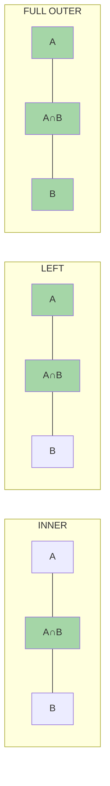

# JOIN: типы и алгоритмы PostgreSQL

> JOIN — это не просто SQL-синтаксис. За каждым JOIN planеr выбирает один из трёх алгоритмов. Неправильный — и запрос тормозит на миллионах строк.

## Содержание
- [Типы JOIN](#типы-join)
- [Алгоритмы JOIN в PostgreSQL](#алгоритмы-join-в-postgresql)
- [Как planner выбирает алгоритм](#как-planner-выбирает-алгоритм)
- [N+1 проблема](#n1-проблема)
- [Подводные камни](#подводные-камни)
- [См. также](#см-также)

---

## Типы JOIN

```
Множества: A = {1, 2, 3},  B = {2, 3, 4}

INNER JOIN:      {2, 3}           — только совпавшие строки
LEFT JOIN:       {1, 2, 3}        — все из A + совпадения из B (NULL для несовпавших)
RIGHT JOIN:      {2, 3, 4}        — все из B + совпадения из A (NULL для несовпавших)
FULL OUTER JOIN: {1, 2, 3, 4}     — все из обеих таблиц
CROSS JOIN:      A × B = 9 строк  — декартово произведение
```



```sql
-- INNER: только совпавшие заказы и пользователи
SELECT o.id, u.name
FROM orders o
INNER JOIN users u ON o.user_id = u.id;

-- LEFT: все заказы, даже без пользователя (user удалён)
SELECT o.id, u.name
FROM orders o
LEFT JOIN users u ON o.user_id = u.id;

-- Антипаттерн: LEFT JOIN + WHERE IS NULL — только НЕ совпавшие из A
SELECT o.id
FROM orders o
LEFT JOIN users u ON o.user_id = u.id
WHERE u.id IS NULL;  -- заказы с удалённым пользователем
```

---

## Алгоритмы JOIN в PostgreSQL

### Nested Loop Join

```
FOR каждая строка из outer_table:
    FOR каждая строка из inner_table (или index lookup):
        IF join_condition → emit row
```

- Сложность: O(N × M) без индекса, O(N × log M) с индексом на inner
- **Хорошо:** outer маленький И есть индекс на join key inner-таблицы
- **Плохо:** обе таблицы большие, нет индекса → O(N²)

```
Nested Loop (cost=0.29..16.33 rows=5)
  -> Seq Scan on users (rows=3)          ← outer (маленький)
  -> Index Scan on orders using idx_user_id  ← inner (с индексом)
       Index Cond: (user_id = users.id)
```

### Hash Join

```
1. BUILD phase: строим хеш-таблицу из меньшей таблицы
   hash_table[hash(join_key)] = row
2. PROBE phase: перебираем большую таблицу
   FOR каждая строка из probe_table:
       lookup в hash_table по hash(join_key)
```

- Сложность: O(N + M) — линейная
- **Хорошо:** большие таблицы, нет индексов, `=` условие
- **Плохо:** хеш-таблица > `work_mem` → spill to disk (Hash Batches > 1)

```
Hash Join (cost=5.00..105.00 rows=1000)
  Hash Cond: (orders.user_id = users.id)
  -> Seq Scan on orders (rows=10000)     ← probe side (большой)
  -> Hash
       Buckets: 1024  Batches: 1
       -> Seq Scan on users (rows=100)   ← build side (меньший)
```

### Merge Join

```
1. Сортируем обе таблицы по join key (если нет индекса)
2. Два указателя двигаются параллельно по обеим таблицам
```

- Сложность: O(N log N + M log M) для сортировки + O(N + M) для merge
- **Хорошо:** обе таблицы уже отсортированы (по индексу), диапазонные условия JOIN
- **Плохо:** нужна сортировка если нет индекса — дороже Hash Join

```
Merge Join (cost=10.00..50.00)
  Merge Cond: (users.id = orders.user_id)
  -> Index Scan on users using users_pkey   ← уже отсортирован
  -> Index Scan on orders using idx_user_id ← уже отсортирован
```

---

## Как planner выбирает алгоритм

```mermaid
flowchart TD
    J[Запрос с JOIN]
    J --> Q1{Есть индекс\nна join key inner-таблицы?}
    Q1 -->|"Да + outer маленький"| NL[Nested Loop\nO(N × log M)]
    Q1 -->|"Нет"| Q2{Обе таблицы\nуже отсортированы?}
    Q2 -->|"Да (по индексу)"| MJ[Merge Join\nO(N + M) после sort]
    Q2 -->|"Нет"| HJ[Hash Join\nO(N + M)]
```

Planner оценивает стоимость каждого алгоритма на основе:
- `pg_statistic`: размер таблиц, кардинальность, распределение значений
- `work_mem`: сколько памяти доступно для хеш-таблицы
- `random_page_cost` vs `seq_page_cost`: стоимость random I/O

```sql
-- Принудительно отключить алгоритм для отладки
SET enable_hashjoin = off;
SET enable_mergejoin = off;
SET enable_nestloop = off;
```

---

## N+1 проблема

Классический антипаттерн в ORM: 1 запрос для списка + N запросов для каждого элемента.

```csharp
// ❌ N+1: 1 SELECT users + N SELECT orders для каждого пользователя
var users = await context.Users.ToListAsync();
foreach (var user in users)
{
    // Выполняется отдельный запрос для каждого user!
    var orders = await context.Orders
        .Where(o => o.UserId == user.Id)
        .ToListAsync();
    Console.WriteLine($"{user.Name}: {orders.Count} orders");
}
// 100 пользователей = 101 запрос в БД
```

```csharp
// ✅ Один JOIN через Include
var users = await context.Users
    .Include(u => u.Orders)
    .ToListAsync();
// Генерирует: SELECT ... FROM users LEFT JOIN orders ON orders.user_id = users.id
// 1 запрос вместо 101
```

```csharp
// ✅ Явный JOIN с проекцией (когда нужны только некоторые поля)
var result = await context.Users
    .Select(u => new
    {
        u.Name,
        OrderCount = u.Orders.Count()
    })
    .ToListAsync();
// Генерирует: SELECT u.name, COUNT(o.id) FROM users u LEFT JOIN orders o ON ...
```

**Как обнаружить N+1:** включить логирование SQL-запросов:

```csharp
// В Program.cs
builder.Services.AddDbContext<AppDbContext>(options =>
    options.UseNpgsql(connectionString)
           .EnableSensitiveDataLogging()
           .LogTo(Console.WriteLine, LogLevel.Information));
```

Или использовать MiniProfiler / EF Core interceptors.

---

## Подводные камни

**Hash Batches > 1 — spill to disk.** Если `work_mem` недостаточно для хеш-таблицы, PostgreSQL разбивает Hash Join на batches — часть данных пишется на диск. Производительность падает кратно.

```sql
-- Увеличить work_mem для тяжёлого запроса
SET work_mem = '256MB';
EXPLAIN ANALYZE SELECT ...;
-- Смотреть: Batches: 1 (не spills)
```

**Картезианский JOIN без условия** — случайно написали CROSS JOIN или пропустили `ON`:
```sql
-- Опасно: если забыть ON — декартово произведение!
SELECT * FROM orders, users;        -- 10000 × 1000 = 10M строк!
SELECT * FROM orders JOIN users;    -- синтаксическая ошибка в PostgreSQL (обязателен ON)
```

**ORDER BY в подзапросе без LIMIT бесполезен:** PostgreSQL не гарантирует порядок при дальнейшем JOIN и вправе игнорировать внутренний ORDER BY.

**Planner ошибается при устаревшей статистике:** после массовой загрузки данных запустить `ANALYZE` — иначе planner может выбрать Nested Loop вместо Hash Join.

---

## См. также

- [04-indexes.md](./04-indexes.md) — индексы на join key критичны для Nested Loop
- [09-query-optimization.md](./09-query-optimization.md) — читать EXPLAIN для диагностики JOIN алгоритмов
