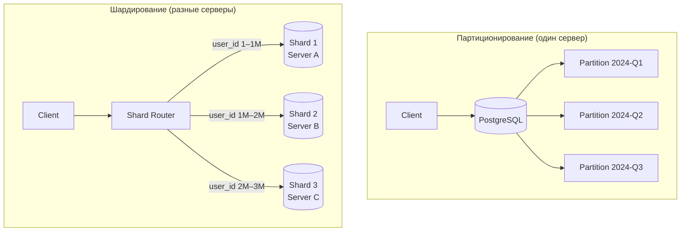
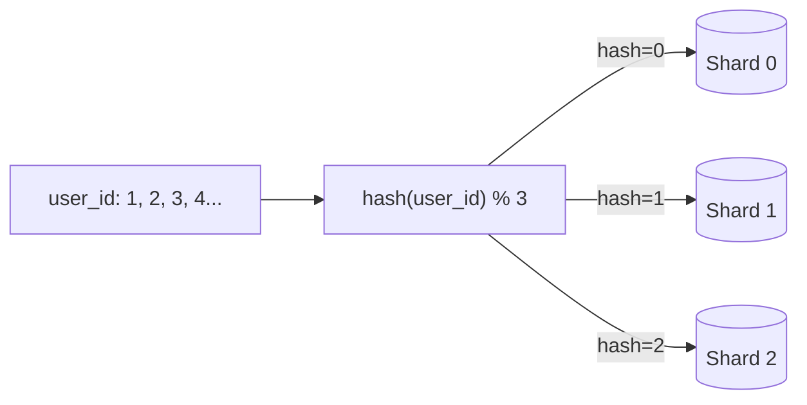
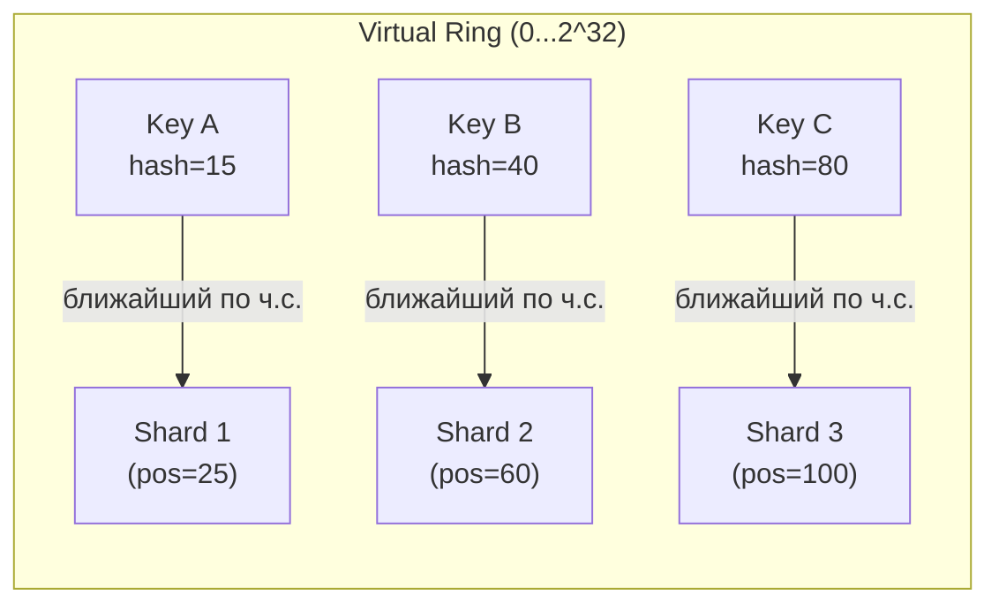
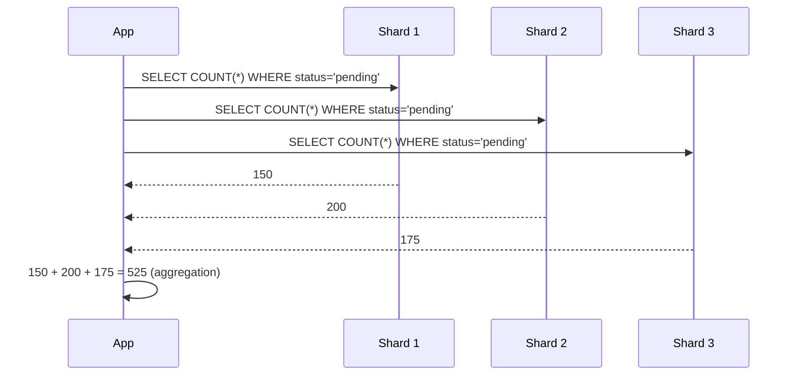
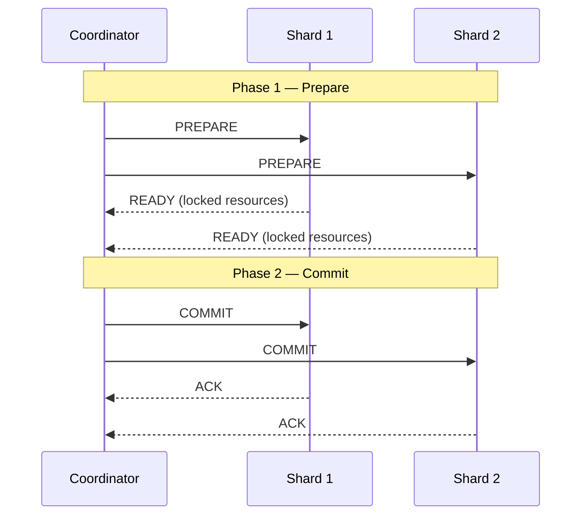
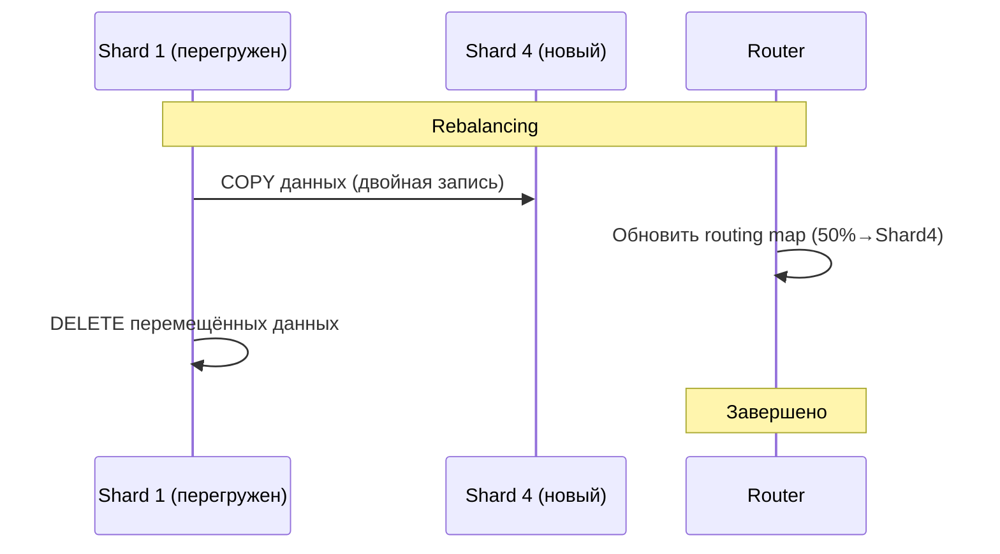

# Шардирование

> Шардирование — последний резерв масштабирования. Перед ним нужно исчерпать индексы, репликацию, партиционирование и кэш. После — жить с ограничениями distributed systems.

## Содержание
- [Горизонтальное масштабирование vs партиционирование](#горизонтальное-масштабирование-vs-партиционирование)
- [Стратегии выбора partition key](#стратегии-выбора-partition-key)
- [Consistent Hashing](#consistent-hashing)
- [Cross-Shard Queries](#cross-shard-queries)
- [Distributed Transactions и 2PC](#distributed-transactions-и-2pc)
- [Rebalancing](#rebalancing)
- [Подводные камни](#подводные-камни)
- [См. также](#см-также)

---

## Горизонтальное масштабирование vs партиционирование

**Партиционирование** — разбиение таблицы на части на **одном сервере**. Один PostgreSQL, несколько физических файлов.

**Шардирование** — разбиение данных по **разным серверам** (физическим машинам). Каждый шард — отдельный PostgreSQL-инстанс.



Shard router — это приложение, middleware (например, Vitess для MySQL, Citus для PostgreSQL) или логика в самом сервисе.

---

## Стратегии выбора partition key

Выбор partition key (shard key) — самое важное решение. Изменить потом — дорого.

### Hash Sharding

```
shard_id = hash(partition_key) % num_shards
```



- ✅ Равномерное распределение при равномерных ключах
- ❌ Добавление/удаление шарда → ремаппинг всех данных (решается Consistent Hashing)
- ❌ Range queries неэффективны — данные разбросаны по всем шардам

### Range Sharding

```
user_id 1–1 000 000       → Shard 1
user_id 1 000 001–2 000 000 → Shard 2
user_id 2 000 001–3 000 000 → Shard 3
```

- ✅ Range queries в один шард: `WHERE created_at BETWEEN ...`
- ❌ Hotspot: новые данные всегда идут в последний шард (особенно time-based keys)
- ❌ Неравномерное распределение при некоторых распределениях данных

### List Sharding

```
country IN ('US', 'CA')       → Shard 1
country IN ('DE', 'FR', 'GB') → Shard 2
country IN ('JP', 'KR', 'CN') → Shard 3
```

- ✅ Geographic/tenant isolation — данные клиентов из EU не смешиваются с US
- ❌ Неравномерность если регионы сильно различаются по размеру

---

## Consistent Hashing

Решает проблему ремаппинга при изменении числа шардов.

**Обычный hashing:** добавили шард → `hash % (N+1)` → почти все ключи переехали.

**Consistent hashing:** узлы и ключи размещаются на виртуальном кольце (0…2³²). Ключ принадлежит ближайшему узлу по часовой стрелке.



**При добавлении нового шарда:** переезжает только часть данных от одного соседнего шарда. Остальные шарды не затрагиваются.

**Virtual nodes (vnodes):** каждый физический шард размещается на кольце в нескольких точках → более равномерное распределение.

Consistent hashing используется в: Cassandra, DynamoDB, Redis Cluster, Citus.

---

## Cross-Shard Queries

Запросы, не содержащие partition key в `WHERE`, вынуждены обращаться ко всем шардам:

```sql
-- ✅ Routing в один шард (partition key = user_id)
SELECT * FROM orders WHERE user_id = 12345;

-- ❌ Cross-shard: нет partition key → нужно опросить все шарды
SELECT COUNT(*) FROM orders WHERE status = 'pending';

-- ❌ Cross-shard JOIN
SELECT u.name, COUNT(o.id)
FROM users u JOIN orders o ON u.id = o.user_id
GROUP BY u.name;
-- users и orders могут быть на разных шардах!
```

**Паттерн Scatter-Gather:**



**Решения для cross-shard:**
- Денормализация: дублировать нужные данные на каждый шард
- Отдельная аналитическая БД (ClickHouse, DWH) для агрегирующих запросов
- Secondary index таблица: `(non-shard-key, shard_id)` для lookup
- Application-level join: загрузить данные из нескольких шардов, соединить в памяти

---

## Distributed Transactions и 2PC

Транзакция, затрагивающая несколько шардов, требует распределённого протокола.

### Two-Phase Commit (2PC)



**Проблема 2PC:** если coordinator падает между фазами 1 и 2 — шарды заморожены в состоянии `PREPARED`. Ресурсы заблокированы до восстановления coordinator.

**2PC медленнее обычной транзакции** — два round-trip + запись в WAL на каждом шарде.

**Альтернатива 2PC — Saga pattern:**

```
Saga: последовательность локальных транзакций + компенсирующие транзакции для отката.

T1 (Shard 1): резервируем товар       → если следующий шаг упал → C1: отменяем резерв
T2 (Shard 2): списываем деньги        → если следующий шаг упал → C2: возвращаем деньги
T3 (Shard 3): создаём запись доставки → готово
```

Рекомендация: проектировать shard key так, чтобы транзакция касалась одного шарда. Если нужна атомарность между шардами — Saga с eventual consistency предпочтительнее 2PC.

---

## Rebalancing

При неравномерном росте данных нужно перемещать данные между шардами.



**Стратегии rebalancing:**
1. **Двойная запись**: во время миграции пишем на оба шарда, читаем с нового
2. **Read-only window**: короткая пауза записи пока данные переносятся
3. **Consistent hashing**: добавить узел → автоматически только часть данных переезжает

---

## Подводные камни

**Неверный shard key = вечные проблемы.** Time-based key → hotspot на последнем шарде. User_id при мультитенантности → данные одного клиента на одном шарде (хорошо для изоляции, плохо при неравномерных клиентах).

**Шардирование — не первый шаг.** Порядок масштабирования:
1. Индексы + query optimization
2. Connection pooling (pgBouncer)
3. Read replicas для read-heavy нагрузки
4. Кэширование (Redis)
5. Партиционирование таблиц
6. Шардирование (последнее)

**Cross-shard JOIN невозможен на уровне БД.** Все join'ы между шардами — в application layer. Архитектура должна это учитывать.

**UUID vs sequential ID как shard key.** UUID распределяет нагрузку равномерно, но UUIDv4 (random) вызывает index fragmentation. UUID v7 (time-ordered) — компромисс.

---

## См. также

- [07-replication.md](./07-replication.md) — репликация внутри каждого шарда
- [08-high-availability.md](./08-high-availability.md) — HA для каждого шарда
