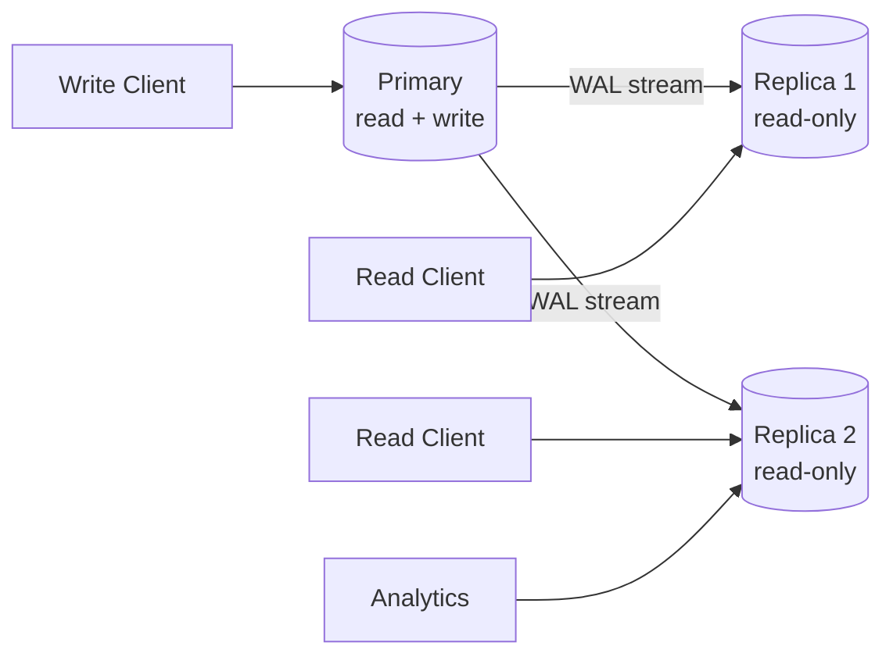
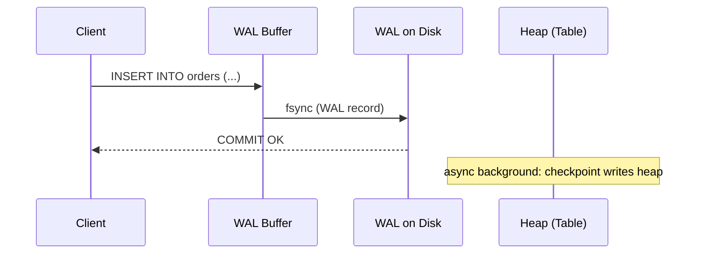
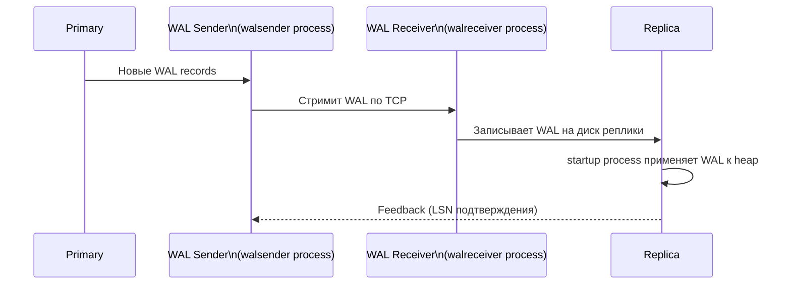
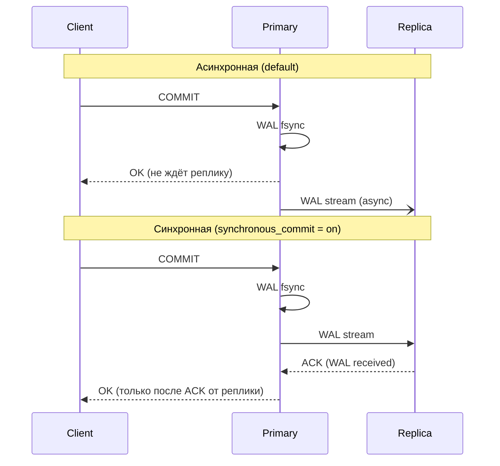
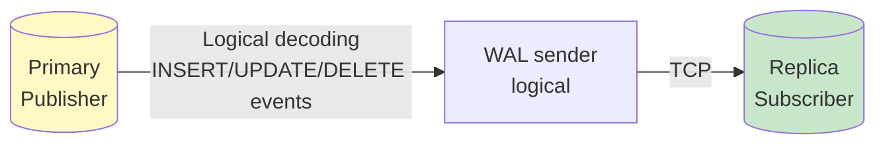

# Репликация в PostgreSQL

> Репликация — это не backup. Это масштабирование чтения и основа HA. WAL — единственное, что гарантирует durability и делает репликацию возможной.

## Содержание
- [Master-Replica топология](#master-replica-топология)
- [WAL — Write-Ahead Log](#wal--write-ahead-log)
- [Streaming Replication (Physical)](#streaming-replication-physical)
- [Синхронная vs асинхронная репликация](#синхронная-vs-асинхронная-репликация)
- [Logical Replication](#logical-replication)
- [Physical vs Logical — сравнение](#physical-vs-logical--сравнение)
- [Подводные камни](#подводные-камни)
- [См. также](#см-также)

---

## Master-Replica топология



**Primary (Master):** единственный узел, принимающий записи. Генерирует WAL.

**Replica (Standby):** применяет WAL от primary в режиме recovery. Обслуживает read-only запросы (`hot_standby = on`).

**Преимущества репликации:**
- Горизонтальное масштабирование читающих запросов
- Основа для HA (failover при падении primary)
- Аналитические запросы не нагружают primary

---

## WAL — Write-Ahead Log

**WAL (Write-Ahead Log)** — журнал всех изменений PostgreSQL. Каждое изменение данных сначала записывается в WAL, затем применяется к heap. Гарантирует **Durability** (буква D в ACID).



Порядок: сначала WAL на диск → потом COMMIT ответ клиенту → потом (асинхронно) heap. Если БД упадёт после COMMIT — WAL восстановит heap при следующем старте.

**Структура WAL:**
- Разбит на сегменты по 16MB (настраивается `wal_segment_size`)
- Каждая запись имеет **LSN (Log Sequence Number)** — монотонно возрастающий 64-bit указатель
- Хранится в `$PGDATA/pg_wal/`

```sql
-- Текущий LSN на primary
SELECT pg_current_wal_lsn();
-- → 0/15000000

-- Текущий LSN на replica
SELECT pg_last_wal_receive_lsn(), pg_last_wal_replay_lsn();

-- Отставание реплики в байтах
SELECT pg_wal_lsn_diff(
    pg_current_wal_lsn(),        -- primary LSN
    pg_last_wal_receive_lsn()    -- replica LSN
) AS lag_bytes;
```

---

## Streaming Replication (Physical)

**Physical replication** — побайтовое копирование WAL-потока. Реплика применяет те же WAL-записи, что primary записал на диск.



**Конфигурация на primary (`postgresql.conf`):**
```ini
wal_level = replica        # минимум для репликации
max_wal_senders = 10       # максимум одновременных реплик
wal_keep_size = 1GB        # сколько WAL хранить для отставших реплик
```

**Конфигурация на replica:**
```ini
# postgresql.conf
hot_standby = on           # разрешить read-only запросы на replica

# recovery.conf / postgresql.conf (PG 12+)
primary_conninfo = 'host=primary-host port=5432 user=replication'
```

```sql
-- Создать replication user на primary
CREATE ROLE replication LOGIN REPLICATION;

-- Посмотреть активные реплики
SELECT client_addr, state, sent_lsn, write_lsn, flush_lsn, replay_lsn,
       pg_wal_lsn_diff(sent_lsn, replay_lsn) AS lag_bytes
FROM pg_stat_replication;
```

---

## Синхронная vs асинхронная репликация



| | Синхронная | Асинхронная |
|--|:----------:|:-----------:|
| Primary ждёт | Подтверждения от реплики | Нет |
| RPO (потери данных) | 0 (нет потери) | > 0 (до нескольких секунд) |
| Latency COMMIT | Выше (+ roundtrip до реплики) | Ниже |
| Когда использовать | Финансы, критические данные | Аналитика, read replicas |

**RPO (Recovery Point Objective)** — максимально допустимые потери данных при аварии.
**RTO (Recovery Time Objective)** — максимально допустимое время восстановления.

```ini
# Синхронная репликация
synchronous_commit = on
synchronous_standby_names = 'replica1'  # ждать именно эту реплику

# Или: ждать хотя бы 1 из 2
synchronous_standby_names = 'ANY 1 (replica1, replica2)'

# remote_write: primary ждёт только записи WAL на диск реплики (не применения)
synchronous_commit = remote_write
```

**`synchronous_commit` уровни:**
- `off` — WAL не ждёт даже local fsync (максимальная производительность, риск потери данных при crash)
- `local` — ждёт local fsync, не ждёт реплику
- `remote_write` — ждёт запись WAL на диск реплики
- `on` — ждёт flush WAL на диск реплики
- `remote_apply` — ждёт применения WAL (строки видны на реплике)

---

## Logical Replication

**Logical replication** — репликация изменений на уровне строк (INSERT/UPDATE/DELETE событий), а не байт WAL.



**Паттерн: Pub/Sub**

```sql
-- На PRIMARY — создаём publication
CREATE PUBLICATION pub_orders
FOR TABLE orders, order_items;

-- Можно с фильтром (PostgreSQL 15+)
CREATE PUBLICATION pub_active_orders
FOR TABLE orders
WHERE (status != 'archived');

-- На REPLICA — создаём subscription
CREATE SUBSCRIPTION sub_orders
CONNECTION 'host=primary-host port=5432 dbname=shop user=replication'
PUBLICATION pub_orders;

-- Посмотреть статус subscription
SELECT subname, pid, received_lsn, latest_end_lsn
FROM pg_stat_subscription;
```

**Применения logical replication:**
- Репликация отдельных таблиц (не всей БД)
- Нулевое downtime при major version upgrade (реплицировать на новую версию)
- CDC (Change Data Capture) для потоковой обработки через Debezium
- Реплицировать в другую СУБД через logical decoding plugins

---

## Physical vs Logical — сравнение

| | Physical (Streaming) | Logical |
|--|:-------------------:|:-------:|
| Что реплицируется | Байты WAL (всё) | Строки (DML события) |
| Granularity | Вся БД или tablespace | Отдельные таблицы, строки |
| Cross-version | Нет (идентичные major versions) | Да (разные major versions) |
| Фильтрация | Нет | Можно WHERE (PG 15+) |
| DDL реплицируется | Да (автоматически) | Нет (нужно вручную) |
| Overhead | Меньше | Больше (logical decoding) |
| Failover | Встроен в Patroni | Сложнее |
| Типичное использование | HA, read replicas | CDC, upgrade, ETL |

---

## Подводные камни

**Replication slots и WAL накопление.** Если реплика отстаёт, primary держит WAL-сегменты (через replication slot). При длительной недоступности реплики WAL накапливается и может заполнить диск:

```sql
-- Посмотреть replication slots и накопленный WAL
SELECT slot_name, active, restart_lsn,
       pg_wal_lsn_diff(pg_current_wal_lsn(), restart_lsn) AS lag_bytes
FROM pg_replication_slots;

-- Удалить неактивный слот (если реплика не вернётся)
SELECT pg_drop_replication_slot('slot_name');
```

**Logical replication не реплицирует DDL.** `ALTER TABLE`, `CREATE INDEX`, `DROP COLUMN` — нужно выполнять вручную на обоих серверах. При несоответствии схем subscription ломается.

**Hot standby конфликты.** Если реплика выполняет долгий запрос, а primary пытается применить WAL с vacuum/удалением строк, которые читает запрос — возникает конфликт. PostgreSQL отменяет запрос на реплике:
```
ERROR: canceling statement due to conflict with recovery
```
Решение: увеличить `max_standby_streaming_delay` или `hot_standby_feedback = on`.

**Асинхронная репликация = stale reads.** После failover на реплику — клиент может увидеть данные, которые первичный сервер записал, но реплика не успела применить. Важно это учитывать в бизнес-логике.

---

## См. также

- [08-high-availability.md](./08-high-availability.md) — Patroni автоматизирует failover поверх streaming replication
- [06-sharding.md](./06-sharding.md) — репликация внутри каждого шарда
