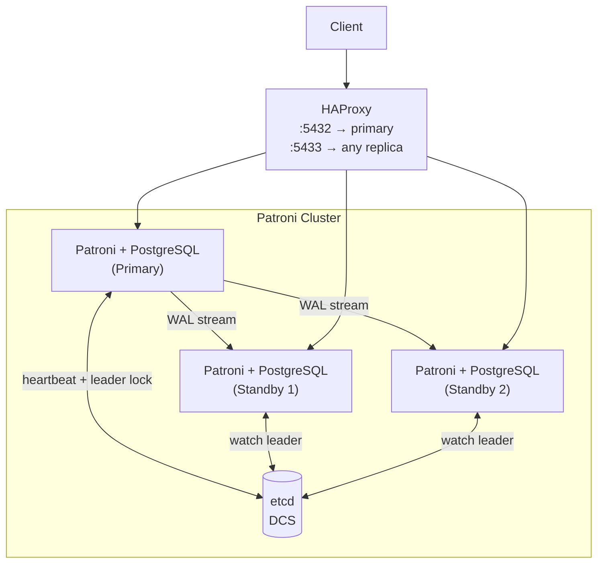
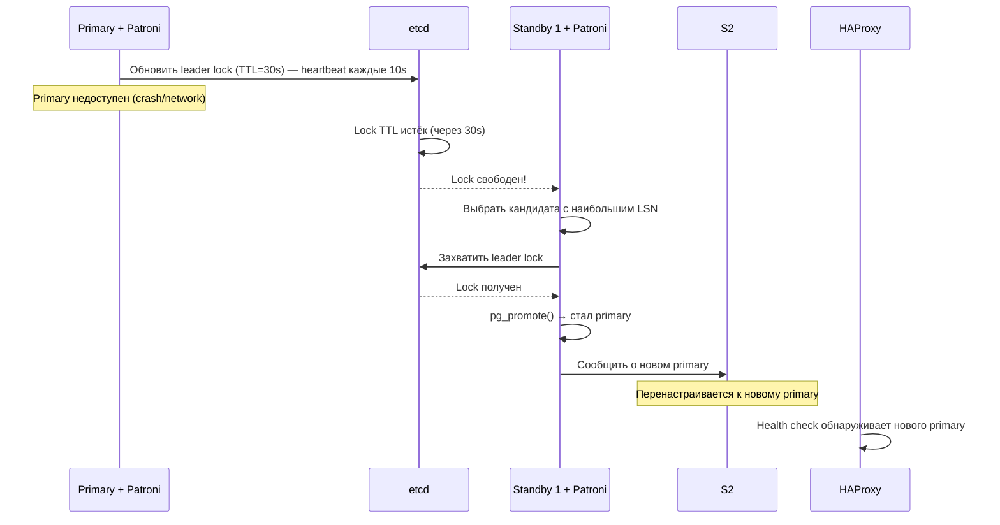
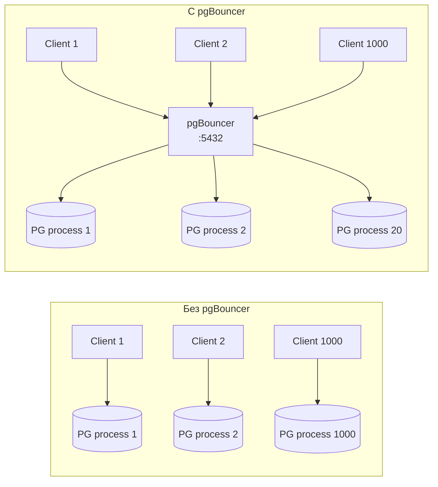
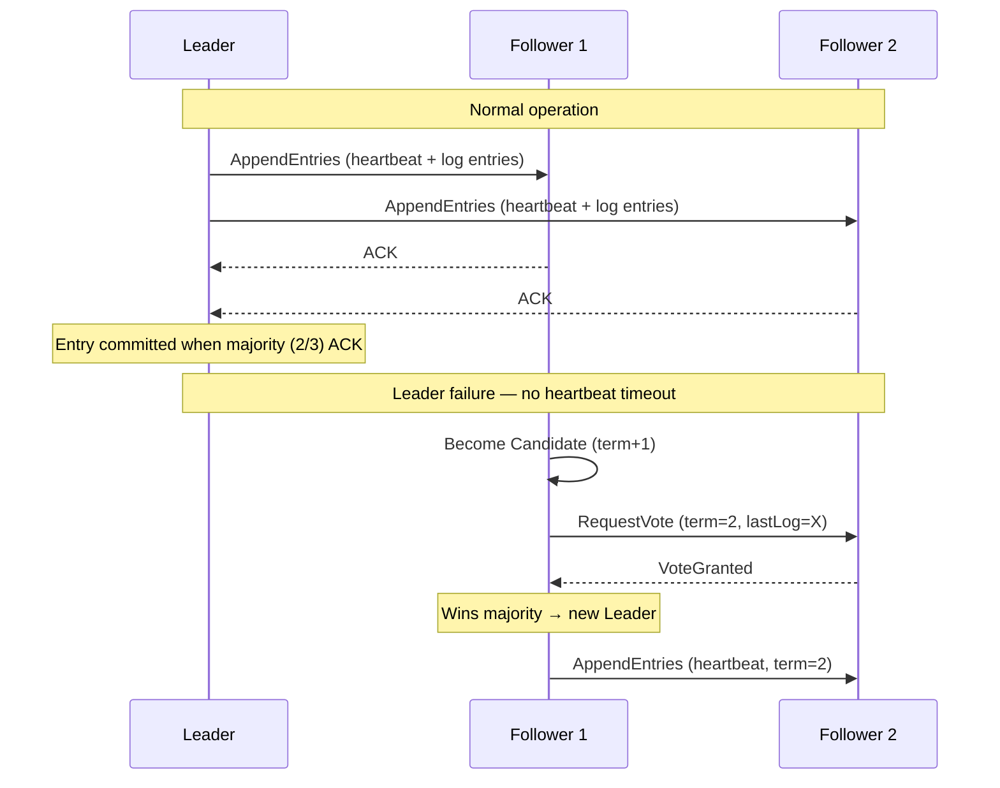
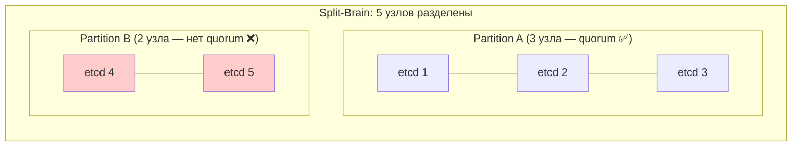

# High Availability: Patroni, pgBouncer, Raft

> HA — это не «два сервера». Это автоматический failover с гарантией консистентности через distributed consensus. Без quorum — split-brain.

## Содержание
- [Active-Passive vs Active-Active](#active-passive-vs-active-active)
- [Patroni — автоматический failover](#patroni--автоматический-failover)
- [pgBouncer — connection pooling](#pgbouncer--connection-pooling)
- [Raft consensus (etcd)](#raft-consensus-etcd)
- [Подводные камни](#подводные-камни)
- [См. также](#см-также)

---

## Active-Passive vs Active-Active

**Active-Passive:**
- Один primary принимает записи, реплики в hot standby
- При падении primary — failover к одной из реплик
- ✅ Простота, строгая консистентность
- ❌ Простои при failover (30–60 сек без automation)

**Active-Active:**
- Несколько узлов одновременно принимают записи
- Требует механизм разрешения конфликтов записи
- ✅ Нет downtime при failover, geographic distribution
- ❌ Сложность, eventual consistency, конфликты

Примеры Active-Active: CockroachDB, YugabyteDB, Cassandra (multi-master).

PostgreSQL нативно — Active-Passive. Active-Active через BDR (Bi-Directional Replication) от pgEdge/EDB.

---

## Patroni — автоматический failover

**Patroni** — демон HA для PostgreSQL. Управляет кластером через DCS (Distributed Coordination Service: etcd, ZooKeeper, Consul). Хранит leader lock в DCS — кто держит lock, тот primary.



### Алгоритм failover



**Конфигурация Patroni (`patroni.yaml`):**
```yaml
name: pg-node-1
scope: my-cluster

etcd3:
  hosts: etcd1:2379,etcd2:2379,etcd3:2379

postgresql:
  listen: 0.0.0.0:5432
  connect_address: 10.0.0.1:5432
  data_dir: /var/lib/postgresql/data
  parameters:
    wal_level: replica
    max_wal_senders: 10
    hot_standby: on

bootstrap:
  dcs:
    ttl: 30              # TTL leader lock в секундах
    loop_wait: 10        # интервал heartbeat
    retry_timeout: 10
    maximum_lag_on_failover: 1048576  # max lag реплики для failover (1MB)
```

**HAProxy проверяет роль через Patroni REST API:**
```
GET http://node:8008/master   → 200 если primary, 503 если нет
GET http://node:8008/replica  → 200 если replica, 503 если нет
```

---

## pgBouncer — connection pooling

PostgreSQL создаёт новый **процесс** на каждое соединение (не поток). При 1000 соединений — 1000 процессов с overhead памяти и context switch.



**Режимы пулинга:**

| Режим | Когда соединение занято | Ограничения |
|-------|------------------------|-------------|
| `session` | На всю сессию клиента | Нет (как без pooler) |
| `transaction` | Только на время транзакции ← **основной** | Нельзя: `SET`, `PREPARE`, `LISTEN`, advisory locks |
| `statement` | На один оператор | Нельзя транзакции из нескольких операторов |

```ini
# pgbouncer.ini
[databases]
shop = host=127.0.0.1 port=5432 dbname=shop

[pgbouncer]
pool_mode = transaction
max_client_conn = 2000      # клиентских соединений
default_pool_size = 20      # реальных соединений к PostgreSQL
min_pool_size = 5
server_reset_query = DISCARD ALL
server_check_delay = 30
log_connections = 0
log_disconnections = 0
```

```sql
-- Мониторинг pgBouncer
SHOW POOLS;    -- активные пулы, ожидающие клиенты
SHOW CLIENTS;  -- текущие клиентские соединения
SHOW SERVERS;  -- соединения к PostgreSQL
SHOW STATS;    -- запросы/сек, объём данных
```

**Типичная конфигурация:** 10–20 соединений к PostgreSQL на сервере приложений, до 200–500 клиентских соединений через pgBouncer.

---

## Raft consensus (etcd)

DCS (etcd, ZooKeeper, Consul) хранит leader lock и конфигурацию кластера. Внутри используют consensus-алгоритмы для согласованного состояния при сбоях.

**Raft** — алгоритм distributed consensus (используется в etcd):



**Ключевые свойства Raft:**
- Лидер выбирается **большинством голосов (quorum)**
- Кластер работоспособен при `⌊N/2⌋ + 1` живых узлах
  - 3 узла → 2 для quorum (терпит 1 сбой)
  - 5 узлов → 3 для quorum (терпит 2 сбоя)
- Все записи проходят через лидера → строгая линеаризуемость
- **Paxos** — более ранний алгоритм, математически строгий, сложнее для понимания и реализации; Raft создавался как «понятный Paxos»

**Практическое следствие для Patroni:** нечётное число узлов etcd. При split-brain (network partition) один сегмент имеет quorum и продолжает работу, другой — нет.



Partition B не сможет обновить leader lock → Patroni на этих узлах не станет primary.

---

## Подводные камни

**TTL слишком короткий** — ложные failover при кратковременном spike нагрузки (primary не успевает обновить lock). Рекомендация: TTL ≥ 30 сек, heartbeat ≤ TTL/3.

**`transaction` mode pgBouncer несовместим с `SET`/`PREPARE`/advisory locks.** Состояние сессии сбрасывается при возврате соединения в пул (`DISCARD ALL`). Если приложение использует prepared statements — нужен `session` mode или `server_reset_query = ""`.

**PgBouncer как SPOF.** Один pgBouncer — single point of failure. Продакшн: два pgBouncer с keepalived/HAProxy перед ними.

**Failover ≠ мгновенный переход.** Patroni failover занимает TTL + время promote (~30–60 сек). Приложение должно обрабатывать ошибки подключения и иметь retry-логику.

**Replication lag при failover.** Если реплика отстала от primary (lag > 0), при promote она не имеет последних транзакций. Patroni настраивает `maximum_lag_on_failover` — реплики с большим lag не участвуют в выборах.

---

## См. также

- [07-replication.md](./07-replication.md) — streaming replication, на которой строится Patroni
- [06-sharding.md](./06-sharding.md) — HA внутри каждого шарда
