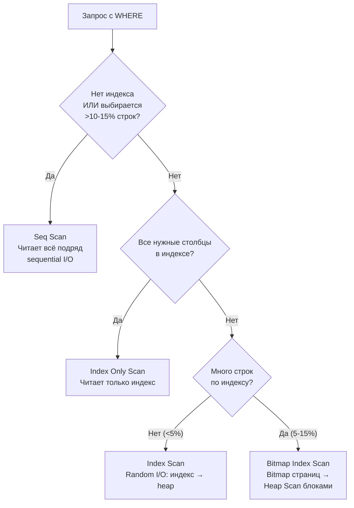

# Оптимизация запросов в PostgreSQL

> EXPLAIN ANALYZE — главный инструмент. Без него оптимизация — гадание. С ним — диагностика по фактам: реальное vs оценочное число строк, типы сканирований, утечки памяти.

## Содержание
- [EXPLAIN и EXPLAIN ANALYZE](#explain-и-explain-analyze)
- [Чтение вывода EXPLAIN](#чтение-вывода-explain)
- [Типы сканирований](#типы-сканирований)
- [Query Planner и cost model](#query-planner-и-cost-model)
- [Типичные проблемы и решения](#типичные-проблемы-и-решения)
- [Партиционирование таблиц](#партиционирование-таблиц)
- [Параллельные запросы](#параллельные-запросы)
- [Подводные камни](#подводные-камни)
- [См. также](#см-также)

---

## EXPLAIN и EXPLAIN ANALYZE

```sql
-- EXPLAIN: показывает plan (не выполняет запрос)
EXPLAIN SELECT * FROM orders WHERE user_id = 5;

-- EXPLAIN ANALYZE: выполняет запрос, показывает реальное vs. estimated
EXPLAIN (ANALYZE, BUFFERS, FORMAT TEXT)
SELECT o.id, u.name, SUM(oi.price)
FROM orders o
JOIN users u ON o.user_id = u.id
JOIN order_items oi ON oi.order_id = o.id
WHERE o.created_at > '2024-01-01'
GROUP BY o.id, u.name;
```

**Опции EXPLAIN:**
- `ANALYZE` — выполнить и показать реальные данные
- `BUFFERS` — показать использование shared buffers (cache hit/miss)
- `FORMAT TEXT|JSON|XML` — формат вывода (JSON удобен для автоматического анализа)
- `VERBOSE` — имена столбцов, output list каждого узла
- `SETTINGS` — показать параметры GUC, влияющие на plan

---

## Чтение вывода EXPLAIN

```
Gather  (cost=1000.00..11000.00 rows=5000 width=36)
        (actual time=10.5..45.2 rows=4850 loops=1)
  Workers Planned: 2
  ->  Parallel Hash Join  (cost=500.00..9500.00 rows=2083 width=36)
        Hash Cond: (orders.user_id = users.id)
        Buffers: shared hit=1240 read=380
        ->  Parallel Seq Scan on orders  (cost=0..8000.00 rows=83333)
              (actual time=0.1..12.3 rows=83200 loops=3)
        ->  Hash
              Buckets: 1024  Batches: 1  Memory Usage: 48kB
              ->  Seq Scan on users  (cost=0..250.00 rows=5000)
                    (actual time=0.1..1.2 rows=4950 loops=1)
  Planning Time: 2.3 ms
  Execution Time: 47.8 ms
```

**`cost=startup..total`:**
- Не миллисекунды — условные единицы (относительно `seq_page_cost = 1.0`)
- `startup` — стоимость до выдачи первой строки
- `total` — стоимость выдачи всех строк
- Сравнивать можно только внутри одного запроса

**`rows` — оценка planner vs `actual rows` — реальность:**
- Расхождение `rows=1000` vs `actual rows=100000` → устаревшая статистика → `ANALYZE`

**`loops=3`** — узел выполнялся 3 раза. `actual time` и `rows` — **per loop**, не total.

**`Buffers: shared hit=1240 read=380`:**
- `hit` — страницы из shared buffer cache (RAM)
- `read` — страницы с диска (I/O miss)
- Высокий `read` при медленном запросе → нужно прогреть кэш или добавить RAM

**Плохие признаки:**
- `rows=1000` → `actual rows=100000` — плохая статистика
- `Seq Scan` на большой таблице с `WHERE` — нет индекса или planner игнорирует
- `Hash Batches: 8` — хеш-таблица спилилась на диск, нужно больше `work_mem`
- `Nested Loop` на двух больших таблицах без индекса — O(N²)

---

## Типы сканирований



| Тип | I/O pattern | Когда | Особенности |
|-----|------------|-------|------------|
| **Seq Scan** | Sequential | Нет индекса / >10-15% строк | Быстро при чтении всей таблицы |
| **Index Scan** | Random | Высокая selectivity (<5%) | Для каждой строки — heap fetch |
| **Index Only Scan** | Sequential | Covering index | Не ходит в heap — самый быстрый |
| **Bitmap Index Scan** | Semi-sequential | 5-15% строк / OR по индексам | Строит bitmap страниц, читает батчами |

**Bitmap Scan — детально:**
```
1. Bitmap Index Scan: для каждой совпадающей строки отмечаем страницу в bitmap
2. Recheck Cond: если строк много — bitmap lossy (только страницы, без точных строк)
   → нужна повторная проверка условия при чтении heap
3. Bitmap Heap Scan: читает страницы из bitmap по порядку (почти sequential)

Полезно для: OR по двум индексам (BitmapOr), range queries
```

```sql
-- Пример Bitmap Scan с BitmapOr
SELECT * FROM orders WHERE user_id = 5 OR status = 'urgent';
-- Plan:
-- Bitmap Heap Scan on orders
--   -> BitmapOr
--       -> Bitmap Index Scan on idx_user_id
--       -> Bitmap Index Scan on idx_status
```

---

## Query Planner и cost model

PostgreSQL Query Planner оценивает стоимость каждого возможного плана и выбирает минимальный. Оценка основана на **cost model** и статистике.

```ini
# postgresql.conf — настройки cost model
seq_page_cost = 1.0        # стоимость sequential read одной страницы
random_page_cost = 4.0     # стоимость random read (HDD). Для SSD: 1.1–2.0
cpu_tuple_cost = 0.01      # CPU на обработку строки
cpu_index_tuple_cost = 0.005
cpu_operator_cost = 0.0025
```

```sql
-- На SSD снижаем random_page_cost → planner чаще выбирает Index Scan
SET random_page_cost = 1.5;
-- Или в конфиге:
-- random_page_cost = 1.5
```

**Статистика для planner** (обновляется через `ANALYZE`):

```sql
-- Посмотреть статистику по столбцу
SELECT attname, n_distinct, most_common_vals, most_common_freqs,
       histogram_bounds, correlation
FROM pg_stats
WHERE tablename = 'orders' AND attname = 'status';

-- n_distinct: число уникальных значений
-- most_common_vals/freqs: топ значений и их частоты
-- histogram_bounds: распределение остальных значений
-- correlation: физическая корреляция с порядком строк (1.0 = идеально коррелирует → хорош для Index Scan)
```

```sql
-- Увеличить детализацию статистики для столбца с широким распределением
ALTER TABLE orders ALTER COLUMN amount SET STATISTICS 500;  -- дефолт 100
ANALYZE orders;
```

---

## Типичные проблемы и решения

### Planner выбирает Seq Scan вместо Index Scan

```sql
-- Причина 1: устаревшая статистика
ANALYZE orders;

-- Причина 2: функция вокруг индексированного столбца (отключает индекс)
-- ❌ Planner не знает, что UPPER(email) покрыт индексом на email
SELECT * FROM users WHERE UPPER(email) = 'USER@EXAMPLE.COM';
-- ✅ Функциональный индекс:
CREATE INDEX ON users (UPPER(email));

-- Причина 3: неявное приведение типов
-- Индекс на integer, но передаём строку:
SELECT * FROM orders WHERE user_id = '12345';  -- implicit cast → no index

-- Причина 4: low cardinality — выбирается слишком много строк
-- Planner прав: Seq Scan быстрее чем 50% строк через Index Scan
```

### Медленный COUNT(*)

```sql
-- ❌ Точный COUNT: всегда Seq Scan
SELECT COUNT(*) FROM events;  -- на 100M строк — несколько секунд

-- ✅ Быстрая приблизительная оценка (из pg_class, обновляется ANALYZE)
SELECT reltuples::bigint FROM pg_class WHERE relname = 'events';

-- ✅ Через EXPLAIN (rows= — оценка planner)
EXPLAIN SELECT 1 FROM events;
```

### Медленный ORDER BY + LIMIT

```sql
-- ❌ Sort всей таблицы, потом Limit
SELECT * FROM products ORDER BY created_at DESC LIMIT 10;

-- ✅ Index Scan по индексу (данные уже отсортированы → Index Scan с LIMIT=10 останавливается сразу)
CREATE INDEX ON products (created_at DESC);
SELECT * FROM products ORDER BY created_at DESC LIMIT 10;
-- → Index Scan, читает ровно 10 страниц
```

### Медленная пагинация OFFSET

```sql
-- ❌ OFFSET: PostgreSQL сканирует и отбрасывает N строк
SELECT * FROM products ORDER BY id LIMIT 20 OFFSET 10000;
-- Стоимость: O(offset + limit)

-- ✅ Keyset pagination (cursor-based): читает ровно 20 строк
SELECT * FROM products
WHERE id > 10000             -- последний id предыдущей страницы
ORDER BY id
LIMIT 20;
-- Стоимость: O(limit) при наличии индекса на id
```

### Hash Batches > 1

```sql
-- ❌ Хеш-таблица не помещается в work_mem → spill to disk
-- Hash Batches: 8 в EXPLAIN

-- ✅ Увеличить work_mem для конкретного запроса
SET work_mem = '256MB';
-- Или в postgresql.conf (для всех запросов) — осторожно: work_mem × max_connections
```

---

## Партиционирование таблиц

Декларативное партиционирование PostgreSQL 10+. Planner делает **Partition Pruning** — обращается только к нужным партициям.

```sql
-- Создать партиционированную таблицу
CREATE TABLE events (
    id BIGSERIAL,
    created_at TIMESTAMPTZ NOT NULL,
    data JSONB
) PARTITION BY RANGE (created_at);

-- Партиции
CREATE TABLE events_2024_q1 PARTITION OF events
    FOR VALUES FROM ('2024-01-01') TO ('2024-04-01');

CREATE TABLE events_2024_q2 PARTITION OF events
    FOR VALUES FROM ('2024-04-01') TO ('2024-07-01');

-- Planner использует только нужную партицию
EXPLAIN SELECT * FROM events WHERE created_at = '2024-02-15';
-- → Seq Scan on events_2024_q1  (только эта партиция!)
```

```sql
-- Партиционирование по хешу (равномерное распределение)
CREATE TABLE orders (user_id INT, ...)
PARTITION BY HASH (user_id);

CREATE TABLE orders_0 PARTITION OF orders FOR VALUES WITH (MODULUS 4, REMAINDER 0);
CREATE TABLE orders_1 PARTITION OF orders FOR VALUES WITH (MODULUS 4, REMAINDER 1);
CREATE TABLE orders_2 PARTITION OF orders FOR VALUES WITH (MODULUS 4, REMAINDER 2);
CREATE TABLE orders_3 PARTITION OF orders FOR VALUES WITH (MODULUS 4, REMAINDER 3);
```

**Преимущества партиционирования:**
- Partition Pruning: запрос читает только нужные партиции
- Быстрое удаление старых данных: `DROP TABLE events_2023_q1` вместо тысяч `DELETE`
- Автоматическое добавление новых партиций через cron/pg_partman
- Параллельный Seq Scan по партициям

```sql
-- pg_partman для автоматического создания партиций
SELECT partman.create_parent(
    p_parent_table := 'public.events',
    p_control := 'created_at',
    p_type := 'range',
    p_interval := 'monthly'
);
```

---

## Параллельные запросы

PostgreSQL автоматически распараллеливает тяжёлые запросы с `Gather` / `Gather Merge` узлом:

```sql
SET max_parallel_workers_per_gather = 4;

-- EXPLAIN покажет:
-- Gather (cost=...)
--   Workers Planned: 4
--   -> Parallel Seq Scan on large_table
--        Workers Launched: 4
```

```ini
# postgresql.conf
max_parallel_workers_per_gather = 4   # воркеры на один запрос
max_parallel_workers = 8              # всего воркеров параллельных запросов
min_parallel_table_scan_size = 8MB    # минимальный размер таблицы для параллелизма
```

```sql
-- Отключить параллелизм для конкретного запроса (OLTP):
SET max_parallel_workers_per_gather = 0;
```

---

## Подводные камни

**`EXPLAIN` без `ANALYZE` врёт.** Plan без реальных данных — только оценки. При диагностике медленных запросов всегда использовать `EXPLAIN (ANALYZE, BUFFERS)`.

**`EXPLAIN ANALYZE` на `DELETE`/`UPDATE` — данные изменятся.** В транзакции с откатом:
```sql
BEGIN;
EXPLAIN ANALYZE DELETE FROM orders WHERE status = 'test';
ROLLBACK;
```

**Planner cache в prepared statements.** Prepared statement с `PLAN_CACHE_INVALIDATION_THRESHOLD` может использовать старый plan. При смене распределения данных — `DEALLOCATE ALL` или параметр `plan_cache_mode = force_generic_plan`.

**`pg_stat_statements` — статистика всех запросов:**
```sql
-- Топ запросов по суммарному времени
SELECT query, calls, total_exec_time, mean_exec_time,
       rows, shared_blks_hit, shared_blks_read
FROM pg_stat_statements
ORDER BY total_exec_time DESC
LIMIT 20;
```

---

## См. также

- [04-indexes.md](./04-indexes.md) — правильные индексы устраняют Seq Scan
- [05-join-algorithms.md](./05-join-algorithms.md) — диагностика Hash/Nested Loop/Merge Join через EXPLAIN
- [02-mvcc.md](./02-mvcc.md) — ANALYZE обновляет статистику, которую использует planner
