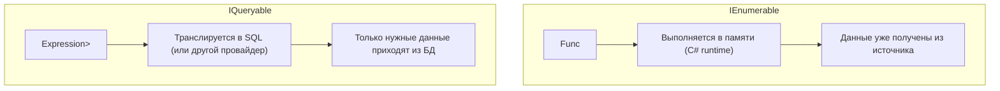
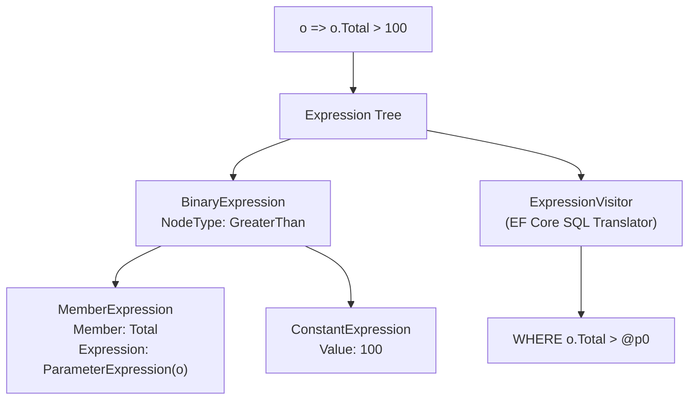
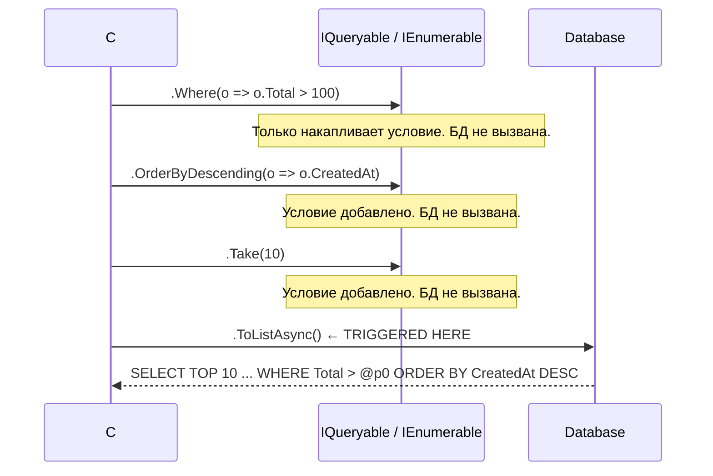
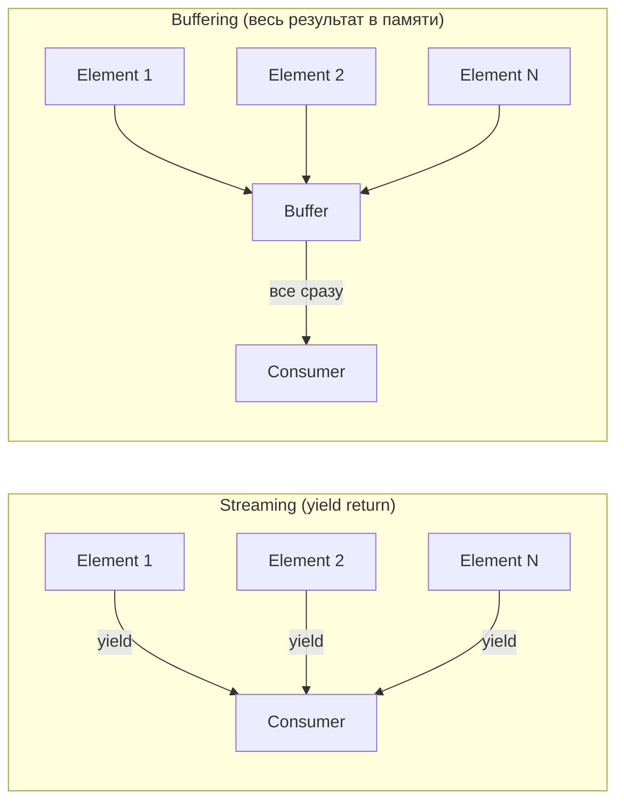

# LINQ: IEnumerable, IQueryable, Expression Trees, Deferred Execution

> LINQ — это не просто синтаксический сахар. IEnumerable и IQueryable — принципиально разные механизмы. Понять разницу значит понять, почему одна строка LINQ уходит в БД, а другая тащит весь датасет в память.

## Содержание
- [Query vs Method Syntax](#query-vs-method-syntax)
- [IEnumerable vs IQueryable](#ienumerable-vs-iqueryable)
- [Expression Trees](#expression-trees)
- [Deferred Execution](#deferred-execution)
- [Streaming vs Buffering](#streaming-vs-buffering)
- [Multiple Enumeration Problem](#multiple-enumeration-problem)
- [Подводные камни](#подводные-камни)
- [См. также](#см-также)

---

## Query vs Method Syntax

Оба синтаксиса компилятор превращает в идентичный IL. Query syntax — синтаксический сахар над method syntax.

```csharp
// Query syntax — ближе к SQL
var result =
    from o in orders
    where o.Total > 100 && o.Status == OrderStatus.Confirmed
    orderby o.CreatedAt descending
    select new { o.Id, o.Total };

// Method syntax — то, во что компилятор разворачивает query syntax
var result = orders
    .Where(o => o.Total > 100 && o.Status == OrderStatus.Confirmed)
    .OrderByDescending(o => o.CreatedAt)
    .Select(o => new { o.Id, o.Total });
```

Query syntax не поддерживает часть операторов (`GroupJoin`, `Zip`, `SkipWhile`, `TakeWhile`). В реальных проектах method syntax встречается чаще.

---

## IEnumerable vs IQueryable

Это фундаментальная разница — не просто интерфейсы, а разные стратегии исполнения.



| | `IEnumerable<T>` | `IQueryable<T>` |
|--|---|---|
| Пространство имён | `System.Collections.Generic` | `System.Linq` |
| Где выполняется | В памяти (CLR) | На источнике данных (БД, API) |
| Параметр фильтра | `Func<T, bool>` | `Expression<Func<T, bool>>` |
| Когда использовать | In-memory коллекции, LINQ to Objects | EF Core, OData, любой провайдер |
| Цепочки операторов | Каждый шаг — новый итератор | Дерево выражений накапливается до исполнения |

```csharp
// Список в памяти — IEnumerable, фильтрация в C#
List<Order> inMemory = GetOrdersFromSomewhere();
var filtered = inMemory.Where(o => o.Total > 100); // Func<Order, bool>
// При итерации: C# выполняет лямбду для каждого элемента списка

// EF Core DbSet — IQueryable, фильтрация в SQL
IQueryable<Order> query = dbContext.Orders;
var filtered = query.Where(o => o.Total > 100); // Expression<Func<Order, bool>>
// При итерации: EF транслирует Expression в WHERE Total > @p0
```

**Критичная ошибка** — преждевременный переход на IEnumerable:

```csharp
// WRONG: AsEnumerable() тащит все заказы из БД в память, потом фильтрует в C#
var highValue = dbContext.Orders
    .AsEnumerable()          // ← здесь всё загружается из БД
    .Where(o => o.Total > 100);

// CORRECT: Where транслируется в SQL
var highValue = dbContext.Orders
    .Where(o => o.Total > 100);  // ← только нужные строки из БД
```

---

## Expression Trees

Expression Tree — это представление лямбды не как исполняемого кода, а как структуры данных, которую можно анализировать и транслировать.



```csharp
// Func<T, bool> — скомпилированный делегат, непрозрачный для анализа
Func<Order, bool> func = o => o.Total > 100;
// func.Method — можно вызвать, нельзя проанализировать структуру

// Expression<Func<T, bool>> — дерево, доступное для обхода
Expression<Func<Order, bool>> expr = o => o.Total > 100;
// expr.Body — BinaryExpression (GreaterThan)
// expr.Body.Left — MemberExpression (Total)
// expr.Body.Right — ConstantExpression (100)

// EF Core обходит это дерево своим ExpressionVisitor
// и генерирует: WHERE "Total" > @p0
```

Именно поэтому `IQueryable.Where` принимает `Expression<Func<T, bool>>`, а не `Func<T, bool>` — провайдер должен уметь прочитать структуру условия, а не просто вызвать его.

---

## Deferred Execution

LINQ-запрос не выполняется при объявлении. Выполнение откладывается до первой итерации.



**Операторы, вызывающие немедленное исполнение (терминальные):**

| Оператор | Описание |
|----------|----------|
| `ToList()` / `ToListAsync()` | Материализует в `List<T>` |
| `ToArray()` / `ToArrayAsync()` | Материализует в `T[]` |
| `ToDictionary()` | Материализует в `Dictionary<K,V>` |
| `First()` / `FirstOrDefault()` | Получает первый элемент |
| `Single()` / `SingleOrDefault()` | Получает один элемент |
| `Count()` / `LongCount()` | Считает количество |
| `Any()` / `All()` | Проверяет условие |
| `Sum()`, `Min()`, `Max()`, `Average()` | Агрегаты |
| `foreach` цикл | Итерация |
| `await foreach` | Асинхронная итерация |

**Операторы, не вызывающие исполнение (ленивые):**

`Where`, `Select`, `OrderBy`, `Skip`, `Take`, `GroupBy`, `Join`, `SelectMany` — возвращают `IQueryable<T>` или `IEnumerable<T>`, накапливают запрос.

```csharp
// Deferred execution — запрос не выполняется при объявлении
IQueryable<Order> query = dbContext.Orders
    .Where(o => o.CustomerId == customerId);   // нет запроса к БД

// Условие можно динамически дополнять
if (status.HasValue)
    query = query.Where(o => o.Status == status.Value);  // всё ещё нет запроса

if (minTotal > 0)
    query = query.Where(o => o.Total >= minTotal);       // всё ещё нет запроса

// Запрос идёт в БД только здесь — один финальный SQL с тремя WHERE
var orders = await query.ToListAsync();
```

---

## Streaming vs Buffering

**Streaming-операторы** возвращают элементы по одному через `yield return` без накопления в памяти.

**Buffering-операторы** сначала собирают все элементы, потом выдают результат.



| Тип | Операторы |
|-----|-----------|
| **Streaming** | `Where`, `Select`, `Take`, `Skip`, `SelectMany`, `Cast`, `OfType` |
| **Buffering (partial)** | `OrderBy` / `ThenBy` — нужно видеть все элементы для сортировки |
| **Buffering (full)** | `GroupBy`, `Reverse`, `ToList`, `ToArray`, `ToDictionary`, `Distinct` |

```csharp
// Streaming — Where обрабатывает элементы по одному, не буферизует
IEnumerable<int> StreamingExample()
{
    foreach (var n in Enumerable.Range(1, 1_000_000))
    {
        if (n % 2 == 0)
            yield return n;    // элементы уходят потребителю по одному
    }
}

// Buffering — OrderBy вынужден прочитать всё перед возвратом первого элемента
var sorted = Enumerable.Range(1, 1_000_000).OrderBy(x => x);
// Всё 1 000 000 элементов материализуются в памяти при первом доступе
```

Для `IQueryable` (EF Core) это разграничение не так критично — всё равно SQL выполняется одним запросом. Для `IEnumerable` (in-memory LINQ) — важно при работе с большими коллекциями.

---

## Multiple Enumeration Problem

Каждая итерация `IEnumerable<T>` или `IQueryable<T>` может выполнять запрос заново.

```csharp
// WRONG: двойное обращение к БД
IQueryable<Order> orders = dbContext.Orders.Where(o => o.Total > 100);

int count = orders.Count();             // SELECT COUNT(*)... → запрос 1
List<Order> list = orders.ToList();     // SELECT * ...      → запрос 2
// Два запроса к БД, хотя могло быть один

// CORRECT: материализуй один раз
List<Order> orders = await dbContext.Orders
    .Where(o => o.Total > 100)
    .ToListAsync();                     // один запрос

int count = orders.Count;               // в памяти
```

**Для IEnumerable** (без EF) ситуация ещё хуже — каждая итерация перезапускает итератор:

```csharp
IEnumerable<Order> GetOrders()
{
    Console.WriteLine("Fetching from expensive source...");
    return expensiveSource.GetOrders();  // каждый вызов — IO операция
}

var orders = GetOrders();       // нет IO пока не итерируем
int count = orders.Count();     // IO вызов 1
var first = orders.First();     // IO вызов 2
var list = orders.ToList();     // IO вызов 3

// Решение: материализовать
var orders = GetOrders().ToList();  // один IO вызов
```

Компиляторные анализаторы (`ReSharper`, `Rider`) предупреждают о multiple enumeration — это PossibleMultipleEnumeration.

---

## Подводные камни

**Closure capture в лямбдах:**

```csharp
// WRONG: переменная захватывается по ссылке
var statuses = new[] { OrderStatus.Pending, OrderStatus.Confirmed };
List<IQueryable<Order>> queries = new();

foreach (var status in statuses)
{
    queries.Add(dbContext.Orders.Where(o => o.Status == status));
}

// При выполнении queries[0] — status уже Confirmed (последнее значение foreach)
// Оба запроса вернут Confirmed-заказы

// CORRECT: захвати локальную копию
foreach (var status in statuses)
{
    var localStatus = status;    // локальная переменная
    queries.Add(dbContext.Orders.Where(o => o.Status == localStatus));
}
```

**Операторы, не транслируемые в SQL:**

```csharp
// EF Core не может транслировать произвольные C# методы
var orders = dbContext.Orders
    .Where(o => MyCustomMethod(o.Total))  // NotSupportedException!
    .ToList();

// Решение: вынести логику, которую EF не знает, на сторону клиента
var orders = dbContext.Orders
    .ToList()                             // сначала загрузить в память
    .Where(o => MyCustomMethod(o.Total)); // потом фильтровать в C#
// Но это тащит весь датасет — см. раздел client/server evaluation
```

---

## См. также

- [02-efcore-architecture.md](./02-efcore-architecture.md) — DbContext, Change Tracker, как IQueryable связывается с EF
- [03-efcore-queries.md](./03-efcore-queries.md) — LINQ→SQL трансляция, Include, клиентское вычисление
