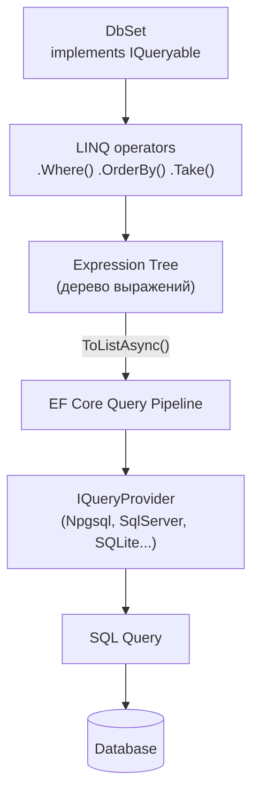
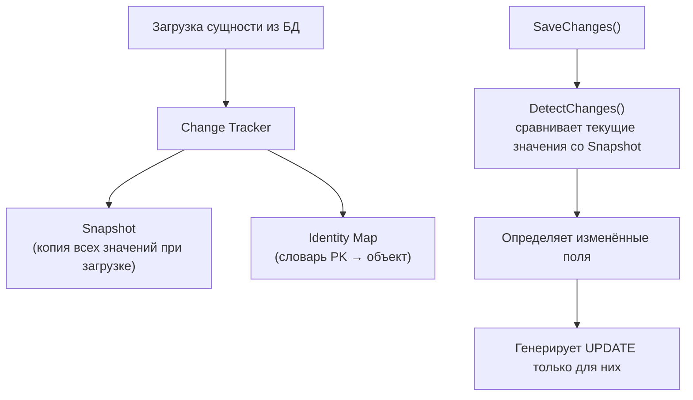
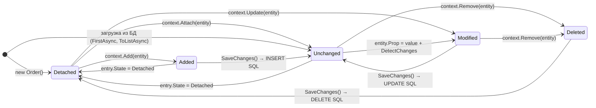
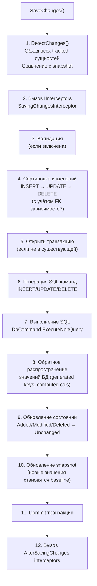

# EF Core: DbContext, Change Tracker, SaveChanges

> DbContext — это Unit of Work + Repository в одном. Change Tracker — мозг, который знает, что изменилось. SaveChanges — транзакция, которая сбрасывает накопленные изменения в БД одним пакетом.

## Содержание
- [DbContext: архитектура](#dbcontext-архитектура)
- [IDbContextFactory: параллельное использование](#idbcontextfactory-параллельное-использование)
- [DbSet как IQueryable-провайдер](#dbset-как-iqueryable-провайдер)
- [Change Tracker: snapshot vs notification](#change-tracker-snapshot-vs-notification)
- [5 состояний сущности](#5-состояний-сущности)
- [SaveChanges: внутренний pipeline](#savechanges-внутренний-pipeline)
- [Управление соединением](#управление-соединением)
- [Подводные камни](#подводные-камни)
- [См. также](#см-также)

---

## DbContext: архитектура

`DbContext` реализует два паттерна одновременно:

- **Unit of Work** — отслеживает все изменения за время жизни объекта и сбрасывает их одной транзакцией через `SaveChanges()`
- **Repository** — предоставляет `DbSet<T>` как точки доступа к каждому типу сущностей

```csharp
/// <summary>
/// Application database context. Represents the Unit of Work for the order domain.
/// Lifetime: Scoped (one instance per HTTP request in ASP.NET Core).
/// </summary>
public class AppDbContext : DbContext
{
    public AppDbContext(DbContextOptions<AppDbContext> options) : base(options) { }

    public DbSet<Order> Orders { get; set; } = null!;
    public DbSet<Customer> Customers { get; set; } = null!;
    public DbSet<Product> Products { get; set; } = null!;

    protected override void OnModelCreating(ModelBuilder modelBuilder)
    {
        // Apply all IEntityTypeConfiguration<T> from this assembly
        modelBuilder.ApplyConfigurationsFromAssembly(typeof(AppDbContext).Assembly);
    }
}

// DI registration
builder.Services.AddDbContext<AppDbContext>(options =>
    options.UseNpgsql(connectionString)
           .EnableSensitiveDataLogging()   // dev only
           .LogTo(Console.WriteLine, LogLevel.Information));
```

`DbContext` — **не потокобезопасен**. Один экземпляр нельзя использовать из нескольких потоков одновременно. В ASP.NET Core он регистрируется как `Scoped` — по одному экземпляру на HTTP-запрос.

---

## IDbContextFactory: параллельное использование

Если нужно несколько параллельных запросов (фоновые сервисы, `Parallel.ForEachAsync`), используй фабрику — она создаёт отдельный `DbContext` для каждой задачи.

```csharp
// Registration
builder.Services.AddDbContextFactory<AppDbContext>(options =>
    options.UseNpgsql(connectionString));

// Usage in background service
public class ReportService
{
    private readonly IDbContextFactory<AppDbContext> _factory;

    public ReportService(IDbContextFactory<AppDbContext> factory)
        => _factory = factory;

    public async Task GenerateAsync(CancellationToken token)
    {
        // Each CreateDbContextAsync() returns a new independent DbContext instance
        await using var db1 = await _factory.CreateDbContextAsync(token);
        await using var db2 = await _factory.CreateDbContextAsync(token);

        // Truly parallel — two separate connections, two separate Change Trackers
        var task1 = db1.Orders.Where(o => o.Status == OrderStatus.Pending).ToListAsync(token);
        var task2 = db2.Customers.CountAsync(token);

        await Task.WhenAll(task1, task2);
    }
}
```

---

## DbSet как IQueryable-провайдер

`DbSet<T>` реализует `IQueryable<T>` — каждый LINQ-оператор добавляет узел в Expression Tree, а не выполняет запрос немедленно.



```csharp
// DbSet<T> — это IQueryable<T>, первый элемент цепочки
IQueryable<Order> query = dbContext.Orders;  // нет запроса к БД

// Каждый оператор добавляет узел в Expression Tree
query = query.Where(o => o.CustomerId == 42);        // Where node
query = query.OrderByDescending(o => o.CreatedAt);   // OrderBy node
query = query.Take(10);                              // Take node

// ToListAsync() — первый момент, когда EF транслирует дерево в SQL
var orders = await query.ToListAsync();
// SQL: SELECT ... FROM "Orders" WHERE "CustomerId" = @p0 ORDER BY "CreatedAt" DESC LIMIT 10
```

---

## Change Tracker: snapshot vs notification

Change Tracker отслеживает состояние всех загруженных сущностей, чтобы `SaveChanges()` мог сгенерировать только нужные SQL-команды.



**Snapshot tracking** (по умолчанию):
- При загрузке сущности EF делает копию всех её свойств (snapshot)
- При `SaveChanges()` вызывает `DetectChanges()` — сравнивает текущие значения со snapshot
- Изменённые поля идут в `UPDATE`

```csharp
var order = await dbContext.Orders.FindAsync(42);
// Change Tracker snapshot: { Status: Pending, Total: 99.99, ... }

order.Status = OrderStatus.Confirmed;
order.Total = 150m;
// Текущие значения отличаются от snapshot

await dbContext.SaveChangesAsync();
// DetectChanges видит: Status и Total изменились
// SQL: UPDATE "Orders" SET "Status" = @p0, "Total" = @p1 WHERE "Id" = @p2
// Только изменённые поля, не все!
```

**Notification tracking** — альтернатива для высоконагруженных сценариев. Сущность реализует `INotifyPropertyChanged`, Change Tracker подписывается на события. Нет нужды обходить все свойства при `DetectChanges()`.

```csharp
// Notification tracking — сущность сама уведомляет об изменениях
public class Order : INotifyPropertyChanged
{
    private OrderStatus _status;
    public OrderStatus Status
    {
        get => _status;
        set
        {
            _status = value;
            PropertyChanged?.Invoke(this, new PropertyChangedEventArgs(nameof(Status)));
        }
    }

    public event PropertyChangedEventHandler? PropertyChanged;
}

// Конфигурация в Fluent API
builder.HasChangeTrackingStrategy(ChangeTrackingStrategy.ChangedNotifications);
```

---

## 5 состояний сущности



```csharp
// Проверка состояния
var order = new Order { CustomerId = 1 };
dbContext.Entry(order).State;  // Detached

dbContext.Orders.Add(order);
dbContext.Entry(order).State;  // Added

await dbContext.SaveChangesAsync();
dbContext.Entry(order).State;  // Unchanged

order.Status = OrderStatus.Shipped;
dbContext.Entry(order).State;  // Modified (после DetectChanges)

dbContext.Orders.Remove(order);
dbContext.Entry(order).State;  // Deleted

// Ручное управление состоянием
var existingOrder = new Order { Id = 42, Total = 200m };
dbContext.Entry(existingOrder).State = EntityState.Modified;
await dbContext.SaveChangesAsync();
// UPDATE "Orders" SET "Total" = @p0, ... WHERE "Id" = 42
// Все поля обновятся, даже те, что не менялись!
```

**Identity Map** — Change Tracker гарантирует: для одного PK в рамках одного `DbContext` — один объект в памяти.

```csharp
var order1 = await dbContext.Orders.FindAsync(42);
var order2 = await dbContext.Orders.FindAsync(42);  // не идёт в БД, берёт из identity map

Console.WriteLine(ReferenceEquals(order1, order2));  // True
```

---

## SaveChanges: внутренний pipeline

`SaveChanges()` / `SaveChangesAsync()` выполняет последовательность операций:



**Порядок операций важен для FK**:

```csharp
// EF автоматически определяет правильный порядок
var customer = new Customer { Name = "Alice" };
var order = new Order { Customer = customer, Total = 99m };

dbContext.Add(customer);
dbContext.Add(order);
await dbContext.SaveChangesAsync();
// SQL порядок: INSERT Customer (получить Id) → INSERT Order (использовать CustomerId)
// EF сам понимает зависимость по навигационному свойству
```

**ExecuteUpdate / ExecuteDelete** (EF Core 7+) — обходит Change Tracker для bulk-операций:

```csharp
// Bulk update — один SQL UPDATE без загрузки сущностей в память
int affected = await dbContext.Orders
    .Where(o => o.Status == OrderStatus.Pending && o.CreatedAt < DateTime.UtcNow.AddDays(-30))
    .ExecuteUpdateAsync(s => s.SetProperty(o => o.Status, OrderStatus.Cancelled));
// SQL: UPDATE "Orders" SET "Status" = @p0 WHERE "Status" = @p1 AND "CreatedAt" < @p2

// Bulk delete
await dbContext.Logs
    .Where(l => l.CreatedAt < DateTime.UtcNow.AddMonths(-6))
    .ExecuteDeleteAsync();
```

---

## Управление соединением

EF Core использует **connection pooling** ADO.NET — физические соединения возвращаются в пул после использования.

```csharp
// DbContext открывает соединение только при выполнении запроса
// и закрывает сразу после — не держит на время жизни DbContext
var orders = await dbContext.Orders.ToListAsync();  // открыть → запрос → закрыть

// Явное управление — когда нужно несколько запросов в одном соединении
await dbContext.Database.OpenConnectionAsync();
try
{
    // Оба запроса используют одно соединение (уже открытое)
    var orders = await dbContext.Orders.ToListAsync();
    var count = await dbContext.Customers.CountAsync();
}
finally
{
    await dbContext.Database.CloseConnectionAsync();
}

// Явная транзакция
await using var tx = await dbContext.Database.BeginTransactionAsync();
try
{
    dbContext.Orders.Add(newOrder);
    await dbContext.SaveChangesAsync();

    dbContext.Payments.Add(payment);
    await dbContext.SaveChangesAsync();

    await tx.CommitAsync();
}
catch
{
    await tx.RollbackAsync();
    throw;
}
```

---

## Подводные камни

**DbContext как Singleton.** Если зарегистрировать `DbContext` как `Singleton` — он будет шариться между всеми запросами. Change Tracker накопит сущности от всех пользователей, не потокобезопасен, память будет расти. Всегда `Scoped`.

**DetectChanges — дорогая операция при большом числе сущностей.** Если в `DbContext` зарегистрировано 10 000 сущностей, каждый вызов `Add()` или `Remove()` триггерит `DetectChanges()`. Для bulk-операций используй `ChangeTracker.AutoDetectChangesEnabled = false` и вызывай `DetectChanges()` вручную.

```csharp
dbContext.ChangeTracker.AutoDetectChangesEnabled = false;
try
{
    foreach (var order in bulkOrders)
        dbContext.Orders.Add(order);
    
    dbContext.ChangeTracker.DetectChanges();  // один раз в конце
    await dbContext.SaveChangesAsync();
}
finally
{
    dbContext.ChangeTracker.AutoDetectChangesEnabled = true;
}
```

**`context.Update(entity)` помечает все поля как Modified.** Используй `Attach` + явное указание изменённых полей, если хочешь обновить только часть:

```csharp
// Update — обновляет ВСЕ поля, включая те, что не менялись
dbContext.Orders.Update(order);
// SQL: UPDATE "Orders" SET field1=@p0, field2=@p1, ... (все поля)

// Правильно: attach + указать только нужное
dbContext.Orders.Attach(order);
dbContext.Entry(order).Property(o => o.Status).IsModified = true;
// SQL: UPDATE "Orders" SET "Status" = @p0 WHERE "Id" = @p1
```

---

## См. также

- [01-linq-core.md](./01-linq-core.md) — IEnumerable vs IQueryable, Expression Trees
- [03-efcore-queries.md](./03-efcore-queries.md) — LINQ→SQL трансляция, Include, загрузка связей
- [04-projection-notracking.md](./04-projection-notracking.md) — AsNoTracking, отключение Change Tracker
