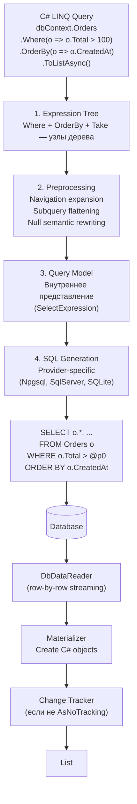
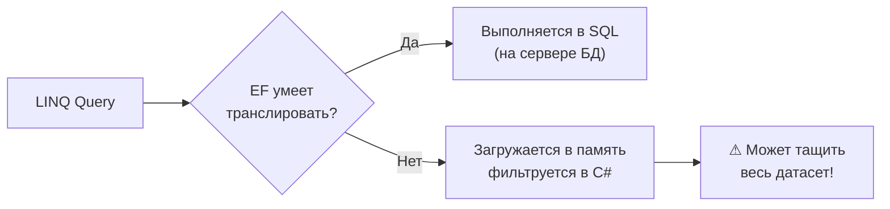
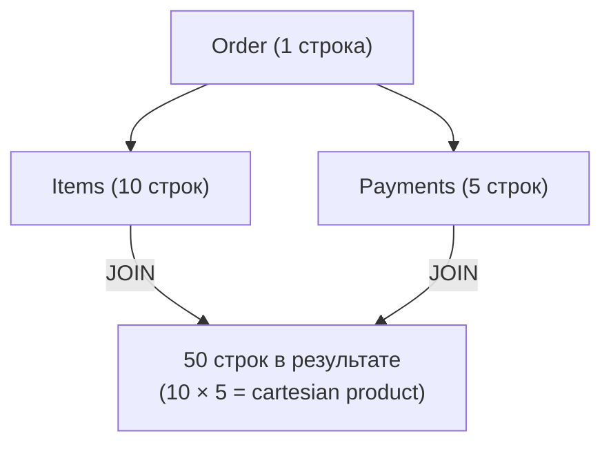
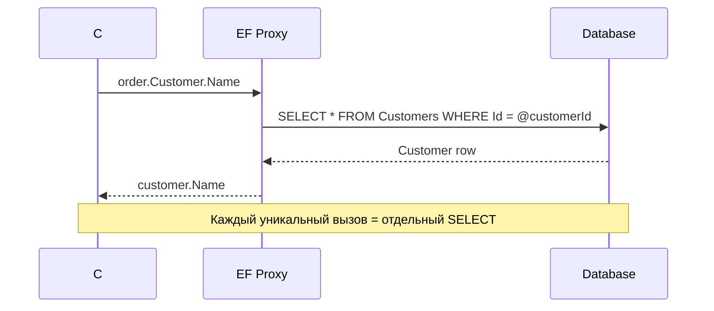

# EF Core: LINQ→SQL трансляция, Include, загрузка связей

> Понять, как EF превращает LINQ в SQL — значит понять, что уходит на сервер, а что выполняется в C#. Неправильная граница client/server evaluation — главная причина неожиданной нагрузки на БД.

## Содержание
- [LINQ→SQL Pipeline](#linqsql-pipeline)
- [Client vs Server Evaluation](#client-vs-server-evaluation)
- [Eager Loading: Include / ThenInclude](#eager-loading-include--theninclude)
- [Cartesian Explosion](#cartesian-explosion)
- [AsSplitQuery](#assplitquery)
- [Explicit Loading](#explicit-loading)
- [Lazy Loading](#lazy-loading)
- [Подводные камни](#подводные-камни)
- [См. также](#см-также)

---

## LINQ→SQL Pipeline



**Отладка: посмотреть сгенерированный SQL:**

```csharp
// Способ 1: ToQueryString() — не выполняет запрос
var sql = dbContext.Orders
    .Where(o => o.Total > 100)
    .OrderByDescending(o => o.CreatedAt)
    .ToQueryString();
Console.WriteLine(sql);

// Способ 2: LogTo при регистрации DbContext
builder.Services.AddDbContext<AppDbContext>(options =>
    options
        .UseNpgsql(connectionString)
        .LogTo(Console.WriteLine, LogLevel.Information));

// Способ 3: через ILogger в DI
options.LogTo(
    message => logger.LogInformation(message),
    LogLevel.Information);
```

---

## Client vs Server Evaluation

EF Core пытается транслировать весь запрос в SQL. Если часть запроса не транслируема — EF переносит её на клиент (загружает данные в память, потом фильтрует в C#).



```csharp
// CORRECT: транслируется в SQL
var orders = await dbContext.Orders
    .Where(o => o.Total > 100)                        // → WHERE Total > @p0
    .Where(o => o.Status == OrderStatus.Confirmed)    // → AND Status = @p1
    .Where(o => o.CreatedAt.Year == 2024)             // → AND YEAR(CreatedAt) = @p2
    .ToListAsync();

// WRONG: Custom C# method не транслируется
// EF Core 3+ выбросит InvalidOperationException (в отличие от EF Core 2, где молча тащил всё)
var orders = await dbContext.Orders
    .Where(o => MyBusinessLogic(o))   // throws: could not be translated
    .ToListAsync();

// WORKAROUND: загрузить сначала, фильтровать в памяти
// Только если уверен, что датасет небольшой!
var orders = (await dbContext.Orders.ToListAsync())
    .Where(o => MyBusinessLogic(o))
    .ToList();
```

**EF Core умеет транслировать:**
- Сравнения (`==`, `!=`, `>`, `<`, `>=`, `<=`)
- Логика (`&&`, `||`, `!`)
- `string.Contains`, `string.StartsWith`, `string.EndsWith`, `string.Length`
- `DateTime.Year`, `DateTime.Month`, `DateTime.Day`, `DateTime.Date`
- `Math.Floor`, `Math.Round`, `Math.Abs`
- `Enumerable.Contains` (для `IN (...)`)
- `EF.Functions.Like`, `EF.Functions.ILike` (PostgreSQL)
- Null-коалесценция (`??`), тернарный оператор

**EF Core не умеет транслировать:**
- Произвольные пользовательские методы
- `Regex` (без `EF.Functions`)
- Итераторы, рекурсия
- `string.Format`, интерполяция с нетривиальной логикой

---

## Eager Loading: Include / ThenInclude

Eager Loading загружает связанные сущности вместе с основным запросом через `JOIN`.

```csharp
// Include — загрузить связанную сущность (один уровень)
var orders = await dbContext.Orders
    .Include(o => o.Customer)    // LEFT JOIN Customers
    .ToListAsync();

// ThenInclude — вложенные связи (несколько уровней)
var orders = await dbContext.Orders
    .Include(o => o.Items)                    // LEFT JOIN OrderItems
        .ThenInclude(i => i.Product)          // LEFT JOIN Products
            .ThenInclude(p => p.Category)     // LEFT JOIN Categories
    .Include(o => o.Customer)                 // LEFT JOIN Customers
    .ToListAsync();
```

Сгенерированный SQL (упрощённо):

```sql
SELECT o.*, c.*, i.*, p.*, cat.*
FROM Orders o
LEFT JOIN Customers c ON c.Id = o.CustomerId
LEFT JOIN OrderItems i ON i.OrderId = o.Id
LEFT JOIN Products p ON p.Id = i.ProductId
LEFT JOIN Categories cat ON cat.Id = p.CategoryId
```

**Фильтрация при Include** (EF Core 5+):

```csharp
// Загрузить только активные товары в заказе
var orders = await dbContext.Orders
    .Include(o => o.Items.Where(i => i.IsActive))
    .Include(o => o.Items.OrderByDescending(i => i.Price).Take(5))
    .ToListAsync();
```

---

## Cartesian Explosion

При нескольких `Include` на коллекции EF Core делает `JOIN` всех коллекций — результирующий датасет растёт как произведение размеров коллекций.



```csharp
// Cartesian explosion — 1 заказ с 10 items и 5 payments = 50 строк в ответе
var orders = await dbContext.Orders
    .Include(o => o.Items)     // коллекция
    .Include(o => o.Payments)  // вторая коллекция
    .ToListAsync();
// SQL: одна строка для каждой комбинации Item × Payment
// EF Core дедуплицирует в памяти, но трафик — 50 строк вместо 16
```

При больших коллекциях это создаёт избыточный трафик. Решение — `AsSplitQuery`.

---

## AsSplitQuery

Вместо одного JOIN-запроса EF Core генерирует отдельные SELECT для каждой коллекции.

```csharp
// Split Query — несколько запросов, нет cartesian explosion
var orders = await dbContext.Orders
    .Include(o => o.Items)
    .Include(o => o.Payments)
    .AsSplitQuery()
    .ToListAsync();
```

Сгенерированные SQL (три отдельных запроса):

```sql
-- Запрос 1: основной
SELECT * FROM Orders;

-- Запрос 2: связанные Items
SELECT i.* FROM OrderItems i
INNER JOIN Orders o ON o.Id = i.OrderId
ORDER BY i.OrderId;

-- Запрос 3: связанные Payments
SELECT p.* FROM Payments p
INNER JOIN Orders o ON o.Id = p.OrderId
ORDER BY p.OrderId;
```

**Когда использовать AsSplitQuery:**
- Несколько `Include` на коллекции (не скалярные навигации)
- Когда размер датасета после JOIN значительно больше суммы частей
- Когда профайлер показывает картезианское увеличение строк

**Когда НЕ использовать:**
- Если важна консистентность данных в момент чтения (split queries выполняются в разных транзакциях — теоретически данные могут измениться между запросами)
- При включённой пагинации — split queries несовместимы с пагинацией верхнего уровня

**Глобально:**

```csharp
// Включить split queries для всего DbContext
builder.Services.AddDbContext<AppDbContext>(options =>
    options.UseNpgsql(connectionString)
           .UseQuerySplittingBehavior(QuerySplittingBehavior.SplitQuery));
```

---

## Explicit Loading

Загрузка связей вручную после основного запроса — когда не знаешь заранее, нужны ли данные.

```csharp
var order = await dbContext.Orders.FindAsync(42);
// Customer и Items ещё не загружены

// Загрузить коллекцию явно
await dbContext.Entry(order)
    .Collection(o => o.Items)
    .LoadAsync();

// Загрузить ссылку явно
await dbContext.Entry(order)
    .Reference(o => o.Customer)
    .LoadAsync();

// Explicit loading с фильтрацией — загрузить только нужное подмножество
await dbContext.Entry(order)
    .Collection(o => o.Items)
    .Query()                                      // вернёт IQueryable
    .Where(i => i.Price > 50)
    .OrderBy(i => i.ProductId)
    .LoadAsync();
```

**Когда использовать Explicit Loading:**
- Условная загрузка: данные нужны только в определённых ветках логики
- После `FindAsync()` — он не поддерживает `Include`
- Когда нужно загрузить отфильтрованное подмножество коллекции

---

## Lazy Loading

Навигационное свойство загружается автоматически при первом обращении через proxy.

```csharp
// Настройка Lazy Loading через прокси
builder.Services.AddDbContext<AppDbContext>(options =>
    options.UseNpgsql(connectionString)
           .UseLazyLoadingProxies());   // требует Microsoft.EntityFrameworkCore.Proxies

// Сущности должны иметь virtual навигационные свойства
public class Order
{
    public int Id { get; set; }

    // virtual — обязательно для lazy loading proxy
    public virtual Customer Customer { get; set; } = null!;
    public virtual ICollection<OrderItem> Items { get; set; } = new List<OrderItem>();
}
```

```csharp
// Lazy loading — первое обращение триггерит SELECT
var order = await dbContext.Orders.FindAsync(42);

// Здесь автоматически выполняется SELECT * FROM Customers WHERE Id = @p0
var customerName = order.Customer.Name;

// Здесь — SELECT * FROM OrderItems WHERE OrderId = @p0
var itemCount = order.Items.Count;
```



**Lazy Loading и N+1:** если итерировать список заказов и обращаться к `order.Customer`, для каждого заказа пойдёт отдельный SELECT — классический N+1. Подробнее — в [05-n-plus-one.md](./05-n-plus-one.md).

**Lazy Loading без proxy** — через `ILazyLoader`:

```csharp
public class Order
{
    private ILazyLoader? _lazyLoader;
    private Customer? _customer;

    public Order() { }
    public Order(ILazyLoader lazyLoader) => _lazyLoader = lazyLoader;

    public Customer? Customer
    {
        get => _lazyLoader.Load(this, ref _customer);
        set => _customer = value;
    }
}
```

---

## Подводные камни

**Include на большой граф без Select — over-fetching.** `Include(o => o.Customer)` загружает все поля Customer, даже если нужны только `Name` и `Email`. Для экономии трафика используй проекцию через `Select` — см. [04-projection-notracking.md](./04-projection-notracking.md).

**AsSplitQuery и транзакционная консистентность.** Три запроса выполняются последовательно. Если между первым и вторым запросом другой процесс изменит данные — получишь несогласованный снимок. В большинстве сценариев это несущественно, но при высоких требованиях к консистентности — обяжи снять все в одной транзакции:

```csharp
await using var tx = await dbContext.Database.BeginTransactionAsync(IsolationLevel.RepeatableRead);
var orders = await dbContext.Orders
    .Include(o => o.Items)
    .AsSplitQuery()
    .ToListAsync();
await tx.CommitAsync();
```

**`FindAsync` и Include несовместимы.** `FindAsync(id)` сначала смотрит в identity map, потом идёт в БД. Если сущность уже в памяти — возвращает её без похода в БД. `Include` с `FindAsync` не работает:

```csharp
// WRONG: Include не применяется к FindAsync
var order = await dbContext.Orders
    .Include(o => o.Customer)
    .FindAsync(42);  // компилируется, но Include игнорируется!

// CORRECT: используй FirstOrDefaultAsync
var order = await dbContext.Orders
    .Include(o => o.Customer)
    .FirstOrDefaultAsync(o => o.Id == 42);
```

---

## См. также

- [01-linq-core.md](./01-linq-core.md) — IQueryable, Expression Trees, deferred execution
- [04-projection-notracking.md](./04-projection-notracking.md) — Select vs Include, AsNoTracking
- [05-n-plus-one.md](./05-n-plus-one.md) — N+1 из-за Lazy Loading, все способы исправить
