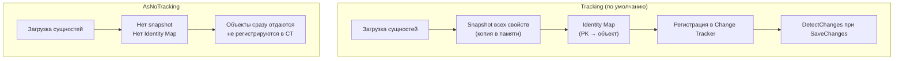

# Проекция и AsNoTracking

> Select — это не просто маппинг полей. Это инструкция EF Core, что включать в SELECT. AsNoTracking убирает накладные расходы Change Tracker для read-only сценариев. Вместе они дают максимальную производительность чтения.

## Содержание
- [Include vs Select: разница в SQL](#include-vs-select-разница-в-sql)
- [Проекция через Select](#проекция-через-select)
- [Auto-JOIN в проекции](#auto-join-в-проекции)
- [AsNoTracking](#asnotracking)
- [AsNoTrackingWithIdentityResolution](#asnotrackingwithidentityresolution)
- [Когда нельзя использовать AsNoTracking](#когда-нельзя-использовать-asnotracking)
- [Таблица производительности](#таблица-производительности)
- [Подводные камни](#подводные-камни)
- [См. также](#см-также)

---

## Include vs Select: разница в SQL

`Include` загружает полные сущности через JOIN. `Select` загружает только то, что явно запрошено.

```csharp
// Include — загружает все поля Order и Customer
var orders = await dbContext.Orders
    .Include(o => o.Customer)
    .ToListAsync();
```

```sql
-- SQL с Include: все поля обеих таблиц
SELECT o."Id", o."Total", o."Status", o."CreatedAt", o."CustomerId", o."Notes", o."ShippingAddress",
       c."Id", c."Name", c."Email", c."Phone", c."Address", c."Country", c."CreatedAt"
FROM "Orders" o
LEFT JOIN "Customers" c ON c."Id" = o."CustomerId"
```

```csharp
// Select — только нужные поля
var orders = await dbContext.Orders
    .Select(o => new OrderSummaryDto
    {
        Id = o.Id,
        Total = o.Total,
        CustomerName = o.Customer.Name   // EF добавит JOIN автоматически
    })
    .ToListAsync();
```

```sql
-- SQL с Select: только запрошенные поля
SELECT o."Id", o."Total", c."Name" AS "CustomerName"
FROM "Orders" o
INNER JOIN "Customers" c ON c."Id" = o."CustomerId"
```

**Итог:** `Select` → меньше данных по сети, меньше памяти, нет накладных расходов Change Tracker (объекты DTO не отслеживаются).

---

## Проекция через Select

```csharp
// DTO — не сущность EF, не отслеживается
public record OrderSummaryDto(
    int Id,
    decimal Total,
    string CustomerName,
    int ItemCount);

// Проекция в record через конструктор
var summaries = await dbContext.Orders
    .Select(o => new OrderSummaryDto(
        o.Id,
        o.Total,
        o.Customer.Name,
        o.Items.Count))
    .ToListAsync();
// SQL включит: o.Id, o.Total, c.Name, COUNT(i.*)

// Анонимный тип — когда DTO не нужен
var data = await dbContext.Orders
    .Where(o => o.Status == OrderStatus.Confirmed)
    .Select(o => new
    {
        o.Id,
        o.Total,
        o.Customer.Name,
        ItemCount = o.Items.Count(i => i.Price > 50)
    })
    .ToListAsync();
```

**Вложенные объекты в проекции:**

```csharp
// Проекция с вложенным объектом
var orders = await dbContext.Orders
    .Select(o => new OrderDetailDto
    {
        Id = o.Id,
        Customer = new CustomerDto
        {
            Name = o.Customer.Name,
            Email = o.Customer.Email
        },
        Items = o.Items.Select(i => new ItemDto
        {
            ProductName = i.Product.Name,
            Quantity = i.Quantity,
            Price = i.Price
        }).ToList()
    })
    .ToListAsync();
// EF транслирует вложенные Select в JOINы и подзапросы
```

---

## Auto-JOIN в проекции

EF Core автоматически добавляет JOIN при обращении к навигационному свойству в `Select`. Не нужно явно писать `Include`.

```csharp
// EF добавит JOIN с Customers автоматически
var names = await dbContext.Orders
    .Select(o => o.Customer.Name)   // нет Include — EF сам добавит INNER JOIN
    .ToListAsync();

// EF добавит JOIN через несколько уровней
var categories = await dbContext.Orders
    .Select(o => o.Items
        .Select(i => i.Product.Category.Name)  // Item → Product → Category
        .Distinct()
        .ToList())
    .ToListAsync();
```

**Разница с Include:**
- `Include` → `LEFT JOIN` (nullable навигация остаётся null если нет связанного)
- Auto-JOIN в `Select` → `INNER JOIN` для non-nullable навигаций, `LEFT JOIN` для nullable

---

## AsNoTracking

`AsNoTracking()` отключает Change Tracker для результатов запроса.



```csharp
// Без отслеживания — для read-only операций
var orders = await dbContext.Orders
    .AsNoTracking()
    .Where(o => o.Status == OrderStatus.Confirmed)
    .Include(o => o.Customer)
    .ToListAsync();
// Объекты в памяти, но Change Tracker их не знает

// Типичные сценарии
// 1. Списки для отображения (API endpoints — GET)
[HttpGet]
public async Task<IActionResult> GetOrders()
{
    var orders = await dbContext.Orders
        .AsNoTracking()
        .Select(o => new OrderDto(o.Id, o.Total, o.Status))
        .ToListAsync();
    return Ok(orders);
}

// 2. Аналитика и агрегации
var report = await dbContext.Orders
    .AsNoTracking()
    .GroupBy(o => o.Status)
    .Select(g => new { Status = g.Key, Count = g.Count(), Total = g.Sum(o => o.Total) })
    .ToListAsync();

// 3. Проверки существования и счётчики
var exists = await dbContext.Orders.AsNoTracking().AnyAsync(o => o.Id == 42);
var count = await dbContext.Orders.AsNoTracking().CountAsync(o => o.CustomerId == 1);

// 4. Глобально для всего DbContext (read-only контекст)
builder.Services.AddDbContext<ReadDbContext>(options =>
    options.UseNpgsql(connectionString)
           .UseQueryTrackingBehavior(QueryTrackingBehavior.NoTracking));
```

---

## AsNoTrackingWithIdentityResolution

Обычный `AsNoTracking()` не выполняет identity resolution: если один Customer связан с 5 заказами, EF создаст 5 разных объектов Customer в памяти.

`AsNoTrackingWithIdentityResolution()` — компромисс: нет Change Tracker, но один объект в памяти на строку БД.

```csharp
// AsNoTracking: один Customer может быть представлен несколькими объектами
var orders = await dbContext.Orders
    .AsNoTracking()
    .Include(o => o.Customer)
    .ToListAsync();

// Если customer #1 имеет 5 заказов:
var c1 = orders[0].Customer;
var c2 = orders[2].Customer;  // тот же Customer, но другой объект!
Console.WriteLine(ReferenceEquals(c1, c2));  // False
Console.WriteLine(c1.Id == c2.Id);           // True (одинаковый Id)

// AsNoTrackingWithIdentityResolution: один объект на сущность
var orders = await dbContext.Orders
    .AsNoTrackingWithIdentityResolution()
    .Include(o => o.Customer)
    .ToListAsync();

Console.WriteLine(ReferenceEquals(orders[0].Customer, orders[2].Customer));  // True!
```

**Когда нужен `AsNoTrackingWithIdentityResolution`:**
- Если обрабатываешь граф объектов в памяти после загрузки
- Если алгоритм предполагает `ReferenceEquals` для сравнения
- При `Include` на связи с возможными дублями (один-ко-многим)

---

## Когда нельзя использовать AsNoTracking

```csharp
// WRONG: AsNoTracking → сущность не отслеживается → SaveChanges ничего не делает
var order = await dbContext.Orders.AsNoTracking().FirstAsync(o => o.Id == 42);
order.Status = OrderStatus.Shipped;
await dbContext.SaveChangesAsync();  // ничего не произошло! Order не tracked.

// CORRECT: без AsNoTracking для обновлений
var order = await dbContext.Orders.FirstAsync(o => o.Id == 42);
order.Status = OrderStatus.Shipped;
await dbContext.SaveChangesAsync();  // UPDATE "Orders" SET "Status" = @p0 WHERE "Id" = 42

// Если сущность уже NoTracking — можно явно прикрепить
var order = await dbContext.Orders.AsNoTracking().FirstAsync(o => o.Id == 42);
order.Status = OrderStatus.Shipped;
dbContext.Orders.Update(order);          // прикрепляет и помечает как Modified
await dbContext.SaveChangesAsync();      // UPDATE (все поля)
```

**Правило:** `AsNoTracking` = только чтение. Любые изменения — отслеживаемые сущности.

---

## Таблица производительности

| Метрика | Tracking | AsNoTracking | AsNoTrackingWithIdentityResolution |
|---------|----------|--------------|-----------------------------------|
| Скорость материализации | Базовая | +30–50% быстрее | +20–30% быстрее |
| Потребление памяти | Высокое (снимки + ссылки в CT) | Низкое | Среднее (identity map без снимков) |
| `DetectChanges()` | Обходит все tracked сущности | Нет | Нет |
| `SaveChanges()` | Генерирует SQL для изменений | Игнорирует эти объекты | Игнорирует эти объекты |
| Identity resolution | Да (через CT identity map) | Нет | Да |
| Дубли объектов в памяти | Нет | Возможны | Нет |

При загрузке 10 000 сущностей разница в скорости может быть 2–3x, потому что для каждой tracked сущности EF:
1. Копирует все свойства в snapshot
2. Регистрирует в identity map (поиск по PK)
3. Подписывается на INotifyPropertyChanged (для notification tracking)

---

## Подводные камни

**Модификация NoTracking-сущности без явного Attach.** Вызов `SaveChanges()` после изменения NoTracking-сущности молча ничего не делает — нет исключения, нет предупреждения.

**AsNoTracking с Lazy Loading — работает, но создаёт N+1.** NoTracking не отключает Lazy Loading proxy. Если сущность загружена с прокси и ты обращаешься к навигационному свойству — пойдёт SELECT, хотя сущность не отслеживается.

```csharp
// Lazy Loading proxy работает даже с AsNoTracking
var order = await dbContext.Orders.AsNoTracking().FirstAsync(o => o.Id == 42);
var name = order.Customer.Name;  // SELECT FROM Customers! (lazy loading сработал)
```

**Select + Include конфликт.** Если используешь `Select`, `Include` игнорируется — EF делает проекцию самостоятельно. Не пиши `Include` вместе с `Select` — это мёртвый код.

```csharp
// Include игнорируется при Select
var orders = await dbContext.Orders
    .Include(o => o.Customer)   // ← этот Include не имеет эффекта
    .Select(o => new { o.Id, o.Customer.Name })  // EF сам добавит JOIN
    .ToListAsync();
```

---

## См. также

- [03-efcore-queries.md](./03-efcore-queries.md) — Include/ThenInclude, AsSplitQuery, Lazy Loading
- [05-n-plus-one.md](./05-n-plus-one.md) — N+1: обнаружение и исправление через проекцию
- [02-efcore-architecture.md](./02-efcore-architecture.md) — Change Tracker internals, snapshot механизм
