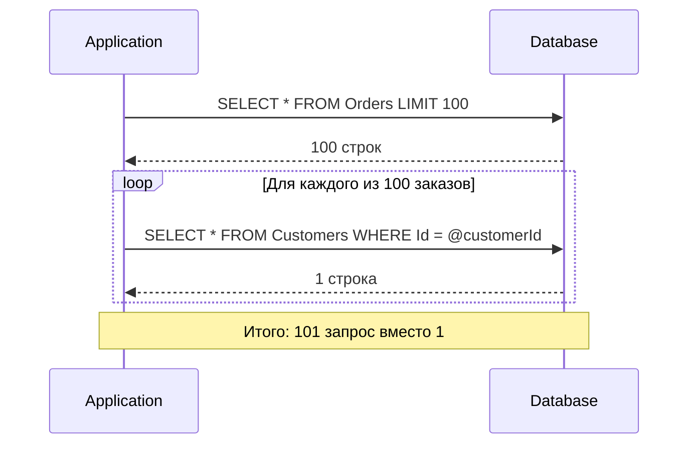

# N+1 проблема: обнаружение и исправление

> N+1 — это когда для загрузки N заказов приложение делает N+1 запросов к БД: один общий и по одному для каждой связанной сущности. Незаметна в dev, убивает production при нагрузке.

## Содержание
- [Что такое N+1](#что-такое-n1)
- [Классический N+1 через Lazy Loading](#классический-n1-через-lazy-loading)
- [Вложенный N×M+1](#вложенный-nm1)
- [Обнаружение N+1](#обнаружение-n1)
- [Исправление: Include](#исправление-include)
- [Исправление: проекция через Select](#исправление-проекция-через-select)
- [Исправление: AsSplitQuery](#исправление-assplitquery)
- [Исправление: ручная batch-загрузка](#исправление-ручная-batch-загрузка)
- [Подводные камни](#подводные-камни)
- [См. также](#см-также)

---

## Что такое N+1



N+1 = 1 запрос за списком + N запросов за связанными данными.

Проявляется:
- При Lazy Loading (основная причина)
- При ручном обращении к навигационному свойству в цикле без предварительного Include
- В GraphQL resolvers без DataLoader

---

## Классический N+1 через Lazy Loading

```csharp
// Lazy Loading включён (UseLazyLoadingProxies)
// WRONG: каждый order.Customer.Name — отдельный SELECT
var orders = await dbContext.Orders.ToListAsync();
// SQL: SELECT * FROM Orders → 100 строк

foreach (var order in orders)
{
    // Первое обращение к .Customer → EF делает SELECT
    Console.WriteLine($"Order {order.Id}: {order.Customer.Name}");
    // SQL: SELECT * FROM Customers WHERE Id = @p0  (100 раз!)
}
// Итого: 101 запрос
```

**Менее очевидный вариант** — через LINQ:

```csharp
// WRONG: Where обращается к Customer → lazy load для каждого элемента
var expensiveOrders = orders
    .Where(o => o.Customer.Country == "Russia")  // N SELECT при Lazy Loading
    .ToList();
```

---

## Вложенный N×M+1

Если у каждого из N заказов M позиций, и для каждой позиции нужен Product — число запросов умножается.

```csharp
// WRONG: N×M+1
var orders = await dbContext.Orders.ToListAsync();  // 1 запрос, 50 заказов

foreach (var order in orders)
{
    foreach (var item in order.Items)  // SELECT OrderItems WHERE OrderId = @p0  (50 раз)
    {
        Console.WriteLine(item.Product.Name);  // SELECT Products WHERE Id = @p0  (M раз для каждого заказа)
    }
}
// Итого при 50 заказах по 10 позиций: 1 + 50 + 500 = 551 запрос
```

---

## Обнаружение N+1

**Способ 1: SQL логирование**

```csharp
builder.Services.AddDbContext<AppDbContext>(options =>
    options.UseNpgsql(connectionString)
           .LogTo(
               message => Console.WriteLine(message),
               LogLevel.Information,
               DbContextLoggerOptions.SingleLine));
// Видно повторяющиеся паттерны: SELECT ... WHERE Id = @p0
```

**Способ 2: MiniProfiler** (в ASP.NET Core)

```csharp
builder.Services.AddMiniProfiler(options =>
    options.RouteBasePath = "/profiler")
    .AddEntityFramework();

// В браузере: /profiler/results-index
// Показывает: количество запросов, дубли, время
```

**Способ 3: QueryCountInterceptor — кастомный перехватчик**

```csharp
/// <summary>
/// Interceptor that counts queries per request and warns about N+1 patterns.
/// </summary>
public class QueryCountInterceptor : DbCommandInterceptor
{
    private int _count;

    public override ValueTask<DbDataReader> ReaderExecutedAsync(
        DbCommand command,
        CommandExecutedEventData eventData,
        DbDataReader result,
        CancellationToken token = default)
    {
        _count++;
        if (_count > 10)
        {
            // Log warning: potential N+1 detected
            Console.WriteLine($"[N+1 Warning] Query #{_count}: {command.CommandText[..50]}...");
        }
        return new ValueTask<DbDataReader>(result);
    }
}

// Registration
builder.Services.AddDbContext<AppDbContext>(options =>
    options.UseNpgsql(connectionString)
           .AddInterceptors(new QueryCountInterceptor()));
```

**Способ 4: тест на количество запросов**

```csharp
[Fact]
public async Task GetOrders_ExecutesExactlyOneQuery()
{
    int queryCount = 0;
    var options = new DbContextOptionsBuilder<AppDbContext>()
        .UseNpgsql(connectionString)
        .LogTo(_ => queryCount++, LogLevel.Information)
        .Options;

    await using var db = new AppDbContext(options);
    await db.Orders.Include(o => o.Customer).ToListAsync();

    Assert.Equal(1, queryCount);
}
```

---

## Исправление: Include

Самый прямолинейный способ — загрузить все нужные данные одним JOIN-запросом.

```csharp
// CORRECT: Include загружает Customer вместе с заказами
var orders = await dbContext.Orders
    .Include(o => o.Customer)
    .ToListAsync();
// SQL: SELECT o.*, c.* FROM Orders o LEFT JOIN Customers c ON c.Id = o.CustomerId

foreach (var order in orders)
{
    // Customer уже в памяти — нет дополнительных запросов
    Console.WriteLine($"Order {order.Id}: {order.Customer.Name}");
}
// Итого: 1 запрос
```

Вложенный Include для нескольких уровней:

```csharp
var orders = await dbContext.Orders
    .Include(o => o.Items)               // JOIN OrderItems
        .ThenInclude(i => i.Product)     // JOIN Products
    .Include(o => o.Customer)            // JOIN Customers
    .ToListAsync();
// Итого: 1 запрос (с несколькими JOINами)
```

---

## Исправление: проекция через Select

Когда нужны не полные сущности, а только конкретные поля — `Select` даёт ещё меньше трафика.

```csharp
// Проекция — никакого N+1, никакого over-fetching
var summaries = await dbContext.Orders
    .Select(o => new OrderSummaryDto
    {
        Id = o.Id,
        Total = o.Total,
        CustomerName = o.Customer.Name,   // EF добавит JOIN автоматически
        ItemCount = o.Items.Count()       // подзапрос COUNT(*)
    })
    .ToListAsync();
// SQL: SELECT o.Id, o.Total, c.Name, COUNT(i.*) ... GROUP BY o.Id
// Один запрос, только нужные поля, нет трекинга
```

---

## Исправление: AsSplitQuery

Когда включение нескольких коллекций создаёт картезианское взрывание — `AsSplitQuery` делает отдельный SELECT для каждой коллекции.

```csharp
// N + N + N запросов вместо одного огромного JOIN
var orders = await dbContext.Orders
    .Include(o => o.Items)
    .Include(o => o.Payments)
    .AsSplitQuery()
    .ToListAsync();
// SQL:
// SELECT * FROM Orders
// SELECT i.* FROM OrderItems i JOIN Orders ... ORDER BY i.OrderId
// SELECT p.* FROM Payments p JOIN Orders ... ORDER BY p.OrderId
```

Подробнее про AsSplitQuery и его ограничения — в [03-efcore-queries.md](./03-efcore-queries.md).

---

## Исправление: ручная batch-загрузка

Когда `Include` не подходит (например, нужна выборочная загрузка после обработки основного списка):

```csharp
// Загрузить заказы
var orders = await dbContext.Orders
    .Where(o => o.Status == OrderStatus.Pending)
    .AsNoTracking()
    .ToListAsync();

// Собрать уникальные CustomerIds
var customerIds = orders.Select(o => o.CustomerId).Distinct().ToList();

// Один запрос за всеми нужными Customer
var customers = await dbContext.Customers
    .Where(c => customerIds.Contains(c.Id))
    .AsNoTracking()
    .ToDictionaryAsync(c => c.Id);

// Сопоставить в памяти — нет N+1
foreach (var order in orders)
{
    var customer = customers[order.CustomerId];
    Console.WriteLine($"Order {order.Id}: {customer.Name}");
}
// Итого: 2 запроса независимо от N
```

Этот паттерн используется в DataLoader (GraphQL) — накапливать ключи, делать один `WHERE Id IN (...)`.

---

## Подводные камни

**Include не спасает, если потом делаешь `.ToList()` и фильтруешь в памяти.**

```csharp
// WRONG: загружает все заказы в память, потом фильтрует в C#
var russianOrders = dbContext.Orders
    .Include(o => o.Customer)
    .ToList()                            // ← все заказы уже в памяти
    .Where(o => o.Customer.Country == "Russia")  // C# фильтрация
    .ToList();

// CORRECT: Where уходит в SQL
var russianOrders = await dbContext.Orders
    .Include(o => o.Customer)
    .Where(o => o.Customer.Country == "Russia")  // → JOIN + WHERE
    .ToListAsync();
```

**Include с большим числом коллекций — картезианское взрывание.** 1 заказ × 10 items × 5 payments = 50 строк для одного заказа. При 100 заказах — 5000 строк вместо 115. Используй `AsSplitQuery`.

**Lazy Loading в фоновых задачах.** Если `DbContext` dispose'd, а потом обращаешься к навигационному свойству — `ObjectDisposedException`. Всегда загружай всё нужное пока `DbContext` жив.

```csharp
// WRONG: DbContext disposed до использования lazy property
Order order;
await using (var db = new AppDbContext(options))
{
    order = await db.Orders.FindAsync(42);
}
// Здесь DbContext уже disposed
Console.WriteLine(order.Customer.Name);  // ObjectDisposedException!

// CORRECT
await using var db = new AppDbContext(options);
var order = await db.Orders
    .Include(o => o.Customer)
    .FirstAsync(o => o.Id == 42);
Console.WriteLine(order.Customer.Name);  // OK, Customer уже загружен
```

**N+1 в LINQ to Objects.** Если данные уже в памяти — Lazy Loading всё равно может сработать, если DbContext жив. Избегай доступа к навигационным свойствам в LINQ-запросах по in-memory коллекциям, если DbContext активен.

---

## См. также

- [03-efcore-queries.md](./03-efcore-queries.md) — Include, ThenInclude, AsSplitQuery
- [04-projection-notracking.md](./04-projection-notracking.md) — Select как альтернатива Include
- [06-relationships.md](./06-relationships.md) — навигационные свойства, типы коллекций
