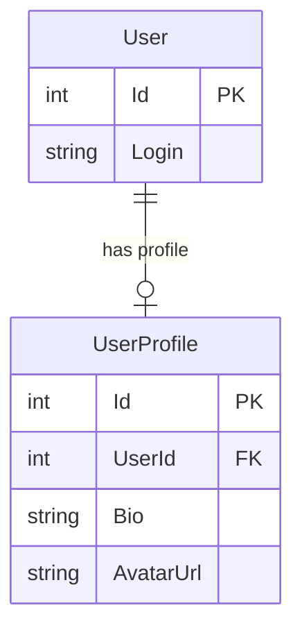
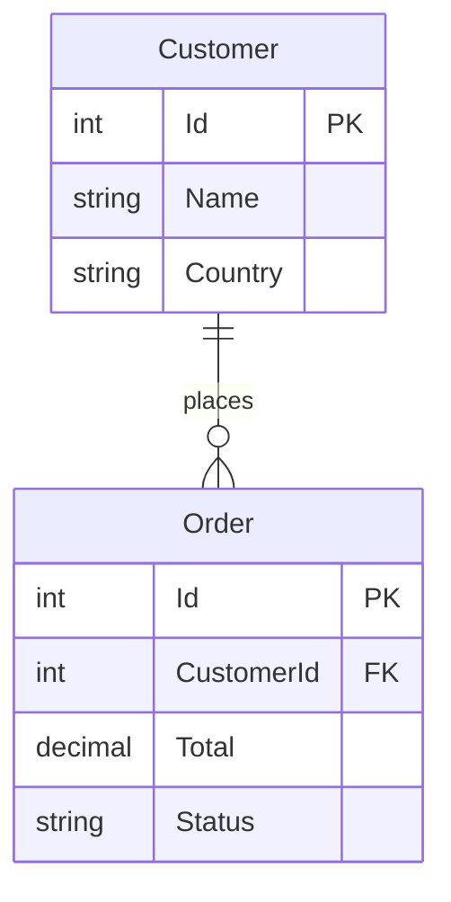
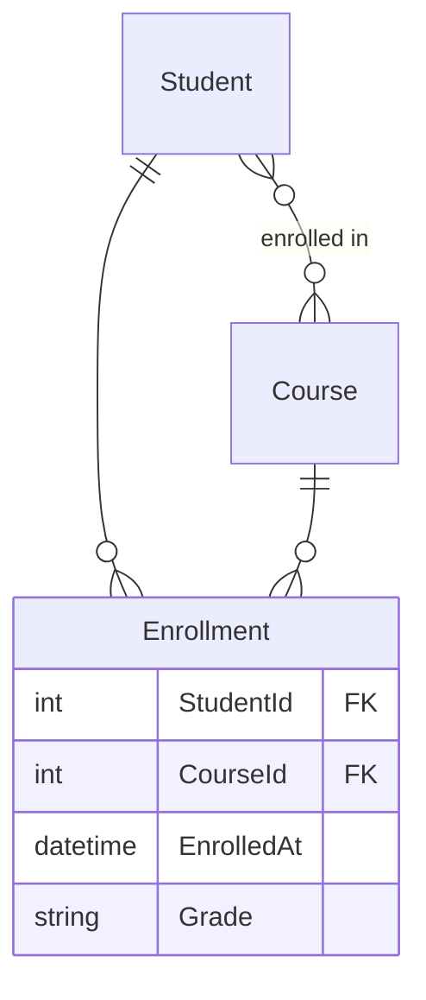
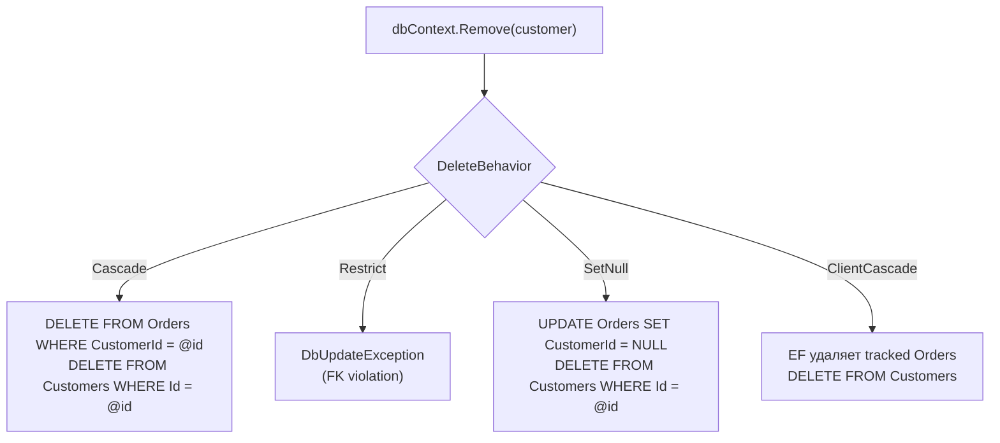

# EF Core: связи, навигационные свойства, cascade delete

> Связи в EF Core — это не просто поля с FK. Выбор типа навигационного свойства влияет на инкапсуляцию доменной модели. Cascade Delete по умолчанию — это потенциальный риск потери данных.

## Содержание
- [One-to-One](#one-to-one)
- [One-to-Many](#one-to-many)
- [Many-to-Many](#many-to-many)
- [Типы коллекций навигационных свойств](#типы-коллекций-навигационных-свойств)
- [Что EF Core инжектирует в коллекции](#что-ef-core-инжектирует-в-коллекции)
- [Backing Fields](#backing-fields)
- [Cascade Delete](#cascade-delete)
- [Подводные камни](#подводные-камни)
- [См. также](#см-также)

---

## One-to-One

Каждая сущность A связана максимум с одной сущностью B. FK размещается на **зависимой** (dependent) стороне.

```csharp
/// <summary>
/// Principal entity — independent side of the relationship.
/// </summary>
public class User
{
    public int Id { get; set; }
    public string Login { get; set; } = string.Empty;

    public UserProfile? Profile { get; set; }  // navigation property
}

/// <summary>
/// Dependent entity — holds the foreign key.
/// </summary>
public class UserProfile
{
    public int Id { get; set; }
    public string Bio { get; set; } = string.Empty;
    public string AvatarUrl { get; set; } = string.Empty;

    public int UserId { get; set; }           // foreign key
    public User User { get; set; } = null!;   // navigation back to principal
}
```

```csharp
/// <summary>
/// Configures one-to-one relationship between User and UserProfile.
/// UserProfile is the dependent — it holds UserId FK.
/// </summary>
public class UserConfiguration : IEntityTypeConfiguration<User>
{
    public void Configure(EntityTypeBuilder<User> builder)
    {
        builder.HasOne(u => u.Profile)
            .WithOne(p => p.User)
            .HasForeignKey<UserProfile>(p => p.UserId)  // явно указать FK на зависимой стороне
            .OnDelete(DeleteBehavior.Cascade);           // удаление User → удаление Profile
    }
}
```



---

## One-to-Many

Одна сущность A связана с множеством сущностей B. FK — на стороне B (многих).

```csharp
/// <summary>
/// Customer aggregate root with encapsulated orders collection.
/// </summary>
public class Customer
{
    public int Id { get; set; }
    public string Name { get; set; } = string.Empty;
    public string Country { get; set; } = string.Empty;

    // Encapsulated: внешний код не может добавлять заказы напрямую
    private readonly List<Order> _orders = new();
    public IReadOnlyCollection<Order> Orders => _orders.AsReadOnly();
}

/// <summary>
/// Order entity belonging to a customer.
/// </summary>
public class Order
{
    public int Id { get; set; }
    public decimal Total { get; set; }
    public OrderStatus Status { get; set; }

    public int CustomerId { get; set; }           // FK
    public Customer Customer { get; set; } = null!; // navigation to principal
}
```

```csharp
/// <summary>
/// Configures one-to-many relationship and backing field access for Orders collection.
/// </summary>
public class CustomerConfiguration : IEntityTypeConfiguration<Customer>
{
    public void Configure(EntityTypeBuilder<Customer> builder)
    {
        builder.HasMany(c => c.Orders)
            .WithOne(o => o.Customer)
            .HasForeignKey(o => o.CustomerId)
            .OnDelete(DeleteBehavior.Cascade);

        // EF Core читает/пишет коллекцию через backing field _orders
        builder.Navigation(c => c.Orders)
            .UsePropertyAccessMode(PropertyAccessMode.Field);
    }
}
```



---

## Many-to-Many

**Implicit (EF Core 5+)** — join-таблица без дополнительных полей:

```csharp
/// <summary>
/// Product with implicit many-to-many relationship to tags.
/// EF Core creates "ProductTag" join table automatically.
/// </summary>
public class Product
{
    public int Id { get; set; }
    public string Name { get; set; } = string.Empty;

    public ICollection<Tag> Tags { get; set; } = new List<Tag>();
}

/// <summary>
/// Tag with implicit many-to-many to products.
/// </summary>
public class Tag
{
    public int Id { get; set; }
    public string Name { get; set; } = string.Empty;

    public ICollection<Product> Products { get; set; } = new List<Product>();
}
// EF создаёт таблицу "ProductTag" с составным PK (ProductId, TagId) автоматически
```

**Explicit** — join-entity с дополнительными полями:

```csharp
/// <summary>
/// Explicit join entity for many-to-many between Student and Course.
/// Contains enrollment metadata (date, grade).
/// </summary>
public class Enrollment
{
    public int StudentId { get; set; }
    public Student Student { get; set; } = null!;

    public int CourseId { get; set; }
    public Course Course { get; set; } = null!;

    public DateTime EnrolledAt { get; set; }
    public Grade? Grade { get; set; }
}

/// <summary>
/// Configures Student-Course many-to-many via Enrollment entity.
/// </summary>
public class EnrollmentConfiguration : IEntityTypeConfiguration<Enrollment>
{
    public void Configure(EntityTypeBuilder<Enrollment> builder)
    {
        builder.HasKey(e => new { e.StudentId, e.CourseId });  // составной PK

        builder.HasOne(e => e.Student)
            .WithMany(s => s.Enrollments)
            .HasForeignKey(e => e.StudentId);

        builder.HasOne(e => e.Course)
            .WithMany(c => c.Enrollments)
            .HasForeignKey(e => e.CourseId);
    }
}
```



---

## Типы коллекций навигационных свойств

| Тип | Add/Remove | Count | Инкапсуляция | Когда использовать |
|-----|-----------|-------|--------------|-------------------|
| `ICollection<T>` | Да | Да | Низкая | Простые случаи, EF-only |
| `IReadOnlyCollection<T>` | Нет | Да | Высокая | DDD агрегаты (с backing field) |
| `List<T>` | Да + IndexOf, Sort | Да | Низкая | Когда нужен порядок элементов |
| `IEnumerable<T>` | Нет | Нет (без LINQ) | Высокая | Не рекомендуется — нет Count без LINQ |
| `HashSet<T>` | Да (уникальность) | Да | Средняя | Когда нужна гарантия уникальности |

**Рекомендация для DDD:**

```csharp
/// <summary>
/// Order aggregate root. Items collection is encapsulated — use AddItem/RemoveItem.
/// </summary>
public class Order
{
    public int Id { get; private set; }
    public int CustomerId { get; private set; }
    public OrderStatus Status { get; private set; } = OrderStatus.Draft;

    // Внутренняя коллекция — EF Core пишет сюда напрямую (через backing field)
    private readonly List<OrderItem> _items = new();

    // Публичный API — только чтение, внешний код не может нарушить инварианты
    public IReadOnlyCollection<OrderItem> Items => _items.AsReadOnly();

    private Order() { }  // EF Core needs parameterless constructor

    public Order(int customerId)
    {
        CustomerId = customerId;
    }

    /// <summary>
    /// Adds a product to the order. Enforces business rules.
    /// </summary>
    public void AddItem(int productId, int quantity, decimal price)
    {
        if (Status != OrderStatus.Draft)
            throw new InvalidOperationException("Cannot add items to a non-draft order.");

        var existing = _items.FirstOrDefault(i => i.ProductId == productId);
        if (existing is not null)
        {
            existing.IncreaseQuantity(quantity);
            return;
        }

        _items.Add(new OrderItem(productId, quantity, price));
    }

    /// <summary>
    /// Removes a product from the order by product ID.
    /// </summary>
    public void RemoveItem(int productId)
    {
        if (Status != OrderStatus.Draft)
            throw new InvalidOperationException("Cannot remove items from a non-draft order.");

        var item = _items.FirstOrDefault(i => i.ProductId == productId)
            ?? throw new InvalidOperationException($"Item {productId} not found.");

        _items.Remove(item);
    }
}
```

---

## Что EF Core инжектирует в коллекции

EF Core создаёт конкретный тип коллекции при материализации — иногда неожиданный:

| Объявление свойства | Что EF Core создаёт при загрузке |
|---------------------|----------------------------------|
| `ICollection<T>` | `HashSet<T>` (EF Core 3+) |
| `IEnumerable<T>` | `HashSet<T>` |
| `IList<T>` | `List<T>` |
| `List<T>` | `List<T>` |
| `HashSet<T>` | `HashSet<T>` |
| `IReadOnlyCollection<T>` (с backing field `List<T>`) | Заполняет backing field |

```csharp
// Объявляешь ICollection<T>, EF заменяет на HashSet<T>!
public ICollection<OrderItem> Items { get; set; } = new List<OrderItem>();

var order = await dbContext.Orders.Include(o => o.Items).FirstAsync();
Console.WriteLine(order.Items.GetType().Name);  // "HashSet`1" — не List!
// Порядок элементов не гарантирован без ORDER BY

// Если нужен List<T> — объявляй явно
public List<OrderItem> Items { get; set; } = new();
// После загрузки: order.Items.GetType() == typeof(List<OrderItem>)
```

`HashSet<T>` обеспечивает корректный identity resolution (нет дублей по `Equals`), поэтому EF Core предпочитает его для `ICollection<T>`.

---

## Backing Fields

Backing fields позволяют EF Core работать с private-полем напрямую, обходя public свойство при чтении/записи.

**Соглашения по именованию** (EF ищет в таком порядке):
- `_items` → для свойства `Items`
- `_Items`
- `m_items`
- `m_Items`

```csharp
/// <summary>
/// Configures Cart entity with backing field for Items collection.
/// EF Core writes directly to _items, bypassing public read-only property.
/// </summary>
public class CartConfiguration : IEntityTypeConfiguration<Cart>
{
    public void Configure(EntityTypeBuilder<Cart> builder)
    {
        builder.HasKey(c => c.Id);

        builder.HasMany(c => c.Items)
            .WithOne()
            .HasForeignKey(i => i.CartId)
            .OnDelete(DeleteBehavior.Cascade);

        // Указать EF Core использовать поле _items при материализации
        builder.Navigation(c => c.Items)
            .UsePropertyAccessMode(PropertyAccessMode.Field);
    }
}
```

**`PropertyAccessMode` — режимы доступа:**

| Режим | Чтение | Запись (материализация) |
|-------|--------|------------------------|
| `Field` | Через поле | Через поле |
| `Property` | Через свойство | Через свойство |
| `FieldDuringConstruction` | Через свойство | Через поле при создании |
| `PreferField` | Через поле (если есть) | Через поле (если есть) |

`PropertyAccessMode.Field` — оптимальный выбор для DDD: EF добавляет элементы в `_items` напрямую, минуя `IReadOnlyCollection<T>` обёртку.

---

## Cascade Delete

Определяет, что происходит с зависимыми сущностями при удалении principal.

| Поведение | При удалении principal | Требования |
|-----------|----------------------|------------|
| `Cascade` | Зависимые удаляются | — |
| `SetNull` | FK зависимых = NULL | FK должен быть nullable |
| `Restrict` | Исключение (если есть зависимые) | — |
| `NoAction` | БД сама решает | — |
| `ClientSetNull` | FK = NULL только для tracked сущностей | FK nullable |
| `ClientCascade` | Удаляются только tracked | — |

**Поведение по умолчанию:**
- Required relationship (non-nullable FK): `Cascade`
- Optional relationship (nullable FK): `ClientSetNull`

```csharp
// Явная конфигурация
builder.HasMany(c => c.Orders)
    .WithOne(o => o.Customer)
    .HasForeignKey(o => o.CustomerId)
    .OnDelete(DeleteBehavior.Restrict);  // предотвращает случайное каскадное удаление

// Restrict: попытка удалить Customer с заказами → исключение
try
{
    dbContext.Customers.Remove(customer);
    await dbContext.SaveChangesAsync();
}
catch (DbUpdateException ex) when (ex.InnerException is PostgresException pg && pg.SqlState == "23503")
{
    // FK violation: "The DELETE statement conflicted with the REFERENCE constraint"
    throw new DomainException("Cannot delete customer with existing orders.");
}
```



**Рекомендация:** в production всегда указывай `DeleteBehavior` явно. Не полагайся на defaults. `Restrict` безопаснее `Cascade` — предотвращает случайное удаление связанных данных.

---

## Подводные камни

**Circular navigation properties и serialization.** Если `Order.Customer` и `Customer.Orders` оба загружены — стандартный `System.Text.Json` уйдёт в бесконечную рекурсию. Решение: DTO без циклических ссылок, или `[JsonIgnore]` на одной стороне, или `ReferenceHandler.Preserve`.

**Many-to-Many implicit и дополнительные поля.** Если потом понадобится добавить поле в join-таблицу (дату, флаг) — придётся переходить на explicit join entity. Лучше сразу использовать explicit если связь может обогащаться.

**`ICollection<T>` и порядок.** EF создаёт `HashSet<T>` — порядок не гарантирован. Если важен порядок при Include — добавляй `OrderBy` явно:

```csharp
var order = await dbContext.Orders
    .Include(o => o.Items.OrderBy(i => i.CreatedAt))
    .FirstAsync(o => o.Id == 42);
```

**Cascade Delete и неожиданные удаления.** `Cascade` по умолчанию для required relationships. Если удаляешь root aggregate — могут каскадно удалиться связанные данные, которые ты не ожидал. Проверяй все `DeleteBehavior` при проектировании схемы.

---

## См. также

- [07-configuration.md](./07-configuration.md) — Fluent API: конфигурация индексов, owned types, global query filters
- [05-n-plus-one.md](./05-n-plus-one.md) — N+1 через навигационные свойства
- [04-projection-notracking.md](./04-projection-notracking.md) — tracking и коллекции
