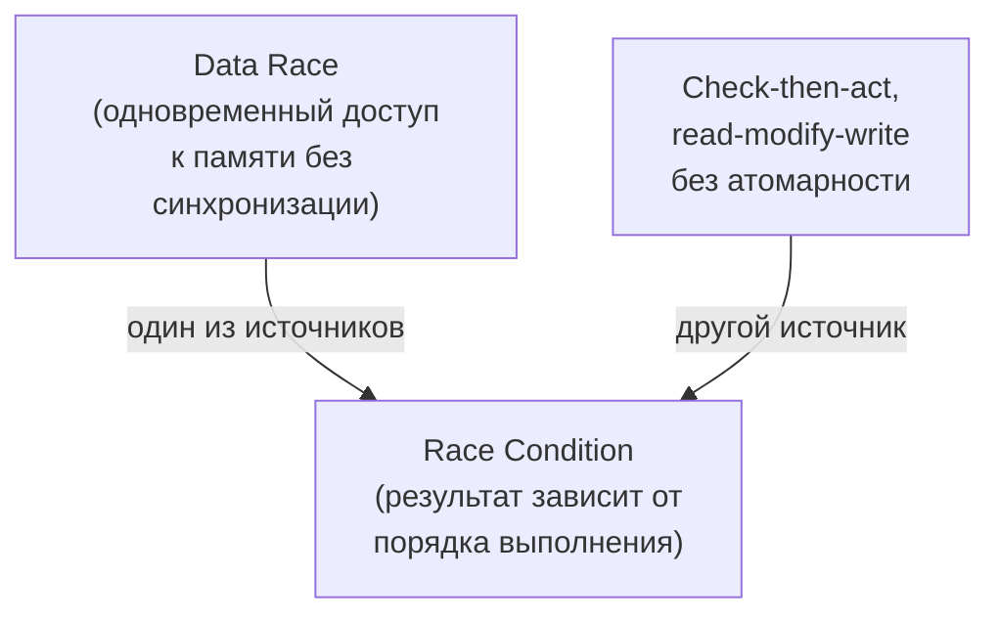
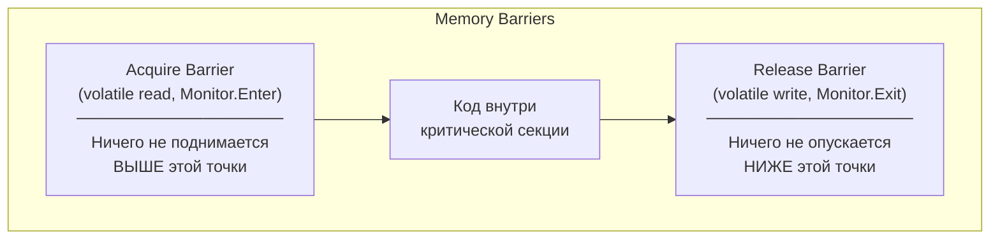

# Основы синхронизации

> Три фундаментальные проблемы многопоточности — atomicity, visibility, ordering — лежат в основе любого бага многопоточного кода.

## Содержание
- [Race condition vs Data race](#race-condition-vs-data-race)
- [Критическая секция](#критическая-секция)
- [Три проблемы многопоточности](#три-проблемы-многопоточности)
- [Memory model .NET](#memory-model-net)
- [Подводные камни](#подводные-камни)
- [См. также](#см-также)

---

## Race condition vs Data race

**Data race** — проблема на уровне памяти: два потока одновременно обращаются к одной ячейке, хотя бы один пишет, синхронизации нет. В C/C++ это undefined behavior. В .NET CLR гарантирует отсутствие «torn reads» для выровненных значений до размера машинного слова (4 байта на x86, 8 байт на x64). Но `long` на 32-bit платформе может дать разорванное чтение:

```csharp
private long _counter; // 64-bit, на 32-bit платформе — 2 отдельные 32-bit записи

// Thread 1:
_counter = 0x00000001_FFFFFFFF;

// Thread 2 (одновременно):
var value = _counter;
// value может быть: 0x00000001_FFFFFFFF (корректно)
//                    0x00000001_00000000 (torn read — верхние 4 байта новые, нижние старые)
//                    0x00000000_FFFFFFFF (torn read — наоборот)
```

**Race condition** — логическая ошибка: результат зависит от порядка выполнения потоков. Может существовать **без data race**:

```csharp
// Race condition без data race:
// Каждая Interlocked-операция атомарна, но check-then-act — нет
private int _balance = 100;

void Withdraw(int amount)
{
    // Между этой проверкой...
    if (Interlocked.CompareExchange(ref _balance, 0, 0) >= amount)
    {
        // ...и этим списанием другой поток тоже может пройти проверку
        Interlocked.Add(ref _balance, -amount);
    }
}
// Два потока могут снять 80 и 50 при балансе 100 — race condition
```



**Ключевое:** data race — **подмножество** race condition. Можно иметь race condition без data race, но data race почти всегда ведёт к race condition.

---

## Критическая секция

**Критическая секция** — участок кода, который должен выполняться только одним потоком в любой момент. Это абстракция, реализуемая через `lock`, `Monitor`, `Mutex`.

```csharp
private readonly object _lock = new();
private int _balance = 100;

/// <summary>
/// Withdraw operation protected by a critical section.
/// The check-then-act sequence is now atomic from other threads' perspective.
/// </summary>
bool Withdraw(int amount)
{
    lock (_lock)
    {
        if (_balance >= amount)
        {
            _balance -= amount;
            return true;
        }
        return false;
    }
}
```

**Три свойства корректной критической секции:**

1. **Mutual exclusion** — внутри максимум один поток
2. **Progress** — если секция свободна и кто-то хочет войти — войдёт за конечное время
3. **Bounded waiting** — поток не ждёт бесконечно (`Monitor` не гарантирует FIFO, но гарантирует прогресс)

---

## Три проблемы многопоточности

### 1. Atomicity

Операция, которая выглядит «одной» в коде, состоит из нескольких шагов. Другой поток видит промежуточное состояние.

```csharp
private int _count;

// _count++ — три операции на уровне CPU:
// 1. Прочитать _count из памяти в регистр
// 2. Увеличить в регистре
// 3. Записать обратно в память
// Другой поток может прочитать _count между шагами 1 и 3 → потеря инкремента
void Increment()
{
    _count++; // NOT atomic!
    // Нужно: Interlocked.Increment(ref _count)
}
```

### 2. Visibility

Изменение, сделанное одним потоком, может быть **невидимо** другому. Причина: CPU кеширует данные в L1/L2, JIT/компилятор кешируют значения в регистрах.

```csharp
private bool _stop = false;

// Thread 1:
void Worker()
{
    while (!_stop) // JIT может закешировать _stop в регистре
    {              // и никогда не перечитывать из памяти
        DoWork();  // бесконечный цикл, даже если _stop == true
    }
}

// Thread 2:
_stop = true; // записано в память, но Thread 1 читает из регистра
// Нужно: volatile bool _stop
```

### 3. Ordering

Компилятор, JIT и процессор **переупорядочивают** инструкции если с точки зрения одного потока результат не меняется. С точки зрения другого потока — порядок критичен.

```csharp
private int _data;
private bool _ready;

// Thread 1:
_data = 42;     // store 1
_ready = true;  // store 2
// Процессор МОЖЕТ выполнить store 2 ДО store 1 (store-store reordering)

// Thread 2:
if (_ready)            // load 1
{
    Console.WriteLine(_data); // load 2
    // Может вывести 0, а не 42!
    // _ready == true, но _data ещё не записан
}
// Нужно: volatile bool _ready (или Volatile.Write/Read)
```

**Примитивы синхронизации решают все три проблемы одновременно:** `lock` гарантирует атомарность, видимость (memory barrier при входе/выходе) и запрещает переупорядочивание через границы.

---

## Memory model .NET

ECMA-335 + реализация CLR определяют четыре уровня гарантий:



| Механизм | Гарантия |
|----------|----------|
| Обычная запись/чтение | Нет гарантий порядка. Aligned ≤ IntPtr.Size — атомарно |
| `volatile` read | Acquire: всё после не перемещается выше |
| `volatile` write | Release: всё до не перемещается ниже |
| `lock` / `Monitor` | Полный memory barrier на Enter и Exit |
| `Thread.MemoryBarrier()` | Full fence — запрещает любые переупорядочивания |

```csharp
// volatile — publish/subscribe паттерн
private int _data;
private volatile bool _ready;

// Thread 1 (publisher):
_data = 42;       // обычная запись
_ready = true;    // volatile write (release): гарантирует, что _data = 42
                  // будет видна любому потоку, который прочитает _ready == true

// Thread 2 (subscriber):
if (_ready)       // volatile read (acquire): если видим _ready = true,
{                 // гарантированно видим _data = 42
    Use(_data);   // безопасно
}
```

**Особенность x86/x64 vs ARM:**

На Intel/AMD процессорах используется модель Total Store Order (TSO) — сильная модель памяти. Они не делают store-store и load-load reordering. Поэтому многие баги видимости **не проявляются на x86**, но **сломают код на ARM** (macOS M1/M2, Android, iOS). Не полагайтесь на «работает на моей машине».

---

## Подводные камни

**`volatile` не делает `++` атомарным:**

```csharp
private volatile int _counter;

void Increment()
{
    _counter++; // ВСЁ ЕЩЁ три операции: read → increment → write
                // Нужно: Interlocked.Increment(ref _counter)
}
```

**`volatile` нельзя применить к `long`/`double`:**

```csharp
private volatile long _id; // COMPILE ERROR
// Причина: на 32-bit их чтение/запись — 2 операции, volatile не поможет
// Нужно: Interlocked.Read(ref _id) / Interlocked.Exchange(ref _id, value)
```

**`Thread.MemoryBarrier()` — дорогая операция.** На ARM генерирует `dmb` (Data Memory Barrier) — сбрасывает store buffer. Использовать только там, где это действительно нужно.

---

## См. также

- [02-lock-monitor.md](./02-lock-monitor.md) — lock / Monitor: главный инструмент взаимного исключения
- [05-interlocked-volatile.md](./05-interlocked-volatile.md) — атомарные операции для решения проблем atomicity/visibility
- [08-problems.md](./08-problems.md) — типичные ошибки, вытекающие из этих трёх проблем
