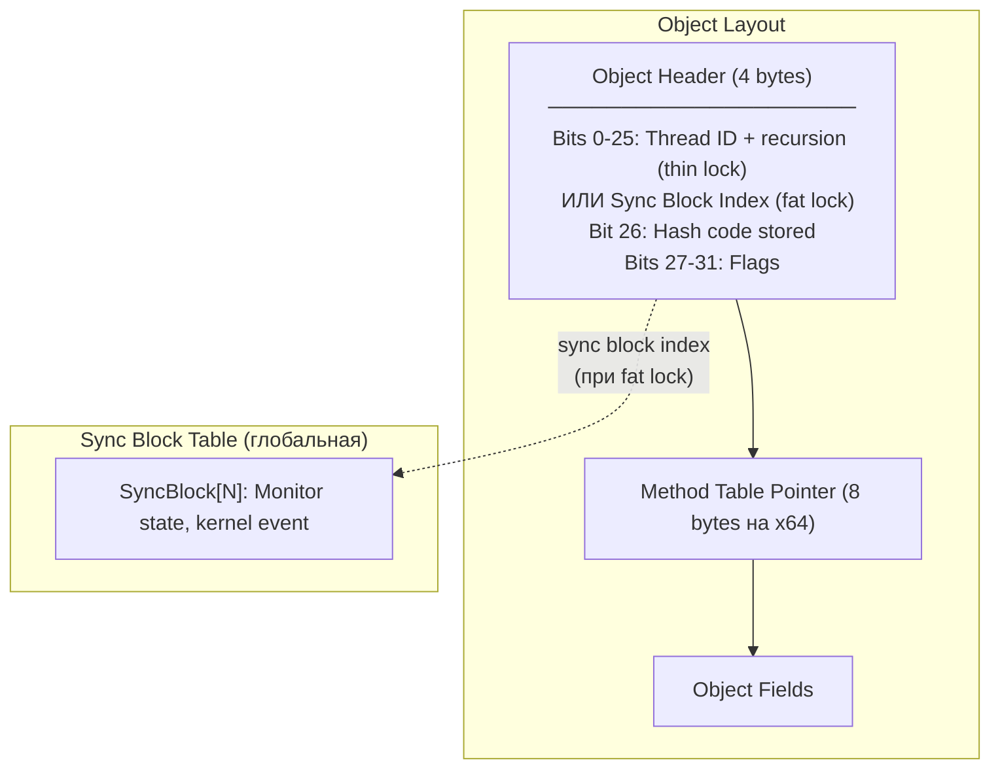

# lock / Monitor, SpinLock, SpinWait

> lock — главный примитив взаимного исключения в .NET. Под капотом — трёхуровневая система от CAS до kernel event.

## Содержание
- [lock изнутри: thin lock → fat lock](#lock-изнутри)
- [Monitor.TryEnter, Wait, Pulse, PulseAll](#monitor-tryenter-wait-pulse-pulseall)
- [SpinLock](#spinlock)
- [SpinWait — адаптивное ожидание](#spinwait)
- [Подводные камни](#подводные-камни)
- [См. также](#см-также)

---

## lock изнутри

`lock` — синтаксический сахар для `Monitor.Enter/Exit`:

```csharp
// Исходный код:
lock (obj) { /* critical section */ }

// C# компилятор генерирует (.NET 4.0+):
bool acquired = false;
try
{
    Monitor.Enter(obj, ref acquired);
    /* critical section */
}
finally
{
    if (acquired)
        Monitor.Exit(obj);
}
```

**Почему `ref acquired`:** если `Monitor.Enter` бросит `ThreadAbortException` до реального захвата, `finally` без флага попытался бы вызвать `Exit` на незахваченной блокировке — `SynchronizationLockException`. Флаг устанавливается **атомарно** с захватом.

**Object header и sync block:**

Каждый объект в .NET имеет object header — 4 байта перед данными. Он используется для thin lock, sync block index и hash code.



**Три уровня — escalation:**

```mermaid
stateDiagram-v2
    [*] --> ThinLock: первый lock(obj)

    state "Thin Lock" as ThinLock {
        note right of ThinLock
            Thread ID + recursion count
            прямо в object header.
            Один CAS — захват.
            Нет аллокаций, нет syscall.
            ~20 нс.
        end note
    }

    ThinLock --> SpinPhase: другой поток хочет lock

    state "Spin Phase" as SpinPhase {
        note right of SpinPhase
            Adaptive spinning ~50 итераций.
            Если владелец отпустит —
            захват без kernel перехода.
        end note
    }

    SpinPhase --> ThinLock: владелец отпустил во время спина
    SpinPhase --> FatLock: spin не помог

    state "Fat Lock" as FatLock {
        note right of FatLock
            SyncBlock из глобальной таблицы.
            Object header → sync block index.
            Kernel event внутри SyncBlock.
            Поток уходит в kernel wait.
            ~1-2 мкс на context switch.
        end note
    }

    FatLock --> ThinLock: GC может deflate lock\n(когда нет ожидающих)
```

**Уровень 1 (Thin Lock, нет contention):** CLR записывает Thread ID в object header через `Interlocked.CompareExchange`. Один CAS — никаких аллокаций. Стоимость ~20 нс. Покрывает 99% случаев.

**Уровень 2 (Spin):** ожидающий поток делает adaptive spinning — проверяет заголовок в цикле. Если владелец отпустит быстро — kernel не задействуется.

**Уровень 3 (Fat Lock):** CLR аллоцирует `SyncBlock` из глобальной таблицы, перезаписывает object header на его индекс, ожидающий поток вызывает `WaitForSingleObject` (Windows) / `futex` (Linux). Стоимость ~1-2 мкс на context switch.

**Deflation:** когда contention прекращается, GC может «сдуть» fat lock обратно в thin lock, освободив SyncBlock.

---

## Monitor TryEnter Wait Pulse PulseAll

**TryEnter — захват с таймаутом:**

```csharp
private readonly object _lock = new();

/// <summary>
/// Try to update resource within 500ms timeout.
/// Returns false if lock is contended beyond timeout.
/// </summary>
bool TryUpdate(string value)
{
    bool acquired = false;
    try
    {
        Monitor.TryEnter(_lock, TimeSpan.FromMilliseconds(500), ref acquired);
        if (!acquired)
            return false;

        _resource = value;
        return true;
    }
    finally
    {
        if (acquired)
            Monitor.Exit(_lock);
    }
}
```

**Monitor имеет две внутренние очереди:**

```
┌─────────────────────────────────────────────────┐
│ Ready Queue                                     │
│ Потоки, вызвавшие Monitor.Enter() и ждущие      │
│ освобождения lock.                              │
├─────────────────────────────────────────────────┤
│ Wait Queue                                      │
│ Потоки, вызвавшие Monitor.Wait() — они          │
│ ОТПУСТИЛИ lock и ждут Pulse/PulseAll.           │
│ После Pulse → переходят в Ready Queue.          │
└─────────────────────────────────────────────────┘
```

`Pulse` перемещает **один** поток из Wait Queue в Ready Queue. `PulseAll` — **все**. Переведённые потоки не получают lock сразу — они конкурируют с другими в Ready Queue.

**Паттерн condition variable (producer/consumer):**

```csharp
private readonly object _lock = new();
private readonly Queue<int> _queue = new();

/// <summary>
/// Producer: enqueue item and wake one consumer.
/// </summary>
void Produce(int item)
{
    lock (_lock)
    {
        _queue.Enqueue(item);
        Monitor.Pulse(_lock); // wake one waiter from Wait Queue
    }
}

/// <summary>
/// Consumer: wait for item, re-check condition on wakeup.
/// </summary>
int Consume()
{
    lock (_lock)
    {
        while (_queue.Count == 0)
        {
            // Атомарно: отпускает lock и засыпает.
            // При Pulse: просыпается и снова захватывает lock.
            Monitor.Wait(_lock);
        }
        return _queue.Dequeue();
    }
}
```

**Почему `while`, а не `if`:** `Wait` может проснуться spuriously (ложное пробуждение) или другой поток мог забрать элемент между `Pulse` и захватом lock. `while` гарантирует перепроверку условия — стандартный паттерн condition variables.

---

## SpinLock

User-mode блокировка, **никогда** не уходящая в kernel. Ожидающий поток крутится в цикле, сжигая CPU.

```csharp
// ВАЖНО: SpinLock — struct. Нельзя передавать по значению.
private SpinLock _spinLock = new(enableThreadOwnerTracking: false);
// enableThreadOwnerTracking: false — отключает проверку рекурсии, экономит ~10 нс

/// <summary>
/// Update stats using spin lock. Only for extremely short critical sections.
/// </summary>
void UpdateStats(int value)
{
    bool acquired = false;
    try
    {
        _spinLock.Enter(ref acquired);
        // ТОЛЬКО молниеносные операции (~десятки нс):
        _sum += value;
        _count++;
    }
    finally
    {
        if (acquired)
            _spinLock.Exit(useMemoryBarrier: false);
            // useMemoryBarrier: false — быстрее, но только если
            // после Exit нет чтений, зависящих от данных внутри lock
    }
}
```

**Когда использовать:** критическая секция занимает **десятки наносекунд** — 2-3 присваивания. Если секция > 1 мкс — SpinLock хуже обычного `lock`, потому что сжигает ядро впустую.

**Четыре ограничения SpinLock:**

1. **Struct** — всегда поле класса или передавать по `ref`. Копия — отдельный lock.
2. **Не рекурсивный** — с `enableThreadOwnerTracking: false` рекурсивный захват → **deadlock** (поток крутится ожидая себя).
3. **Не для длинных операций** — если поток вытесняется внутри SpinLock, все ожидающие крутятся впустую весь time slice (~15 мс).
4. **Не для кода с await** — нельзя `await` внутри SpinLock.

---

## SpinWait

`SpinWait` — не блокировка, а **helper-структура** для реализации ожидания. Инкапсулирует стратегию «сначала покрутись, потом уступи, потом усни».

```csharp
/// <summary>
/// Adaptive wait for a condition using SpinWait strategy.
/// </summary>
void WaitForCondition()
{
    SpinWait spinner = new();
    while (!_condition)
    {
        spinner.SpinOnce();
        // Итерации 1-10:  Thread.SpinWait() — busy wait на CPU
        // Итерации 11-20: Thread.Yield() — уступить потокам с >= приоритетом
        // Итерации 21+:   Thread.Sleep(0/1) — отпустить CPU полностью
    }
}
```

**Adaptive spinning:**
- На **одноядерной** системе — сразу `Yield`/`Sleep` (spin бесполезен: если мы крутимся, владелец lock не выполняется)
- На **многоядерной** — сначала spin (надеясь, что владелец работает на другом ядре), потом постепенно отступает

**SpinWait.SpinUntil — удобная обёртка:**

```csharp
bool success = SpinWait.SpinUntil(() => _ready, TimeSpan.FromSeconds(5));
if (!success)
    throw new TimeoutException("Condition was not met within 5 seconds");
```

**Где используется:** внутри `SpinLock`, `SemaphoreSlim`, `ManualResetEventSlim`, `ConcurrentQueue<T>`. `SpinWait` — строительный блок примитивов, не конечный продукт.

---

## Подводные камни

**lock(this) — внешний код может захватить ваш lock:**

```csharp
// ПЛОХО: любой код снаружи может сделать lock(myService)
class BadService
{
    public void Process()
    {
        lock (this) { DoWork(); } // опасно
    }
}

// ХОРОШО: приватный объект
class GoodService
{
    private readonly object _lock = new();
    public void Process()
    {
        lock (_lock) { DoWork(); }
    }
}
```

**lock(typeof(T)) — глобальный lock для всех экземпляров:**

```csharp
// ПЛОХО: один lock на все MyService<string> во всём AppDomain
class MyService<T>
{
    public void Process()
    {
        lock (typeof(T)) { DoWork(); } // глобальный!
    }
}
```

**lock на строку — string interning:**

```csharp
// ПЛОХО: "my-lock" может быть интернирована — один объект для всего AppDomain
lock ("my-lock") { DoWork(); }

// ХОРОШО: выделенный object
private static readonly object _lock = new();
lock (_lock) { DoWork(); }
```

**Не вызывать `Monitor.Exit` без предшествующего `Monitor.Enter` — `SynchronizationLockException`.**

---

## См. также

- [01-fundamentals.md](./01-fundamentals.md) — три проблемы многопоточности, memory model
- [03-rw-sem-event.md](./03-rw-sem-event.md) — ReaderWriterLockSlim, SemaphoreSlim для специализированных сценариев
- [08-problems.md](./08-problems.md) — deadlock, lock convoy, over-synchronization
