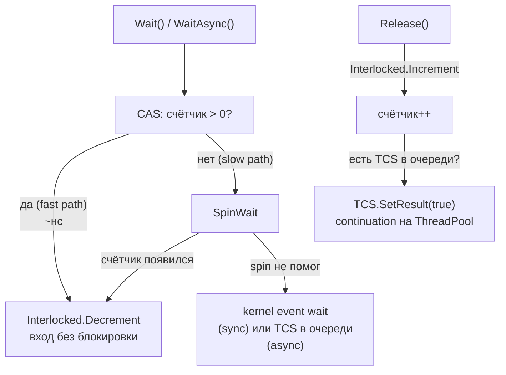
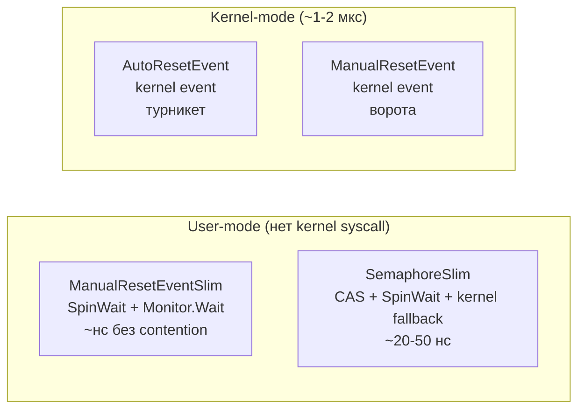

# ReaderWriterLockSlim, SemaphoreSlim, ManualResetEventSlim

> User-mode примитивы для специализированных сценариев: read-heavy нагрузки, throttling и сигнализация между потоками.

## Содержание
- [ReaderWriterLockSlim](#readerwriterlockslim)
- [SemaphoreSlim](#semaphoreslim)
- [ManualResetEventSlim и AutoResetEvent](#manualreseteventslim-и-autoresetevent)
- [Подводные камни](#подводные-камни)
- [См. также](#см-также)

---

## ReaderWriterLockSlim

**Что это:** блокировка для сценария «много читателей, редкие писатели». Несколько потоков могут читать одновременно, запись — монопольная.

**Три режима:**

| Режим | Параллельные читатели | Параллельные писатели | Описание |
|-------|----------------------|-----------------------|----------|
| Read | Неограниченно | 0 | Чтение, не блокирует других читателей |
| Write | 0 | 1 | Монопольная запись, блокирует всех |
| Upgradeable read | 1 upgradeble + N read | 0 | Можно повысить до write без отпускания |

```csharp
private readonly ReaderWriterLockSlim _rwLock = new();
private Dictionary<string, string> _cache = new();

/// <summary>
/// Read value. Multiple threads can read simultaneously.
/// </summary>
string Read(string key)
{
    _rwLock.EnterReadLock();
    try
    {
        return _cache.TryGetValue(key, out var value) ? value : null;
    }
    finally { _rwLock.ExitReadLock(); }
}

/// <summary>
/// Write value. Exclusive — blocks all readers and writers.
/// </summary>
void Write(string key, string value)
{
    _rwLock.EnterWriteLock();
    try { _cache[key] = value; }
    finally { _rwLock.ExitWriteLock(); }
}

/// <summary>
/// Read-then-conditionally-write without releasing read lock.
/// Upgradeable prevents another writer from slipping in between read and upgrade.
/// </summary>
string GetOrCreate(string key, Func<string> factory)
{
    _rwLock.EnterUpgradeableReadLock();
    try
    {
        if (_cache.TryGetValue(key, out var value))
            return value;

        _rwLock.EnterWriteLock();
        try
        {
            // Double-check: another thread may have added it while upgrading
            if (_cache.TryGetValue(key, out value))
                return value;

            value = factory();
            _cache[key] = value;
            return value;
        }
        finally { _rwLock.ExitWriteLock(); }
    }
    finally { _rwLock.ExitUpgradeableReadLock(); }
}
```

**Когда использовать:** соотношение чтений к записям **минимум 10:1**. При меньшем соотношении overhead `ReaderWriterLockSlim` (отслеживание потоков, три очереди) превышает выгоду от параллельного чтения — обычный `lock` будет быстрее.

**Writer starvation:** если читатели приходят непрерывно, писатель может ждать очень долго. `ReaderWriterLockSlim` смягчает это: когда есть ожидающий писатель, новые читатели блокируются.

Реализует `IDisposable` — вызывать `Dispose()` для освобождения внутренних ресурсов.

---

## SemaphoreSlim

**Что это:** lightweight семафор в user-mode. Ограничивает количество потоков, одновременно входящих в секцию. В отличие от `lock` (0 или 1 поток) — допускает N потоков.

**Внутренняя реализация:**



`WaitAsync()` при пустом счётчике создаёт `TaskCompletionSource`, кладёт в очередь и возвращает `TCS.Task`. При `Release()` — `TCS.SetResult(true)`, continuation выполняется на ThreadPool. **Поток не блокируется.**

```csharp
// Ограничить одновременные HTTP-запросы тремя
private readonly SemaphoreSlim _throttle = new(initialCount: 3, maxCount: 3);

/// <summary>
/// Execute HTTP request with concurrency throttling.
/// </summary>
async Task<string> Fetch(string url, CancellationToken ct)
{
    await _throttle.WaitAsync(ct); // non-blocking wait
    try
    {
        using var client = new HttpClient();
        return await client.GetStringAsync(url, ct);
    }
    finally
    {
        _throttle.Release();
    }
}
```

**Ключевые характеристики:**

- **Не привязан к потоку** — `Release()` может вызвать любой поток, не обязательно тот, кто вызвал `Wait()`. Это отличает от `Monitor` (owner-based).
- **Async API** — единственный примитив синхронизации в BCL с `WaitAsync()`.
- **CancellationToken** — `WaitAsync(CancellationToken)` для отмены ожидания.
- **Async mutex** — `SemaphoreSlim(1, 1)` — аналог `lock` для async-кода.

---

## ManualResetEventSlim и AutoResetEvent

**ManualResetEventSlim** — сигнальный примитив. После `Set()` все ожидающие просыпаются, и событие **остаётся** в сигнальном состоянии. Нужно вызвать `Reset()` чтобы закрыть его.

```csharp
private readonly ManualResetEventSlim _gate = new(initialState: false);

/// <summary>
/// Worker: wait until initialization is complete.
/// </summary>
void Worker()
{
    _gate.Wait(); // block until Set() is called
    Process();    // all workers proceed simultaneously after Set()
}

/// <summary>
/// Initializer: open the gate for all waiting workers.
/// </summary>
void Initialize()
{
    LoadData();
    _gate.Set();    // wake ALL waiting threads, gate stays open
    // _gate.Reset(); // close gate again if needed (manual reset)
}
```

**AutoResetEvent** — после пробуждения **одного** потока автоматически возвращается в несигнальное состояние. «Турникет» — пропускает по одному.

```csharp
private readonly AutoResetEvent _signal = new(initialState: false);

/// <summary>
/// Worker: process one item per received signal.
/// </summary>
void Worker()
{
    while (true)
    {
        _signal.WaitOne(); // block until signaled, auto-resets after waking one thread
        ProcessOneItem();
    }
}

/// <summary>
/// Producer: signal worker to process next item.
/// </summary>
void EnqueueWork()
{
    PrepareItem();
    _signal.Set(); // wake exactly ONE waiting thread
}
```

**Критическое отличие:** `AutoResetEvent` — **kernel-mode** примитив (наследник `WaitHandle`). `ManualResetEventSlim` — **user-mode** (SpinWait + `Monitor.Wait`). Нет `AutoResetEventSlim` в BCL. Для lightweight auto-reset — используйте `SemaphoreSlim(0, 1)`.



| Характеристика | ManualResetEventSlim | AutoResetEvent |
|---------------|---------------------|----------------|
| Mode | User-mode (с fallback) | Kernel-mode |
| Set() будит | Всех ожидающих | Одного ожидающего |
| После Set() | Остаётся signaled | Авто-reset в unsignaled |
| Overhead | ~нс без contention | ~1-2 мкс (syscall) |
| Аналогия | Открытые ворота | Турникет |
| Cross-process | Нет | Да (через имя) |

---

## Подводные камни

**ReaderWriterLockSlim — не использовать при низком соотношении read/write:**

```csharp
// ПЛОХО при соотношении 50/50: overhead > выигрыш
private readonly ReaderWriterLockSlim _rwLock = new();
void Update() { _rwLock.EnterWriteLock(); ... }
void Get()    { _rwLock.EnterReadLock(); ... }

// ХОРОШО при 50/50: проще и быстрее
private readonly object _lock = new();
void Update() { lock (_lock) { ... } }
void Get()    { lock (_lock) { ... } }
```

**SemaphoreSlim — не вызывать `Release()` лишний раз:**

```csharp
var sem = new SemaphoreSlim(3, 3);
sem.Release(4); // SemaphoreFullException — превышает maxCount!
```

**SemaphoreSlim — не путать с `Semaphore` (kernel-mode):**

`SemaphoreSlim` не поддерживает именование и cross-process. Если нужен межпроцессный семафор — только `Semaphore` (kernel).

**ManualResetEventSlim — использовать только внутри одного процесса.** Для cross-process — `ManualResetEvent` через `EventWaitHandle`.

---

## См. также

- [04-kernel-mode.md](./04-kernel-mode.md) — Mutex, Semaphore, EventWaitHandle: когда нужен kernel-mode
- [06-async-sync.md](./06-async-sync.md) — SemaphoreSlim.WaitAsync как основа async-совместимой синхронизации
- [08-problems.md](./08-problems.md) — lock convoy и writer starvation
