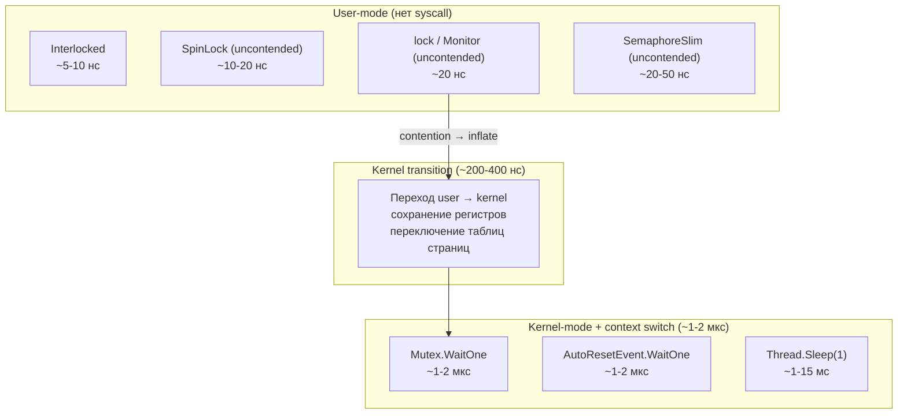
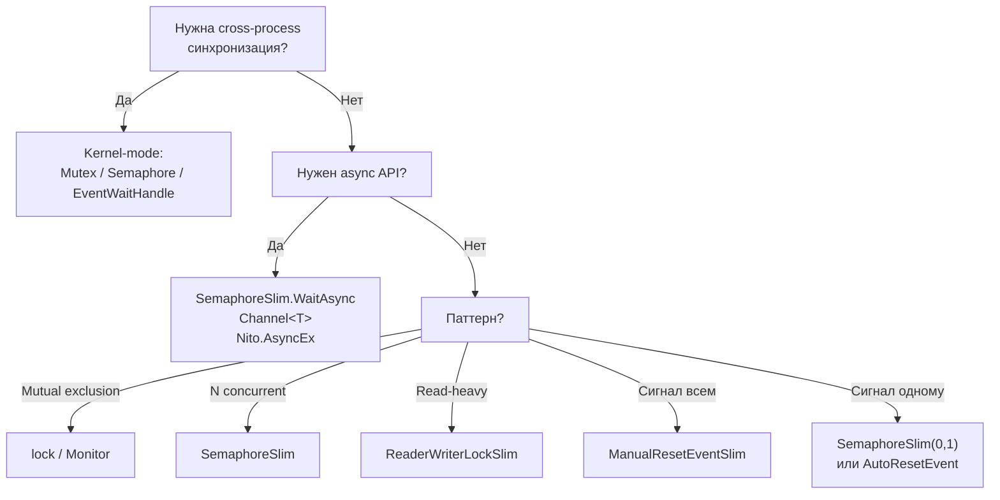

# Kernel-mode примитивы

> Mutex, Semaphore, EventWaitHandle — kernel-mode примитивы для cross-process синхронизации. Стоимость на порядок выше user-mode, поэтому используются только когда user-mode недостаточно.

## Содержание
- [Mutex](#mutex)
- [Semaphore](#semaphore)
- [EventWaitHandle](#eventwaithandle)
- [Стоимость kernel-mode vs user-mode](#стоимость-kernel-mode-vs-user-mode)
- [Правило выбора](#правило-выбора)
- [Подводные камни](#подводные-камни)
- [См. также](#см-также)

---

## Mutex

**Что это:** kernel-mode блокировка с поддержкой cross-process синхронизации через именованные объекты. Один Mutex может синхронизировать потоки из **разных процессов**.

**Главный сценарий — single-instance приложение:**

```csharp
/// <summary>
/// Ensure only one instance of the application is running system-wide.
/// Uses named mutex visible across all user sessions.
/// </summary>
static void EnsureSingleInstance()
{
    const string mutexName = "Global\\MyApp_SingleInstance_3F2504E0";
    // "Global\\" — виден из всех сессий Windows
    // "Local\\"  — виден только в текущей сессии

    using var mutex = new Mutex(
        initiallyOwned: false,
        name: mutexName,
        out bool createdNew
    );

    if (!createdNew)
    {
        Console.WriteLine("Another instance is already running");
        Environment.Exit(1);
    }

    RunApplication();
    // mutex освобождается при Dispose (using)
}
```

**Межпроцессная синхронизация (защита shared memory / named pipe):**

```csharp
/// <summary>
/// Cross-process critical section: ensure exclusive access to shared resource.
/// </summary>
void AccessSharedResource()
{
    using var mutex = new Mutex(initiallyOwned: false, name: "Global\\MyApp_SharedResource");
    mutex.WaitOne();
    try
    {
        ReadWriteSharedMemory();
    }
    finally
    {
        mutex.ReleaseMutex();
    }
}
```

**Особенности Mutex:**

- **Owner-based** — только поток, вызвавший `WaitOne()`, может вызвать `ReleaseMutex()`. Попытка из другого потока → `ApplicationException`.
- **Рекурсивный** — один поток может вызвать `WaitOne()` несколько раз, нужно столько же `ReleaseMutex()`.
- **Abandoned mutex** — если поток-владелец завершился без `ReleaseMutex()`, следующий ожидающий получит `AbandonedMutexException`. Это позволяет обнаружить crash предыдущего владельца.
- **Стоимость** — каждый `WaitOne`/`ReleaseMutex` — syscall, ~1-2 мкс. Uncontended `lock` — ~20 нс. Разница в **100x**.

---

## Semaphore

**Что это:** kernel-mode семафор. Ограничивает количество одновременных доступов к ресурсу с поддержкой cross-process именования.

```csharp
/// <summary>
/// Limit concurrent database connections across multiple processes.
/// Named semaphore is visible system-wide.
/// </summary>
void AccessDatabase()
{
    using var semaphore = new Semaphore(
        initialCount: 5,
        maximumCount: 5,
        name: "Global\\MyApp_DbPool"
    );

    semaphore.WaitOne();
    try
    {
        ExecuteQuery();
    }
    finally
    {
        semaphore.Release();
    }
}
```

**Semaphore vs SemaphoreSlim:**

| Характеристика | Semaphore | SemaphoreSlim |
|---------------|-----------|---------------|
| Mode | Kernel | User (с kernel fallback) |
| Cross-process | Да (именование) | Нет |
| WaitAsync() | Нет | Да |
| CancellationToken | Нет | Да |
| Performance (uncontended) | ~1-2 мкс | ~20-50 нс |
| IDisposable | Да (WaitHandle) | Да |

**Правило:** используйте `Semaphore` только для cross-process. Во всех остальных случаях — `SemaphoreSlim`.

---

## EventWaitHandle

**Что это:** базовый класс для kernel-mode событий (`ManualResetEvent`, `AutoResetEvent`). Поддерживает именованные события для cross-process сигнализации.

```csharp
/// <summary>
/// Process A: wait for data from Process B.
/// </summary>
void WaitForExternalData()
{
    using var signal = new EventWaitHandle(
        initialState: false,
        mode: EventResetMode.ManualReset,
        name: "Global\\MyApp_DataReady"
    );

    signal.WaitOne();
    ReadSharedData();
}

/// <summary>
/// Process B: signal Process A when data is written.
/// </summary>
void SignalDataReady()
{
    using var signal = new EventWaitHandle(
        initialState: false,
        mode: EventResetMode.ManualReset,
        name: "Global\\MyApp_DataReady"
    );

    WriteSharedData();
    signal.Set(); // все ожидающие во всех процессах просыпаются
}
```

**WaitHandle.WaitAll / WaitAny — ожидание нескольких объектов:**

```csharp
WaitHandle[] handles = { event1, event2, event3 };

// Ждать пока ВСЕ события сигналятся
WaitHandle.WaitAll(handles);

// Ждать ПЕРВОЕ сигнальное событие, получить его индекс
int index = WaitHandle.WaitAny(handles);
```

**Ограничение:** `WaitAll` поддерживает максимум 64 handle (ограничение Windows API `WaitForMultipleObjects`).

---

## Стоимость kernel-mode vs user-mode



**Почему kernel-mode дороже:**

1. **Syscall** — CPU переходит из ring 3 (user) в ring 0 (kernel): сохраняет состояние, переключает таблицы страниц. ~200-400 нс только на переход.
2. **Context switch** — ОС вытесняет поток, запускает другой. Сохранение/восстановление регистров, сброс TLB. ~1-2 мкс.
3. **Cache pollution** — после context switch L1/L2 кеш содержит данные другого потока. ~100+ нс на cache miss при возврате.

| Операция | Время |
|----------|-------|
| Interlocked.Increment | ~5-10 нс |
| SpinLock (uncontended) | ~10-20 нс |
| lock (uncontended, thin lock) | ~20 нс |
| SemaphoreSlim.Wait (uncontended) | ~20-50 нс |
| Mutex.WaitOne (uncontended) | ~1-2 мкс |
| Context switch | ~1-2 мкс |
| Thread.Sleep(1) | ~1-15 мс |

---

## Правило выбора



**Kernel-mode оправдан:**
- Cross-process синхронизация (именованные объекты)
- Интеграция с legacy COM/Win32 API, ожидающим `WaitHandle`
- `WaitHandle.WaitAll`/`WaitAny` на нескольких объектах

**User-mode оправдан (99% случаев):**
- Синхронизация внутри одного процесса
- Нужна максимальная производительность
- Нужен async API

---

## Подводные камни

**Mutex — не забывать `ReleaseMutex()` при исключении:**

```csharp
// ПЛОХО: если DoWork() бросит исключение, Mutex никогда не освободится
mutex.WaitOne();
DoWork(); // exception here → mutex abandoned
mutex.ReleaseMutex();

// ХОРОШО: try/finally
mutex.WaitOne();
try { DoWork(); }
finally { mutex.ReleaseMutex(); }
```

**Abandoned mutex — обрабатывать как ошибку:**

```csharp
try
{
    mutex.WaitOne();
}
catch (AbandonedMutexException)
{
    // Предыдущий владелец завершился аварийно — состояние ресурса неизвестно
    // Mutex захвачен нами, но нужно проверить целостность данных
    ValidateSharedResource();
}
```

**`WaitAll` на Mutex из одного потока — deadlock:**

```csharp
// Попытка ждать себя — deadlock (Thread ID совпадает с владельцем)
WaitHandle.WaitAll(new WaitHandle[] { mutex1, mutex2 }); // не делать если mutex1 уже у текущего потока
```

---

## См. также

- [03-rw-sem-event.md](./03-rw-sem-event.md) — user-mode аналоги для синхронизации внутри процесса
- [02-lock-monitor.md](./02-lock-monitor.md) — lock/Monitor как основной инструмент
- [08-problems.md](./08-problems.md) — deadlock через порядок захвата
