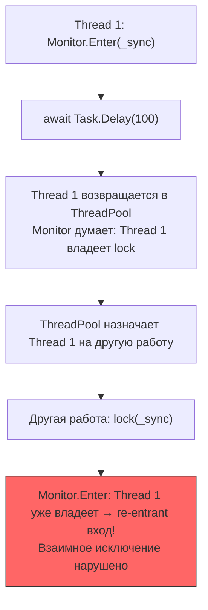

# Async-совместимая синхронизация

> lock нельзя использовать с await — это ограничение компилятора. SemaphoreSlim(1,1) — правильная замена. AsyncLocal\<T\> — для ambient state через await.

## Содержание
- [Почему lock нельзя с await](#почему-lock-нельзя-с-await)
- [SemaphoreSlim.WaitAsync](#semaphoreslimwaitasync)
- [Паттерн AsyncLock](#паттерн-asynclock)
- [Nito.AsyncEx](#nitoasyncex)
- [AsyncLocal\<T\> vs ThreadLocal\<T\>](#asynclocalt-vs-threadlocalt)
- [Channel\<T\> как примитив координации](#channelt)
- [Подводные камни](#подводные-камни)
- [См. также](#см-также)

---

## Почему lock нельзя с await

Компилятор C# **запрещает** `await` внутри `lock` (ошибка CS1996):

```csharp
// ОШИБКА КОМПИЛЯЦИИ: Cannot await in the body of a lock statement
lock (_sync)
{
    await Task.Delay(100); // CS1996
}
```

**Почему:** `Monitor.Enter`/`Exit` привязаны к **конкретному потоку** — тот поток, что вызвал `Enter`, должен вызвать `Exit`. `await` может продолжить выполнение на **другом потоке** (если нет SynchronizationContext):



Даже если continuation вернётся на тот же поток, во время `await` поток **отпущен в пул** и может выполнять другую задачу. Та задача может попытаться захватить этот же `lock` — deadlock: поток ждёт lock, который он же «держит».

---

## SemaphoreSlim.WaitAsync

`SemaphoreSlim` — единственный примитив синхронизации в BCL с **async API**. Это краеугольный камень async-синхронизации.

**Как WaitAsync работает изнутри:**

1. Если счётчик > 0: уменьшает через CAS, возвращает завершённый `Task` (fast path, ~нс)
2. Если счётчик == 0: создаёт `TaskCompletionSource<bool>`, добавляет в очередь, возвращает `TCS.Task`
3. При `Release()`: берёт первый TCS из очереди, вызывает `TCS.SetResult(true)` → continuation выполняется на ThreadPool

**Поток не блокируется** — он возвращается в пул и выполняет другую работу пока ждёт слот.

```csharp
private readonly SemaphoreSlim _semaphore = new(initialCount: 1, maxCount: 1);

/// <summary>
/// Async-safe mutual exclusion. Thread is NOT blocked while waiting.
/// </summary>
async Task UpdateAsync(CancellationToken ct)
{
    await _semaphore.WaitAsync(ct); // non-blocking wait
    try
    {
        await _repository.SaveAsync(ct); // await inside is safe!
    }
    finally
    {
        _semaphore.Release(); // может вызвать любой поток
    }
}
```

**Throttling — ограничение параллельных запросов:**

```csharp
private readonly SemaphoreSlim _throttle = new(initialCount: 5, maxCount: 5);

async Task<string> FetchAsync(string url, CancellationToken ct)
{
    await _throttle.WaitAsync(ct);
    try
    {
        return await _httpClient.GetStringAsync(url, ct);
    }
    finally
    {
        _throttle.Release();
    }
}
```

---

## Паттерн AsyncLock

`SemaphoreSlim(1, 1)` не имеет синтаксиса `using`. Оборачиваем в `AsyncLock`:

```csharp
/// <summary>
/// Async-compatible mutual exclusion.
/// Wraps SemaphoreSlim(1,1) with IDisposable release pattern.
/// </summary>
public sealed class AsyncLock
{
    private readonly SemaphoreSlim _semaphore = new(1, 1);

    public async Task<IDisposable> Acquire(CancellationToken ct = default)
    {
        await _semaphore.WaitAsync(ct);
        return new Releaser(_semaphore);
    }

    private sealed class Releaser : IDisposable
    {
        private readonly SemaphoreSlim _semaphore;

        public Releaser(SemaphoreSlim semaphore)
        {
            _semaphore = semaphore;
        }

        public void Dispose() => _semaphore.Release();
    }
}

// Использование — почти как обычный lock:
private readonly AsyncLock _lock = new();

async Task UpdateAsync(CancellationToken ct)
{
    using (await _lock.Acquire(ct))
    {
        await _repository.SaveAsync(ct);
        // SemaphoreSlim.Release() вызывается при выходе из using
    }
}
```

**Отличия от `lock`:**

- **Не привязан к потоку** — нет owner thread. Release может быть на другом потоке.
- **Не рекурсивный** — повторный вызов `Acquire()` без Release = deadlock.
- Нет `lock(this)` проблем — нет thread ownership вообще.

---

## Nito.AsyncEx

Библиотека от Stephen Cleary — набор async-совместимых примитивов, отсутствующих в BCL.

```csharp
// AsyncLock — mutex с поддержкой reentrancy
private readonly AsyncLock _mutex = new();

async Task Example(CancellationToken ct)
{
    using (await _mutex.LockAsync(ct))
    {
        await DoWorkAsync(ct);
    }
}

// AsyncAutoResetEvent — async-аналог AutoResetEvent
private readonly AsyncAutoResetEvent _signal = new();

async Task WaitForSignal(CancellationToken ct)
{
    await _signal.WaitAsync(ct); // non-blocking
    ProcessItem();
}

void Signal() => _signal.Set(); // wake one waiter

// AsyncManualResetEvent — async-аналог ManualResetEvent
private readonly AsyncManualResetEvent _gate = new();

async Task WaitForGate(CancellationToken ct)
{
    await _gate.WaitAsync(ct); // все ожидающие проходят после Set()
}

// AsyncReaderWriterLock — async-аналог ReaderWriterLockSlim
private readonly AsyncReaderWriterLock _rwLock = new();

async Task ReadAsync(CancellationToken ct)
{
    using (await _rwLock.ReaderLockAsync(ct))
    {
        await ReadDataAsync(ct);
    }
}

async Task WriteAsync(CancellationToken ct)
{
    using (await _rwLock.WriterLockAsync(ct))
    {
        await WriteDataAsync(ct);
    }
}
```

**Когда использовать Nito.AsyncEx:**
- Нужен async ManualResetEvent / AutoResetEvent — в BCL их нет
- Нужен async ReaderWriterLock — `ReaderWriterLockSlim` не имеет async API
- Нужен AsyncLock с reentrancy — `SemaphoreSlim(1,1)` не поддерживает

---

## AsyncLocal\<T\> vs ThreadLocal\<T\>

`ThreadLocal<T>` — значение привязано к `Thread.CurrentThread`. После `await` на другом потоке — теряется.

`AsyncLocal<T>` — значение хранится в `ExecutionContext`, который «течёт» через `await`. Даже если continuation выполняется на другом потоке — значение сохраняется.

```csharp
private static readonly ThreadLocal<string> _threadLocal = new();
private static readonly AsyncLocal<string> _asyncLocal = new();

async Task CompareAsync()
{
    _threadLocal.Value = "thread value";
    _asyncLocal.Value  = "async value";

    Console.WriteLine($"Thread {Thread.CurrentThread.ManagedThreadId} before await:");
    Console.WriteLine($"  ThreadLocal: {_threadLocal.Value}"); // "thread value"
    Console.WriteLine($"  AsyncLocal:  {_asyncLocal.Value}");  // "async value"

    await Task.Delay(100); // continuation может выполниться на другом потоке

    Console.WriteLine($"Thread {Thread.CurrentThread.ManagedThreadId} after await:");
    Console.WriteLine($"  ThreadLocal: {_threadLocal.Value}"); // null (другой поток!)
    Console.WriteLine($"  AsyncLocal:  {_asyncLocal.Value}");  // "async value" (сохранилось!)
}
```

**Copy-on-write семантика AsyncLocal:** `ExecutionContext` копируется при каждом `await`. Изменение в child-контексте **не видно** в parent-контексте:

```csharp
private static readonly AsyncLocal<int> _depth = new();

async Task Outer()
{
    _depth.Value = 1;
    await Inner();
    Console.WriteLine(_depth.Value); // 1 (НЕ 2 — copy-on-write)
}

async Task Inner()
{
    _depth.Value = 2; // модифицирует КОПИЮ ExecutionContext
    Console.WriteLine(_depth.Value); // 2
}
```

| Характеристика | ThreadLocal\<T\> | AsyncLocal\<T\> |
|---------------|-----------------|-----------------|
| Привязка | Thread | ExecutionContext |
| Через await | Теряется | Сохраняется |
| Применение | Per-thread буферы, кеш | Correlation ID, user context |
| Copy-on-write | Нет | Да (child не влияет на parent) |
| Производительность | ~1 нс | ~10-20 нс |

---

## Channel\<T\>

Channel — async-native инструмент для producer-consumer координации. В отличие от `BlockingCollection`, который блокирует поток, Channel полностью async:

```csharp
/// <summary>
/// Bounded async channel: producer blocks async when full (backpressure),
/// consumer blocks async when empty.
/// </summary>
var channel = Channel.CreateBounded<WorkItem>(new BoundedChannelOptions(100)
{
    FullMode = BoundedChannelFullMode.Wait, // async wait when full
    SingleWriter = false,
    SingleReader = true
});

// Producer:
async Task ProduceAsync(ChannelWriter<WorkItem> writer, CancellationToken ct)
{
    await foreach (var item in GetItemsAsync(ct))
    {
        await writer.WriteAsync(item, ct); // async wait if channel full
    }
    writer.Complete();
}

// Consumer:
async Task ConsumeAsync(ChannelReader<WorkItem> reader, CancellationToken ct)
{
    await foreach (var item in reader.ReadAllAsync(ct))
    {
        await ProcessAsync(item, ct);
    }
}
```

**`BlockingCollection` vs `Channel<T>`:**

| | BlockingCollection | Channel\<T\> |
|--|-------------------|-------------|
| Ожидание | Блокирует поток | Async (поток свободен) |
| Async API | Нет | Да |
| Backpressure | Да | Да |
| ASP.NET Core | Thread starvation риск | Безопасно |

---

## Подводные камни

**Не использовать `SemaphoreSlim` после `Dispose`:**

```csharp
var sem = new SemaphoreSlim(1, 1);
sem.Dispose();
sem.Wait(); // ObjectDisposedException
```

**`AsyncLock` не рекурсивный — deadlock:**

```csharp
private readonly AsyncLock _lock = new();

async Task Method()
{
    using (await _lock.Acquire())
    {
        await Method(); // deadlock: _lock уже захвачен, ждём сами себя
    }
}
```

**`AsyncLocal` и `Task.Run`** — `Task.Run` создаёт дочерний `ExecutionContext`. Изменение `AsyncLocal` внутри `Task.Run` **не видно** снаружи:

```csharp
var local = new AsyncLocal<int>();
local.Value = 1;

await Task.Run(() => {
    local.Value = 42; // модифицирует копию
});

Console.WriteLine(local.Value); // 1 (не 42!)
```

---

## См. также

- [03-rw-sem-event.md](./03-rw-sem-event.md) — SemaphoreSlim sync API
- [08-problems.md](./08-problems.md) — async deadlock через .Result/.Wait()
- [05-interlocked-volatile.md](./05-interlocked-volatile.md) — атомарные операции без блокировок
