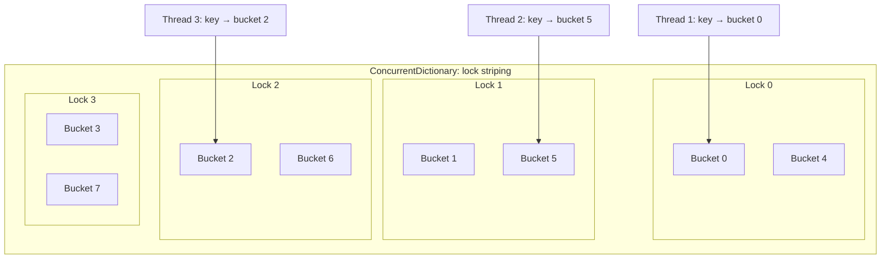

# Concurrent коллекции

> Thread-safe коллекции из System.Collections.Concurrent — lock striping, lock-free алгоритмы и immutability как стратегии для высокого параллелизма.

## Содержание
- [ConcurrentDictionary\<K,V\>](#concurrentdictionarykv)
- [ConcurrentQueue\<T\> и ConcurrentStack\<T\>](#concurrentqueuet-и-concurrentstackt)
- [ConcurrentBag\<T\>](#concurrentbagt)
- [BlockingCollection\<T\>](#blockingcollectiont)
- [Immutable коллекции](#immutable-коллекции)
- [Подводные камни](#подводные-камни)
- [См. также](#см-также)

---

## ConcurrentDictionary\<K,V\>

**Что это:** thread-safe словарь с lock striping — несколько lock'ов, каждый защищает подмножество bucket'ов. Вместо одного lock на всё — параллельный доступ к разным частям.



Потоки 1, 2, 3 попадают в **разные stripe'ы** — нет contention, все работают параллельно. По умолчанию количество stripe'ов = `Environment.ProcessorCount`.

**Правильное использование:**

```csharp
private readonly ConcurrentDictionary<string, int> _counts = new();

/// <summary>
/// Atomically increment counter for a key.
/// AddOrUpdate is atomic per stripe, but factory can be called multiple times.
/// </summary>
void Increment(string key)
{
    _counts.AddOrUpdate(
        key,
        addValue: 1,
        updateValueFactory: (k, existing) => existing + 1
    );
}

/// <summary>
/// TryAdd: atomic, returns false if key already exists.
/// </summary>
bool TryRegister(string key, int value)
{
    return _counts.TryAdd(key, value);
}

/// <summary>
/// TryUpdate: CAS-semantics — only updates if existing matches expected.
/// </summary>
bool TryUpdateIfExpected(string key, int newValue, int expectedCurrent)
{
    return _counts.TryUpdate(key, newValue, expectedCurrent);
}
```

**Атомарность методов:**

| Метод | Атомарен? | Детали |
|-------|-----------|--------|
| `TryAdd` | Да | Один lock на bucket |
| `TryRemove` | Да | Один lock на bucket |
| `TryUpdate` | Да | CAS-семантика |
| `AddOrUpdate` | **Factory НЕ под lock** | Factory может вызваться несколько раз |
| `GetOrAdd` | **Factory НЕ под lock** | Factory может вызваться несколько раз |
| `Count` | Захватывает **все** locks | Дорогая операция |
| `ToArray` | Захватывает **все** locks | Snapshot всего словаря |

**`GetOrAdd` — factory может вызваться дважды:**

```csharp
// ОСТОРОЖНО: если два потока одновременно вызовут GetOrAdd("key"),
// оба вызовут factory, но только один результат попадёт в словарь
var value = _cache.GetOrAdd("key", key => new ExpensiveObject(key));

// Если factory дорогой — используйте Lazy<T>:
var lazy = _lazyCache.GetOrAdd("key",
    key => new Lazy<ExpensiveObject>(() => new ExpensiveObject(key)));
var obj = lazy.Value; // factory вызовется ровно один раз (Lazy гарантирует)
```

---

## ConcurrentQueue\<T\> и ConcurrentStack\<T\>

**ConcurrentQueue\<T\>** — lock-free FIFO. Внутри реализована на сегментах (массивах) связанных в linked list. Enqueue/Dequeue через `Interlocked.CompareExchange`, без lock'ов.

```csharp
private readonly ConcurrentQueue<LogEntry> _logQueue = new();

/// <summary>
/// Producer: enqueue log entry. Lock-free, ~10-20 ns.
/// </summary>
void Log(string message)
{
    _logQueue.Enqueue(new LogEntry(message, DateTime.UtcNow));
}

/// <summary>
/// Consumer: drain all available entries.
/// </summary>
void Flush()
{
    while (_logQueue.TryDequeue(out var entry))
        WriteToFile(entry);
}
```

**ConcurrentStack\<T\>** — lock-free LIFO. Linked list с CAS на голову. Push/TryPop — один `Interlocked.CompareExchange`.

```csharp
private readonly ConcurrentStack<Connection> _pool = new();

void Return(Connection conn) => _pool.Push(conn); // lock-free

Connection Rent()
    => _pool.TryPop(out var conn) ? conn : new Connection(); // lock-free
```

| | ConcurrentQueue\<T\> | ConcurrentStack\<T\> |
|---|---------------------|---------------------|
| Алгоритм | Lock-free (segmented array) | Lock-free (linked list + CAS) |
| Enqueue / Push | ~10-20 нс | ~10-20 нс |
| Dequeue / Pop | ~10-20 нс | ~10-20 нс |
| Порядок | FIFO | LIFO |
| Память | Сегменты (batch alloc, cache-friendly) | Node per item (GC pressure) |

---

## ConcurrentBag\<T\>

**Что это:** коллекция, оптимизированная для сценариев, где каждый поток и добавляет, и забирает элементы. Внутри — **thread-local списки** с work stealing.

**Внутри:** каждый поток имеет свой локальный список. `Add` идёт в локальный список (без contention). `TryTake` сначала берёт из своего списка; если пуст — «ворует» из списков других потоков.

```csharp
private readonly ConcurrentBag<Result> _results = new();

/// <summary>
/// Each parallel worker adds to its thread-local list — no contention.
/// </summary>
void ProcessParallel(IEnumerable<int> items)
{
    Parallel.ForEach(items, item =>
    {
        var result = Compute(item);
        _results.Add(result); // thread-local, без contention
    });
}
```

**Когда использовать:** `Parallel.ForEach` сценарии — один поток и добавляет, и забирает. Для классического producer-consumer (один добавляет, другой забирает) — `ConcurrentQueue<T>` или `Channel<T>` эффективнее.

---

## BlockingCollection\<T\>

**Что это:** обёртка над `IProducerConsumerCollection<T>` (по умолчанию `ConcurrentQueue<T>`), добавляющая **блокирующее** ожидание и bounded capacity.

```csharp
/// <summary>
/// Bounded producer-consumer with blocking semantics.
/// Producer blocks when full, consumer blocks when empty.
/// </summary>
void ProducerConsumerExample()
{
    using var collection = new BlockingCollection<WorkItem>(boundedCapacity: 100);

    // Producer (отдельный поток):
    Task.Run(() =>
    {
        foreach (var item in GetItems())
        {
            collection.Add(item); // БЛОКИРУЕТ если 100 элементов уже в очереди
        }
        collection.CompleteAdding();
    });

    // Consumer:
    foreach (var item in collection.GetConsumingEnumerable())
    {
        // БЛОКИРУЕТ когда пусто, выходит когда CompleteAdding()
        Process(item);
    }
}
```

**Важно:** `BlockingCollection` — **синхронный** примитив. `Add`/`Take` **блокируют поток**. В async-контексте это thread starvation. Для async используйте `Channel<T>`.

| | BlockingCollection\<T\> | Channel\<T\> |
|--|------------------------|-------------|
| Ожидание | Блокирует поток | Async (поток свободен) |
| Async API | Нет | Да |
| Backpressure | Да (bounded capacity) | Да |
| Применение | Thread-based pipelines | Async pipelines |

---

## Immutable коллекции

**Что это:** коллекции из `System.Collections.Immutable`, которые **никогда не изменяются** после создания. Любая «модификация» создаёт новый экземпляр. Thread-safety через отсутствие мутации.

**Паттерн: Interlocked.CompareExchange + immutable коллекция:**

```csharp
private ImmutableDictionary<string, Config> _config =
    ImmutableDictionary<string, Config>.Empty;

/// <summary>
/// Lock-free config update: creates new immutable instance, swaps reference atomically.
/// </summary>
void UpdateConfig(string key, Config value)
{
    SpinWait spinner = new();
    while (true)
    {
        var current = _config;                     // snapshot (immutable — безопасно)
        var updated = current.SetItem(key, value); // новый экземпляр

        if (Interlocked.CompareExchange(ref _config, updated, current) == current)
            return; // успешно заменили ссылку

        spinner.SpinOnce(); // другой поток изменил — повторяем
    }
}

/// <summary>
/// Lock-free read: immutable reference is always consistent.
/// </summary>
Config ReadConfig(string key)
{
    // Чтение ссылки на x64 атомарно, объект immutable → полностью безопасно
    return _config.TryGetValue(key, out var config) ? config : null;
}
```

**ImmutableInterlocked** — helper, заменяет ручной CAS loop:

```csharp
ImmutableInterlocked.AddOrUpdate(ref _config, key, value, (k, old) => value);
ImmutableInterlocked.TryAdd(ref _config, key, value);
ImmutableInterlocked.TryRemove(ref _config, key, out var removed);
```

**Структуры данных и сложность:**

| Коллекция | Структура | Add/Remove |
|-----------|-----------|------------|
| `ImmutableList<T>` | Balanced tree | O(log n) |
| `ImmutableDictionary<K,V>` | Hash-array mapped trie | O(log n) |
| `ImmutableSortedSet<T>` | Red-black tree | O(log n) |
| `ImmutableArray<T>` | Array copy | O(n) — дорого |
| `ImmutableStack<T>` | Linked list | O(1) |
| `ImmutableQueue<T>` | Two stacks | Amortized O(1) |

**Когда использовать:** конфигурация, справочные данные, read-heavy с редкими записями. Паттерн `Interlocked.CompareExchange` + immutable = lock-free read + lock-free write.

---

## Подводные камни

**`Count` и `ToArray` у ConcurrentDictionary — захватывают все locks:**

```csharp
// МЕДЛЕННО на hot path — захватывает все N stripe locks
int count = _dict.Count;
var snapshot = _dict.ToArray();

// Вместо Count — используйте IsEmpty для проверки пустоты (O(1))
bool empty = _dict.IsEmpty;
```

**BlockingCollection в async-контексте — thread starvation:**

```csharp
// BAD: блокирует поток, ASP.NET Core ThreadPool голодает
async Task ProcessAsync()
{
    var item = _collection.Take(); // BLOCKS the thread!
    await HandleAsync(item);
}

// GOOD: использовать Channel<T>
async Task ProcessAsync()
{
    var item = await _channel.Reader.ReadAsync(); // async, поток свободен
    await HandleAsync(item);
}
```

**`GetOrAdd` vs `TryAdd` + `TryGetValue` — разные гарантии:**

```csharp
// GetOrAdd: factory может быть вызван дважды, но только один результат попадёт в словарь
// TryAdd возвращает false если ключ уже есть
// TryGetValue не вызывает никаких фабрик
```

**Immutable коллекции — не использовать ImmutableArray для частых обновлений:**

```csharp
// ImmutableArray.Add = копирует весь массив — O(n)
// Для частых обновлений: ImmutableList или ImmutableHashSet
```

---

## См. также

- [05-interlocked-volatile.md](./05-interlocked-volatile.md) — CAS, который используют concurrent коллекции внутри
- [06-async-sync.md](./06-async-sync.md) — Channel\<T\> как async-альтернатива BlockingCollection
- [08-problems.md](./08-problems.md) — over-synchronization: когда concurrent коллекция не помогает
